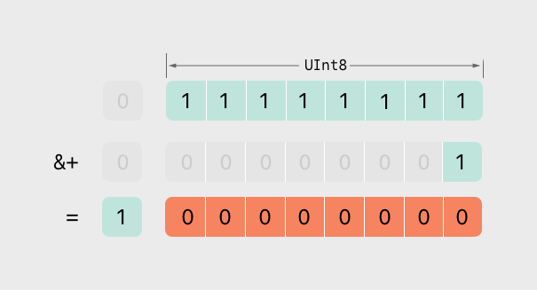

# 高级运算符

<iframe style="border:none" width="100%" height="450" src="https://whimsical.com/embed/LozDVBMW5qwKauBpEQV3zm"></iframe>

除了之前介绍过的 基本运算符，Swift 还提供了数种可以对数值进行复杂运算的高级运算符。它们包含了在 C 和 Objective-C 中已经被大家所熟知的位运算符和移位运算符。

与 C 语言中的算术运算符不同，Swift 中的算术运算符默认是不会溢出的。所有溢出行为都会被捕获并报告为错误。如果想让系统允许溢出行为，可以选择使用 Swift 中另一套默认支持溢出的运算符，比如溢出加法运算符（`&+`）。所有的这些溢出运算符都是以 `&` 开头的。

自定义结构体、类和枚举时，如果也为它们提供标准 Swift 运算符的实现，将会非常有用。在 Swift 中为这些运算符提供自定义的实现非常简单，运算符也会针对不同类型使用对应实现。

我们不用被预定义的运算符所限制。在 Swift 中可以自由地定义中缀、前缀、后缀和赋值运算符，它们具有自定义的优先级与关联值。这些运算符在代码中可以像预定义的运算符一样使用，你甚至可以扩展已有的类型以支持自定义运算符。

## 位运算符

位运算符可以操作数据结构中每个独立的比特位。它们通常被用在底层开发中，比如图形编程和创建设备驱动。位运算符在处理外部资源的原始数据时也十分有用，比如对自定义通信协议传输的数据进行编码和解码。

Swift 支持 C 语言中的全部位运算符，接下来会一一介绍。

### Bitwise NOT Operator（按位取反运算符）

按位取反运算符（`~`） 对一个数值的全部比特位进行取反：


按位取反运算符是一个前缀运算符，直接放在运算数之前，并且它们之间不能添加任何空格：

```swift
let initialBits: UInt8 = 0b00001111
let invertedBits = ~initialBits // 等于 0b11110000
```

`UInt8` 类型的整数有 `8` 个比特位，可以存储 `0 ~ 255` 之间的任意整数。这个例子初始化了一个 `UInt8` 类型的整数，并赋值为二进制的 `00001111`，它的前 `4` 位为 `0`，后 `4` 位为 `1`。这个值等价于十进制的 `15`。

接着使用按位取反运算符创建了一个名为 `invertedBits` 的常量，这个常量的值与全部位取反后的 `initialBits` 相等。即所有的 `0` 都变成了 `1`，同时所有的 `1` 都变成 `0`。`invertedBits` 的二进制值为 `11110000`，等价于无符号十进制数的 `240`。

### Bitwise AND Operator（按位与运算符）

按位与运算符（`&`） 对两个数的比特位进行合并。它返回一个新的数，只有当两个数的对应位都为 `1` 的时候，新数的对应位才为 `1`：


在下面的示例当中，`firstSixBits` 和 `lastSixBits` 中间 `4` 个位的值都为 `1`。使用按位与运算符之后，得到二进制数值 `00111100`，等价于无符号十进制数的 `60`：

```swift
let firstSixBits: UInt8 = 0b11111100
let lastSixBits: UInt8  = 0b00111111
let middleFourBits = firstSixBits & lastSixBits // 等于 00111100
```

### Bitwise OR Operator（按位或运算符）

按位或运算符（`|`）可以对两个数的比特位进行比较。它返回一个新的数，只要两个数的对应位中有任意一个为 `1` 时，新数的对应位就为 `1`：


在下面的示例中，`someBits` 和 `moreBits` 存在不同的位被设置为 `1`。使用按位或运算符之后，得到二进制数值 `11111110`，等价于无符号十进制数的 `254`：

```swift
let someBits: UInt8 = 0b10110010
let moreBits: UInt8 = 0b01011110
let combinedbits = someBits | moreBits // 等于 11111110
```

### Bitwise XOR Operator（按位异或运算符）

按位异或运算符，或称「排外的或运算符」（`^`），可以对两个数的比特位进行比较。它返回一个新的数，当两个数的对应位不相同时，新数的对应位就为 `1`，并且对应位相同时则为 `0`：


在下面的示例当中，`firstBits` 和 `otherBits` 都有一个自己为 `1`，而对方为 `0` 的位。按位异或运算符将新数的这两个位都设置为 `1`。在其余的位上 `firstBits` 和 `otherBits` 是相同的，所以设置为 `0`：

```swift
let firstBits: UInt8 = 0b00010100
let otherBits: UInt8 = 0b00000101
let outputBits = firstBits ^ otherBits // 等于 00010001
```

### Bitwise Left and Right Shift Operators（按位左移、右移运算符）

按位左移运算符（`<<`） 和 按位右移运算符（`>>`） 可以对一个数的所有位进行指定位数的左移和右移，但是需要遵守下面定义的规则。

对一个数进行按位左移或按位右移，相当于对这个数进行乘以 `2` 或除以 `2` 的运算。将一个整数左移一位，等价于将这个数乘以 `2`，同样地，将一个整数右移一位，等价于将这个数除以 `2`。

**无符号整数的移位运算**

对无符号整数进行移位的规则如下：

- 已存在的位按指定的位数进行左移和右移。
- 任何因移动而超出整型存储范围的位都会被丢弃。
- 用 `0` 来填充移位后产生的空白位。

这种方法称为逻辑移位。

以下这张图展示了 `11111111 << 1`（即把 `11111111` 向左移动 `1` 位），和 `11111111 >> 1`（即把 `11111111` 向右移动 `1` 位）的结果。蓝色的数字是被移位的，灰色的数字是被抛弃的，橙色的 `0` 则是被填充进来的：


下面的代码演示了 Swift 中的移位运算：

```swift
let shiftBits: UInt8 = 4 // 即二进制的 00000100
shiftBits << 1           // 00001000
shiftBits << 2           // 00010000
shiftBits << 5           // 10000000
shiftBits << 6           // 00000000
shiftBits >> 2           // 00000001
```

可以使用移位运算对其他的数据类型进行编码和解码：

```swift
let pink: UInt32 = 0xCC6699
let redComponent = (pink & 0xFF0000) >> 16  // redComponent 是 0xCC，即 204
let greenComponent = (pink & 0x00FF00) >> 8 // greenComponent 是 0x66， 即 102
let blueComponent = pink & 0x0000FF         // blueComponent 是 0x99，即 153
```

**有符号整数的移位运算**

对比无符号整数，有符号整数的移位运算相对复杂得多，这种复杂性源于有符号整数的二进制表现形式。（为了简单起见，以下的示例都是基于 `8` 比特的有符号整数，但是其中的原理对任何位数的有符号整数都是通用的。）

有符号整数使用第 `1` 个比特位（通常被称为符号位）来表示这个数的正负。符号位为 `0` 代表正数，为 `1` 代表负数。

其余的比特位（通常被称为数值位）存储了实际的值。有符号正整数和无符号数的存储方式是一样的，都是从 `0` 开始算起。这是值为 `4` 的 `Int8` 型整数的二进制位表现形式：


符号位为 `0`（代表这是一个「正数」），另外 `7` 位则代表了十进制数值 `4` 的二进制表示。

负数的存储方式略有不同。它存储 `2` 的 `n` 次方减去其实际值的绝对值，这里的 `n` 是数值位的位数。一个 `8` 比特位的数有 `7` 个比特位是数值位，所以是 `2` 的 `7` 次方，即 `128`。

这是值为 `-4` 的 `Int8` 型整数的二进制表现形式：


这次的符号位为 `1`，说明这是一个负数，另外 `7` 个位则代表了数值 `124`（即 `128` - `4`）的二进制表示：


负数的表示通常被称为二进制补码。用这种方法来表示负数乍看起来有点奇怪，但它有几个优点。

首先，如果想对 `-1` 和 `-4` 进行加法运算，我们只需要对这两个数的全部 `8` 个比特位执行标准的二进制相加（包括符号位），并且将计算结果中超出 `8` 位的数值丢弃：


其次，使用二进制补码可以使负数的按位左移和右移运算得到跟正数同样的效果，即每向左移一位就将自身的数值乘以 `2`，每向右移一位就将自身的数值除以 `2`。要达到此目的，对有符号整数的右移有一个额外的规则：当对有符号整数进行按位右移运算时，遵循与无符号整数相同的规则，但是对于移位产生的空白位使用符号位进行填充，而不是用 `0`。


这个行为可以确保有符号整数的符号位不会因为右移运算而改变，这通常被称为算术移位。

由于正数和负数的特殊存储方式，在对它们进行右移的时候，会使它们越来越接近 `0`。在移位的过程中保持符号位不变，意味着负整数在接近 `0` 的过程中会一直保持为负。

## 溢出运算符

当向一个整数类型的常量或者变量赋予超过它容量的值时，Swift 默认会报错，而不是允许生成一个无效的数。这个行为为我们在运算过大或者过小的数时提供了额外的安全性。

例如，`Int16` 型整数能容纳的有符号整数范围是 `-32768` 到 `32767`。当为一个 `Int16` 类型的变量或常量赋予的值超过这个范围时，系统就会报错：

```swift
var potentialOverflow = Int16.max
// potentialOverflow 的值是 32767，这是 Int16 能容纳的最大整数
potentialOverflow += 1 // [!code error]
// 这里会报错
```

在赋值时为过大或者过小的情况提供错误处理，能让我们在处理边界值时更加灵活。

然而，当你希望的时候也可以选择让系统在数值溢出的时候采取截断处理，而非报错。Swift 提供的三个溢出运算符来让系统支持整数溢出运算。这些运算符都是以 `&` 开头的：

- 溢出加法 `&+`
- 溢出减法 `&-`
- 溢出乘法 `&*`

### 数值溢出

数值有可能出现上溢或者下溢。

这个示例演示了当我们对一个无符号整数使用溢出加法（`&+`）进行上溢运算时会发生什么：

```swift
var unsignedOverflow = UInt8.max
// unsignedOverflow 等于 UInt8 所能容纳的最大整数 255
unsignedOverflow = unsignedOverflow &+ 1
// 此时 unsignedOverflow 等于 0
```

`unsignedOverflow` 被初始化为 `UInt8` 所能容纳的最大整数（`255`，以二进制表示即 `11111111`）。然后使用溢出加法运算符（``&+``）对其进行加 `1` 运算。这使得它的二进制表示正好超出 `UInt8` 所能容纳的位数，也就导致了数值的溢出，如下图所示。数值溢出后，仍然留在 `UInt8` 边界内的值是 `00000000`，也就是十进制数值的 `0`。




当允许对一个无符号整数进行下溢运算时也会产生类似的情况。这里有一个使用溢出减法运算符（`&-`）的例子：

```swift
var unsignedOverflow = UInt8.min
// unsignedOverflow 等于 UInt8 所能容纳的最小整数 0
unsignedOverflow = unsignedOverflow &- 1
// 此时 unsignedOverflow 等于 255
```

`UInt8` 型整数能容纳的最小值是 `0`，以二进制表示即 `00000000`。当使用溢出减法运算符对其进行减 `1` 运算时，数值会产生下溢并被截断为 `11111111`， 也就是十进制数值的 `255`。


溢出也会发生在有符号整型上。针对有符号整型的所有溢出加法或者减法运算都是按位运算的方式执行的，符号位也需要参与计算。

```swift
var signedOverflow = Int8.min
// signedOverflow 等于 Int8 所能容纳的最小整数 -128
signedOverflow = signedOverflow &- 1
// 此时 signedOverflow 等于 127
```

`Int8`型整数能容纳的最小值是`-128`，以二进制表示即 `10000000`。当使用溢出减法运算符对其进行减 `1` 运算时，符号位被翻转，得到二进制数值 `01111111`，也就是十进制数值的 `127`，这个值也是 `Int8` 型整数所能容纳的最大值。


对于无符号与有符号整型数值来说，当出现上溢时，它们会从数值所能容纳的最大数变成最小数。同样地，当发生下溢时，它们会从所能容纳的最小数变成最大数。

## 运算符函数

运算符函数是一种特殊的函数，用来定义或重载已有的运算符的行为。这意味着你可以为自定义的数据类型指定加法、减法、乘法等运算符的具体实现方式。使用运算符函数可以让你的代码更加直观和易于理解。

例如，如果你有一个自定义的结构体表示二维坐标点，你可能会希望使用加号（`+`）来表示两个坐标点的合并操作。下面是如何实现这个功能的一个例子：

```swift
struct Point {
    var x: Int
    var y: Int
}

// 重载加号运算符
func +(left: Point, right: Point) -> Point {
    return Point(x: left.x + right.x, y: left.y + right.y)
}

let point1 = Point(x: 1, y: 2)
let point2 = Point(x: 3, y: 4)
let point3 = point1 + point2  // 结果是 Point(x: 4, y: 6)
```

在这个例子中，我们定义了一个 `Point` 结构体，并重载了 `+` 运算符。这样我们就可以直接使用 `+` 运算符来合并两个 `Point` 实例。这种方式使得代码更加直观和自然。

运算符函数通常需要使用 `func` 关键字声明，其函数名就是要定义或重载的运算符，参数通常是要进行运算的类型的实例。返回类型可以根据运算的具体需求来定义。在 Swift 中，你也可以重载比较运算符、逻辑运算符等。

### 前缀和后缀运算符

前缀（Prefix）和后缀（Postfix）运算符是用来修改单个操作数的值的特殊运算符。它们通常用于增加或减少变量的值，例如经典的递增（`++`）和递减（`--`）运算符。虽然 Swift 标准库中不直接支持 `++` 和 `--` 运算符，你可以通过重载前缀和后缀运算符来实现类似的功能。

#### 前缀运算符

前缀运算符紧跟在操作数之前。如果你想自定义一个前缀运算符，比如为一个数值类型添加一个自定义的递增操作，可以这样做：

```swift
prefix operator +++

prefix func +++(number: inout Int) -> Int {
    number += 3
    return number
}

var myNumber = 1
+++myNumber  // myNumber 现在是 4
```
在这个例子中，我们定义了一个前缀运算符 `+++`，它每次调用时将操作数增加 3。

#### 后缀运算符

后缀运算符紧跟在操作数之后。如果你需要自定义一个后缀运算符，如为一个数值类型添加一个自定义的递减操作，可以这样实现：

```swift
postfix operator ---

postfix func ---(number: inout Int) -> Int {
    number -= 3
    return number
}

var anotherNumber = 10
anotherNumber---  // anotherNumber 现在是 7
```
在这个例子中，我们定义了一个后缀运算符 `---`，它每次调用时将操作数减少 3。

::: warning 注意
- 前缀和后缀运算符的定义需要明确地使用 `prefix` 和 `postfix` 关键字。
- 这些运算符函数通常接收一个 `inout` 参数，表示它们可以修改传入的变量。
- 你可以为任何类型定义前缀和后缀运算符，使得对该类型的操作更符合你的特定需求。

:::

### 复合赋值运算符

复合赋值运算符是一种将赋值运算符（`=`）与其他运算符结合使用的便捷方式，用以简化代码。常见的复合赋值运算符包括 `+=`、`-=`、`*=` 和 `/=` 等。这些运算符可以在改变变量值的同时进行赋值，使代码更加简洁。

复合赋值运算符的基本用法如下：

```swift
var a = 10
a += 5  // 现在 a 是 15，等同于 a = a + 5

var b = 3
b *= 2  // 现在 b 是 6，等同于 b = b * 2
```

这里，`a += 5` 实际上是 `a = a + 5` 的简写形式，`b *= 2` 则是 `b = b * 2` 的简写。这些运算符提高了代码的可读性和编写效率。

Swift 允许你为自定义类型重载现有的复合赋值运算符，或定义新的复合赋值运算符。这需要使用 `inout` 关键字，因为复合赋值运算符通常会修改左侧操作数的值。下面是一个为自定义类型 `Point` 重载 `+=` 运算符的示例：

```swift
struct Point {
    var x: Int
    var y: Int
}

func +=(left: inout Point, right: Point) {
    left.x += right.x
    left.y += right.y
}

var p1 = Point(x: 1, y: 1)
let p2 = Point(x: 2, y: 2)
p1 += p2  // p1 现在是 Point(x: 3, y: 3)
```

在这个例子中，`+=` 被重载来使两个 `Point` 实例的对应坐标相加。这种方式让 `Point` 类型的操作符行为与内置数值类型的复合赋值运算符行为类似，从而增加了代码的直观性和一致性。

::: warning 注意
- 当重载或定义复合赋值运算符时，总是需要考虑操作的安全性和性能。
- 确保定义的复合赋值运算符不会引入任何意外的副作用，尤其是在处理复杂的数据结构时。
- 适当使用 `inout` 来确保变量可以被正确地修改。

:::

### 等价运算符

等价运算符主要用于判断两个实例是否相等或不等。Swift 标准库提供了两种基本的等价运算符：`==` (等于) 和 `!=` (不等于)。这些运算符对于基本数据类型如整数、浮点数、字符串等已经有内置的实现。当你需要为自定义类型判断等价性时，你可以通过实现 `Equatable` 协议来自定义 `==` 运算符的行为。

#### `Equatable` 协议
`Equatable` 协议要求实现一个静态方法 `==`，该方法接受两个该类型的实例作为参数，并返回一个布尔值，表示这两个实例是否等价。以下是一个实现 `Equatable` 协议的例子：

```swift
struct Point: Equatable {
    var x: Int
    var y: Int

    static func ==(lhs: Point, rhs: Point) -> Bool {
        return lhs.x == rhs.x && lhs.y == rhs.y
    }
}

let point1 = Point(x: 1, y: 2)
let point2 = Point(x: 1, y: 2)
let point3 = Point(x: 2, y: 3)

print(point1 == point2)  // 输出 true
print(point1 == point3)  // 输出 false
```

在这个例子中，`Point` 结构体实现了 `Equatable` 协议，并定义了 `==` 运算符来判断两个 `Point` 实例是否在 x 和 y 坐标上都相等。

#### 自动合成等价性检查
从 Swift 4.1 开始，如果一个结构体或类的所有属性都遵守 `Equatable` 协议，Swift 可以自动为你合成 `==` 运算符的实现，你只需要声明类型遵守 `Equatable` 协议即可，而不需要显式地实现 `==` 运算符。例如：

```swift
struct Point: Equatable {
    var x: Int
    var y: Int
}

let point1 = Point(x: 1, y: 2)
let point2 = Point(x: 1, y: 2)
print(point1 == point2)  // 输出 true
```

::: warning 注意
- 当自定义 `==` 运算符时，务必确保其行为符合预期，特别是当结构体或类中包含复杂类型或集合类型时。
- 实现等价性检查时，应考虑到性能因素，尤其是在涉及大量数据或复杂数据结构的比较时。

:::

## 自定义运算符

你可以自定义运算符，这提供了极高的灵活性，允许你为特定的数据类型或业务逻辑定义专属的运算逻辑。Swift 支持自定义前缀（prefix）、中缀（infix）和后缀（postfix）运算符。这使得你可以创建完全定制的运算符，比如向量的点乘、矩阵运算或者其他复杂操作。

### 自定义运算符的步骤
1. **声明运算符**: 首先，你需要使用 `operator` 关键字在全局作用域中声明新的运算符。
2. **指定运算符类型**: 指定运算符是前缀、中缀还是后缀。
3. **定义运算符的功能**: 实现一个函数来定义运算符的行为。

### 示例
下面是一个自定义中缀运算符 `**` 的例子，用于计算幂运算：

```swift
infix operator **: MultiplicationPrecedence  // 定义运算符并指定优先级组

func **(base: Double, exponent: Int) -> Double {
    return pow(base, Double(exponent))
}

let result = 2.0 ** 3  // 计算 2 的 3 次方，结果为 8.0
```

在这个例子中，`**` 运算符用于计算幂。通过使用 `infix operator` 关键字和指定优先级组（这里是 `MultiplicationPrecedence`，与乘法和除法具有相同的优先级），你可以确保运算符的行为符合预期。

::: tip 自定义运算符的注意事项
- **优先级和结合性**: 中缀运算符可以定义优先级和结合性（associativity）。优先级决定了运算符相对于其他运算符的优先执行顺序，而结合性决定了当多个相同的运算符连续出现时的分组方式（比如左结合或右结合）。
- **命名**: 自定义运算符应该有意义，避免使用难以理解或容易混淆的符号。
- **使用场景**: 虽然自定义运算符可以提供方便，但过度使用可能会让代码难以理解和维护。建议在确实能提高代码清晰度和效率的情况下使用。

:::

## 结果构造器

结果构造器（Result Builders）是一个强大的特性，主要用于构建复杂的嵌套数据结构，尤其常见于声明性 UI 编程和复杂数据处理场景。结果构造器通过提供一种声明式的方法来组合和构造数据，从而简化了相关代码的编写。它在 SwiftUI 中广泛使用，用于构建用户界面的元素。

### 结果构造器的基本原理
结果构造器是一种特殊的编译时功能，它允许你通过连续的函数调用和语句来构建复杂的对象。在 Swift 中，你可以通过标记一个类型为 `@resultBuilder` 来创建自己的结果构造器。结果构造器类型通常包含一系列静态方法，这些方法决定了如何将多个值组合成最终的结果。

### 示例：自定义结果构造器
下面是一个简单的结果构造器的示例，用于构建字符串列表：

```swift
@resultBuilder
struct StringListBuilder {
    static func buildBlock(_ components: String...) -> [String] {
        return components
    }
}

// 使用结果构造器来构建字符串数组
@StringListBuilder
func buildStringList() -> [String] {
    "Apple"
    "Banana"
    "Cherry"
}

let fruits = buildStringList()
print(fruits)  // 输出：["Apple", "Banana", "Cherry"]
```

在这个例子中，`StringListBuilder` 是一个结果构造器，它定义了一个 `buildBlock` 方法来处理一系列字符串，并将它们组合成一个数组。使用 `@StringListBuilder` 修饰 `buildStringList` 函数，使得函数体内的多个字符串表达式被自动捕获并传递给结果构造器处理。

### 结果构造器在 SwiftUI 中的应用
在 SwiftUI 中，结果构造器用于构建视图层次结构。例如，`ViewBuilder` 是 SwiftUI 提供的一个内置的结果构造器，用于构建视图的内容：

```swift
import SwiftUI

struct ContentView: View {
    var body: some View {
        VStack {
            Text("Hello, world!")
            Text("SwiftUI is great!")
        }
    }
}
```

在这个例子中，`VStack` 使用 `ViewBuilder` 来允许你列出多个视图。每个视图（这里是 `Text`

视图）都由 `ViewBuilder` 自动处理并构建成一个视图层次结构。

### 结果构造器的高级用法
除了基本的构建块外，结果构造器还提供了如 `buildOptional`、`buildEither`、`buildArray` 等高级功能，用于处理更复杂的条件和集合。

例如，可以用 `buildOptional` 来处理可能为空的内容：

```swift
@resultBuilder
struct StringListBuilder {
    static func buildBlock(_ components: String...) -> [String] {
        return components
    }

    static func buildOptional(_ component: [String]?) -> [String] {
        return component ?? []
    }
}

@StringListBuilder
func buildOptionalStringList(includeMore: Bool) -> [String] {
    "Apple"
    "Banana"
    if includeMore {
        "Cherry"
    }
}

let moreFruits = buildOptionalStringList(includeMore: true)
print(moreFruits)  // 输出：["Apple", "Banana", "Cherry"]
let lessFruits = buildOptionalStringList(includeMore: false)
print(lessFruits)  // 输出：["Apple", "Banana"]
```

在这个示例中，`buildOptional` 方法允许 `if` 语句中的结果被可选地包含在最终结果中，这对于创建基于条件的动态数据结构非常有用。

