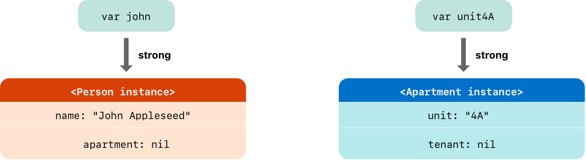
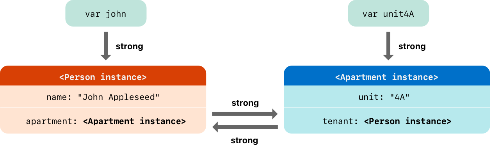
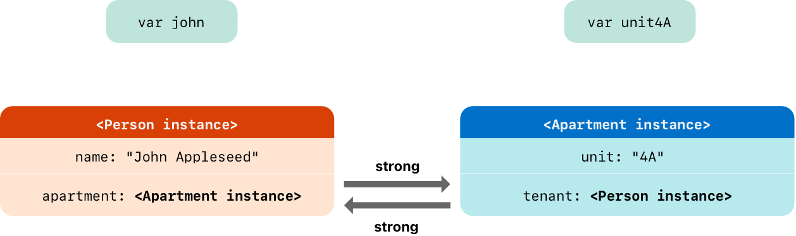
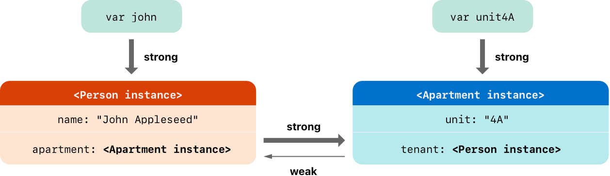
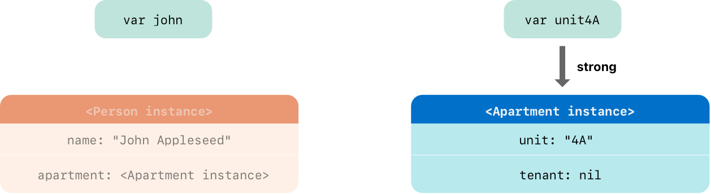
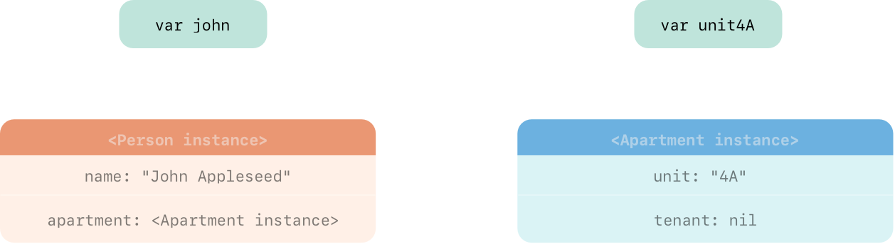
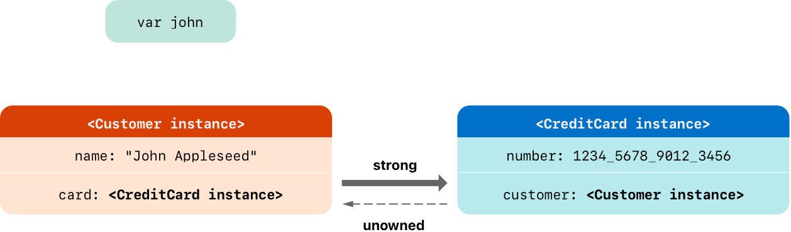
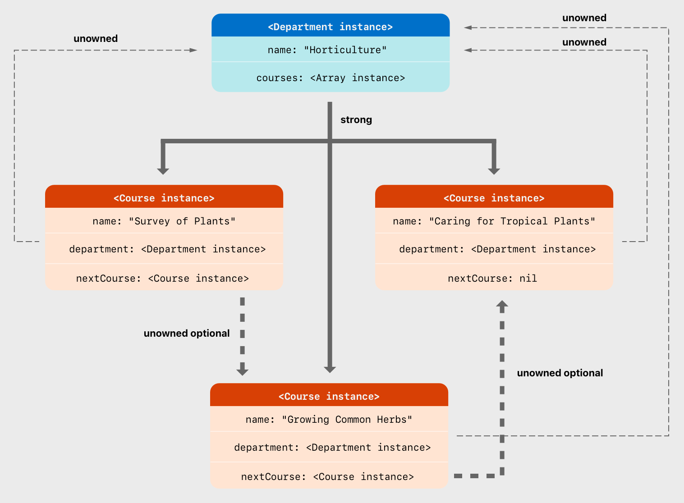
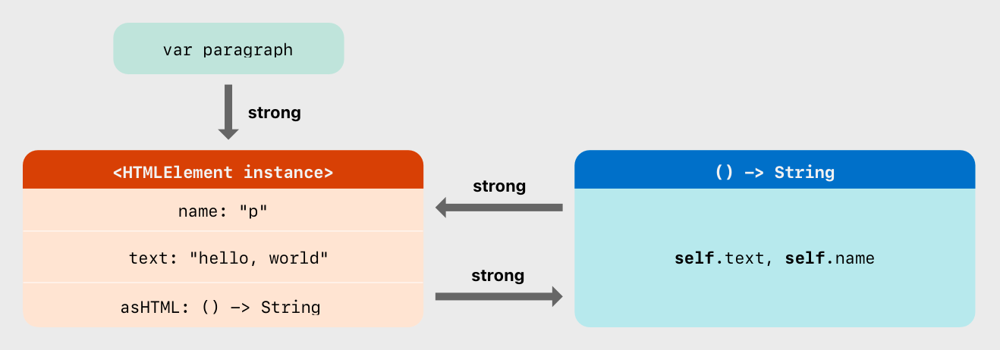
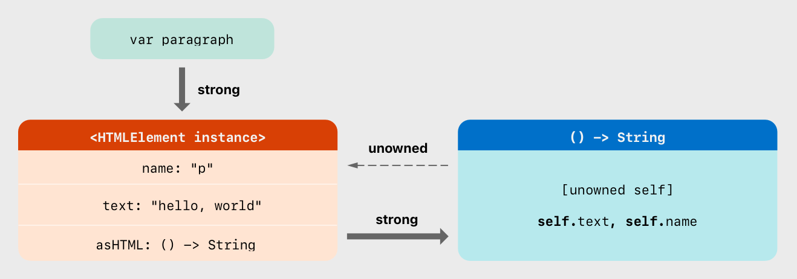

# 自动引用计数

<iframe style="border:none" width="100%" height="450" src="https://whimsical.com/embed/SRBACvrZDcfgMjHfP4ffJn"></iframe>

Swift 使用自动引用计数（ `ARC` ） 机制来跟踪和管理你的应用程序的内存。

通常情况下，Swift 内存管理机制会一直起作用，你无须自己来考虑内存的管理。

`ARC` 会在类的实例不再被使用时，自动释放其占用的内存。

然而在少数情况下，为了能帮助你管理内存，`ARC` 需要更多的，代码之间关系的信息。


## 自动引用计数的工作机制

::: info 工作机制

- 每当你创建一个新的类实例时，`ARC` 会分配一块内存来储存该实例的信息。内存中会包含实例的类型信息，以及这个实例所关联的任何存储属性的值。
- 此外，当实例不再被使用时，`ARC` 释放实例所占用的内存，并让释放的内存能挪作他用。这确保了不再被使用的实例，不会一直占用内存空间。
- 然而，当 `ARC` 回收并释放了正在被使用中的实例后，该实例的属性和方法将不能再被访问和调用。实际上，如果你试图访问这个实例，你的应用程序很可能会崩溃。

为了确保使用中的实例不会被销毁，`ARC` 会跟踪和计算每一个实例正在被多少属性，常量和变量所引用。哪怕实例的引用数为 $1$，`ARC` 都不会销毁这个实例。

为了使上述成为可能，无论你将实例赋值给属性、常量或变量，它们都会创建此实例的强引用。之所以称之为「强」引用，是因为它会将实例牢牢地保持住，只要强引用还在，实例是不允许被销毁的。

:::

首先，我们定义了一个简单的 `Person` 类，它有一个名为 `name` 的常量属性和一个构造器，以及一个析构器：

```swift
class Person {
    let name: String
    init(name: String) {
        self.name = name
        print("\(name) is being initialized")
    }
    deinit {
        print("\(name) is being deinitialized")
    }
}
```

当你创建一个 `Person` 类的实例时，比如一个名字叫 `John Appleseed` 的人，构造器会运行并打印出初始化的消息。

```swift
var reference1: Person?
var reference2: Person?
var reference3: Person?
reference1 = Person(name: "John Appleseed")
// 输出：John Appleseed is being initialized
```

- 这里 `reference1` 是 `Person` 类实例的第一个引用。
- 由于它是一个强引用，`ARC` 会保证这个实例至少在 `reference1` 存在时不会被销毁。

如果你想让更多的变量引用同一个实例，你可以将这个实例赋给其他变量：

```swift
reference2 = reference1
reference3 = reference1
```

现在，`John Appleseed` 的这个实例有三个强引用指向它，这意味着只要这三个引用中的任何一个存在，这个实例就不会被销毁。

如果你决定不再使用这个实例，你可以通过将这些变量赋值为 `nil` 来移除这些强引用：

```swift
reference1 = nil
reference2 = nil
```

- 此时，尽管你移除了两个引用，但 `reference3` 仍然保持着对该实例的引用，所以实例不会被销毁。
- 只有当你也将 `reference3` 设为 `nil` 时，最后一个强引用被断开：

```swift
reference3 = nil
// 输出：John Appleseed is being deinitialized
```

这时，由于没有任何强引用指向该实例，`ARC` 将清理这个实例，调用析构器，并打印出相应的消息，标志着实例的完全销毁。


## 类实例之间的循环强引用

上面的例子中，`ARC` 会跟踪你所新创建的 `Person` 实例的引用数量，并且会在 `Person` 实例不再被需要时销毁它。

然而，我们可能会写出一个类实例的强引用数永远不能变成 $0$ 的代码。

如果**两个类实例互相持有对方的强引用，因而每个实例都让对方一直存在，这就是所谓的循环强引用**。

下面展示了一个不经意产生循环强引用的例子。

例子定义了两个类：`Person` 和 `Apartment`：

```swift
class Person {
    let name: String
    init(name: String) { self.name = name }
    var apartment: Apartment?
    deinit { print("\(name) is being deinitialized") }
}

class Apartment {
    let unit: String
    init(unit: String) { self.unit = unit }
    var tenant: Person?
    deinit { print("Apartment \(unit) is being deinitialized") }
}

var john: Person?
var unit4A: Apartment?

john = Person(name: "John Appleseed")
unit4A = Apartment(unit: "4A")
```


在两个实例被创建和赋值后，下图表现了强引用的关系。

- 变量 `john` 现在有一个指向 `Person` 实例的强引用
- 而变量 `unit4A` 有一个指向 `Apartment` 实例的强引用：




现在你能够将这两个实例关联在一起，这样人就能有公寓住了，而公寓也有了房客：

```swift
john!.apartment = unit4A
unit4A!.tenant = john
```
::: warning 注意
注意感叹号是用来解包和访问可选变量 `john` 和 `unit4A` 中的实例，这样实例的属性才能被赋值。
:::




不幸的是，这两个实例关联后会产生一个循环强引用。

- `Person` 实例现在有了一个指向 `Apartment` 实例的强引用。
- 而 `Apartment` 实例也有了一个指向 `Person` 实例的强引用。

因此，当你断开 `john` 和 `unit4A` 变量所持有的强引用时，引用计数并不会降为 $0$，实例也不会被 `ARC` 销毁：

```swift
john = nil
unit4A = nil
```




::: danger
`Person` 和 `Apartment` 实例之间的强引用关系保留了下来并且不会被断开。
:::

## 解决实例之间的循环强引用


Swift 提供了两种办法用来解决你在使用类的属性时所遇到的循环强引用问题：

- 弱引用（ `weak reference` ）
- 无主引用（ `unowned reference` ）。

### 弱引用

弱引用不会对其引用的实例保持强引用，因而不会阻止 `ARC` 销毁被引用的实例。这个特性阻止了引用变为循环强引用。

**声明属性或者变量时，在前面加上 `weak` 关键字表明这是一个弱引用**。

因为弱引用不会保持所引用的实例，即使引用存在，实例也有可能被销毁。

- 因此，`ARC` 会在引用的实例被销毁后自动将其弱引用赋值为 `nil`。
- 并且因为弱引用需要在运行时允许被赋值为`nil`，所以它们会被定义为**可选类型变量**，而不是常量。
- 你可以像其他可选值一样，检查弱引用的值是否存在，这样可以避免访问已销毁的实例的引用。

::: warning 注意
当 ARC 设置弱引用为 `nil` 时，属性观察不会被触发。
:::

例如，`Apartment` 的 `tenant` 属性被声明为弱引用：

```swift{11}
class Person {
    let name: String
    init(name: String) { self.name = name }
    var apartment: Apartment?
    deinit { print("\(name) is being deinitialized") }
}

class Apartment {
    let unit: String
    init(unit: String) { self.unit = unit }
    weak var tenant: Person?
    deinit { print("Apartment \(unit) is being deinitialized") }
}
```
现在，两个关联在一起的实例的引用关系如下图所示：



- `Person` 实例依然保持对 `Apartment` 实例的强引用。
- 但是 `Apartment` 实例只持有对 `Person` 实例的弱引用。

这意味着当你通过把 `john` 变量赋值为 `nil` 而断开其所保持的强引用时，再也没有指向 `Person` 实例的强引用了：

```swift
john = nil
// 打印“John Appleseed is being deinitialized”
```

由于再也没有指向 `Person` 实例的强引用，该实例会被销毁，且 `tenant` 属性会被赋值为 `nil`：



唯一剩下的指向 `Apartment` 实例的强引用来自于变量 `unit4A`。如果你断开这个强引用，再也没有指向 `Apartment` 实例的强引用了：

```swift
unit4A = nil
// 打印“Apartment 4A is being deinitialized”
```



### 无主引用

::: info 无主引用与弱引用

无主引用（ `unowned` ）与弱引用（ `weak` ）有类似的作用，它们都不会强持有实例，从而帮助避免循环引用的问题。

不同之处在于，无主引用适用于被引用的实例拥有与之相同或更长生命周期的情况。
:::

当你**声明一个属性或变量时，可以在其前面加上 `unowned` 关键字来指明这是一个无主引用**。


::: danger 注意
- 与弱引用不同的是，无主引用总是预期有值的。
- 因此，无主引用的对象**不是可选类型**，当相关联的实例被销毁后，自动引用计数（ `ARC` ）也不会将无主引用设置为 `nil`。
- 重要的是，你必须确保无主引用始终指向一个尚未被销毁的实例。
- 如果在实例被销毁后访问其无主引用，程序将触发运行时错误。
:::

以下是 `Customer` 和 `CreditCard` 两个类的定义，它们模拟了银行客户和其信用卡之间的关系。

::: info

一个客户可能拥有或不拥有信用卡，但每张信用卡必定关联一个客户。

:::

- `Customer` 类中有一个可选的 `?` 的 `card` 属性。
- 而 `CreditCard` 类中的 `customer` 属性则是非可选的 $\ne$`?`。

为了避免循环强引用，`CreditCard` 类中的 `customer` 属性被定义为无主引用 `unowned`：

```swift
class Customer {
    let name: String
    var card: CreditCard?
    init(name: String) {
        self.name = name
    }
    deinit {
        print("\(name) is being deinitialized")
    }
}

class CreditCard {
    let number: UInt64
    unowned let customer: Customer
    init(number: UInt64, customer: Customer) {
        self.number = number
        self.customer = customer
    }
    deinit {
        print("Card #\(number) is being deinitialized")
    }
}
```
在你关联两个实例后，它们的引用关系如下图所示：


由于 `customer` 属性被设置为无主引用，当你解除对 `john` 变量的强引用，就不再存在任何指向该 `Customer` 实例的强引用了。



由于不存在任何指向 `Customer` 实例的强引用，该实例随即被销毁。随后，由于也没有任何指向 `CreditCard` 实例的强引用，这个实例也被销毁了。

### 无主可选引用

可以将类的可选引用标记为无主引用。

按照 `ARC` 的所有权模型，无主可选引用和弱引用都可以在同一上下文里使用。

区别是使用无主可选引用时，需要保证引用的对象总是合法的，或者将它设置为 `nil`。

这里有一个追踪学校特定系科所提供课程的示例：

```swift
class Department {
    var name: String
    var courses: [Course]
    init(name: String) {
        self.name = name
        self.courses = []
    }
}

class Course {
    var name: String
    unowned var department: Department
    unowned var nextCourse: Course?
    init(name: String, in department: Department) {
        self.name = name
        self.department = department
        self.nextCourse = nil
    }
}
```

某些课程没有推荐的后续课程，所以 `nextCourse` 属性是可选的。

下面是使用这些类的示例：

```swift
let department = Department(name: "Horticulture")

let intro = Course(name: "Survey of Plants", in: department)
let intermediate = Course(name: "Growing Common Herbs", in: department)
let advanced = Course(name: "Caring for Tropical Plants", in: department)

intro.nextCourse = intermediate
intermediate.nextCourse = advanced
department.courses = [intro, intermediate, advanced]
```



- 无主可选引用不会保持对包装类实例的强持有，所以它不会影响 `ARC` 对该实例的析构 `deinit`。
- 在 `ARC` 下，无主可选引用除了可以为 `nil` 外，其他表现和无主引用一致。

### 无主引用和隐式解包可选值属性


::: tip 上面弱引用和无主引用的例子涵盖了两种常用的需要打破循环强引用的场景

- `Person` 和 `Apartment` 的例子展示了两个属性的值都允许为 `nil`，并会潜在的产生循环强引用。这种场景最适合用弱引用来解决。
- `Customer` 和 `CreditCard` 的例子展示了一个属性的值允许为 `nil`，而另一个属性的值不允许为 `nil`，这也可能会产生循环强引用。这种场景最适合通过无主引用来解决。

:::

然而，存在着第三种场景，在这种场景中，两个属性都必须有值，并且初始化完成后永远不会为 `nil`。

**在这种场景中，需要一个类使用无主属性，而另外一个类使用隐式解包可选值属性**。使两个属性在初始化完成后能被直接访问（不需要可选解包），同时避免了循环引用。


下面的例子定义了两个类，`Country` 和 `City`，每个类将另外一个类的实例保存为属性。

- 在这个模型中，每个国家必须有首都，每个城市必须属于一个国家。
- 为了实现这种关系，`Country` 类拥有一个 `capitalCity` 属性，而 `City` 类有一个 `country` 属性：


```swift
class Country {
    let name: String
    var capitalCity: City!
    
    init(name: String, capitalName: String) {
        self.name = name
        self.capitalCity = City(name: capitalName, country: self)
    }
}

class City {
    let name: String
    unowned let country: Country
    
    init(name: String, country: Country) {
        self.name = name
        self.country = country
    }
}
```
为了建立两个类的依赖关系，`City` 的构造器接受一个 `Country` 实例作为参数，并且将实例保存到 `country` 属性。

::: warning
`Country` 的构造器调用了 `City` 的构造器。然而，只有 `Country` 的实例完全初始化后，`Country` 的构造器才能把 `self` 传给 `City` 的构造器。

:::


为了满足这种需求，通过在类型结尾处加上感叹号（ `City!` ）的方式，将 `Country` 的 `capitalCity`  属性声明为隐式解包可选值类型的属性。

::: info 由于 `capitalCity` 默认值为 `nil`，一旦 `Country` 的实例在构造器中给 `name` 属性赋值后，整个初始化过程就完成了。

- 这意味着一旦 `name` 属性被赋值后，`Country` 的构造器就能引用并传递隐式的 `self`。
- `Country` 的构造器在赋值 `capitalCity` 时，就能将 `self` 作为参数传递给 `City` 的构造器。
:::
上述的意义在于你可以通过一条语句同时创建 `Country` 和 `City` 的实例，而不产生循环强引用，并且 `capitalCity` 的属性能被直接访问，而不需要通过感叹号来解包它的可选值：

```swift
var country = Country(name: "Canada", capitalName: "Ottawa")
print("\(country.name)'s capital city is called \(country.capitalCity.name)")
// 输出：“Canada's capital city is called Ottawa”
```
在上面的例子中，使用隐式解包可选值意味着满足了类的构造器的两个构造阶段的要求。

`capitalCity` 属性在初始化完成后，能像非可选值一样使用和存取，同时还避免了循环强引用。


## 闭包的循环强引用

::: tip 循环强引用还会发生在当你将一个闭包赋值给类实例的某个属性，并且这个闭包体中又使用了这个类实例时

这个闭包体中可能访问了实例的某个属性，例如 `self.someProperty`，或者闭包中调用了实例的某个方法，例如 `self.someMethod()`。这两种情况都导致了闭包「捕获」`self`，从而产生了循环强引用。
:::

循环强引用的产生，是因为闭包和类相似，都是引用类型。

当你把一个闭包赋值给某个属性时，你是将这个闭包的引用赋值给了属性。

- 闭包 -> 赋值给属性
- 属性 -> 被闭包访问

实质上，这跟之前的问题是一样的——两个强引用让彼此一直有效。

但是，和两个类实例不同，这次一个是类实例，另一个是闭包。


下面的例子为你展示了当一个闭包引用了 `self` 后是如何产生一个循环强引用的。

```swift
class HTMLElement {

    let name: String
    let text: String?

    lazy var asHTML: () -> String = {
        if let text = self.text {
            return "<\(self.name)>\(text)</\(self.name)>"
        } else {
            return "<\(self.name) />"
        }
    }

    init(name: String, text: String? = nil) {
        self.name = name
        self.text = text
    }
    
    deinit {
        print("\(name) is being deinitialized")
    }

}
```

下面的代码展示了如何用 `HTMLElement` 类创建实例并打印消息：

```swift
var paragraph: HTMLElement? = HTMLElement(name: "p", text: "hello, world")
print(paragraph!.asHTML())
// 打印“<p>hello, world</p>”
```

不幸的是，上面写的 `HTMLElement` 类产生了类实例和作为 `asHTML` 默认值的闭包之间的循环强引用。循环强引用如下图所示：



- 实例的 `asHTML` 属性持有闭包的强引用。
- 但是，闭包在其闭包体内使用了 `self`（引用了 `self.name` 和 `self.text`），因此闭包捕获了 `self`，这意味着闭包又反过来持有了 `HTMLElement` 实例的强引用。

这样两个对象就产生了循环强引用。


## 解决闭包的循环强引用

在**定义闭包时同时定义捕获列表作为闭包的一部分**，通过这种方式可以解决闭包和类实例之间的循环强引用
- 捕获列表定义了闭包体内捕获一个或者多个引用类型的规则。
- 跟解决两个类实例间的循环强引用一样，声明每个捕获的引用为弱引用 `weak` 或无主引用 `unowned`，而不是强引用。
- 应当根据代码关系来决定使用弱引用还是无主引用。


::: warning 注意
Swift 有如下要求：只要在闭包内使用 `self` 的成员，就要用 `self.someProperty` 或者 `self.someMethod()`（而不只是 `someProperty` 或 `someMethod()` ）。

这提醒你可能会一不小心就捕获了 `self`。
:::

### 定义捕获列表

捕获列表中的每一项都由一对元素组成，一个元素是 `weak` 或 `unowned` 关键字，另一个元素是类实例的引用（例如 `self` ）或初始化过的变量（如 `delegate = self.delegat`e）。

这些项在方括号 `[]` 中用逗号 `,` 分开。

如果闭包有参数列表和返回类型，把捕获列表放在它们前面：

```swift{2}
lazy var someClosure = {
    [unowned self, weak delegate = self.delegate]
    (index: Int, stringToProcess: String) -> String in
    // 这里是闭包的函数体
}
```

如果闭包没有指明参数列表或者返回类型，它们会通过上下文推断，那么可以把捕获列表和关键字 `in` 放在闭包最开始的地方：


```swift{2}
lazy var someClosure = {
    [unowned self, weak delegate = self.delegate] in
    // 这里是闭包的函数体
}
```

### 弱引用和无主引用

- 在闭包和捕获的实例总是互相引用并且总是同时销毁时，将闭包内的捕获定义为「**无主引用**」。
- 相反的，在被捕获的引用可能会变为 `nil` 时，将闭包内的捕获定义为「**弱引用**」。弱引用总是可选类型 `optional`，并且当引用的实例被销毁后，弱引用的值会自动置为 `nil`。这使我们可以在闭包体内检查它们是否存在。

::: warning 注意
如果被捕获的引用绝对不会变为 `nil`，应该用无主引用，而不是弱引用。
:::

前面的 `HTMLElement` 例子中，无主引用是正确的解决循环强引用的方法。这样编写 `HTMLElement` 类来避免循环强引用：


```swift{7}
class HTMLElement {

    let name: String
    let text: String?

    lazy var asHTML: () -> String = {
        [unowned self] in
        if let text = self.text {
            return "<\(self.name)>\(text)</\(self.name)>"
        } else {
            return "<\(self.name) />"
        }
    }

    init(name: String, text: String? = nil) {
        self.name = name
        self.text = text
    }

    deinit {
        print("\(name) is being deinitialized")
    }

}
```

上面的 `HTMLElement` 实现和之前的实现一致，除了在 `asHTML` 闭包中多了一个捕获列表。

这里，捕获列表是 `[unowned self]`，表示「将 `self` 捕获为无主引用而不是强引用」。

和之前一样，我们可以创建并打印 `HTMLElement` 实例：

```swift
var paragraph: HTMLElement? = HTMLElement(name: "p", text: "hello, world")
print(paragraph!.asHTML())
// 打印“<p>hello, world</p>”
```

使用捕获列表后引用关系如下图所示：



这一次，闭包以无主引用的形式捕获 `self`，并不会持有 `HTMLElement` 实例的强引用。

如果将 `paragraph` 赋值为 `nil`，`HTMLElement` 实例将会被销毁，并能看到它的析构器打印出的消息：

```swift
paragraph = nil
// 打印“p is being deinitialized”
```