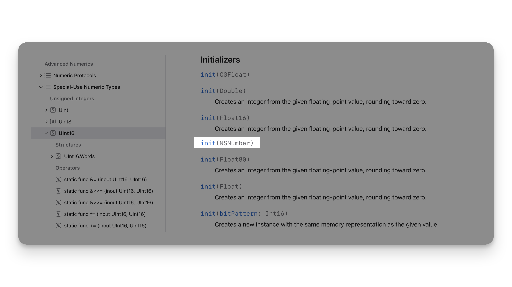

# 基础部分

<iframe style="border:none" width="100%" height="450" src="https://whimsical.com/embed/TAXMEpqr8PiJExMXoqmtN1"></iframe>

## 常量和变量

「常量」的值一旦设定就不能改变，而「变量」的值可以随意更改。

使用前必须声明，`let` 来声明常量，`var` 声明变量，例如：

```swift
let maximumNumberOfLoginAttempts = 10
var currentLoginAttempt = 0
```

可以在一行中声明多个常量或者多个变量，用逗号隔开：

```swift
var x = 0.0, y = 0.0, z = 0.0
```

### 类型注解

用来说明常量或者变量中要存储的值的「类型」，比如:

```swift
var welcomeMessage: String

var total: Int

var changed: Bool
```

- 「变量」welcomeMessage 的「类型」是字符串（`String`）
- 「变量」total 的「类型」是数值型（`Int`）
- 「变量」changed 的「类型」是布尔型（`Bool`）

可以在一行中定义多个同样类型的变量，用逗号分割，并在最后一个变量名之后添加类型注解：

```swift
var red, green, blue: Double
```

如果在「声明」变量或常量时赋予了「初值」，则可以不写类型注解，因为 Swift 可以根据「初值」推断出它的类型。例如：

```swift
var message = "Hello" // Swift 推断出它是「字符串」类型
```

### 命名

不能包含数学符号，箭头，保留的（或者非法的）Unicode 码位，连线与制表符。也不能以数字开头。如下例：

```swift
let π = 3.14159 // [!code error]
let 你好 = "你好世界" // [!code error]
let 🐶🐮 = "dogcow" // [!code error]
```


一旦你将常量或者变量声明为确定的类型，你就不能使用「相同」的名字「再次」进行声明，或者「改变」其存储的值的「类型」。同时，你也不能将常量与变量进行「互转」。

```swift
var greeting = "Hello, World"

//Error: Invalid redeclaration of 'greeting'
var greeting: Int = 1 // [!code error]

//Error: Cannot assign value of type 'Int' to type 'String'
greeting = 5 // [!code error]

```

可以更改现有的变量值为「同类型」的值。如下例：

```swift
var greeting = "Hello, World"

// greeting 现在是 "Hello, Swift!"
greeting = "Hello, Swift" 
```

常量的值一旦被确定就不能更改了。尝试这样做会导致编译时报错：

```swift
let languageName = "Swift"

//Error: Cannot assign to value: 'languageName' is a 'let' constant
languageName = "Swift++"  // [!code error]
```

### 输出常量和变量


可以用 [print(_:separator:terminator:)](https://developer.apple.com/documentation/swift/print(_:separator:terminator:)) 函数来输出当前常量或变量的值:

```swift
func print(
    _ items: Any...,
    separator: String = " ",
    terminator: String = "\n"
)
```
- items：零个或多个要打印的项目。
- separator：在每个项目之间打印的字符串。默认为一个空格（"` `"）。
- terminator：在所有项目打印完毕后打印的字符串。默认为换行符（"`\n`"）。

例如：

::: code-group

```swift [常规用法]
print("One two three four five")
// Prints "One two three four five"


print(1...5)
// Prints "1...5"


print(1.0, 2.0, 3.0, 4.0, 5.0)
// Prints "1.0 2.0 3.0 4.0 5.0"
```

```swift [分隔符]
print(1.0, 2.0, 3.0, 4.0, 5.0, separator: " ... ")
// Prints "1.0 ... 2.0 ... 3.0 ... 4.0 ... 5.0"
```

```swift [终止符]
for n in 1...5 {
    print(n, terminator: ",end")
}
// Prints "12345,end"
```

:::

如果要将变量或常量传入字符串，可以使用「字符串插值」，用法`\(...)`

```swift {4-5}
let price = 2
let number = 3
let message = """
If one cookie costs \(price) dollars, \
\(number) cookies cost \(price * number) dollars.
"""
print(message)
// Prints "If one cookie costs 2 dollars, 3 cookies cost 6 dollars."
```

## 注释

请在代码中使用注释来添加提示或笔记，这样便于将来阅读。Swift 编译器在编译代码时会自动忽略掉这些注释部分。

::: code-group

```swift [单行注释]
// 这是一个注释
```

```swift [多行]
/* 这也是一个注释，
但是是多行的 */
```

```swift [多行嵌套]
/* 这是第一个多行注释的开头
/* 这是第二个被嵌套的多行注释 */
这是第一个多行注释的结尾 */
```
:::

## 分号

与其他大部分编程语言不同，Swift 并不强制要求在每条语句的结尾处使用分号（`;`），当然，你也可以按照你自己的习惯添加分号。有一种情况下「必须」要用分号，即你打算在**同一行内写多条独立的语句**：

```swift
let cat = "🐱"; print(cat)
// 输出“🐱”
```

## 整数

Swift 提供了 8、16、32 和 64 位的有符号和无符号整数类型。

::: tip 提示
在 Swift 中，整数类型分为有符号和无符号两种。

- **有符号整数**：可以表示正数、负数以及零。其类型前面会有一个 `Int`，比如 `Int8`、`Int16`、`Int32`、`Int64`，其中的数字代表这个类型可以使用的位数。比如 `Int8` 表示有符号的 `8` 位整数，其范围是 `-128` 到 `127`。
- **无符号整数**：只能表示非负数（正数和零）。其类型前面会有一个 `UInt`，比如 `UInt8`、`UInt16`、`UInt32`、`UInt64`，这里的数字同样代表使用的位数。例如 `UInt8` 表示无符号的 `8` 位整数，其范围是 `0` 到 `255`。
:::


### 整数范围

你可以访问不同整数类型的 `min` 和 `max` 属性来获取对应类型的最小值和最大值：

```swift
let minValue = UInt8.min  // minValue 为 0，是 UInt8 类型
let maxValue = UInt8.max  // maxValue 为 255，是 UInt8 类型
```

### Int

Swift 提供了一个特殊的整数类型 `Int`，长度与「当前平台」的原生字长相同：

- 在 32 位平台上，`Int` 和 `Int32` 长度相同。
- 在 64 位平台上，`Int` 和 `Int64` 长度相同。


::: warning 注意
除非你需要特定长度的整数，一般来说使用 `Int` 就够了。这可以提高代码一致性和可复用性。即使是在 32 位平台上，`Int` 可以存储的整数范围也可以达到 `-2,147,483,648` ~ `2,147,483,647`，大多数时候这已经足够大了。
:::

### UInt

Swift 也提供了一个特殊的「无符号类型」`UInt`，长度与当前平台的原生字长相同

::: warning 注意
尽量避免使用 `UInt`，除非必须存储一个与当前平台字长相同的无符号整数。在大多数情况下，建议使用 `Int`，即使是存储非负值。这样做可以提高代码的通用性，减少不同整数类型间的转换，并符合 Swift 的类型推断机制。
:::

## 浮点数

浮点数是有小数部分的数字，比如 3.14159、0.1 和 -273.15。

浮点类型比整数类型表示的范围更大，可以存储比 `Int` 类型更大或者更小的数字。Swift 提供了两种有符号浮点数类型：
- `Double` 表示 64 位浮点数。当你需要存储很大或者很高精度的浮点数时请使用此类型。
- `Float` 表示 32 位浮点数。精度要求不高的话可以使用此类型。

::: tip 提示
`Double` 精确度很高，至少有 15 位小数，而 `Float` 只有 6 位小数。选择哪个类型取决于你的代码需要处理的值的范围，在两种类型都匹配的情况下，将优先选择 `Double`。
:::


## 类型安全和类型推断

Swift 是一个「类型安全」的语言。它会在编译你的代码时进行「类型检查」并把不匹配的类型标记为错误。这可以让你在开发的时候尽早发现并修复错误。

如果没有显示的指定类型，Swift 会通过「类型推断」来选择合适的类型，原理是依据你的「赋值」。

例如，如果你给一个新常量赋值 `42` 并且没有标明类型，Swift 可以推断出常量类型是 `Int` ，因为你给它赋的初始值看起来像一个整数：

```swift
let meaningOfLife = 42
// meaningOfLife 会被推测为 Int 类型
```

同理，如果你没有给浮点字面量标明类型，Swift 会推断你想要的是 Double，而且总是会选择 `Double` 而不是 `Float`。

```swift
let pi = 3.14159
// pi 会被推测为 Double 类型
```

如果表达式中同时出现了整数和浮点数，会被推断为 `Double` 类型：

```swift
let anotherPi = 3 + 0.14159
// anotherPi 会被推测为 Double 类型
```

## 数值型字面量


| 类型   |  前缀前缀  |        示例 |
|------|:----:|----------:|
| 十进制  |  无   |      `17` |
| 二进制  | `0b` | `0b10001` |
| 八进制  | `0o` |    `0o21` |
| 十六进制 | `0x` |    `0x11` |


::: info 要点

- 浮点字面量主要以十进制或者是十六进制表达。
- 小数点两边必须有至少一个十进制数字（或者是十六进制的数字）。
- 十进制浮点数也可以有一个可选的「指数」，通过大写或者小写的 `e` 来指定；
- 十六进制浮点数必须有一个指数，通过大写或者小写的 `p` 来指定。

:::


如果一个十进制数的指数为 $e$，那这个数相当于基数和 $10^e$ 的乘积：

- `1.25e2`表示 $1.25 \times 10^2$ ，等于`125.0`。
- `1.25e-2`表示 $1.25 \times 10^{-2}$，等于`0.0125`。

如果一个十六进制数的指数为 $e$，那这个数相当于基数和$2^e$ 的乘积：

- `0xFp2` 表示 $15 \times 2^2$，等于 `60.0`。
- `0xFp-2` 表示 $15 \times 2^{-2}$，等于 `3.75`。

下面的这些浮点字面量都等于十进制的 `12.1875`：

```swift
let decimalDouble = 12.1875
let exponentDouble = 1.21875e1
let hexadecimalDouble = 0xC.3p0
```

::: details 为什么？

1. **十进制双精度浮点数**（`let decimalDouble = 12.1875`）：
    - 这是该数字的标准十进制（基数 `10`）表示方式，直接按照数值显示：`12.1875`。

2. **指数双精度浮点数**（`let exponentDouble = 1.21875e1`）：
    - 这种表示方式使用了科学记数法，这在编程中常用于高效处理非常大或非常小的数字。`e1` 表示前面的数字需要乘以 `10` 的 `1` 次方。
    - 因此，`1.21875e1` 转换为 $(1.21875 \times 10^1 = 12.1875)$。

3. **十六进制双精度浮点数**（`let hexadecimalDouble = 0xC.3p0`）：
    - 这是十六进制（基数 `16`）表示方式，也是在编程中表达二进制数据的一种紧凑方式。`0xC.3` 对应于十六进制中的 `C.3`，其中 `C` 在十六进制中为 `12`，在十进制中为 `12`，而 `3` 是 $(3/16)$。
    - `p0` 部分表示该数字需要乘以 `2` 的 `0` 次方（即 `1`）。因此，`0xC.3p0` 在转换为十进制时也等于 `12.1875`。


:::

数值类字面量可以包括额外的格式来增强可读性。整数和浮点数都可以添加额外的「**零**」并且包含「**下划线**」，并不会影响字面量：

```swift
let paddedDouble = 000123.456
let oneMillion = 1_000_000
let justOverOneMillion = 1_000_000.000_000_1
```


## 数值型类型转换

不同整数类型的变量和常量可以存储不同范围的数字。`Int8` 类型的常量或者变量可以存储的数字范围是 `-128-127`，而 `UInt8` 类型的常量或者变量能存储的数字范围是`0-255`。如果数字超出了常量或者变量可存储的范围，编译的时候会报错：

```swift
let cannotBeNegative: UInt8 = -1 // [!code error]
// UInt8 类型不能存储负数，所以会报错
let tooBig: Int8 = Int8.max + 1 // [!code error]
// Int8 类型不能存储超过最大值的数，所以会报错

```

要将一个数字从一种类型转换为另一种类型，你需要用这个数字作为输入，来创建一个新的目标类型实例。





如果你想将两种不同类型的数字（比如 `UInt8` 和 `UInt16`）一起运算或比较，你需要先将它们转换成同一类型。例如，可以先用 `UInt16` 的构造函数将 `UInt8` 的数值转换成 `UInt16` 类型，这样两个数值就能匹配，再进行计算或比较。这个转换是必须的，因为Swift不允许直接在不同类型的数字间进行操作。如下例：


```swift
let twoThousand: UInt16 = 2_000
let one: UInt8 = 1
let twoThousandAndOne = twoThousand + UInt16(one)
```

## 整数和浮点数转换

整数和浮点数的转换必须显式指定类型，如下例整数被强转为浮点数：

```swift
let three = 3
let pointOneFourOneFiveNine = 0.14159
let pi = Double(three) + pointOneFourOneFiveNine // [!code focus]
// pi 等于 3.14159，所以被推测为 Double 类型
```

这个例子中，常量`three`的值被转换为 `Double` 类型，加号两边的数**类型必须相同**。如果不进行转换，两者无法相加。

浮点数转换为整数会丢失浮点数，如下例：

```swift
let integerPi = Int(pi)
// integerPi 等于 3
```

::: warning 注意
数字字面量（如 `3` 和 `0.14159`）可以直接相加，因为字面量本身不具有固定的类型。这些字面量的具体类型将根据它们用途的上下文在编译时确定。这意味着你可以将整数和浮点数字面量直接组合在一起进行计算，而不需要显式地指定类型。编译器会自动推断出最合适的类型来处理这些字面量的计算。相反，当你使用具体类型的变量和常量进行操作时，你必须确保它们的类型兼容或进行必要的类型转换，因为每个变量和常量从一开始就有一个明确的类型定义。

:::


## 类型别名

类型别名允许你为现有类型定义一个新名字，可以通过`typealias`关键字实现。

类型别名非常适用于那些想要为某个数据类型提供「更清晰」、「具体含义」的名称的情况。

```swift
typealias AudioSample = UInt16
```

一旦定义了类型别名，就可以在代码中替代原有类型来使用这个新名字：

```swift
var maxAmplitudeFound = AudioSample.min
// maxAmplitudeFound 现在是 0
```

## 布尔值

Swift 语言中包含一个基本的布尔（ Boolean ）类型，称为 `Bool`。这种类型用于表示逻辑上的真或假，因此布尔值只能是 `true` 或 `false` 这两种状态。

```swift
let orangesAreOrange = true
let turnipsAreDelicious = false
```

当你编写条件语句比如 `if` 语句的时候，布尔值非常有用：

```swift{1}
if turnipsAreDelicious {
    print("Mmm, tasty turnips!")
} else {
    print("Eww, turnips are horrible.")
}
// 输出“Eww, turnips are horrible.”
```

如果你在需要使用 `Bool` 类型的地方使用了非布尔值，Swift 的类型安全机制会报错。下面的例子会报告一个编译时错误：

```swift
let i = 1
if i { // [!code error]
    // 这个例子不会通过编译，会报错
}
```

然而，下面的例子是合法的：

```swift
let i = 1
if i == 1 { // [!code ++]
    // 这个例子会编译成功
}
```

`i == 1` 的比较结果是 `Bool` 类型，所以第二个例子可以通过类型检查。


## 元组

元组（`tuples`）是一种数据结构，它可以将「多个值」组合成一个「单一」的复合值。元组中的每个成员可以是「不同类型」的数据，这使得元组非常灵活且适用于多种场景，如同时处理不同类型的信息。

假设你想要存储一个学生的信息，包括他们的名字、年龄和平均分数。使用元组，你可以轻松地将这些不同类型的数据组合在一起：

```swift
let student = ("Alice", 20, 89.5)
```

在这个例子中，`student` 元组包含了三个元素：一个字符串 `Alice`（名字），一个整数 `20`（年龄），和一个浮点数 `89.5`（平均分数）。

你还可以通过**索引**访问元组中的元素，如下所示：

```swift
print("Name: \(student.0)")   // 输出: Name: Alice
print("Age: \(student.1)")    // 输出: Age: 20
print("Score: \(student.2)")  // 输出: Score: 89.5
```

此外，Swift 允许你给元组中的元素命名，使代码更加清晰易懂：

```swift
let student = (name: "Alice", age: 20, score: 89.5)

print("Name: \(student.name)")   // 输出: Name: Alice
print("Age: \(student.age)")     // 输出: Age: 20
print("Score: \(student.score)") // 输出: Score: 89.5
```

你可以通过分解（或解构）的方式将这个元组的每个元素赋值给单独的常量或变量，如下所示：

```swift
let (name, age, score) = student

print("Name: \(name)")   // 输出: Name: Alice
print("Age: \(age)")     // 输出: Age: 20
print("Score: \(score)") // 输出: Score: 89.5

```

在这个分解过程中， `name`, `age`, `score` 分别被初始化为 `student` 元组中对应的值。此后，你可以像使用普通变量那样使用它们，无需通过元组索引。

如果你只需要元组中的某些元素，可以使用下划线 `_` 忽略不需要的元素：

```swift
//在这个例子中，我们只关心名字和分数，而年龄则被忽略。
let (name, _, score) = student

print("Name: \(name)")   // 输出: Name: Alice
print("Score: \(score)") // 输出: Score: 89.5

```

## 可选类型

可选类型（`optionals`）用于处理值可能缺失的情况。一个可选类型要么「持有」一个值，你可以通过解析可选类型来访问这个值；要么它根本「不包含」任何值。

这使得 Swift 的类型系统既安全又表达力强，因为它可以明确地区分值存在与否的情况。使用可选类型，开发者可以优雅地处理缺失数据的场景，避免常见的错误如空指针异常。


假设你有一个应用，其中用户可以设置他们的生日，但这个信息是可选的，因为用户可能不愿意分享。你可以使用可选类型来定义一个变量，来存储这种可能存在也可能不存在的值：

```swift
var birthday: String?
```

这里，`birthday` 被定义为 `String?` 类型，意味着它可以包含一个字符串或者没有任何值（`nil`）。

### 设置和访问可选类型
假设用户决定输入他们的生日：

```swift
birthday = "1992-08-15"
```

如果你想在屏幕上显示这个生日信息，你需要先检查它是否存在，以避免运行时错误。这可以通过「**可选绑定**」来实现，这种方式可以安全地检查并解包可选类型的值：

```swift
if let date = birthday {
    print("User's birthday is \(date).")
} else {
    print("User's birthday is not set.")
}
```

在这个例子中，如果 `birthday` 包含一个值，那么这个值将被赋给新的常量 `date`，并在 `if` 语句的第一个分支中使用。如果 `birthday` 是 `nil`，则执行 `else` 分支。

### 使用空合运算符
另一种常见的处理可选类型的方式是使用空合运算符（`??`），这允许你提供一个默认值，用于在可选类型为 `nil` 时使用：

```swift{1}
let displayBirthday = birthday ?? "Unknown"
print("User's birthday is \(displayBirthday).")
```

在这个例子中，如果 `birthday` 是 `nil`，则 `displayBirthday` 将**默认**为 `Unknown`。

### 赋值为 nil

可选类型的一个关键特性是它们可以被赋值为 `nil` 来明确表示没有值。这是区别于非可选类型的重要特征，因为「非可选类型」在 Swift 中必须总是有一个有效的值。例如：

```swift{2}
var birthday: String? = "1992-08-15"
birthday = nil  // 现在 birthday 没有值
```
在这个例子中，`birthday`最初被设置为一个具体的日期字符串，随后被设置为 `nil` 来表示用户决定不提供生日信息。

### 强制解析（Forced Unwrapping）

当你**确定**一个可选类型确实包含值的时候，你可以使用感叹号（`!`）来强制解析这个可选值。使用感叹号是一种声明：「我确定这里有值，请直接使用」。 这种方式被称为**强制解析**，但需要小心使用，因为如果可选值为 `nil` 时进行强制解析，程序将**崩溃**。

```swift{1}
var birthday: String? = "1992-08-15"
print("User's birthday is \(birthday!).")
```
如果`birthday`确实包含一个字符串，那么强制解析是安全的。但如果`birthday`是 `nil`，这行代码将引发运行时错误。

::: warning 提示
使用强制解析最好加上 `if` 判断，比如：
```swift
if birthday != nil {
    print("User's birthday is \(birthday!).")
}
```
:::


## 隐式解析可选类型

有时你可能知道一旦可选类型被设定值后就不会再被设为 `nil`。在这种情况下，为了避免频繁的解包，你可以使用隐式解析可选类型。这是通过将**类型声明**从 `String?` 改为 `String!` 实现的，这意味着每次访问该变量时可以不用解包，系统将自动解包它。

```swift{1}
var birthday: String! = "1992-08-15"
print("User's birthday is \(birthday).")  // 不需要显式解包
```
隐式解析可选仍然允许变量为 `nil`，但每次使用时系统假设该变量包含一个值，因此你不需要每次访问时都进行解包。这种方式适用于变量在初始化后确保总会有值的场景，但仍需谨慎使用以避免运行时错误。

## 错误处理

在 Swift 中，你可以通过错误处理机制来应对程序执行过程中可能遇到的各种错误情况。与使用可选类型来表示函数执行的成功或失败不同，错误处理机制能够明确地标识失败的原因，并将错误信息传递到程序的其他部分。

当一个函数遇到问题时，它可以抛出一个错误，而调用这个函数的代码则有责任捕获这个错误并作出相应的处理。这种机制不仅帮助你管理和响应错误，还使得错误的原因和解决方案更加清晰，有助于提高程序的健壮性和用户体验。

```swift{1}
func canThrowAnError() throws {
    // 这个函数有可能抛出错误
}
```

如果你想让一个函数能够抛出错误，你应该在其声明中添加 `throws` 关键字。这表明该函数在执行过程中可能会遇到并抛出错误。当调用这样的函数时，你需要在调用表达式前加上 `try` 关键词，以标明这里的代码可能会处理抛出的错误。

```swift{2}
do {
    try canThrowAnError()
    // 没有错误消息抛出
} catch {
    // 有一个错误消息抛出
}
```

`do` 语句创建一个新的作用域，用于执行可能抛出错误的代码。这个作用域中的错误可以被传递到一个或多个 `catch` 子句。这些 `catch` 子句用于捕获并处理可能发生的错误，使你能够对不同类型的错误做出不同的响应。

```swift
func makeASandwich() throws {
    // ...
}

do {
    try makeASandwich()
    eatASandwich()
} catch SandwichError.outOfCleanDishes { // [!code error]
    washDishes()
} catch SandwichError.missingIngredients(let ingredients) { // [!code error]
    buyGroceries(ingredients)
}
```

在这个例子中，`makeASandwich()` 函数在尝试制作三明治时可能会遇到两种错误：没有干净的盘子或者缺少某些原料。这个函数被标记为 `throws`，表示它可以抛出错误。为了处理可能发生的错误，函数调用被包裹在一个 `do` 语句块中，同时使用 `try` 关键字。

如果在 `makeASandwich()` 函数执行过程中没有发生任何错误，那么会正常调用 `eatASandwich()` 函数来吃三明治。然而，如果存在错误：

- 如果错误是 `SandwichError.outOfCleanDishes`，表示没有干净的盘子，这时会调用 `washDishes()` 函数来清洗盘子。
- 如果错误是 `SandwichError.missingIngredients`，表示缺少一些原料，这时 `buyGroceries(_:)` 函数将被调用，并将捕获到的缺失原料列表（一个字符串数组）作为参数传递。


## 断言和先决条件

断言和先决条件是在代码运行时进行的检查，用于确保在执行后续代码之前某个必要条件已经得到满足。如果断言或先决条件的布尔表达式评估为真（`true`），代码将正常继续执行。相反，如果评估结果为假（`false`），表明程序当前状态是无效的，随即程序将终止执行，并导致应用程序崩溃。

你可以使用断言和先决条件来明确你的编程假设和期望。断言通常用于开发阶段，帮助开发者发现错误和不正确的假设；而先决条件则用于生产环境，用来检测和防止问题的发生。这些检查不仅验证程序的运行时期望，而且还充当代码中的有用文档。

与错误处理不同，断言和先决条件不是用来处理可恢复或预期内的错误。断言失败意味着程序处于一个无效状态，且通常无法恢复。因此，一旦检测到这种无效状态，程序会被立即中止，从而防止错误状态进一步损害系统。

断言和先决条件的主要区别在于它们的检查时机：断言只在调试环境中执行，而先决条件则在调试和生产环境中都会执行。这意味着在开发阶段，你可以使用大量的断言进行测试和验证，但这些断言在生产环境中不会被评估，从而不影响程序性能。

### 使用断言进行调试

在 Swift 中，你可以使用标准库提供的 `assert(_:file:line:)` 函数来编写断言。这个函数接受一个布尔表达式和一个可选的消息字符串。如果表达式的结果为 `false`，则会显示该消息并中断应用程序：

```swift
let age = -3
assert(age >= 0, "A person's age cannot be less than zero")
// 因为 age 是负数，所以断言会触发，并中止程序
```

在这个例子中，只有当 `age` 的值非负时（`age >= 0`），程序才会继续执行。如果 `age` 的值为负，如示例中所示，`age >= 0` 结果为 `false`，断言将被触发，程序将立即终止。

如果不需要提供断言消息，你也可以省略它，简单地写成：

```swift
assert(age >= 0)
```

此外，如果条件已经在代码中被检查，你可以使用 `assertionFailure(_:file:line:)` 函数来直接指示一个断言失败的情况，例如：

```swift
if age > 10 {
    print("You can ride the roller-coaster or the ferris wheel.")
} else if age > 0 {
    print("You can ride the ferris wheel.")
} else {
    assertionFailure("A person's age can't be less than zero.")
}
```

在这个代码块中，如果年龄小于或等于零，程序会调用 `assertionFailure` 来明确表示出现了不应该发生的情况。

### 强制执行先决条件

在 Swift 中，当你需要确保某个条件必须为真以便安全地继续执行代码时，可以使用先决条件（`preconditions`）。这种情况常见于检查潜在的程序错误，例如防止下标越界或确保传递给函数的参数是合理的。

你可以使用全局 `precondition(_:file:line:)` 函数来设置一个先决条件。这个函数接收一个布尔表达式和一个消息字符串。如果表达式评估结果为 `false`，则显示该消息并中断程序执行：

```swift
// 在一个数组访问的下标实现中
precondition(index > 0, "Index must be greater than zero.")
```

在这个例子中，先决条件检查下标 `index` 必须大于零。如果 `index` 不满足这一条件，程序将显示错误消息并终止执行，从而防止可能的数组越界错误。

此外，如果你已经通过其他方式检查了所有可能的条件，并且希望明确表达某个条件不应该发生（例如，在 `switch` 语句中），你可以使用 `preconditionFailure(_:file:line:)` 方法来明确标示出一个不应该达到的程序状态：

```swift
switch someValue {
    case validOption1:
        // 处理选项1
    case validOption2:
        // 处理选项2
    default:
        preconditionFailure("All valid cases should be handled.")
}
```

在这里，`preconditionFailure` 被用来表明如果 `switch` 语句中的 `default` 分支被执行，那么就表示存在一个逻辑错误，因为所有有效的值应该已经被前面的分支处理了。


::: danger fatalError
在 Swift 开发中，你有时会用到 `fatalError(_:file:line:)` 函数，这个函数在代码的任何优化级别下都会强制停止程序执行。这是特别重要的，尤其是当你使用特定的编译选项，如未检查模式（`unchecked mode`，通过 `-Ounchecked` 编译选项启用），那时先决条件（`preconditions`）不会被检查。

在未检查模式下，编译器假设所有的先决条件**总是为真**，这会导致对代码进行更激进的优化。这种优化可以提高程序的性能，但同时也增加了因未捕捉到程序错误而导致严重问题的风险。不过，不像断言和先决条件可能会被编译器在这种模式下忽略，`fatalError` 函数总是会导致程序终止，无论优化设置如何。

`fatalError(_:file:line:)` 函数通常用于两种情况：

1. **当方法还未实现时：** 在早期开发阶段或当你在设计接口时，可能会有一些方法暂时没有实现。在这些方法体中使用 `fatalError("Unimplemented")` 可以确保如果不小心调用了这些未实现的方法，程序会立即崩溃。这样可以清楚地标示出哪些部分的代码还需要被开发或修改。

    示例代码：
    ```swift
    func futureFeature() {
        fatalError("This feature has not been implemented yet.")
    }
    ```

2. **强制处理所有的情况：** 在编写 `switch` 语句时，如果你已经覆盖了所有认为可能的情况，但编译器仍要求提供 `default` 分支，可以在 `default` 分支使用 `fatalError` 来标明如果运行到这里就是出现了不应该发生的情况。

    示例代码：
    ```swift
    switch someEnum {
    case .option1:
        // 处理选项1
    case .option2:
        // 处理选项2
    default:
        fatalError("Unhandled case in switch for someEnum")
    }
    ```

使用 `fatalError` 是一种确保软件质量的策略，通过使程序在出现严重逻辑错误时立即崩溃，从而避免错误数据的进一步处理或错误逻辑的执行。
:::