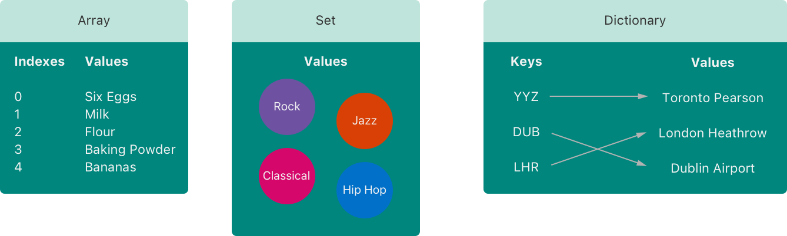
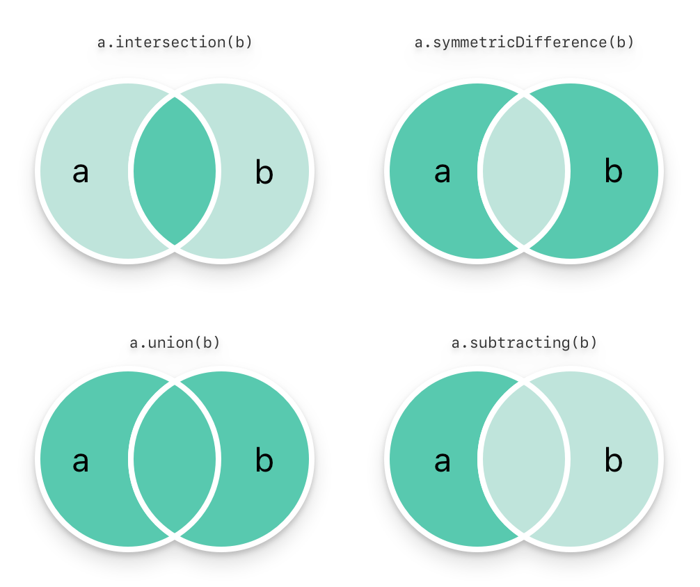
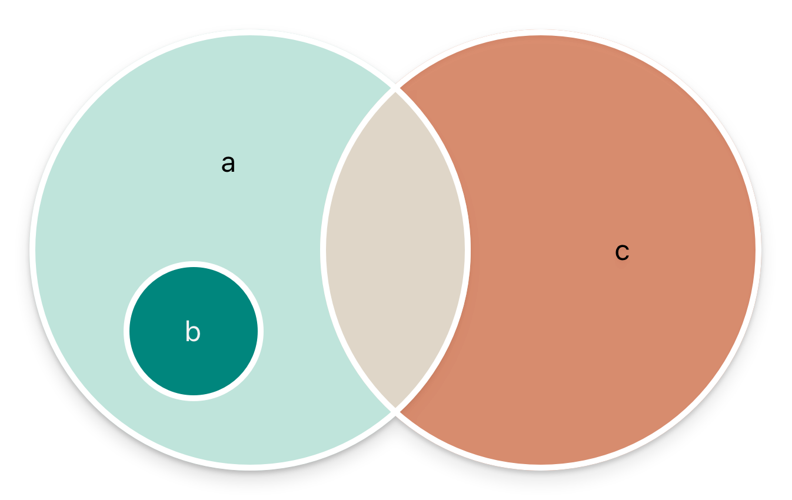

# 集合类型

<iframe style="border:none" width="800" height="450" src="https://whimsical.com/embed/2EnCepoK8djjmqmgJMwCQP"></iframe>

Swift 语言提供了三种基本的集合类型来存储数据集：数组（Array）、集合（Set）和字典（Dictionary）。数组用于存储有序的数据集合，集合用于存储一个无序且不包含重复元素的数据集，而字典则存储无序的键值对数据集。



数组、集合和字典都要求明确指定存储的数据类型。这种类型安全的设计确保了不能插入错误的数据类型，同时你也可以放心，从这些集合中取出的数据类型是预期的和一致的。

## 集合的可变性

如果你将一个数组、集合或字典分配给一个「变量」，那么这个集合是「可变的」。这意味着你可以在创建后随时添加、修改或删除数据项。相反，如果你将这些集合类型分配给一个「常量」，则它们变为「不可变的」，其内容和大小将无法更改。

## 数组（Arrays）

数组使用有序列表存储同一类型的多个值。相同的值可以多次出现在一个数组的不同位置中。

### 数组的简单语法

数组的完整类型标注是 `Array<Element>`，这里的 `Element` 表示数组中允许的唯一数据类型。你也可以使用更简洁的语法 `[Element]` 来定义数组。虽然这两种表达方式在功能上完全相同，推荐使用简短的形式 `[Element]`。在本文中，我们将一直采用这种简洁的语法来处理数组。

### 创建一个空数组

你可以使用构造器语法（`[]`）创建一个特定数据类型（`[Int]`）的数组。如下例：

```swift{1}
var someInts: [Int] = []
print("someInts is of type [Int] with \(someInts.count) items.")
// 输出：“someInts is of type [Int] with 0 items.”
```

这段代码中，`someInts` 的数据类型被推断为 `[Int]`，即一个整数数组。

如果你已经在代码中定义了数组的类型，你可以使用更简洁的方式`[]`来清空数组或重新初始化它：

```swift{3}
someInts.append(3)
// someInts 现在包含一个整数值
someInts = []
// someInts 重新被设为空数组，但类型仍然是 [Int]
```

这样，`someInts` 在添加新元素后又被重置为一个空数组，但其数据类型不变，依然是整数数组。

### 创建一个带有默认值的数组

`Array` 类型提供了一种构造方法，允许你创建一个具有特定大小的数组，并且数组中的所有元素都初始化为相同的默认值。你可以通过指定数组的元素数量（`count`）和每个元素的初始值（`repeating`）来使用这种构造方法。这里是如何使用这个构造方法的示例：

```swift
var threeDoubles = Array(repeating: 0.0, count: 3)
// threeDoubles 是一种 [Double] 数组，等价于 [0.0, 0.0, 0.0]
```

在这个例子中，`repeating: 0.0` 表示数组中每个元素的初始值是 `0.0`，而 `count: 3` 指定数组应该有 3 个这样的元素。

### 通过两个数组相加创建一个数组

你可以使用加法操作符（+）来组合两个已存在的相同类型数组。新数组的数据类型会从两个数组的数据类型中推断出来：

```swift{4}
var anotherThreeDoubles = Array(repeating: 2.5, count: 3)
// anotherThreeDoubles 被推断为 [Double]，等价于 [2.5, 2.5, 2.5]

var sixDoubles = threeDoubles + anotherThreeDoubles
// sixDoubles 被推断为 [Double]，等价于 [0.0, 0.0, 0.0, 2.5, 2.5, 2.5]
```

### 用数组字面量构造数组

你可以使用数组字面量来构建数组，这是一个简单直观的方法。数组字面量由一组数值组成，这些数值被逗号分隔，并被包括在方括号中。这使得数组的创建既快速又直观。例如：

```swift
var shoppingList: [String] = ["Eggs", "Milk"]
// shoppingList 已经被构造并且拥有两个初始项。
```
当你使用字面量创建包含相同类型值的数组时，Swift 会自动推断出数组的类型。例如：

```swift
var shoppingList = ["Eggs", "Milk"]
```

### 访问和修改数组

你可以使用各种数组的方法和属性来访问和修改数组，或者使用下标语法来操作数组。下面是如何使用这些特性的详细解释：

#### 访问数组元素数量
使用数组的 `count` 属性来获取数组中的元素数量：
```swift
print("The shopping list contains \(shoppingList.count) items.")
// 输出 "The shopping list contains 2 items." （这个数组有2个项）
```

#### 检查数组是否为空
使用布尔属性 `isEmpty` 来检查数组是否为空，这是检查 `count` 是否为 0 的快捷方式：
```swift
if shoppingList.isEmpty {
    print("The shopping list is empty.")
} else {
    print("The shopping list is not empty.")
}
// 打印 "The shopping list is not empty."（shopping list 不是空的）
```

#### 添加新元素
你可以使用 `append(_:)` 方法在数组的末尾添加新元素：
```swift
shoppingList.append("Flour")
// shoppingList 现在有3个数据项，似乎有人在摊煎饼
```
此外，使用加法赋值运算符 `+=` 来将一个或多个同类型的元素直接添加到数组末尾：
```swift
shoppingList += ["Baking Powder"]
// shoppingList 现在有四项了
shoppingList += ["Chocolate Spread", "Cheese", "Butter"]
// shoppingList 现在有七项了
```

#### 使用下标访问和修改元素
可以直接使用下标语法来获取或修改数组中的元素，将所需的索引放在数组名称后的方括号中：
```swift
var firstItem = shoppingList[0]
// 第一项是 "Eggs"

shoppingList[0] = "Six eggs"
// 其中的第一项现在是 "Six eggs" 而不是 "Eggs"
```

::: warning 注意

Swift 的数组索引从 0 开始。

:::

#### 使用下标修改多个元素
你也可以使用下标来一次改变数组中一系列元素的值，即使新数据和原数据的数量不同：
```swift
shoppingList[4...6] = ["Bananas", "Apples"]
// shoppingList 现在有6项
```

#### 插入和移除元素
通过调用 `insert(_:at:)` 方法在数组的特定索引之前添加元素：
```swift
shoppingList.insert("Maple Syrup", at: 0)
// shoppingList 现在有7项
// 列表中的第一项现在是 "Maple Syrup"
```
使用 `remove(at:)` 方法来移除指定索引的元素：
```swift
let mapleSyrup = shoppingList.remove(at: 0)
// 索引值为0的数据项被移除
// shoppingList 现在只有6项，不包括 "Maple Syrup"
```

::: warning 注意
为避免索引越界的运行时错误，请确保使用的索引在有效范围内。
:::


#### 移除数组的最后一个元素
如果你只想移除数组的最后一个元素，可以使用 `removeLast()` 方法：
```swift
let apples = shoppingList.removeLast()
// 数组的最后一项被移除了
// shoppingList 现在只有5项，不包括 "Apples"
```

### 数组的遍历

你可以使用`for-in`循环来遍历数组中所有的数据项：

```swift
for item in shoppingList {
    print(item)
}
// Six eggs
// Milk
// Flour
// Baking Powder
// Bananas
```

当你需要同时获取数组中每个元素的「值」和「索引」时，可以使用 `enumerated()` 方法。这个方法会遍历数组，并返回一个「元组」，每个元组包含一个元素的索引和值。索引从 0 开始，每次遍历时递增，确保索引和元素能够准确对应。在遍历过程中，你可以将这些元组分解为临时的常量或变量：

```swift
for (index, value) in shoppingList.enumerated() {
    print("Item \(String(index + 1)): \(value)")
}
// Item 1: Six eggs
// Item 2: Milk
// Item 3: Flour
// Item 4: Baking Powder
// Item 5: Bananas
```

## 集合（Sets）

集合是一种用来存储相同类型的值的数据结构，而且集合中的每个元素都必须是唯一的，不会出现重复的元素。与数组不同的是，集合中的元素是无序的，即元素的存储顺序不是固定的。

集合非常适用于那些不关心元素顺序，只关心某个值是否出现过的场景。例如，你可能使用集合来检查一组数据中是否包含某个特定的元素，或者快速获取不重复的元素列表。

### 集合类型的哈希值

在 Swift 中，要让一个类型可以安全地存储在集合中，如数组、字典或集合，这个类型必须遵守`Hashable `协议。这意味着类型必须能够提供一个方法来计算其哈希值。哈希值是一个整型（`Int `类型），它用于在哈希表结构中快速定位元素的位置。如果两个对象相等（即满足`a == b`），它们必须具有相同的哈希值（`a.hashValue == b.hashValue`）。

Swift 的标准库中所有的基本数据类型，如字符串（`String`）、整数（`Int`）、浮点数（`Double`）和布尔值（`Bool`）等，默认都实现了`Hashable`协议。这意味着它们可以直接用作字典的键或集合的元素。

此外，如果你有一个枚举类型，且它的每个成员都没有关联值，那么这个枚举也默认遵守`Hashable`协议。例如：

```swift
enum Direction {
    case north, south, east, west
}

// Direction 枚举现在可以用作集合元素或字典键
let directions: Set<Direction> = [.north, .east, .south]

```

在这个例子中，`Direction`枚举没有关联值，并且自动符合`Hashable`，使得我们可以将其用作集合`Set`的元素。

::: details 扩展

当你希望将自定义类型用作集合（如数组、集合）的元素或字典的键时，这个类型必须遵循 `Hashable` 协议。`Hashable` 协议扩展自 `Equatable` 协议，这意味着除了要求类型是可哈希化的，还必须是可比较等价的。

### 什么是 `Hashable` 协议？

遵循 `Hashable` 协议的类型需要实现一个名为 `hash(into:)` 的方法，通过这个方法可以将类型的状态编码到一个或多个 `Hasher` 提供的整数值中。`Hasher` 是 Swift 提供的一个用于哈希计算的工具，它帮助我们生成一个符合标准的、高效的哈希值。

此前，Swift 使用 `hashValue` 这个属性来返回一个整数作为对象的哈希值，但在 Swift 4.2 中引入了 `hash(into:)` 方法以提供一个更安全、更直接的方式来自定义哈希实现，从而替代了 `hashValue`。

### 什么是 `Equatable` 协议？

由于 `Hashable` 协议继承自 `Equatable` 协议，任何遵循 `Hashable` 的类型也必须实现 `Equatable` 协议。这就要求提供一个自定义的等式比较操作符 `==`，用来判断两个实例是否相等。实现这个操作符时，必须确保满足三个条件：

- **自反性**：任何实例与自身比较都应该是相等的，即 `a == a` 总是返回 `true`。
- **对称性**：如果实例 `a` 等于实例 `b`，那么 `b` 也应该等于 `a`，即 `a == b` 的结果应该与 `b == a` 相同。
- **传递性**：如果 `a == b` 且 `b == c`，那么 `a` 必须等于 `c`。

### 实际应用示例

假设我们有一个自定义的结构体 `Person`：

```swift
struct Person: Hashable {
    var id: Int
    var name: String

    func hash(into hasher: inout Hasher) {
        hasher.combine(id)
        hasher.combine(name)
    }

    static func ==(lhs: Person, rhs: Person) -> Bool {
        return lhs.id == rhs.id && lhs.name == rhs.name
    }
}
```

在这个例子中，`Person` 结构体包括了 `id` 和 `name` 两个属性，并且这两个属性都被用于计算哈希值和比较等价性。这样，只有当两个 `Person` 实例的 `id` 和 `name` 都相等时，它们才被认为是相等的。

通过这种方式，我们确保了自定义类型在使用集合或字典时能够正确地进行比较和哈希处理，从而保证了数据结构的性能和正确性。

:::


### 集合类型语法

集合类型表现为`Set<Element>`，其中`Element`是集合中存储的元素的类型。与数组（在 Swift 中用`Array<Element>`或简写形式`[Element]`表示）不同，集合（`Set`）没有类似数组的简化写法，必须使用完整的泛型类型`Set<Element>`来声明。

### 创建和构造一个空的集合

你可以通过构造器语法创建一个特定类型的空集合：

```swift{1}
var letters = Set<Character>()
print("letters is of type Set<Character> with \(letters.count) items.")
// 打印“letters is of type Set<Character> with 0 items.”
```

此外，如果上下文提供了类型信息，比如作为函数的参数或者已知类型的变量或常量，你可以通过一个空的数组字面量创建一个空的集合：

```swift
letters.insert("a")
// letters 现在含有1个 Character 类型的值
letters = []
// letters 现在是一个空的 Set，但是它依然是 Set<Character> 类型
```

### 用数组字面量创建集合

你可以通过数组「字面量」来快速构造集合，这是一种简洁有效的方式。在这个例子中，我们定义了一个名为 `favoriteGenres` 的集合，用来存储 `String` 类型的值。

```swift{1}
var favoriteGenres: Set<String> = ["Rock", "Classical", "Hip hop"]
// favoriteGenres 被构造成含有三个初始值的集合
```

这段代码中，`favoriteGenres` 被声明为 `Set<String>` 类型，意味着这个集合只能存储 `String` 类型的值。这里通过数组字面量直接初始化，包括三个字符串：`"Rock"`, `"Classical"`, 和 `"Hip hop"`。

::: warning 注意
由于 `favoriteGenres` 使用 `var` 关键字声明，这表明它是一个可变集合。你可以在后续的代码中添加或删除元素。相对的，如果使用 `let` 关键字，则该集合将不可修改。
:::

虽然集合类型不能直接从数组字面量中自动推断，但如果数组字面量中的元素类型一致，Swift 的类型推断功能可以让你省略具体的集合类型声明。因此，你也可以这样写：

```swift
var favoriteGenres: Set = ["Rock", "Classical", "Hip hop"]
```

在这个简化的声明中，Swift 能够自动推断出 `Set<String>` 作为 `favoriteGenres` 的类型，因为所有元素均为字符串。


### 访问和修改一个集合

管理集合时，可以通过多种属性和方法对集合进行访问和修改。以下是一些基本的操作方法：

#### 获取集合中元素的数量

使用 `count` 属性可以快速获取集合中元素的数量。这是一个只读属性。

```swift
print("I have \(favoriteGenres.count) favorite music genres.")
// 打印：“I have 3 favorite music genres.”
```

#### 检查集合是否为空

使用 `isEmpty` 属性可以检查集合是否为空，这是检查 `count` 是否为 0 的快捷方式。

```swift
if favoriteGenres.isEmpty {
    print("As far as music goes, I'm not picky.")
} else {
    print("I have particular music preferences.")
}
// 打印：“I have particular music preferences.”
```

#### 添加元素

通过 `insert(_:)` 方法可以向集合中添加新的元素。

```swift
favoriteGenres.insert("Jazz")
// favoriteGenres 现在包含 4 个元素
```

#### 删除元素

使用 `remove(_:)` 方法可以删除集合中的元素。如果该元素存在于集合中，则该方法会删除它并返回其值；如果不存在，则返回 `nil`。

```swift
if let removedGenre = favoriteGenres.remove("Rock") {
    print("\(removedGenre)? I'm over it.")
} else {
    print("I never much cared for that.")
}
// 打印：“Rock? I'm over it.”
```

#### 清空集合

使用 `removeAll()` 方法可以删除集合中的所有元素。

```swift
favoriteGenres.removeAll()
// 现在 favoriteGenres 是空的
```

#### 检查元素是否存在

`contains(_:)` 方法可以检查集合中是否包含特定的值。

```swift
if favoriteGenres.contains("Funk") {
    print("I get up on the good foot.")
} else {
    print("It's too funky in here.")
}
// 打印：“It's too funky in here.”
```
### 遍历一个集合

集合中的元素没有特定的顺序，因此，遍历时，元素的出现顺序可能与添加顺序不同。

#### 无序遍历集合（默认）

使用 `for-in` 循环可以遍历集合中的所有元素。因为集合是无序的，所以每次程序运行时元素的遍历顺序可能不同。

```swift
for genre in favoriteGenres {
    print("\(genre)")
}
// 可能的输出：
// Classical
// Jazz
// Hip hop
```

#### 按顺序遍历集合

如果你需要按照特定的顺序遍历集合，可以使用 `sorted()` 方法。这个方法会返回一个数组，数组中的元素是根据提供的排序标准（默认是升序）来排列的。

```swift
for genre in favoriteGenres.sorted() {
    print("\(genre)")
}
// 输出将会是：
// Classical
// Hip hop
// Jazz
```

这里使用了 `sorted()` 方法，它默认按照元素值的升序排列（对于字符串类型是按字典顺序）。因此，输出的顺序是确定的，从 "Classical" 到 "Jazz"。

## 集合操作

你可以高效地执行一些集合操作，例如合并两个集合、查找两个集合的共同元素，或者判断两个集合是完全包含、部分重叠还是完全不相交。

### 基本集合操作

下面的插图描述了两个集合`a`和`b`，以及通过阴影部分的区域显示集合各种操作的结果。




- 使用 `intersection(_:)` 方法可以创建一个新集合，包含两个集合的「交集」，即同时存在于两个集合中的元素。
- 使用 `symmetricDifference(_:)` 方法可以创建一个新集合，包含两个集合中「不重叠」的元素，即仅存在于其中一个集合中的元素。
- 使用 `union(_:)` 方法可以创建一个新集合，包含两个集合中的「所有」元素，合并两个集合的元素。
- 使用 `subtracting(_:)` 方法可以创建一个新集合，包含「在」一个集合中但「不在」另一个集合中的元素。

```swift
let oddDigits: Set = [1, 3, 5, 7, 9]
let evenDigits: Set = [0, 2, 4, 6, 8]
let singleDigitPrimeNumbers: Set = [2, 3, 5, 7]

oddDigits.union(evenDigits).sorted()
// [0, 1, 2, 3, 4, 5, 6, 7, 8, 9]
oddDigits.intersection(evenDigits).sorted()
// []
oddDigits.subtracting(singleDigitPrimeNumbers).sorted()
// [1, 9]
oddDigits.symmetricDifference(singleDigitPrimeNumbers).sorted()
// [1, 2, 9]
```

### 集合成员关系和相等

下面的插图描述了三个集合`a`、`b`和`c`，以及通过重叠区域表述集合间共享的元素。集合`a`是集合`b`的父集合，因为`a`包含了`b`中所有的元素。相反的，集合`b`是集合`a`的子集合，因为属于`b`的元素也被`a`包含。集合`b`和集合`c`是不相交的，因为它们之间没有共同的元素。



- 使用「是否相等」运算符（`==`）可以判断两个集合是否包含完全相同的元素。
- 使用 `isSubset(of:)` 方法可以检查一个集合中的所有元素是否也包含在另一个集合中。
- 使用 `isSuperset(of:)` 方法可以确定一个集合是否包括另一个集合中的所有元素。
- 使用 `isStrictSubset(of:)` 或 `isStrictSuperset(of:)` 方法可以判断一个集合是否严格是另一个集合的子集或父集，即两个集合不完全相等。
- 使用 `isDisjoint(with:)` 方法可以确定两个集合是否没有任何共同的元素（即完全不相交）。

```swift
let houseAnimals: Set = ["🐶", "🐱"]
let farmAnimals: Set = ["🐮", "🐔", "🐑", "🐶", "🐱"]
let cityAnimals: Set = ["🐦", "🐭"]

houseAnimals.isSubset(of: farmAnimals)
// true
farmAnimals.isSuperset(of: houseAnimals)
// true
farmAnimals.isDisjoint(with: cityAnimals)
// true
```

## 字典


字典是一种数据结构，用来存储成对的数据，即键值对。在字典中，每个「键」（key）都唯一地对应一个「值」（value）。这就像是我们在现实生活中用词典查单词的意思一样，通过一个特定的词（键）来找到其定义（值）。不同于数组，字典中的数据并没有固定的顺序。字典非常适合用于那些需要通过特定标识符快速访问数据的情况。需要注意的是，字典中所有的键应该是相同类型的，所有的值也应该保持类型一致。

### 字典类型简化语法

字典的定义通常使用 `Dictionary<Key, Value>` 这种形式，其中 `Key` 是用作键的类型，而 `Value` 是与键相对应的值的类型。例如，定义一个存储学生分数的字典，`var scores: Dictionary<String: Int>`。

::: warning 注意
字典中的键类型 `Key` 必须遵守 `Hashable` 协议，这是因为字典需要能够快速地检索键值对，而哈希表的实现依赖于键的可哈希性。这与 `Set` 中的元素类型必须遵守 `Hashable` 协议是同样的原理。
:::

除了完整的形式 `Dictionary<Key, Value>`，Swift 还提供了一种简化的字典类型表示方法：`[Key: Value]`。这两种表示方式在功能上是相同的，但是简化形式 `[Key: Value]` 更为常用且易于阅读，因此通常是首选方式。上例可以直接写为`var scores: [String: Int]`。


### 创建一个空字典

你可以使用构造语法创建一个特定类型的空字典，就像你在数组中会做的那样：

```swift{1}
var namesOfIntegers: [Int: String] = [:]
// 这里 namesOfIntegers 是一个空的 [Int: String] 字典
```

在这个例子中，`[:]` 是一个空字典字面量，用来初始化一个没有任何键值对的字典。

如果在代码中上下文已经明确字典的类型，你还可以更简洁地重新初始化一个空字典。例如，当你想清空一个已有的字典或重新分配其内容时：

```swift{4}
namesOfIntegers[16] = "sixteen"
// 此时，namesOfIntegers 包含一个键值对，其键为 16，值为 "sixteen"

namesOfIntegers = [:]
// 通过这种方式，namesOfIntegers 再次变成了一个空的 [Int: String] 类型的字典
```

### 用字典字面量创建字典

使用字典字面量来构造字典是一种直观且有效的方法，其语法与之前介绍的数组字面量相似。字典字面量允许你快速地创建一个包含一个或多个键值对的字典集合。

每个键值对由一个键和一个值组成，键与值之间用冒号（`:`）分隔。这些键值对列表由逗号（`,`）分隔，并整体被包裹在方括号（`[]`）中。例如：

```swift
[key1: value1, key2: value2, key3: value3]
```

下面是一个实际的例子，这个例子中创建了一个存储国际机场名称的字典。键是机场的三个字母国际航空运输代码，值是相应的机场名称：

```swift
var airports: [String: String] = ["YYZ": "Toronto Pearson", "DUB": "Dublin"]
```

这里，`airports` 字典被声明为 `[String: String]` 类型，表明该字典的键和值都是字符串类型。这个字典使用字典字面量初始化，包含两个键值对：键 `YYZ` 对应值 "Toronto Pearson"，键 `DUB` 对应值 "Dublin"。


::: warning 注意
这个字典被声明为变量（使用 `var` 关键字），而不是常量（使用 `let` 关键字），这是因为可能会向字典中添加更多机场信息。
:::

如果字典中所有的键属于同一类型，并且所有的值也属于另一同一类型，那么 Swift 可以自动推断出字典的类型，因此你也可以省略具体的类型声明，简单写成：

```swift
var airports = [1: "Toronto Pearson", 2: "Dublin"]
```

在这种情况下，由于字典字面量中的键和值均类型一致，Swift 能够推断出 `airports` 是一个 `[Int: String]` 类型的字典。


### 访问和修改字典

字典提供多种方法和属性来访问和修改其内容。你可以使用属性和下标语法来增加、更新或检索字典中的数据项。

#### 使用 `count` 和 `isEmpty` 属性

你可以通过字典的 `count` 属性来获取字典中的数据项数量，类似于数组的使用方法：

```swift
print("The dictionary of airports contains \(airports.count) items.")
// 打印“The dictionary of airports contains 2 items.”（这个字典有两个数据项）
```

使用 `isEmpty` 布尔属性，可以快速检查 `count` 属性是否为 0：

```swift
if airports.isEmpty {
    print("The airports dictionary is empty.")
} else {
    print("The airports dictionary is not empty.")
}
// 打印“The airports dictionary is not empty.”
```

#### 使用下标语法添加和修改数据项

通过下标语法，你可以添加新的数据项或修改现有数据项。只需使用合适类型的键作为下标索引，并分配相应类型的值：

```swift
airports["LHR"] = "London"
// airports 字典现在有三个数据项

airports["LHR"] = "London Heathrow"
// “LHR”对应的值被改为“London Heathrow”
```

#### 使用 `updateValue(_:forKey:)` 方法更新数据

`updateValue(_:forKey:)` 方法提供了一种方式来设置或更新特定键的值，如果要更新的值存在则返回更新之前的旧值，否则它将返回`nil`：

```swift
if let oldValue = airports.updateValue("Dublin Airport", forKey: "DUB") {
    print("The old value for DUB was \(oldValue).")
}
// 输出“The old value for DUB was Dublin.”
```

#### 使用下标语法检索数据

下标语法也可以用来检索字典中特定键的值。由于可能存在键不存在的情况，因此返回的是一个可选类型：

```swift
if let airportName = airports["DUB"] {
    print("The name of the airport is \(airportName).")
} else {
    print("That airport is not in the airports dictionary.")
}
// 打印“The name of the airport is Dublin Airport.”
```

#### 使用下标语法移除数据项

你可以通过将键的对应值设为 `nil` 来从字典中移除一个键值对：

```swift
airports["APL"] = "Apple Internation"
// “Apple Internation”不是真的APL机场，删除它
airports["APL"] = nil
// APL现在被移除了
```

#### 使用 `removeValue(forKey:)` 方法移除数据项

`removeValue(forKey:)` 方法提供另一种移除字典中键值对的方式，并在键值对存在时返回被移除的值：

```swift
if let removedValue = airports.removeValue(forKey: "DUB") {
    print("The removed airport's name is \(removedValue).")
} else {
    print("The airports dictionary does not contain a value for DUB.")
}
// 打印“The removed airport's name is Dublin Airport.”
```

### 字典遍历

你可以使用`for-in`循环来遍历某个字典中的键值对。每一个字典中的数据项都以``(key, value)`元组形式返回，并且可以使用临时常量或者变量来分解这些元组：

```swift
for (airportCode, airportName) in airports {
    print("\(airportCode): \(airportName)")
}
// YYZ: Toronto Pearson
// LHR: London Heathrow
```


通过访问`keys`或者`values`属性，你也可以遍历字典的键或者值：

```swift
for airportCode in airports.keys {
    print("Airport code: \(airportCode)")
}
// Airport code: YYZ
// Airport code: LHR

for airportName in airports.values {
    print("Airport name: \(airportName)")
}
// Airport name: Toronto Pearson
// Airport name: London Heathrow
```


如果你在使用一个`API`（应用程序编程接口）或者某个函数，而这个`API`或函数需要一个数组作为参数，你可以直接使用字典的`keys`或 `values`属性来构造一个新的数组，并将这个数组作为参数传递给那个`API`或函数。


```swift
let airportCodes = [String](airports.keys)
// airportCodes 是 ["YYZ", "LHR"]

let airportNames = [String](airports.values)
// airportNames 是 ["Toronto Pearson", "London Heathrow"]
```


字典是无序类型。为了以特定的顺序遍历字典的键或值，可以对字典的`keys`或`values`属性使用`sorted()`方法。

假设我们有一个字典，记录了几个城市及其对应的国家：

```swift
var cities = ["New York": "USA", "Paris": "France", "Tokyo": "Japan"]
```

如果你想按字典顺序对城市名（键）进行排序遍历，可以这样做：

```swift
let sortedKeys = cities.keys.sorted()
for city in sortedKeys {
    print("\(city): \(cities[city]!)")
}
```

这段代码首先对字典的 `keys` 进行排序，结果存储在 `sortedKeys` 中，然后通过遍历这个已排序的键数组来访问和打印每个城市及其对应的国家。

同样的，如果你想按国家名对值进行排序遍历，可以这样做：

```swift
let sortedValues = cities.values.sorted()
for country in sortedValues {
    if let city = cities.first(where: { $0.value == country })?.key {
        print("\(city): \(country)")
    }
}
```
这段代码首先对字典的 `values` 进行排序，然后通过遍历已排序的值来找到对应的城市并打印

::: warning 注意

因为多个城市可能属于同一个国家，所以我们使用了 `first(where:)` 方法来找到匹配的第一个城市名。

:::

