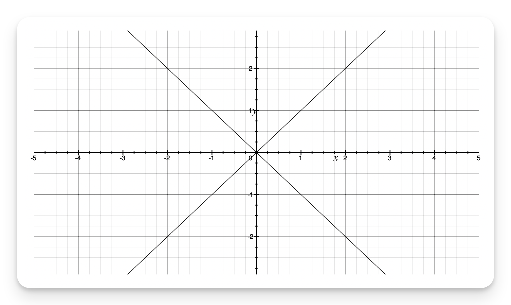

# 控制流

<iframe style="border:none" width="100%" height="450" src="https://whimsical.com/embed/HYAsbk6C3hKrhMpCtexkzz"></iframe>

## For-In 循环

你可以使用`for-in`循环来遍历一个集合中的所有元素，例如数组中的元素、范围内的数字或者字符串中的字符。如下例：

::: code-group

```swift{2-4} [遍历数组]
let names = ["Anna", "Alex", "Brian", "Jack"]
for name in names {
    print("Hello, \(name)!")
}
// Hello, Anna!
// Hello, Alex!
// Hello, Brian!
// Hello, Jack!
```

```swift{2-4} [遍历字典]
let numberOfLegs = ["spider": 8, "ant": 6, "cat": 4]
for (animalName, legCount) in numberOfLegs {
    print("\(animalName)s have \(legCount) legs")
}
// cats have 4 legs
// ants have 6 legs
// spiders have 8 legs
```

```swift{4-6} [只循环]
let base = 3
let power = 10
var answer = 1
for _ in 1...power {
    answer *= base
}
print("\(base) to the power of \(power) is \(answer)")
// 输出“3 to the power of 10 is 59049”
```

```swift{1-3} [闭区间]
for index in 1...5 {
    print("\(index) times 5 is \(index * 5)")
}
// 1 times 5 is 5
// 2 times 5 is 10
// 3 times 5 is 15
// 4 times 5 is 20
// 5 times 5 is 25
```

```swift{2-4} [半开区间]
let minutes = 60
for tickMark in 0..<minutes {
    // 每一分钟都渲染一个刻度线（60次）
}
```
```swift{2-4} [指定步数&半开区间]
let minuteInterval = 5
for tickMark in stride(from: 0, to: minutes, by: minuteInterval) {
    // 每5分钟渲染一个刻度线（0, 5, 10, 15 ... 45, 50, 55）
}
```

```swift{2-4} [指定步数&闭区间]
let hours = 12
let hourInterval = 3
for tickMark in stride(from: 3, through: hours, by: hourInterval) {
    // 每3小时渲染一个刻度线（3, 6, 9, 12）
}
```
:::


## While 循环

`while` 循环在 Swift 中会不断执行一组语句，直到给定的条件不再满足（变为假）。这种循环特别适合于那些在循环开始前不确定需要迭代多少次的情况。Swift 提供了两种 `while` 循环的形式：

- `while` 循环：在每次循环开始前检查条件。如果条件为真，循环继续执行。
- `repeat-while` 循环：在每次循环结束后检查条件。这意味着循环内的语句至少会执行一次，之后再根据条件判断是否继续执行。

### While

`while`循环从计算一个条件开始。如果条件为`true`，会重复运行一段语句，直到条件变为`false`。

下面是`while`循环的一般格式：

```swift
while condition {
    statements
}
```

::: details 蛇和梯子


下面的例子来玩一个叫做蛇和梯子（也叫做滑道和梯子）的小游戏：


游戏的规则如下：

- 游戏盘面包括`25`个方格，游戏目标是达到或者超过第`25`个方格；
- 每一轮，你通过掷一个六面体骰子来确定你移动方块的步数，移动的路线由上图中横向的虚线所示；
- 如果在某轮结束，你移动到了梯子的底部，可以顺着梯子爬上去；
- 如果在某轮结束，你移动到了蛇的头部，你会顺着蛇的身体滑下去。


### 初始化游戏盘

首先，游戏盘被初始化为一个拥有 26 个元素（索引从 0 到 25）的整数数组。每个元素初始为 0，代表没有任何蛇或梯子影响该位置。

```swift
let finalSquare = 25
var board = [Int](repeating: 0, count: finalSquare + 1)
```

### 设置蛇和梯子

一些位置被设定为特定的值，表示蛇或梯子的影响。正值表示向上移动（梯子），负值表示向下移动（蛇）。

```swift
board[03] = +08; board[06] = +11; board[09] = +09; board[10] = +02
board[14] = -10; board[19] = -11; board[22] = -02; board[24] = -08
```

### 游戏逻辑

玩家开始时位于起始位置（索引 0），使用循环结构来模拟玩家的移动。

```swift
var square = 0
var diceRoll = 0
while square < finalSquare {
    // 掷骰子
    diceRoll += 1
    if diceRoll == 7 { diceRoll = 1 }
    // 根据点数移动
    square += diceRoll
    if square < board.count {
        // 如果玩家还在棋盘上，顺着梯子爬上去或者顺着蛇滑下去
        square += board[square]
    }
}
print("Game over!")
```

**掷骰子**: 这里使用了一个简化的骰子模拟，`diceRoll` 从 1 增加到 6，然后重置。这不是随机掷骰，而是一种预设的循环模式。

**移动**: 玩家根据骰子的结果向前移动相应的格数。

**检测和响应**: 每次移动后，检查玩家是否移动到了蛇头或梯子底部。如果是，玩家会根据数组中的值向上或向下移动。

**游戏结束条件**: 如果玩家的位置到达或超过了终点（25号格），游戏结束。

### 安全性检查

确保 `square` 索引不会超出数组范围，这是非常关键的，因为任何超出范围的访问都会导致运行时错误。

```swift
if square < board.count {
    square += board[square]
}
```

:::


### Repeat-while

`while`循环的另外一种形式是`repeat-while`，它和`while`的区别是在判断循环条件之前，先执行一次循环的代码块。然后重复循环直到条件为`false`。


下面是 repeat-while 循环的一般格式：


```swift
repeat {
    statements
} while condition
```


::: details 蛇和梯子

下面是使用 repeat-while 循环改写的“蛇和梯子”游戏代码：

```swift
var square = 0
var diceRoll = 0

repeat {
    // 掷骰子
    diceRoll += 1
    if diceRoll == 7 { diceRoll = 1 }
    // 移动到新位置
    square += diceRoll
    if square < board.count {
        // 如果玩家还在棋盘上，顺着梯子爬上去或者顺着蛇滑下去
        square += board[square]
    }
} while square < finalSquare

print("Game over!")
```

:::


## 条件语句


根据特定的条件执行特定的代码通常是十分有用的。当错误发生时，你可能想运行额外的代码；或者，当值太大或太小时，向用户显示一条消息。要实现这些功能，你就需要使用条件语句。

Swift 提供两种类型的条件语句：`if`语句和`switch`语句。通常，当条件较为简单且可能的情况很少时，使用`if`语句。而`switch`语句更适用于条件较复杂、有更多排列组合的时候。并且`switch`在需要用到「模式匹配」的情况下会更有用。

::: details 模式匹配

在编程中，「模式匹配」（pattern-matching）是一种检查给定数据是否符合某种特定模式的技术，这种模式可以是一个具体的值、一个数据结构的一部分，或者是符合特定条件的多种可能性。在 Swift 中，`switch` 语句提供了强大的模式匹配功能，使得它在需要根据变量的不同值或状态执行不同代码段的场景中非常有用。

### 如何使用 `switch` 进行模式匹配

Swift 的 `switch` 语句可以与多种类型的模式一起使用，包括：

1. **字面量模式**：匹配具体的数值或字符串。
2. **区间模式**：匹配一个值是否落在特定的区间内。
3. **元组模式**：可以同时检查多个值。
4. **类型模式**：检查某个实例是否属于特定的类型。
5. **关联值模式**：匹配枚举的不同情况及其关联的值。
6. **可选模式**：匹配 `Optional` 值是否存在。

### 示例

这里举一个简单的例子来展示 `switch` 语句在模式匹配中的应用：

假设你有一个元组 `(x, y)` 表示一个坐标点，在不同的坐标范围内进行不同的处理：

```swift
let point = (1, 2)

switch point {
case (0, 0):
    print("点在原点上")
case (_, 0):
    print("点在 x 轴上")
case (0, _):
    print("点在 y 轴上")
case (-2...2, -2...2):
    print("点在以原点为中心的正方形区域内")
default:
    print("点在其他位置")
}
```

在这个例子中：

- 第一个 `case` 是字面量模式，匹配坐标正好是 `(0, 0)`。
- 第二个和第三个 `case` 使用了通配符 `_`，表示匹配任何值，用于检查点是否在某一轴上。
- 第四个 `case` 使用了区间模式，检查点是否位于定义的区间内。
- `default` 用来处理所有其他未被前面的 `case` 捕获的情况。

这样的模式匹配让 `switch` 语句能够清晰地描述出复杂的条件逻辑，使代码既简洁又易于理解和维护。
:::


### If

`if`语句最简单的形式就是只包含一个条件，只有该条件为`true`时，才执行相关代码：


::: code-group

```swift{2-4} [最简形式]
var temperatureInFahrenheit = 30
if temperatureInFahrenheit <= 32 {
    print("It's very cold. Consider wearing a scarf.")
}
// 输出“It's very cold. Consider wearing a scarf.”

```

```swift{4-6} [从句]
var temperatureInFahrenheit = 40
if temperatureInFahrenheit <= 32 {
    print("It's very cold. Consider wearing a scarf.")
} else {
    print("It's not that cold. Wear a t-shirt.")
}
// 输出“It's not that cold. Wear a t-shirt.”
```

```swift{4-5} [多分支]
var temperatureInFahrenheit = 90
if temperatureInFahrenheit <= 32 {
    print("It's very cold. Consider wearing a scarf.")
} else if temperatureInFahrenheit >= 86 {
    print("It's really warm. Don't forget to wear sunscreen.")
} else {
    print("It's not that cold. Wear a t-shirt.")
}
// 输出“It's really warm. Don't forget to wear sunscreen.”
```

```swift{7} [else可选]
var temperatureInFahrenheit = 72
if temperatureInFahrenheit <= 32 {
    print("It's very cold. Consider wearing a scarf.")
} else if temperatureInFahrenheit >= 86 {
    print("It's really warm. Don't forget to wear sunscreen.")
}
//else 可选
```

:::

### Switch

`switch` 语句通过将一个值与多个模式进行匹配来工作。一旦找到匹配的模式，它就执行该模式对应的代码块。在面对多个条件判断时，使用 `switch` 语句通常比 `if` 语句更清晰易懂。

```swift
switch some value to consider {
case value 1:
    respond to value 1
case value 2,
    value 3:
    respond to value 2 or 3
default:
    otherwise, do something else
}
```
如下例:

```swift [一般用法]
let someCharacter: Character = "z"
switch someCharacter {
case "a":
    print("The first letter of the alphabet")
case "z":
    print("The last letter of the alphabet")
default:
    print("Some other character")
}
// 输出“The last letter of the alphabet”
```

::: danger 不会隐式「贯穿」
与 C 和 Objective-C 的 `switch` 语句不同，Swift 中的 `switch` 语句在完成一个匹配的 `case` 分支后自动终止，不会继续执行下一个 `case` 分支。因此，在 Swift 的 `case` 分支中不需要显式使用 `break` 语句来防止代码「贯穿」到下一个分支。这个特性使得 Swift 的 `switch` 语句更加安全和易于使用，避免了因忘记写 `break` 而导致的错误。
:::


每一个`case`分支都必须包含至少一条语句。像下面这样书写代码是无效的，因为第一个`case`分支是空的：

```swift
let anotherCharacter: Character = "a"
switch anotherCharacter {
case "a": // 无效，这个分支下面没有语句 // [!code error]
case "A":
    print("The letter A")
default:
    print("Not the letter A")
}
// 这段代码会报编译错误
```

为了让单个`case`同时匹配`a`和`A`，可以将这个两个值组合成一个复合匹配，并且用逗号分开：

```swift{3}
let anotherCharacter: Character = "a"
switch anotherCharacter {
case "a", "A":
    print("The letter A")
default:
    print("Not the letter A")
}
// 输出“The letter A”
```

### 区间匹配

`case`分支的模式也可以是一个值的区间。下面的例子展示了如何使用区间匹配来输出任意数字对应的自然语言格式：

```swift
let approximateCount = 62
let countedThings = "moons orbiting Saturn"
let naturalCount: String
switch approximateCount {
case 0:
    naturalCount = "no"
case 1..<5:
    naturalCount = "a few"
case 5..<12:
    naturalCount = "several"
case 12..<100:
    naturalCount = "dozens of"
case 100..<1000:
    naturalCount = "hundreds of"
default:
    naturalCount = "many"
}
print("There are \(naturalCount) \(countedThings).")
// 输出“There are dozens of moons orbiting Saturn.”
```


### 元组

我们可以使用元组在同一个 `switch`语句中测试多个值。元组中的元素可以是值，也可以是区间。另外，使用下划线（`_`）来匹配所有可能的值。

下面的例子展示了如何使用一个 (`Int`, `Int`) 类型的元组来分类下图中的点 (`x`, `y`)：

```swift
let somePoint = (1, 1)
switch somePoint {
case (0, 0):
    print("\(somePoint) is at the origin")
case (_, 0):
    print("\(somePoint) is on the x-axis")
case (0, _):
    print("\(somePoint) is on the y-axis")
case (-2...2, -2...2):
    print("\(somePoint) is inside the box")
default:
    print("\(somePoint) is outside of the box")
}
// 输出“(1, 1) is inside the box”
```


::: warning 首个匹配
与 C 语言不同，Swift 允许一个值匹配到多个 `case` 选项，如果有多个匹配成功的情况，Swift 只会执行第一个匹配到的 `case` 分支。

以点 (0, 0) 为例，如果 `case (0, 0)` 是第一个列出的分支，那么它会被执行，而其他可能匹配到这个点的分支则会被忽略。
:::


### 值绑定（Value Bindings）

在 Swift 中的 `switch` 语句中，你可以使用值绑定（value binding）来捕获与 `case` 匹配的值。这种方法允许你声明临时的常量或变量，并在整个 `case` 分支体内使用这些值。这特别有用于当你需要从复杂数据类型中提取部分信息并在 `case` 分支中使用这些信息时。

在下面的例子中，点 `(x, y)` 使用 `(Int, Int)` 类型的元组表示，并在 `switch` 语句中进行分类处理：

```swift
let anotherPoint = (2, 0)
switch anotherPoint {
case (let x, 0):
    print("on the x-axis with an x value of \(x)")
case (0, let y):
    print("on the y-axis with a y value of \(y)")
case let (x, y):
    print("somewhere else at (\(x), \(y))")
}
// 输出“on the x-axis with an x value of 2”
```

在这个例子中：

- 第一个 `case (let x, 0)` 捕获任何位于 x 轴上的点。这里 `x` 是一个临时常量，表示点的 x 坐标值，而 y 坐标固定为 0。
- 第二个 `case (0, let y)` 捕获任何位于 y 轴上的点。这里 `y` 是一个临时常量，表示点的 y 坐标值，而 x 坐标固定为 0。
- 第三个 `case let (x, y)` 用来匹配所有其他情况。它通过 `let` 声明捕获 x 和 y 坐标，无论这些坐标是什么值，如果前面的两个条件不匹配，这个 `case` 将匹配任何点。

::: warning 注意

这个`switch`语句不包含默认分支。这是因为最后一个`case`——`case let(x, y)`声明了一个可以匹配余下所有值的元组。这使得`switch`语句已经完备了，因此不需要再书写默认分支。
:::

### Where

`case`分支的模式可以使用`where`语句来判断额外的条件。

下面的例子把下图中的点`(x, y)`进行了分类：

```swift
let yetAnotherPoint = (1, -1)
switch yetAnotherPoint {
case let (x, y) where x == y:
    print("(\(x), \(y)) is on the line x == y")
case let (x, y) where x == -y:
    print("(\(x), \(y)) is on the line x == -y")
case let (x, y):
    print("(\(x), \(y)) is just some arbitrary point")
}
// 输出“(1, -1) is on the line x == -y”
```




### 复合型 Cases

当多个条件可以使用同一种方法来处理时，可以将这几种可能放在同一个 case 后面，并且用逗号隔开。当 case 后面的任意一种模式匹配的时候，这条分支就会被匹配。并且，如果匹配列表过长，还可以分行书写：

```swift
let someCharacter: Character = "e"
switch someCharacter {
case "a", "e", "i", "o", "u":
    print("\(someCharacter) is a vowel")
case "b", "c", "d", "f", "g", "h", "j", "k", "l", "m",
    "n", "p", "q", "r", "s", "t", "v", "w", "x", "y", "z":
    print("\(someCharacter) is a consonant")
default:
    print("\(someCharacter) is not a vowel or a consonant")
}
// 输出“e is a vowel”
```


复合匹配允许你在一个`case`语句中列举多个模式，而且可以结合值绑定，这是`switch`语句中的一个强大功能。为了确保代码的正确性和安全性，复合匹配要求所有的匹配模式都必须绑定相同类型的值，这样无论哪个模式被触发，分支体内的代码都可以安全地使用这些值。

::: details 为什么需要所有模式包含相同的值绑定？

假设在同一个 `case` 里你有多个模式，如果每个模式绑定不同的值或不同类型的值，那么在执行 `case` 分支内的代码时，你可能会遇到不知道该使用哪个值或值类型不匹配的问题。为了避免这种情况，Swift 要求你在使用复合匹配时，每个模式都绑定相同类型的值。

考虑一个简单的例子，我们有一个表示节日的枚举和相关的日期：

```swift
enum Festival {
    case springFestival, nationalDay, midAutumn
}
enum Date {
    case monthDay(month: Int, day: Int)
}
```

现在我们要根据节日显示其日期：

```swift
let festival = Festival.springFestival
let date = Date.monthDay(month: 1, day: 25)

switch (festival, date) {
case (.springFestival, .monthDay(let month, let day)),
    (.nationalDay, .monthDay(let month, let day)):
    print("节日日期：\(month)月\(day)日")
default:
    print("未知或其他节日")
}
```

在这个 `switch` 语句中，我们检查两个枚举值的组合。`case` 语句列出了两种情况：春节和国庆节，每种情况都与 `Date.monthDay` 匹配，并且都绑定了 `month` 和 `day` 这两个值。

- **复合匹配**：`(.springFestival, .monthDay(let month, let day)), (.nationalDay, .monthDay(let month, let day))` 表示两种节日都使用相同的值绑定模式。
- **值绑定一致性**：每个模式都绑定 `month` 和 `day`，并且这两个值在所有列出的模式中类型都是一致的（这里都是 `Int`）。

这样设计的好处是无论哪个节日被匹配，分支内的代码都能访问到相同类型的 `month` 和 `day`。

:::

## 控制转移语句

控制转移语句改变你代码的执行顺序，通过它可以实现代码的跳转。Swift 有五种控制转移语句：

- continue
- break
- fallthrough
- return
- throw

throw 语句会在[错误处理](./error.md)章节讨论。

### Continue

`continue` 语句在 Swift 中用于在循环中跳过当前的迭代，并立即开始下一次迭代。这意味着循环体内在 `continue` 语句之后的代码将不会执行，但循环本身并不会终止，只是跳过当前循环中剩余的部分，直接进入下一轮循环的开始。

这个语句通常用于在特定条件下忽略某些循环迭代，从而避免执行不必要或不适合的操作。比如说，当你在处理一系列数据并且希望跳过某些特定的值时，`continue` 就非常有用。如下例：

```swift{3}
for number in 1...10 {
    if number % 2 == 0 {
        continue // 如果是偶数，则跳过后续代码，直接进行下一次循环
    }
    print("处理奇数: \(number)")
}
```

在这个例子中，我们使用`continue`语句跳过所有偶数的处理。当`number`是偶数时，`continue`会被触发，循环不会执行`print("处理奇数: \(number)")`这一行，而是直接进入下一次迭代。因此，这段代码只会打印出`1`到`10`之间的奇数。

### Break


`break` 语句在 Swift 中是用来立即终止控制流的执行。这个语句可以用在 `switch` 语句和各种循环语句（如 `for`、`while`、`repeat-while` 等）中。使用 `break` 语句可以使代码从当前的 `switch` 块或循环中立即退出，继续执行之后的代码。

#### 在循环中的使用

在循环中，`break` 用于完全终止循环，不论循环条件是否仍然为真。这对于在检测到某种特定条件时立即停止循环非常有用。

**示例：**
```swift
for number in 1...10 {
    if number == 5 {
        break // 当 number 等于 5 时，结束循环
    }
    print("当前数字是 \(number)")
}
print("循环结束")
```

在这个例子中，当 `number` 等于 5 时，`break` 语句会立即结束 `for` 循环，所以只会打印出 1 到 4 的数字，循环在到达 5 时终止，随后执行 `print("循环结束")`。

#### 在 switch 语句中的使用

在 `switch` 语句中，`break` 可以用来在某个 `case` 中什么都不做就跳出 `switch` 语句。虽然在 Swift 中每个 `case` 分支末尾默认就有隐含的 `break`（除非明确使用 [`fallthrough`](#fallthrough)），但有时你可能需要显式地使用 `break` 来表达意图。

**示例：**
```swift
let someCharacter: Character = "a"
switch someCharacter {
case "a", "e", "i", "o", "u":
    print("这是一个元音字母")
case "b", "c", "d", "f":
    // 什么都不做
    break
default:
    print("这是一个辅音字母")
}
```

在这里，如果 `someCharacter` 是 `b`, `c`, `d`, `f` 中的任何一个，`switch` 会进入对应的 `case`，但由于内部只有一个 `break`，所以这个 `case` 实际上什么也不做，然后退出 `switch` 语句。


### fallthrough

`fallthrough` 主要用于需要显式地从一个 `case` 迁移到下一个 `case` 的情况。这可以使一系列 `case` 共享相同的代码逻辑，而不需要重复书写代码。

::: warning 注意
这与大多数编程语言中 `switch` 语句的默认行为不同，因为 Swift 的 `switch` 默认在每个 `case` 完成后自动退出，不会进入下一个 `case`，除非使用 `fallthrough` 关键字。
:::

下面是一个使用 `fallthrough` 的示例，演示如何在多个 `case` 之间共享代码：

```swift
let integerToDescribe = 5
var description = "数字 \(integerToDescribe) 是"

switch integerToDescribe {
case 2, 3, 5, 7, 11, 13, 17, 19:
    description += " 质数，同时也是"
    fallthrough
default:
    description += " 一个整数。"
}

print(description)
```

在这个例子中：

1. 如果 `integerToDescribe` 的值是 2, 3, 5, 7, 11, 13, 17, 或 19 中的任何一个，它首先匹配质数的 `case`。
2. 在质数的 `case` 中，我们给 `description` 添加了一段文本，并使用了 `fallthrough`。
3. 由于 `fallthrough` 的存在，控制流直接“跌落”到下一个 `case` —— 这里是 `default` 分支。
4. 在 `default` 分支中，我们继续添加到 `description` 字符串。

::: warning 注意

使用`fallthrough`关键字会导致程序控制流直接「跌落」到紧随其后的下一个`case`或`default`块中，无论这个`case`的匹配条件是否真正符合当前的情况。

这意味着即便下一个`case`的条件实际上并不匹配，只要前一个`case`使用了`fallthrough`，程序还是会执行下一个`case`中的代码。这是一种特意设计的行为，允许在某些`case`中共享或扩展执行逻辑，不需要条件真的匹配。

:::

### 标签

在 Swift 中，使用标签（statement label）来标记循环或条件语句是一个非常有用的功能，尤其是在你有多层嵌套的循环或条件语句时。通过标签，你可以明确指定 `break` 或 `continue` 语句应当影响哪一个循环或条件语句，这可以大大增强代码的清晰度和控制力。

声明一个带标签的语句时，你需要在语句开始之前添加一个由你自定义的标签名和冒号组成的前导关键字。这个标签然后可以被 `break` 或 `continue` 语句引用，以便控制流程。

下面是一个使用标签来控制循环的示例：

```swift
outerLoop: for i in 1...3 {
    innerLoop: for j in 1...3 {
        if j == 2 {
            continue outerLoop  // 跳过当前 outerLoop 的迭代
        }
        print("i: \(i), j: \(j)")
    }
}
```

在这个示例中：
- `outerLoop` 和 `innerLoop` 是循环的标签。
- 当 `j` 等于 2 时，`continue outerLoop` 会被触发。这使得控制流跳过当前的 `outerLoop` 的迭代，并立即开始下一次的 `outerLoop` 迭代。
- 这意味着输出不会包括任何 `j` 等于 2 的组合。

::: tip 在嵌套结构中使用标签的好处

使用标签可以帮助你管理复杂的嵌套结构，尤其是在处理多层循环时，直接指明哪一个循环应该被 `break` 或 `continue` 影响，可以防止错误并提高代码的可读性。这在处理复杂的数据处理或多层条件逻辑时尤其有用。

:::

## Guard 提前退出

`guard` 语句是 Swift 中的一种特殊控制流语句，它用来提早退出函数或循环当特定条件不满足时。与 `if` 语句相比，`guard` 的主要特点是它会强化需要满足的条件以继续执行代码的逻辑，而不符合条件时则执行 `else` 从句中的代码，并且从当前的代码块中退出。

::: tip 为什么使用 `guard`？
使用 `guard` 语句的主要优势是它能提高代码的可读性和安全性。通过 `guard`，你可以把不满足条件的情况先处理掉（通常是退出函数），这样接下来的代码就不需要再嵌套太多的条件判断，代码结构会更加清晰。
:::

`guard` 语句总是伴随一个 `else` 从句，这个从句中必须有一个导致退出当前作用域的操作，比如 `return`、`break`、`continue` 或 `throw`。其基本形式如下：

```swift{2-5}
func someFunction(value: Int?) {
    guard let value = value else {
        print("没有有效的值")
        return
    }
    print("值为 \(value)")
}
```

在这个例子中：
- 使用 `guard let` 来解包 `value`。如果 `value` 是 `nil`（即解包失败），则执行 `else` 从句。
- `else` 从句中有一个 `return` 语句，它会立即退出函数。这样，只有在 `value` 非 `nil` 的情况下，函数的剩余部分才会执行。


## 检测 API 可用性


Swift 的API 可用性检查是一种强大的功能，它允许开发者确保应用在使用特定功能时与当前的操作系统版本兼容。这个特性在开发跨多个平台或对旧版本操作系统支持时尤其有用，可以避免在运行时出现因 API 不可用而导致的崩溃。

### 如何使用 API 可用性检查？

Swift 提供了 `@available` 属性和 `if #available` 以及 `guard #available` 语句，用于在编译时和运行时检查 API 的可用性。

#### 编译时检查

使用 `@available` 属性可以标记函数、类、协议等的可用性。例如，如果某个 API 从 iOS 10 开始可用，你可以这样标记：

```swift
@available(iOS 10, *)
func useNewAPI() {
    // 使用 iOS 10 及以上版本的 API
}
```

这里的 `*` 表示在其他所有平台上，这个函数的可用性不受限制。

#### 运行时检查

使用 `if #available` 或 `guard #available` 可以进行运行时的版本检查。这允许在代码中安全地使用新API，同时在旧版本系统中提供替代的实现。例如：

```swift
if #available(iOS 11, *) {
    // 只在 iOS 11 及以上版本执行
    useNewFeatureAvailableInIOS11()
} else {
    // 在 iOS 11 以下版本执行
    useOlderAlternative()
}
```

或者使用 `guard` 来提前退出：

```swift
func someFunction() {
    guard #available(iOS 11, *) else {
        print("仅在 iOS 11 及以上版本可用")
        return
    }
    useNewFeatureAvailableInIOS11()
}
```


::: tip 为什么使用 API 可用性检查？

1. **兼容性保证**：确保应用不会因调用了在当前系统版本不可用的 API 而崩溃。
2. **向后兼容**：让开发者能够在保证应用稳定运行的同时，利用最新的技术。
3. **代码清晰**：明确区分不同系统版本间的功能差异，提高代码的可读性和可维护性。

通过这些机制，Swift 提供了一种有效的方式来处理在多版本操作系统上的 API 兼容性问题，帮助开发者构建更稳定、更安全的应用。

:::