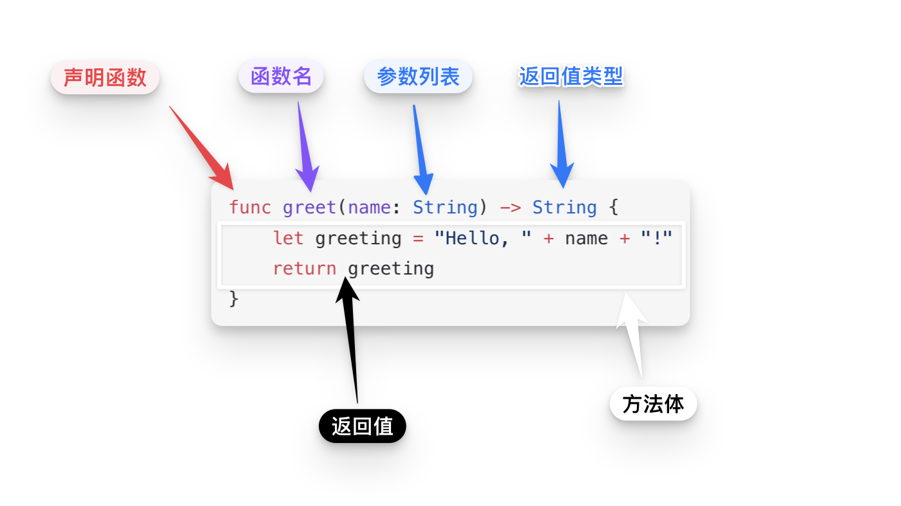

# 函数

<iframe style="border:none" width="100%" height="450" src="https://whimsical.com/embed/Qn3XHc8azrebr2xUq3xEtb"></iframe>

函数是一段组织好的、可重复使用的代码，用于执行一个特定任务。

## 函数的定义

函数是编程中的基本构建块，它允许我们封装代码以执行特定任务，这样可以增强代码的可读性和可重用性。

通过定义参数，函数可以接收外部输入，这些参数在函数内部被称为「形参」，而调用函数时传入的具体值被称为「实参」。

函数的返回类型定义了函数执行结束后可以返回给调用者的数据类型，如果函数不需要返回任何值，则使用`Void`或省略返回类型说明。




::: info 函数解析
1. **`func` 关键字**：
    - `func` 是定义函数的关键字，用于开始一个函数声明。它告诉 Swift，接下来的代码块是一个函数。

2. **函数名**：
    - 在这个例子中，函数名是 `greet`。函数名后面通常跟有一对圆括号，里面可以包含一个或多个参数。函数名和参数一起，如 `greet(name:)`，帮助描述函数的作用和它所需的输入。

3. **参数列表**：
    - `name: String` 是函数的参数列表部分，这里只有一个参数。`name` 是参数的标签，用于在调用函数时标识传入的值，`String` 表明这个参数的类型必须是一个字符串。参数列表允许函数接收外部输入。

4. **返回箭头和返回类型**：
    - `->` 符号用于指示函数将返回一个值，后面跟的 `String` 定义了返回值的数据类型。在这个例子中，函数返回一个字符串。

5. **方法体**：
    - 方法体由大括号 `{}` 包围，包含了函数执行的所有代码。在这个例子中，方法体包括创建一个问候语字符串并返回它。

6. **返回值**：
    - `return` 关键字用于从函数返回一个值。在这个例子中，`return greeting` 表示函数结束执行，并将 `greeting` 变量的值返回给调用者。
:::


## 函数调用

```swift{1,4}
var name = greet(person: "Anna")
print(name)
// 打印“Hello, Anna!”
print(greet(person: "Brian"))
// 打印“Hello, Brian!”
```

这里的步骤很简单：
1. **写出函数名**（`greet`），跟上圆括号。
2. **在圆括号里提供必要的参数**（这里是 `"Anna"`）。
3. **接收函数返回的结果**，如果有的话（这里将结果存储在 `greeting` 变量中）。


## 函数参数

你可以根据需要定义函数，它们可能没有参数，也可能有多个参数。这些不同的定义允许函数处理不同的任务，适应不同的使用场景。下面将简单介绍如何定义和使用无参数函数和多参数函数。

### 无参数函数

无参数函数是不需要任何输入即可执行的函数。定义一个无参数函数非常简单，只需在函数名后的括号中不包含任何参数即可。

**示例：**
```swift
func sayHello() -> String {
    return "Hello, world!"
}
```
调用无参数函数也很简单，只需要写出函数名和一对空括号：
```swift
let greeting = sayHello()
print(greeting)  // 输出 "Hello, world!"
```

### 多参数函数

多参数函数可以接受两个或更多的参数。在定义时，参数由逗号分隔，每个参数都必须指明其名称和类型。

**示例：**
```swift
func greet(person: String, day: String) -> String {
    return "Hello \(person), today is \(day)."
}
```
在调用多参数函数时，每个参数的值需要按照定义时的顺序传递：

```swift
let message = greet(person: "Anna", day: "Tuesday")
print(message)  // 输出 "Hello Anna, today is Tuesday."
```


### 参数标签

当你定义一个函数时，可以为每个参数指定一个外部名称（即参数标签）和一个内部名称。外部名称用于在调用函数时使用，而内部名称在函数的实现内部使用。


```swift
func greet(person name: String, from hometown: String) -> String {
    return "Hello \(name)! Glad you could visit from \(hometown)."
}
```

在这个示例中，`person`和`from`是参数标签，`name`和`hometown`是相应的内部参数名称。

调用带参数标签的函数

```swift
let greeting = greet(person: "John", from: "Houston")
print(greeting)
```

### 省略参数标签

如果你不想为某个参数使用标签，可以使用下划线（`_`）作为参数标签，这样在调用函数时就不需要写出参数标签。

```swift
func add(_ num1: Int, _ num2: Int) -> Int {
    return num1 + num2
}
```

调用这个函数时，不需要使用参数标签：

```swift
let sum = add(5, 3)
```


::: tip 参数标签的好处

- **增强了代码的可读性**：使用参数标签可以使函数调用更清晰，尤其是当函数需要多个参数时。
- **提高了代码的灵活性**：你可以通过修改参数标签而不改变参数名的方式来调整你的 API，这对于维护公共API非常有用。
- **使函数调用更加表达性**：参数标签可以帮助你的代码读起来更像是自然语言，这样其他阅读你代码的人可以更容易理解它的行为。

:::


### 默认参数值

你可以为函数的参数提供默认值。这样，在调用函数时，如果没有传递该参数，它将采用默认值。这在许多情况下都很有用，因为它使函数调用更简洁，并且允许你为那些不经常变化的参数提供一个默认的「备选项」。

```swift
func greet(name: String = "World") {
    print("Hello, \(name)!")
}

// 调用 greet() 函数时不传递参数，它会使用默认参数
greet() // 输出: Hello, World!

// 也可以传递参数来覆盖默认值
greet(name: "Alice") // 输出: Hello, Alice!
```

### 可变参数

你可以使用可变参数来定义一个函数，这使得函数可以接受任意数量的参数。可变参数允许你传递零个或多个相同类型的参数给函数。

```swift
func sum(numbers: Int...) -> Int {
    var total = 0
    for number in numbers {
        total += number
    }
    return total
}

// 调用 sum() 函数时传递不定数量的参数
let result1 = sum(numbers: 1, 2, 3, 4, 5)
print(result1) // 输出: 15

let result2 = sum(numbers: 10, 20, 30)
print(result2) // 输出: 60

```

在这个例子中，`sum`函数有一个名为`numbers`的可变参数，类型为`Int...`。你可以像普通参数一样传递参数给这个函数，而函数内部会将这些参数当作一个「**数组**」进行处理。在函数体内，我们使用了`for-in`循环来遍历参数数组，并将它们相加，最后返回总和。


### 输入输出参数

在 Swift 中，你可以通过使用 `inout` 关键字来定义输入输出参数，这种参数允许函数修改调用者传递给函数的值，并将这些修改传递回调用者。使用输入输出参数时，你需要在参数前面加上 `inout` 关键字，并在调用函数时传递参数的地址（使用 `&` 符号）。

::: warning 参数地址
传递参数的地址意味着将参数在内存中的位置（即地址）传递给函数，而不是传递参数的值本身。在 Swift 中，当你将参数的地址传递给函数时，函数可以通过这个地址直接访问参数的内存，并在需要时修改参数的值。
:::

下面是一个简单的示例，演示了如何在 Swift 中使用输入输出参数：

```swift
func swapInts(_ a: inout Int, _ b: inout Int) {
    let temp = a
    a = b
    b = temp
}

var x = 5
var y = 10

print("Before swapping: x = \(x), y = \(y)")
//Before swapping: x = 5, y = 10

// 使用输入输出参数来交换变量的值
swapInts(&x, &y)

print("After swapping: x = \(x), y = \(y)")
//After swapping: x = 10, y = 5

```

在这个例子中，`swapInts` 函数有两个输入输出参数 `a` 和 `b`。在函数内部，我们交换了这两个参数的值。在调用函数时，我们需要使用 `&` 符号来传递参数的地址，以便让函数能够修改这些参数的值。

需要注意的是，输入输出参数不能有默认值，并且必须是可变参数。例如，不能在下面这样调用函数：

```swift
swapInts(&x, &10) // 这是错误的用法
```
因为 `&` 操作符只能应用于可变的变量，而 `10` 是一个常量，不可变的。

## 函数返回值

Swift 提供了多种灵活的方式来定义函数的返回类型，以适应不同的编程需求。这些包括无返回值函数、多重返回值函数（使用元组类型）、可选元组返回类型，以及隐式返回的函数。下面我们将详细介绍这些类型的函数。

### 无返回值函数

如果函数不需要返回任何值，可以将返回类型指定为 `Void` 或者省略返回箭头（`->`）和类型。

**示例：**

::: code-group

```swift [省略返回箭头]
func printGreeting() {
    print("Hello, world!")
}
```

```swift [Void]
func printGreeting() -> Void{
    print("Hello, world!")
}
```
:::


调用这个函数会执行打印操作，但不返回任何值：
```swift
printGreeting()  // 输出 "Hello, world!"
```

### 多重返回值函数

使用元组（tuple）允许函数返回多个值，这些值被包含在一个单一的复合值中。

**示例：**
```swift
func getCurrentDateAndTime() -> (date: String, time: String) {
    let date = "2023-04-23"
    let time = "10:45 AM"
    return (date, time)
}
```
调用这个函数时，可以接收一个包含两个部分的元组：
```swift
let dateTime = getCurrentDateAndTime()
print("Date: \(dateTime.date), Time: \(dateTime.time)")
```


当然，可选返回类型在 Swift 中是一个重要的特性，它允许函数返回一个可能是 `nil` 的值。这对于处理那些可能无法成功返回正常结果的情况非常有用，比如在查找数据或执行计算时遇到错误或异常条件。

### 可选返回类型

通过在返回类型后添加 `?` 来定义一个函数的可选返回类型。这意味着函数可以返回一个特定类型的值，或者在某些条件下返回 `nil`。

**示例：**
```swift
func findSquareRoot(of number: Double) -> Double? {
    if number >= 0 {
        return sqrt(number)
    } else {
        return nil  // 返回 nil 表示没有有效的平方根
    }
}
```
在这个例子中，`findSquareRoot` 函数尝试计算一个数的平方根。如果输入的数是非负数，则返回计算结果；如果是负数，则返回 `nil`，因为负数没有实数平方根。

调用这种类型的函数需要处理可选值，常见的方法是使用 `if let` 或 `guard let` 来解包。

```swift
if let root = findSquareRoot(of: 9) {
    print("The square root of 9 is \(root)")
} else {
    print("No square root exists.")
}

if let root = findSquareRoot(of: -1) {
    print("The square root is \(root)")
} else {
    print("No square root exists.")  // 输出这一行
}
```

::: warning 为什么使用可选返回类型？
可选返回类型是一种安全的处理方式，它明确了返回值可能是 `nil`，并迫使调用者处理这种可能性。这种方式可以减少运行时错误，提高程序的稳定性和可靠性。例如，在处理网络请求、文件操作或数据库查询等可能失败的操作时，可选类型提供了一种表达失败而不引发程序崩溃的方式。
:::


### 隐式返回的函数

Swift 允许在某些情况下隐式返回表达式的结果。如果函数体是一个单行表达式，那么这个表达式的结果将自动成为函数的返回值，无需使用 `return` 关键字。

**示例：**
```swift
func sum(_ a: Int, _ b: Int) -> Int {
    a + b
}
```
调用这个简洁的函数：
```swift
let result = sum(5, 3)
print("The sum is \(result)")  // 输出 "The sum is 8"
```

## 函数类型

在 Swift 中，函数也是一种类型，可以像其他类型一样进行操作和传递。你可以将函数作为参数传递给其他函数，也可以从函数中返回另一个函数。Swift 使用函数类型来表示函数，函数类型由参数类型和返回类型组成。


### 函数类型作为参数

下面是一个简单的示例，演示了如何定义函数类型以及如何将函数作为参数传递给其他函数：

```swift
// 定义一个函数，它接受一个函数作为参数
func operateOn(a: Int, b: Int, operation: (Int, Int) -> Int) -> Int {
    return operation(a, b)
}

// 定义一些可以传递给 operateOn 函数的函数
func add(_ a: Int, _ b: Int) -> Int {
    return a + b
}

func subtract(_ a: Int, _ b: Int) -> Int {
    return a - b
}

// 使用 operateOn 函数，并将不同的函数作为参数传递
let result1 = operateOn(a: 10, b: 5, operation: add)
print("Addition result: \(result1)") // 输出: Addition result: 15

let result2 = operateOn(a: 10, b: 5, operation: subtract)
print("Subtraction result: \(result2)") // 输出: Subtraction result: 5
```

在这个例子中，我们首先使用 `typealias` 关键字定义了一个函数类型 `BinaryOperation`，它接受两个整数参数并返回一个整数。然后，我们定义了一个函数 `operateOn`，它接受两个整数和一个函数作为参数，并在函数体内调用了传递进来的函数。接着，我们定义了两个函数 `add` 和 `subtract`，它们都符合 `BinaryOperation` 类型的函数。

最后，我们调用了 `operateOn` 函数，并将不同的函数 `add` 和 `subtract` 作为参数传递给它。


### 函数类型作为返回值

函数类型可以作为函数的返回类型。这使得函数可以根据一些条件返回不同的函数，或者根据特定的逻辑构造并返回一个新的函数。

下面是一个简单的示例，演示了如何定义一个函数，它返回另一个函数作为结果：

```swift
// 定义一个函数，它返回一个接受两个整数参数并返回整数的函数
func chooseOperation(_ operationType: String) -> ((Int, Int) -> Int) {
    func add(_ a: Int, _ b: Int) -> Int {
        return a + b
    }
    
    func subtract(_ a: Int, _ b: Int) -> Int {
        return a - b
    }
    
    // 根据传入的操作类型返回不同的函数
    switch operationType {
    case "add":
        return add
    case "subtract":
        return subtract
    default:
        fatalError("Unsupported operation")
    }
}

// 使用 chooseOperation 函数来获取不同的操作函数
let operationFunc = chooseOperation("add")
let result = operationFunc(5, 3)
print("Result: \(result)") // 输出: Result: 8
```

在这个例子中，`chooseOperation` 函数根据传入的 `operationType` 参数返回一个相应的函数。如果传入的是 "add"，则返回一个加法函数；如果传入的是 "subtract"，则返回一个减法函数。最后，我们将返回的函数保存在变量 `operationFunc` 中，并使用它来进行计算。

### 定义函数类型

当你想要为某个函数类型定义一个更简洁的别名时，可以使用`typealias`关键字。

```swift
// 定义一个函数类型别名，该函数接受两个整数参数并返回一个整数
typealias BinaryOperation = (Int, Int) -> Int

// 使用函数类型别名来声明函数
func performOperation(a: Int, b: Int, operation: BinaryOperation) -> Int {
    return operation(a, b)
}
```

使用`typealias`可以让代码更加清晰易读，特别是当你需要在多个地方使用同一个函数类型时。


## 嵌套函数

嵌套函数是定义在另一个函数体内部的函数，它们可以访问外部函数的变量，并且只能在包含它们的函数内部调用。在 Swift 中，嵌套函数是一种非常有用的技术，它可以帮助你将代码模块化，并将实现细节隐藏在函数内部，从而提高代码的可读性和可维护性。


```swift
func calculatePrices(originalPrice: Double, taxRate: Double) -> Double {
    // 定义一个嵌套函数来计算价格加税
    func calculateTax(price: Double) -> Double {
        return price * (1 + taxRate)
    }
    
    // 调用嵌套函数来计算原价加税后的价格
    let totalPrice = calculateTax(price: originalPrice)
    return totalPrice
}

// 调用外部函数
let finalPrice = calculatePrices(originalPrice: 100, taxRate: 0.1)
print("Final price: \(finalPrice)") // 输出: Final price: 110.0

```

在这个例子中，`calculatePrices`函数包含了一个嵌套函数`calculateTax`，它用来计算价格加税后的总价。在`calculatePrices`函数内部，我们调用了嵌套函数`calculateTax`来计算原价加税后的总价，并将结果返回。

::: info 封装
嵌套函数使得我们可以将相关的功能封装在一个函数内部，从而减少了代码的重复性，提高了代码的可维护性。同时，它们也能够帮助我们更好地组织代码，将不需要对外暴露的实现细节隐藏起来。
:::