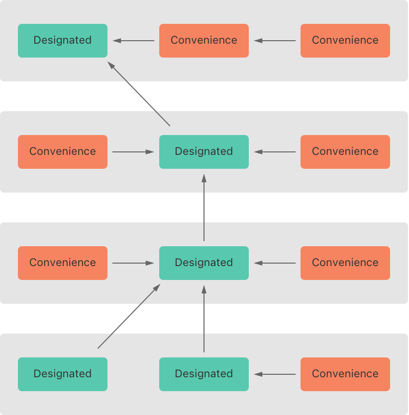

# 构造过程

<iframe style="border:none" width="100%" height="450" src="https://whimsical.com/embed/F93vGV2BDLCzxo5tQsNJak"></iframe>

Swift 中的构造器使用 `init` 关键字来定义。构造器可以有参数，也可以没有参数。构造器的主要职责是确保实例的所有属性在使用前都已正确初始化。

## 默认构造器
对于没有提供任何自定义构造器的类和结构体，Swift 自动提供一个默认构造器（default initializer），这个构造器会将所有属性设置为其默认值。


如果一个类的所有属性都提供了默认值，并且没有其他构造器定义，那么可以不手动实现构造器，Swift 将为这个类提供一个默认的无参构造器。然而，通常情况下，当类中含有没有初始值的非可选类型属性时，或者需要依赖特定的初始化逻辑时，你**必须显式提供构造器**。

举个例子，如果类的属性在定义时都已经初始化了，Swift 就会提供一个默认构造器：

```swift
class Person {
    var name: String = "Unknown"
    var age: Int = 0
}
```

在这个例子中，`Person` 类没有定义任何自定义构造器，但是它的所有属性在声明时都已经有了默认值，所以 Swift 会自动提供一个默认构造器。你可以这样创建 `Person` 的实例：

```swift
let someone = Person()
```

然而，如果类中有未初始化的非可选类型属性，你必须提供一个构造器：

```swift
class Person {
    var name: String
    var age: Int

    init(name: String, age: Int) {
        self.name = name
        self.age = age
    }
}
```

在这种情况下，因为 `name` 和 `age` 属性在定义时没有初始值，所以必须通过构造器来初始化，Swift 不会自动生成默认构造器。


### 成员逐一构造器
对于「结构体」，如果没有定义任何自定义构造器，Swift 会自动提供一个成员逐一构造器（memberwise initializer）。这个构造器可以让你初始化结构体的所有属性。

```swift
struct Size {
    var width: Double
    var height: Double
}

let twoByTwo = Size(width: 2.0, height: 2.0)
```

## 自定义构造过程

自定义构造过程提供了多样的选项来满足不同场景的需求。这些选项包括形参的使用、实参标签的定制、可选属性类型的初始化，以及在构造过程中对常量属性的赋值。

### 形参的构造过程

形参是用来接收传递给构造器的值的变量。构造器的形参遵循与函数相同的语法和行为规则。例如，当你创建一个实例时，可以通过形参来初始化属性：

```swift
class Car {
    var color: String
    var price: Int
    
    init(color: String, price: Int) {
        self.color = color
        self.price = price
    }
}
```

在这个例子中，`color` 和 `price` 是构造器的形参，用来接收创建 `Car` 实例时提供的信息。

### 形参命名和实参标签

构造器形参可以有一个外部名字（实参标签）和一个内部名字。实参标签用于调用时增强代码的可读性，而内部名字在构造器内部使用：

```swift
class Car {
    var color: String
    var price: Int
    
    init(color inputColor: String, price inputPrice: Int) {
        self.color = inputColor
        self.price = inputPrice
    }
}
```

在这种情况下，调用构造器时使用实参标签 `color` 和 `price`，但在构造器的内部，我们使用 `inputColor` 和 `inputPrice` 来引用传递的值。

### 不带实参标签的构造器形参

如果你不希望在调用构造器时使用实参标签，可以通过在形参前加 `_` 来省略实参标签：

```swift
init(_ color: String, _ price: Int) {
    self.color = color
    self.price = price
}
```

这样，在创建实例时就不需要写实参标签，可以直接传递值：

```swift
let myCar = Car("Red", 100000)
```

### 可选属性类型

可选属性类型允许在属性可能不需要立即赋值的情况下使用。这意味着属性可以在对象生命周期中的某个时间点后再被设置，或者根本不设置（即保留为 `nil`）：

```swift
class Person {
    var name: String
    var jobTitle: String?
    
    init(name: String) {
        self.name = name
    }
}
```

在这个例子中，`jobTitle` 是一个可选字符串，它在构造器中没有被初始化，允许它在稍后被赋予一个值或者保持为 `nil`。

### 构造过程中常量属性的赋值

即使是定义为常量（`let`）的属性，也可以在构造过程中赋值一次。一旦常量属性在构造器中被赋值后，它就不能再被修改了：

```swift
class Person {
    let birthYear: Int
    
    init(birthYear: Int) {
        self.birthYear = birthYear
    }
}
```

这里 `birthYear` 是一个常量属性，它在构造过程中被赋值，并且在之后的对象生命周期中不可更改。


## 值类型的构造器代理

值类型（例如结构体和枚举）可以使用构造器代理（constructor delegation），这允许一个构造器调用另一个构造器来执行部分初始化工作。

### 结构体的构造器代理

对于结构体，构造器代理主要是在同一个结构体内部的不同构造器之间进行。这称为内部构造器代理。在 Swift 中，可以使用 `self.init` 来实现这一点。这允许你在一个构造器中初始化所有属性后，通过另一个构造器进行额外的初始化或配置。

下面是一个示例，演示了结构体如何使用构造器代理：

```swift
struct Point {
    var x: Double
    var y: Double

    // 主构造器
    init(x: Double, y: Double) {
        self.x = x
        self.y = y
    }

    // 辅助构造器
    init(x: Double) {
        self.init(x: x, y: 0)  // 代理到主构造器
    }
}
```

在这个例子中，`Point` 结构体有两个构造器。辅助构造器 `init(x: Double)` 通过调用主构造器 `init(x: Double, y: Double)` 来完成初始化，从而避免了代码重复，并保证了所有属性都被适当地初始化。

### 枚举的构造器代理

对于枚举，虽然不常见，但也可以定义构造器，并且使用构造器代理。这主要用于复杂的枚举，其中的每个情况可能有相似的数据要初始化：

```swift
enum Measurement {
    case Kilometer(unit: String, multiplier: Double)
    case Meter(unit: String, multiplier: Double)

    init() {
        self.init(unit: "m", multiplier: 1.0)  // 默认为米
    }
    
    init(unit: String, multiplier: Double) {
        self = .Meter(unit: unit, multiplier: multiplier)
    }
}
```

在这个枚举中，我们提供了一个默认构造器和一个接受更多参数的构造器。默认构造器通过调用另一个构造器来设置默认值，使用了构造器代理来简化代码。

::: tip 构造器代理的规则

在使用构造器代理时，Swift 强制执行几个规则以确保初始化过程的完整性和安全性：
- 构造器代理调用必须始终指向同一类型的另一个构造器。
- 在代理到另一个构造器之前，不得访问 `self` 的任何属性，不得调用任何实例方法或访问实例属性。
- 代理链必须保证最终所有属性都得到初始化。

:::

## 类的继承和构造过程

Swift 在类的继承和构造过程中提供了复杂的规则来确保所有类实例都被正确且安全地初始化。这包括了指定构造器和便利构造器的概念、构造器代理、两段式构造过程、以及构造器的继承和重写等多个方面。

### 指定构造器和便利构造器
在 Swift 类中，构造器分为两种类型：指定构造器和便利构造器。
- **指定构造器**（Designated Initializers）是类的主要构造器，负责初始化所有类引入的属性，并调用其父类的构造器，完成整个类层级的初始化过程。
- **便利构造器**（Convenience Initializers）是辅助性的，用于调用同一类中的指定构造器，允许以较少的配置就完成对象的创建。

```swift
class SomeClass {
    var someProperty: Any
    init(someParameter: Any) {
        // 指定构造器
        self.someProperty = someParameter
    }
    convenience init() {
        // 便利构造器
        self.init(someParameter: SomeDefaultValue)
    }
}
```

### 类类型的构造器代理

::: info 规则 1: 指定构造器必须调用其直接父类的指定构造器
这是为了确保构造过程能够正确地从底部到顶部初始化所有属性，并确保每个类的构造器能得到正确执行。指定构造器是类的主要构造器，负责处理重要的初始化任务，并确保父类也被适当地初始化。
:::
::: info 规则 2: 便利构造器必须调用同类中定义的其它构造器
便利构造器通常用于支持类的次要初始化路径或提供额外的方便性。它们不直接初始化类，而是通过调用同一类中的其他构造器（通常是指定构造器）来间接完成这一任务，从而避免代码重复并保持初始化逻辑的集中。
:::
:::info 规则 3: 便利构造器最后必须调用指定构造器
这条规则确保所有构造路径最终都会经过指定构造器，因此可以集中处理类的所有重要初始化逻辑。这样一来，无论使用哪个便利构造器，类的完整初始化过程都得到保证。
:::

这些规则可以通过下面图例来说明：


::: tip 记忆方法
- **指定构造器必须总是向上代理**：这表示指定构造器总是需要向上调用其父类的指定构造器，保证从基类到派生类的属性都被正确初始化。
- **便利构造器必须总是横向代理**：这意味着便利构造器应该调用同一类中的其他构造器（通常是指定构造器），确保它通过已有的构造逻辑来完成初始化。

:::


下面图例中展示了一种涉及四个类的更复杂的类层级结构。它演示了指定构造器是如何在类层级中充当「漏斗」的作用，在类的构造器链上简化了类之间的相互关系。



### 两段式构造过程
Swift 的构造过程包括两个阶段：
1. **第一阶段**：每个存储型属性通过自身类中的构造器设置初始值，然后向上遵循继承链，每个类的指定构造器确保其父类的存储型属性也被正确初始化。
2. **第二阶段**：从顶层父类向下，每个类有机会在构造器中进一步自定义其属性和执行其他任何初始化应该在父类完全初始化后进行的设置。

::: warning 作用
两段式构造过程的使用让构造过程更安全，同时在整个类层级结构中给予了每个类完全的灵活性。两段式构造过程可以防止属性值在初始化之前被访问，也可以防止属性被另外一个构造器意外地赋予不同的值。

:::


### 构造器的继承和重写

- Swift 中的子类默认情况下不会继承父类的构造器。Swift 的这种机制可以防止一个父类的简单构造器被一个更精细的子类继承，而在用来创建子类的新实例时没有完全或错误被初始化。
- 假如你希望自定义的子类中能提供一个或多个跟父类相同的构造器，你可以在子类中提供这些构造器的自定义实现。
- 当你在编写一个和父类中指定构造器相匹配的子类构造器时，你实际上是在重写父类的这个指定构造器。因此，你必须在定义子类构造器时带上`override`修饰符。即使你重写的是系统自动提供的默认构造器，也需要带上`override`修饰符。
- Swift 中的子类可以编写与父类便利构造器匹配的构造器，但由于子类不能直接调用父类的便利构造器，因此严格来说，并没有对父类构造器进行重写。在这种情况下，在子类中编写一个与父类便利构造器匹配的构造器时，不需要添加`override`修饰符。
- 如果子类的构造器没有在构造过程中做任何自定义操作（比如修改了父类的属性），并且父类有一个同步、无参数的指定构造器，那么可以在子类的构造器中省略调用父类构造器的步骤（省略`super.init()`）。


### 构造器的自动继承
子类在以下两种情况下自动继承父类的构造器：
1. 子类没有定义任何指定构造器，将继承所有父类的指定构造器。
2. 子类提供了所有父类指定构造器的实现（通过方法一或自己定义），将自动继承所有父类的便利构造器。


## 可失败构造器
可失败构造器（Failable Initializer）是一种可以因初始化失败而返回 `nil` 的构造器。在定义时使用 `init?`：

```swift
struct Animal {
    let species: String
    init?(species: String) {
        if species.isEmpty {
            return nil
        }
        self.species = species
    }
}

let someCreature = Animal(species: "") // 返回 nil，因为无效的输入
```

### 枚举类型的可失败构造器

你可以通过一个带一个或多个形参的可失败构造器来获取枚举类型中特定的枚举成员。如果提供的形参无法匹配任何枚举成员，则构造失败。

下例中，定义了一个名为`TemperatureUnit`的枚举类型。其中包含了三个可能的枚举状态（`Kelvin`、`Celsius`和 `Fahrenheit`），以及一个根据表示温度单位的`Character`值找出合适的枚举成员的可失败构造器：

```swift{3,12}
enum TemperatureUnit {
    case Kelvin, Celsius, Fahrenheit
    init?(symbol: Character) {
        switch symbol {
        case "K":
            self = .Kelvin
        case "C":
            self = .Celsius
        case "F":
            self = .Fahrenheit
        default:
            return nil
        }
    }
}


let fahrenheitUnit = TemperatureUnit(symbol: "F")
if fahrenheitUnit != nil {
    print("This is a defined temperature unit, so initialization succeeded.")
}
// 打印“This is a defined temperature unit, so initialization succeeded.”

let unknownUnit = TemperatureUnit(symbol: "X")
if unknownUnit == nil {
    print("This is not a defined temperature unit, so initialization failed.")
}
// 打印“This is not a defined temperature unit, so initialization failed.”
```

### 带原始值的枚举类型的可失败构造器

使用带有原始值的枚举类型时，Swift自动提供了一个可失败的构造器`init?(rawValue:)`。这个构造器接受一个`rawValue`参数，其类型与枚举的原始值类型相匹配。如果提供的原始值能够匹配到某个枚举成员，则构造器初始化成功；如果没有匹配项，则初始化失败。

以`TemperatureUnit`枚举为例，我们可以将其定义为以字符为原始值的类型，如下所示：

```swift
enum TemperatureUnit: Character {
    case Kelvin = "K"
    case Celsius = "C"
    case Fahrenheit = "F"
}

// 使用原始值来初始化枚举成员
let fahrenheitUnit = TemperatureUnit(rawValue: "F")
if fahrenheitUnit != nil {
    print("This is a defined temperature unit, so initialization succeeded.")
}
// 输出：“This is a defined temperature unit, so initialization succeeded.”

// 尝试使用未定义的原始值进行初始化
let unknownUnit = TemperatureUnit(rawValue: "X")
if unknownUnit == nil {
    print("This is not a defined temperature unit, so initialization failed.")
}
// 输出：“This is not a defined temperature unit, so initialization failed.”
```

在这段代码中，当使用"F"初始化`fahrenheitUnit`时，由于"F"与`Fahrenheit`成员的原始值相匹配，构造器成功返回了该枚举成员。而尝试用"X"初始化`unknownUnit`时，因为没有任何枚举成员的原始值是"X"，构造器返回了`nil`，表示初始化失败。


### 构造失败的传递

类、结构体、枚举的可失败构造器可以横向代理到它们自己其他的可失败构造器。类似的，子类的可失败构造器也能向上代理到父类的可失败构造器。

无论是向上代理还是横向代理，如果你代理到的其他可失败构造器触发构造失败，整个构造过程将立即终止，接下来的任何构造代码不会再被执行。

::: details 怎么理解

在 Swift 中，有两种类型的构造器：

1. **不可失败构造器**（使用 `init` 关键字）：这种构造器总是会成功创建一个对象实例，不会失败。
2. **可失败构造器**（使用 `init?` 关键字）：这种构造器在尝试创建对象实例时，如果遇到某些问题，可以返回 `nil`，表示构造失败。

有时，你已经有一个不可失败的构造器，它可以正常创建对象。但是，基于某些新的规则或条件，你希望在某些情况下让构造过程有可能失败。这时，你可以创建一个新的可失败构造器，这个构造器在内部调用原本的不可失败构造器，然后根据新的条件来决定是否要让整个构造失败（即返回 `nil`）。

这种方法被称为构造器代理，即一个构造器内部调用另一个构造器来完成一些基础的初始化工作。通过这种方式，你可以在原有的成功构造过程中加入可能的失败逻辑。

### 举例说明

假设有一个类，它的一个不可失败构造器接受一个名字和价格：

```swift
class Product {
    var name: String
    var price: Int
    
    // 不可失败构造器
    init(name: String, price: Int) {
        self.name = name
        self.price = price
    }
}
```

现在，你想增加一个规则：如果一个产品的价格超过100元并且打算作为促销商品出售，这种情况下构造器应该失败。为了实现这个规则，你可以添加一个可失败构造器：

```swift
// 可失败构造器
convenience init?(name: String, price: Int, isOnSale: Bool) {
    self.init(name: name, price: price)  // 调用不可失败构造器
    if isOnSale && price > 100 {
        return nil  // 如果满足促销且价格超过100，构造失败
    }
}
```

在这个例子中，新的可失败构造器首先调用不可失败构造器来设置名字和价格，然后根据是否促销和价格是否超过100来决定是否构造成功。如果这些条件导致构造应该失败，它就返回 `nil`。

:::


### 重写一个可失败构造器

当我们在 Swift 中处理继承时，构造器的重写规则可以有一些特殊的考虑。特别是在处理可失败构造器（`init?`）和非可失败构造器（`init`）时，有一些重要的规则需要理解：

::: info 重写父类的可失败构造器
当你在子类中重写父类的可失败构造器时，你可以选择：
- 用另一个可失败构造器重写它，或者
- 用一个非可失败构造器重写它。
:::

::: info 使用非可失败构造器重写可失败构造器
这种情况特别有趣，因为它允许你将一个原本可能失败的构造过程变为一个保证成功的过程。这是合法的，因为你是在增加保证（即确保构造不会失败），而不是去掉已有的保证。

例如，父类有一个可能会因为某些输入不正确而失败的构造器。如果你在子类中有足够的信息或者逻辑来保证即使在这些情况下也能成功创建对象，你就可以用非可失败构造器来重写这个可失败构造器。
:::

::: info 强制解包父类构造器的返回值

如果你在子类的非可失败构造器中重写了一个父类的可失败构造器，你需要在调用父类的可失败构造器后进行强制解包（使用 `!`）。这是因为父类构造器可能返回 `nil`，但由于你在子类中使用的是非可失败构造器，你需要保证不会返回 `nil`。强制解包是告诉编译器你有信心父类构造器不会在这种情况下返回 `nil`。
:::

::: info 不能用可失败构造器重写非可失败构造器

这是不允许的，因为这会降低父类构造器的安全性。非可失败构造器保证了总是能成功创建对象，而可失败构造器则没有这个保证。如果允许这种重写，那么在预期对象总是创建成功的代码中可能会出现 `nil`，这会引起运行时错误。
:::

### 示例说明

假设有一个父类 `Vehicle`，它有一个可失败构造器，因为它需要一个有效的车牌号：

```swift
class Vehicle {
    var licensePlate: String

    init?(licensePlate: String) {
        guard licensePlate.count == 7 else { return nil }
        self.licensePlate = licensePlate
    }
}
```

现在，你有一个子类 `Car`，在你的业务逻辑中，车牌号总是由另一个系统验证和提供，因此你确定它总是有效的。你可以用非可失败构造器重写这个可失败构造器：

```swift
class Car: Vehicle {
    override init(licensePlate: String) {
        super.init(licensePlate: licensePlate)!
    }
}
```

在这个例子中，`Car` 类的构造器不允许失败，它通过强制解包调用了 `Vehicle` 的可失败构造器（因为你已经确定了输入总是有效的）。


## 必要构造器

在类的构造器前添加`required`修饰符表明所有该类的子类都必须实现该构造器：

```swift{2}
class SomeClass {
    required init() {
        // 构造器的实现代码
    }
}
```

在子类重写父类的必要构造器时，必须在子类的构造器前也添加`required`修饰符，表明该构造器要求也应用于继承链后面的子类。在重写父类中必要的指定构造器时，不需要添加`override`修饰符：

```swift{2}
class SomeSubclass: SomeClass {
    required init() {
        // 构造器的实现代码
    }
}
```


## 使用闭包设置默认值


在 Swift 中，你可以使用闭包来为类或结构体的属性提供初始值。这通常在属性的默认值需要一些计算或者配置的情况下使用。闭包的好处在于它允许你编写一个小的代码块来生成属性的初始值。

闭包的基本格式如下：

```swift
class MyClass {
    var property: PropertyType = {
        // 在这里编写生成初始值的代码
        return value
    }()
}
```

闭包跟在赋值符号 `=` 之后，用大括号 `{}` 包围起来，最后有一对括号 `()` 表示立即执行这个闭包。

假设我们有一个类 `Product`，它有一个属性 `description`，其值依赖于其他属性 `name` 和 `price`：

```swift
class Product {
    var name: String
    var price: Double
    // 使用闭包来设置description的默认值
    var description: String = {
        return "正在加载描述..."
    }()

    init(name: String, price: Double) {
        self.name = name
        self.price = price
        // 初始化后更新description的值
        self.description = "这是一款产品，名为\(name)，价格为\(price)元。"
    }
}
```

在这个示例中：
- `description` 的初始值通过一个闭包设置为 `"正在加载描述..."`。
- 这个闭包在属性被访问之前立即执行。
- 在 `init` 构造器中，我们基于 `name` 和 `price` 的值更新了 `description`。

::: warning 注意事项

1. **闭包执行时机**：闭包在属性首次访问时执行，结果被缓存供后续使用。在上面的例子中，我们实际上在构造器中覆盖了闭包的值，因此闭包里的初始设置实际上并未发挥作用。

2. **捕获实例属性**：如果闭包内部需要使用实例的其他属性，这通常不直接在闭包内完成，因为闭包执行时，实例的其他属性可能还未被初始化完毕，这可能会导致运行时错误。因此，如果要依赖其他属性，通常在构造器中设置比较安全。

3. **内存管理**：如果闭包中捕获了 `self`（即当前实例），需要注意可能产生的循环引用问题。在类中使用闭包时，可能需要使用 `[weak self]` 或 `[unowned self]` 来避免内存泄漏。

:::


## 使用函数设置默认值

使用函数来设置类或结构体属性的默认值是 Swift 中一种比较少见但有效的初始化方法。这通常用于属性的默认值需要通过一些逻辑计算得到，而这些逻辑复杂到不适合直接写在属性定义中。

在 Swift 中，你可以定义一个函数来计算初始值，然后在属性定义时调用这个函数。这个函数可以是全局函数、静态方法或者其他类的方法。

::: tip 为什么使用函数？

使用函数可以让代码更加模块化和复用。比如，如果多个类或结构体需要相似的初始化逻辑，你可以将这部分逻辑放在一个函数中，然后在每个类或结构体中调用它来初始化属性。
:::

假设我们需要为一个类的某个属性设置一个基于当前日期和其他条件计算得到的默认值：

```swift
func getDefaultName() -> String {
    let currentDate = Date()
    let dateFormatter = DateFormatter()
    dateFormatter.dateStyle = .long
    return "产品-" + dateFormatter.string(from: currentDate)
}

class Product {
    var name: String = getDefaultName()  // 使用函数设置默认值
}
```

在这个例子中，`getDefaultName` 是一个全局函数，它返回一个包含当前日期的字符串作为产品的默认名称。这种方式使得 `Product` 类的 `name` 属性在被创建时自动获取一个基于当前日期的默认名称。

::: warning 注意事项

1. **执行时机**：函数在类或结构体的每个实例被创建时调用，这意味着每个实例的属性可能会有不同的初始值，取决于函数调用时的环境和参数。

2. **访问权限**：确保设置默认值的函数在需要访问它的地方可见，例如如果只有某个类需要访问这个函数，可能更合适将其定义为该类的私有方法。

3. **复杂的初始化逻辑**：如果属性的初始化逻辑非常复杂，使用函数来封装这些逻辑可以让主类保持简洁和易于维护。

这种方式虽然不如闭包常用，但在某些情况下更适合，尤其是当初始化逻辑需要被多处复用或者逻辑过于复杂时。
:::
