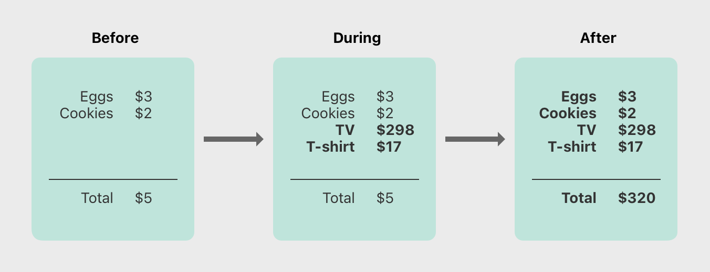
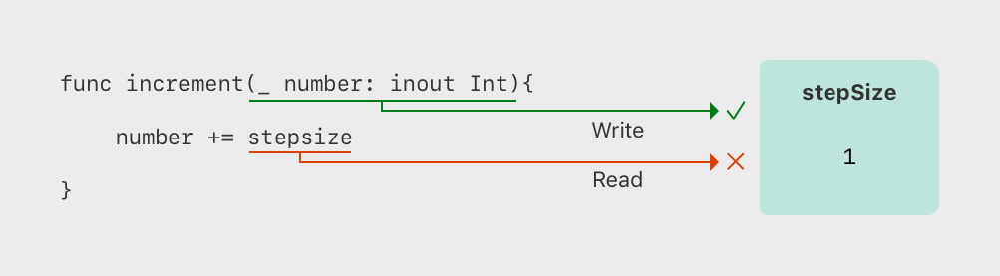
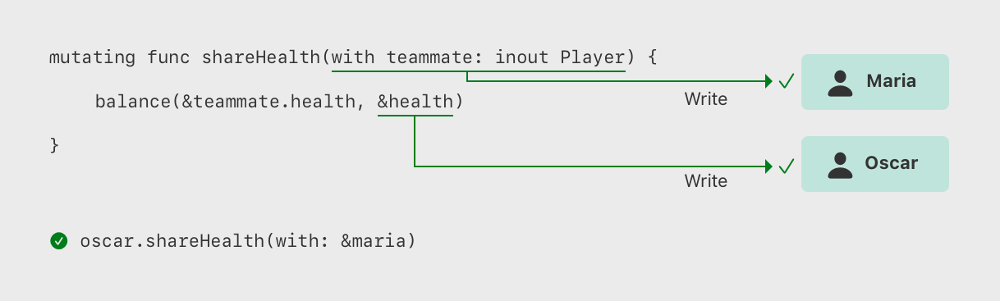
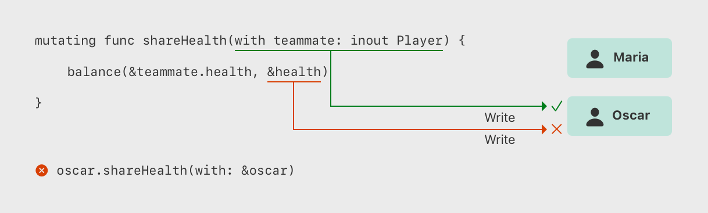

# 内存安全

<iframe style="border:none" width="100%" height="450" src="https://whimsical.com/embed/W4WvyhNYjzZvDCybAsJh6X"></iframe>

默认情况下，Swift 防止代码中发生不安全的行为。例如，Swift 确保变量在使用前已被初始化，内存在释放后不会被访问，以及数组索引会进行越界检查。

Swift 也确保多次访问同一内存区域时不会发生冲突。为此，它要求任何修改内存位置的代码必须具有对该内存的独占访问权限。因为 Swift 自动管理内存，大部分时间你无需担心内存访问的问题。然而，了解可能出现冲突的情况非常重要，这可以帮助你避免编写出存在内存访问冲突的代码。如果你的代码中确实存在冲突，编译时或运行时系统将会报错。

## 理解内存访问冲突

当你在代码中执行诸如设置变量的值或将参数传递给函数之类的操作时，就会发生内存访问。例如，以下代码中包含了读取访问和写入访问：

```swift
// 向 one 所在的内存区域发起一次写操作
var one = 1

// 向 one 所在的内存区域发起一次读操作
print("We're number \(one)!")
```


当你的代码的不同部分同时试图访问内存中的同一位置时，就会发生内存访问冲突。同时对一个内存位置的多次访问可能会产生不可预测或不一致的行为。在 Swift 中，有一些方法可以修改一个跨越多行代码的值，这使得在其修改过程中尝试访问该值成为可能。

你可以通过思考如何更新写在纸上的预算来看到类似的问题。更新预算是一个两步过程：首先你添加项目的名称和价格，然后更改总金额以反映列表上当前的项目。更新前后，你都可以从预算中读取任何信息，并得到正确的答案，如下图所示：




当你正在将项目添加到预算中时，由于总金额尚未更新以反映新添加的项目，预算处于临时无效状态。在添加项目的过程中读取总金额会给你错误的信息。

这个例子还展示了在解决内存访问冲突时可能遇到的一个挑战：有时有多种解决冲突的方法可以产生不同的答案，并且哪个答案是正确的并不总是显而易见的。在这个例子中，根据你是否想要原始的总金额或更新后的总金额，$5 或 $320 可能是正确的答案。在你可以解决冲突访问之前，你需要确定它原本打算做什么。

::: warning 注意
如果你编写过并发或多线程代码，内存访问冲突可能是一个熟悉的问题。然而，这里讨论的内存访问冲突可以在单线程上发生，并不涉及并发或多线程代码。

如果你在单一线程内遇到内存访问冲突，Swift 保证你会在编译时或运行时得到一个错误。对于多线程代码，可以使用 [Thread Sanitizer](https://developer.apple.com/documentation/xcode/diagnosing-memory-thread-and-crash-issues-early) 来帮助检测跨线程的冲突访问。
:::

## 内存访问的特征

在处理内存访问冲突的背景下，需要考虑三个内存访问的特性：访问是读取还是写入，访问的持续时间，以及被访问的内存位置。具体来说，如果满足以下所有条件，则会发生冲突：

- 至少有一个是写入访问或非原子访问。
- 它们访问内存中的相同位置。
- 它们的访问时间重叠。

读取和写入访问之间的区别通常很明显：写入访问会改变内存位置，而读取访问则不会。内存中的位置指的是被访问的内容——例如变量、常量或属性。内存访问的持续时间可以是瞬时的或长期的。

如果操作仅使用 C 语言的原子操作，那么该操作是原子的；否则，它是非原子的。

如果在访问开始后和结束前，不可能有其他代码运行，那么这种访问是瞬时的。由于其性质，两个瞬时访问不能同时发生。大多数内存访问都是瞬时的。例如，下面代码列表中的所有读取和写入访问都是瞬时的：

```swift
func oneMore(than number: Int) -> Int {
    return number + 1
}


var myNumber = 1
myNumber = oneMore(than: myNumber)
print(myNumber)
// Prints "2"
```

然而，有几种被称为长期访问的内存访问方式，它们在其他代码的执行期间持续存在。瞬时访问和长期访问之间的区别在于，长期访问开始后和结束前，有可能运行其他代码，这种情况称为重叠。长期访问可以与其他长期访问和瞬时访问重叠。

在使用函数和方法中的输入输出参数或结构的变异方法的代码中，通常会出现重叠访问。在下面的章节中讨论了使用长期访问的特定 Swift 代码类型。

## In-Out 参数的访问冲突


一个函数对其所有`In-Out`参数具有长期的写入权限。`In-Out`参数的写入权限在所有非`In-Out`参数被评估之后开始，并且持续整个函数调用的时间。如果有多个`In-Out`参数，写入权限的开始顺序与参数出现的顺序相同。
这种长期写入权限的一个后果是，你不能访问作为`In-Out`传递的原始变量，即使作用域规则和访问控制本应允许——任何对原始变量的访问都会造成冲突。例如：

```swift
var stepSize = 1

func increment(_ number: inout Int) {
    number += stepSize
}

increment(&stepSize)
// Error: conflicting accesses to stepSize
```

在上面的代码中，`stepSize`是一个全局变量，通常可以在`increment(_:)`函数内部访问。然而，对`stepSize`的读取访问与对`number`的写入访问重叠了。如下图所示，`number`和`stepSize`都指向内存中的同一个位置。这些读写访问都指向同一块内存并且时间上重叠，从而产生了冲突。



解决这种冲突的一种方法是显式地复制`stepSize`：

```swift
// 显式地复制
var copyOfStepSize = stepSize
increment(&copyOfStepSize)


// 更新回原值
stepSize = copyOfStepSize
// stepSize 现在的值是 2
```

当你在调用 `increment(_:)` 函数之前复制了 `stepSize` 的值并将其命名为 `copyOfStepSize`，很明显，`copyOfStepSize` 的值会增加当前的步长。由于读取操作在写入操作开始之前就结束了，因此不存在冲突。

然而，对于 `inout` 参数来说，长期写访问还存在另一个需要注意的点：如果将同一个变量作为函数的多个 `inout` 参数传递，就会产生冲突。例如：

```swift
func balance(_ x: inout Int, _ y: inout Int) {
    let sum = x + y
    x = sum / 2
    y = sum - x
}
var playerOneScore = 42
var playerTwoScore = 30
balance(&playerOneScore, &playerTwoScore)  // 正常
balance(&playerOneScore, &playerOneScore)
// 错误：playerOneScore 访问冲突
```

上面的 `balance(_:_:)` 函数通过修改其两个参数来将总值平均分配给它们。使用 `playerOneScore` 和 `playerTwoScore` 作为参数调用它不会产生冲突 - 虽然存在两个同时写入的访问, 但它们访问内存中的不同位置。相比之下, 将 `playerOneScore` 同时作为两个参数的值则会产生冲突, 因为它试图同时在内存中的相同位置执行两次写入访问。

::: warning 注意
由于运算符也是函数, 因此它们也可以长期访问其输入输出参数。例如, 假设 `balance(_:_:)` 是一个名为 `<^>` 的运算符函数，那么写成 `playerOneScore <^> playerOneScore` 也会导致与 `balance(&playerOneScore, &playerOneScore)` 相同的冲突。
:::

## 方法里 self 的访问冲突

结构体上的`mutating`方法可以在方法调用期间写访问并修改自身 (`self`) 的属性值。例如，考虑一个游戏中每个玩家的角色数据 (`struct`)，包含以下属性：

* 生命值（health amount）：当受到伤害时会减少
* 能量值（energy amount）：当使用特殊技能时会减少

```swift
struct Player {
    var name: String
    var health: Int
    var energy: Int


    static let maxHealth = 10
    mutating func restoreHealth() {
        health = Player.maxHealth
    }
}
```


`restoreHealth()` 方法对 `self` 的写访问从方法开始一直持续到方法返回。在这个例子中，`restoreHealth()` 内部没有其他代码可以同时访问玩家实例的属性（也就是没有竞争条件）。而下方提到的 `shareHealth(with:)` 方法则不同，它接受另一个玩家实例作为`In-Out`参数，这就可能导致**同时访问**的场景。

```swift
extension Player {
    mutating func shareHealth(with teammate: inout Player) {
        balance(&teammate.health, &health)
    }
}


var oscar = Player(name: "Oscar", health: 10, energy: 10)
var maria = Player(name: "Maria", health: 5, energy: 10)
oscar.shareHealth(with: &maria)  // OK
```

上面的例子中，调用 `shareHealth(with:)` 方法让 Oscar 玩家的角色数据跟 Maria 玩家的角色数据共享生命值并不会造成冲突。这是因为：

* 在方法调用期间，对 `oscar` 的写访问发生，因为 `oscar` 是`mutating`方法中的 `self` 值。
* 同时，由于 `maria` 被作为`In-Out`传递，也存在对 `maria` 的写访问（同样持续整个方法调用）。

如下图所示，它们访问的是内存中的不同位置。即使这两个写访问在时间上重叠，也不会产生冲突。



但是，如果你将 `oscar` 作为参数传递给 `shareHealth(with:)`，就会产生冲突：

```swift
oscar.shareHealth(with: &oscar)
// Error: conflicting accesses to oscar

```

`mutating`方法在方法执行期间需要写访问 `self`，同时 `In-Out` 参数也需要在相同的时间段内写访问 `teammate`。然而，正如下图所示，在方法内部，`self` 和 `teammate` 引用的是内存中的同一个位置。这两个写访问指向相同的内存，并且在时间上重叠，从而产生了冲突。



## 属性的访问冲突

结构体、元组和枚举等类型由各个独立的成员值组合而成，例如结构体的属性或元组的元素。由于它们是值类型，任何对部分值的修改都会修改整个值，这意味着读写其中一个属性都需要读写整个值的访问权限。例如，对元组元素的重叠写访问会产生冲突：

```swift
var playerInformation = (health: 10, energy: 20)
balance(&playerInformation.health, &playerInformation.energy)
// 错误：playerInformation 的属性访问冲突
```

在上面的例子中，当为元组的元素调用 `balance(_:_:)` 函数时会产生冲突，原因是存在对 `playerInformation` 的重叠写访问。由于 `playerInformation.health` 和 `playerInformation.energy` 都作为 `In-Out` 参数传递，这意味着 `balance(_:_:)` 函数在调用期间需要写访问它们。同时，由于访问元组元素需要访问整个元组，因此这就产生了两个针对 `playerInformation` 的写访问，并且它们的持续时间重叠，从而导致冲突。

下面的代码展示了同样的错误也可能会出现在全局变量中存储的结构体属性的重叠写访问中。

```swift
var holly = Player(name: "Holly", health: 10, energy: 10)
balance(&holly.health, &holly.energy)  // 错误
```

实际上，对于结构体属性的大多数访问是可以安全地重叠的。例如，如果将上例中的变量 `holly` 改为局部变量而不是全局变量，编译器就可以保证这个重叠访问是安全的：

```swift
func someFunction() {
    var oscar = Player(name: "Oscar", health: 10, energy: 10)
    balance(&oscar.health, &oscar.energy)  // 正常
}
```


在前面的例子中，我们看到Oscar的健康和能量作为两个参数被传递到了`balance(_:_:)`函数。由于这两个属性互不影响，因此编译器能够确保使用它们是内存安全的。

有时候，Swift在处理结构体时，对属性的重叠访问并不一定违反内存安全。虽然独占访问内存是一种严格的规则，但并非所有安全的代码都需要遵守这种独占访问。如果编译器能确定即使是非独占访问也是安全的，它会允许这样的代码执行。具体来说，编译器会在以下情况下认为重叠访问是安全的：

1. 只访问某个实例的存储属性，不涉及计算属性或类属性。
2. 该结构体定义为局部变量而不是全局变量。
3. 该结构体没有被闭包捕获，或者只被非逃逸闭包捕获。

如果编译器不能确定这些访问是安全的，它就不会允许这种访问方式。

