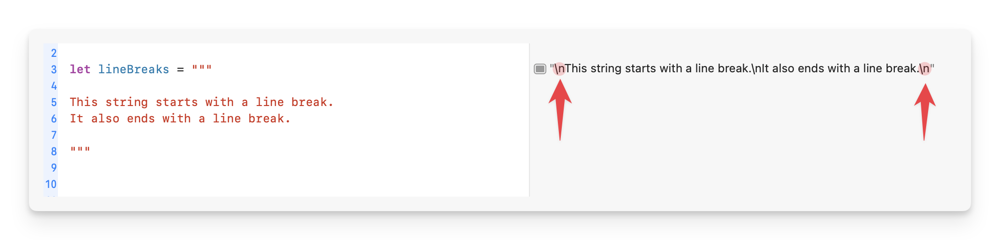
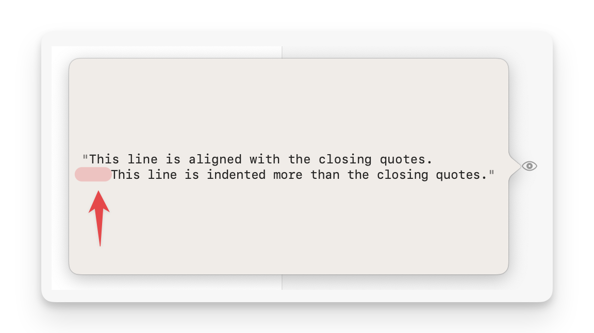
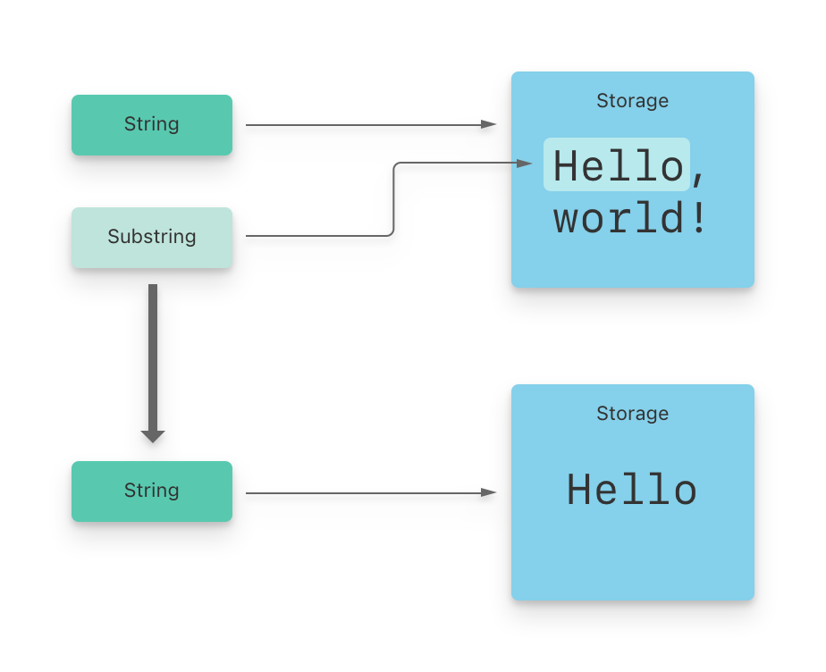

# 字符串和字符

<iframe style="border:none" width="800" height="450" src="https://whimsical.com/embed/3qocuAP4bXRcDLirztX7Rj"></iframe>

## 字符串字面量

在 Swift 中，你可以通过使用字符串字面量来定义预设的字符串值。字符串字面量是由一对双引号包围的一组固定顺序的字符。

字符串字面量可以用于为常量和变量提供初始值：

```swift
let someString = "Some string literal value"
```

### 多行字符串字面量

如果你需要一个字符串是跨越多行的，那就使用「多行字符串字面量」 — 由一对三个双引号包裹着的具有固定顺序的文本字符集：

```swift
let quotation = """
The White Rabbit put on his spectacles.  "Where shall I begin,
please your Majesty?" he asked.

"Begin at the beginning," the King said gravely, "and go on
till you come to the end; then stop."
"""
```

要创建一个包含多行文本的字符串，你可以使用三个连续的双引号（`"""`）来开启和关闭这个字符串。这种格式的字符串称为多行字符串字面量。你写的字符串内容从第一组三个双引号后的下一行开始，并在遇到第二组三个双引号之前的那一行结束。

因此，这个字符串的开始和结束的三个双引号各占一行，这两行里不包含任何文本内容，也不会自动加入换行符。

::: details 编码时换行

默认情况下，每一行都会在字符串中自动添加一个换行符。这意味着，如果你按如下方式编写代码：

```swift
let speech = """
Hello,
world!
"""
```

字符串 `speech` 的输出结果会在 "Hello," 和 "world!" 之间有一个换行，显示为：
```
Hello,
world!
```

但是，**如果你想在「编码时」为了清晰而在代码中换行，同时又不希望这些代码行间的换行出现在最终的字符串结果中**，你可以在每一行的末尾加上一个反斜杠（\）。这个反斜杠告诉 Swift 编译器忽略它后面的换行符，所以虽然你的代码在视觉上是分开的，输出的字符串将不包含这些换行符，而是作为一个连续的行显示。

例如：

```swift
let speech = """
Hello,\
    world!\
"""
```

这时，`speech` 的输出结果会是：
```
Hello, world!
```

这里，尽管代码在 "Hello," 和 "world!" 之间换了行，由于每行的末尾有反斜杠，输出的字符串中并不包含换行符，而是连成了一句话。
:::


### 首尾添加换行符

如果你想让字符串实际的内容以换行符**开始**和**结束**，你需要在多行字符串的第一行和最后一行单独放置换行符。例如：

```swift
let lineBreaks = """

This string starts with a line break.
It also ends with a line break.

"""
```

在这个例子中，`lineBreaks` 变量的值实际上以一个换行符开始，并且在 "It also ends with a line break." 后又添加了一个换行符。因此，当你打印 `lineBreaks` 时，它的输出会在开始前和结束后各有一个额外的空行。



### 添加缩进

Swift 允许你对多行字符串字面量进行**缩进**，以使它们在代码中的外观更加整洁。多行字符串的缩进方式是基于结尾三个引号（"""）的位置来确定的。编译器会自动忽略每行开头与结尾引号相同数量的空格。但是，如果某行的缩进超出了这个基准，超出的部分会被保留在最终的字符串中。

例如：

```swift
let example = """
    This line is aligned with the closing quotes.
        This line is indented more than the closing quotes.
    """
```



在这个例子中，"This line is aligned with the closing quotes." 将不包含任何前导空格，因为它的缩进与结尾的三个引号「对齐」。而 "This line is indented more than the closing quotes." 则会在其前面保留4个空格，因为它比结尾的三个引号「多」缩进了4个空格。


### 字符串字面量的特殊字符

字符串字面量可以包含以下特殊字符：

- `\0` 表示空字符
- `\\` 表示反斜线本身
- `\t` 表示水平制表符（相当于一个`Tab`缩进）
- `\n` 表示换行符
- `\r` 表示回车符
- `\"` 表示双引号（用于在字符串内部表示双引号）
- `\'` 表示单引号（通常在字符串中不需要转义，除非用于字符字面量）

Unicode 标量使用 `\u{n}` 的形式表示，其中 `n` 是一个一到八位的十六进制数，表示 Unicode 字符的代码点。

下面的代码为各种特殊字符的使用示例。`wiseWords`常量包含了两个双引号。`dollarSign`、`blackHeart`和`sparklingHeart `常量演示了三种不同格式的 Unicode 标量：

```swift
let wiseWords = "\"Imagination is more important than knowledge\" - Einstein"
// "Imagination is more important than knowledge" - Einstein
let dollarSign = "\u{24}"             // $，Unicode 标量 U+0024
let blackHeart = "\u{2665}"           // ♥，Unicode 标量 U+2665
let sparklingHeart = "\u{1F496}"      // 💖，Unicode 标量 U+1F496
```

## 扩展字符串分隔符

在 Swift 中，你可以使用扩展分隔符来处理字符串中的特殊字符，这使得字符串中的「转义字符」被看作「普通字符」。这是通过在字符串的双引号外面添加数字符号（`#`）来实现的。例如，如果你使用如下方式编写字符串：

```swift
let example = #"Line 1 \nLine 2"#
```

这个字符串会原样输出 `Line 1 \nLine 2`，其中 `\n` 不会被解释为换行符，而是作为普通文本的一部分。

如果你希望在使用扩展分隔符的同时保持转义字符的特殊效果，你需要在转义符（`\`）后也添加相同数量的`#` 符号。例如，如果你想在上述例子中包含实际的换行效果，你可以这样写：

```swift
let example = #"Line 1 \#nLine 2"#
```

同样地，如果你使用了多个`#`来作为扩展分隔符，你需要在转义符后添加相应数量的`#`。例如：

```swift
let example = ###"Line 1 \###nLine 2"###
```

这会正确地解释 `\n` 为换行符，使得 `Line 1` 和 `Line 2` 在输出时分别位于不同的行。

此外，扩展分隔符也可以用于多行字符串字面量。如果你想在多行字符串中直接包含三个双引号（`"""`），你可以使用扩展分隔符来避免这些双引号被解释为字符串的结束标记。这可以通过将三个双引号放在扩展分隔符内来实现，如下所示：

```swift
let multilineString = #"""
Here is a string that includes triple quotes (""") inside.
"""#
```

这样，即使字符串内部包含三个双引号，它们也会被视为普通文本的一部分，而不会结束字符串。

## 初始化空字符串

要创建一个空的字符串，你可以直接使用空字符串字面量或者初始化一个新的 `String` 实例：

```swift
var emptyString = ""               // 使用空字符串字面量
var anotherEmptyString = String()  // 使用初始化方法
// 这两个字符串都是空的，并且它们是等价的。
```

要检查一个字符串是否为空，可以使用 `isEmpty` 属性，它返回一个布尔值：

```swift
if emptyString.isEmpty {
    print("Nothing to see here")
}
// 将会打印："Nothing to see here"
```
## 字符串可变性

在 Swift 中，你可以通过将字符串分配给变量或常量来控制这个字符串是否可以被修改：

- **变量**（使用 `var` 关键字）: 这样定义的字符串可以在以后被修改。例如：
    ```swift
    var greeting = "Hello"
    greeting = "Hello, world!"  // 可以修改变量的值 // [!code ++]
    ```

- **常量**（使用 `let` 关键字）: 这样定义的字符串一旦设定后就不能被修改。例如：
    ```swift
    let farewell = "Goodbye"
    // farewell = "See you later"  // 尝试修改会引发编译错误 // [!code error]
    ```
## 字符串是值类型

在 Swift 中，`String` 类型是一个值类型，这有几个关键点需要理解：

1. **值类型的行为**：与引用类型不同，值类型在赋给新的变量、常量，或者在函数和方法中传递时，会创建原始数据的一个拷贝。这意味着每次你操作字符串时，你实际上是在操作一个新的副本，而不是原始字符串。

2. **所有权和修改**：由于字符串被拷贝，所以函数或方法接收的字符串是独立于原始字符串的。这种行为确保了传递给函数的字符串不会被外部修改，保护了数据的完整性。在 Swift 中，只有你显式地修改了字符串，它才会变化。

3. **编译器优化**：虽然值类型通常会涉及很多数据拷贝，但 Swift 编译器会进行智能优化。它尽可能地推迟拷贝操作，直到真正需要修改数据时才执行拷贝。这种优化被称为「写时复制」（Copy-on-Write），它帮助提高性能，使得即便是值类型的字符串也能高效地使用，因为不是每次操作都会触发实际的数据拷贝。


## 使用字符

在 Swift 中，你可以使用 `for-in` 循环来遍历字符串的每一个字符。例如：

```swift{1}
for character in "Dog!🐶" {
    print(character)
}
// 输出：
// D
// o
// g
// !
// 🐶
```

这种循环方式让你可以逐个处理字符串中的每个字符。

此外，你也可以创建一个独立的字符常量或变量，只需指定类型为 `Character` 并使用字符字面量进行赋值：

```swift
let exclamationMark: Character = "!"
```

如果你想从一系列字符中创建一个字符串，可以将一个类型为 `Character` 的数组传递给 `String` 的初始化器：

```swift{2}
let catCharacters: [Character] = ["C", "a", "t", "!", "🐱"]
let catString = String(catCharacters)
print(catString)
// 打印输出：“Cat!🐱”
```

这里，数组 `catCharacters` 包含了字符 'C', 'a', 't', '!', 和 '🐱'。通过 `String(catCharacters)`，这些字符被组合成了一个新的字符串 "Cat!🐱"。

## 连接字符串和字符

字符串可以通过加法运算符（+）相加在一起（或称“连接”）创建一个新的字符串：

```swift{3}
let string1 = "hello"
let string2 = " there"
var welcome = string1 + string2
// welcome 现在等于 "hello there"
```

你也可以通过加法赋值运算符（+=）将一个字符串添加到一个已经存在字符串变量上：

```swift{2}
var instruction = "look over"
instruction += string2
// instruction 现在等于 "look over there"
```

你可以用 append() 方法将一个字符附加到一个字符串变量的尾部：

```swift{2}
let exclamationMark: Character = "!"
welcome.append(exclamationMark)
// welcome 现在等于 "hello there!"
```

::: warning 注意
字符类型 Character 的变量或常量只能包含单个字符。因此，你不能将一个字符串或另一个字符添加到已经存在的字符变量上。
:::

## 字符串插值

字符串插值是一种在 Swift 中构建新字符串的方法，允许你将常量、变量、字面量和表达式嵌入到字符串中。无论是单行还是多行的字符串字面量，都可以使用字符串插值。要进行插值，你需要将要插入的项放在反斜线后面跟随一对圆括号中，例如：

```swift{2}
let multiplier = 3
let message = "\(multiplier) times 2.5 is \(Double(multiplier) * 2.5)"
// message 是 "3 times 2.5 is 7.5"
```

这里，`multiplier` 是一个整数变量，它的值为`3`。在字符串 `message` 中，`\(multiplier)` 将 `multiplier` 的值插入到字符串中，显示为 "3 times 2.5 is"。

接下来，表达式 `\(Double(multiplier) * 2.5)` 在字符串中进一步计算了 `multiplier` 的浮点数乘积，即 `3 * 2.5`，结果为 `7.5`。因此，整个字符串 `message` 描述了这个乘法表达式的过程和结果，形成了 "3 times 2.5 is 7.5"。

## Unicode

Unicode是一个用于在不同书写系统中对文本进行编码、表示和处理的国际标准。它使你可以用标准格式表示来自任意语言几乎所有的字符，并能够对文本文件或网页这样的外部资源中的字符进行读写操作。Swift 的 String 和 Character 类型是完全兼容 Unicode 标准的。

### Unicode 标量

在 Swift 中，`String` 类型的构建基础是 Unicode 标量。Unicode 标量基本上是用来唯一表示字符或修饰符的 21 位数字码点。这些码点使用十六进制数表示，前面加上“U+”。例如，U+0061 表示小写的拉丁字母 `a`，而 U+1F425 表示一个小鸡的表情符号 `🐥`。

Unicode 标量涵盖了从 U+0000 到 U+10FFFF 的范围，但并非这个范围内的所有值都被分配给了字符。有些码点保留未使用，以便将来可能的扩展或特殊用途，如用于 UTF-16 编码的代理对（surrogate pairs）。已分配的每个码点不仅有一个码值，还有一个官方名称，比如“LATIN SMALL LETTER A”或“FRONT-FACING BABY CHICK”，这些名称帮助标识和描述字符。

### 可扩展的字形群集

在 Swift 中，每一个 `Character` 类型实际上代表的是一个“可扩展的字形群”。这个概念可以看作是组成人类可识别的单个字符的一个或多个 Unicode 标量的集合。Unicode 标量是指 Unicode 字符集中的一个具体码点。

为了更好地理解这一概念，让我们看一个具体的例子：字母 `é`。

1. **单一标量表示**：
    字母 `é` 可以通过一个单一的 Unicode 标量表示，即 U+00E9，这个标量对应的是 “LATIN SMALL LETTER E WITH ACUTE”（带急促重音的小写字母 e）。

2. **组合标量表示**：
    同样的字母 `é` 也可以通过两个分开的 Unicode 标量来表示：
    - U+0065：代表 “LATIN SMALL LETTER E”（小写字母 e）。
    - U+0301：代表 “COMBINING ACUTE ACCENT”（急促重音符号）。
    这种情况下，小写字母 e 和急促重音符号组合起来，形成了与单一标量 U+00E9 相同的视觉字符 `é`。


```swift
let eAcute: Character = "\u{E9}"                         // é
let combinedEAcute: Character = "\u{65}\u{301}"          // e 后面加上  ́
// eAcute 是 é, combinedEAcute 是 é
```

::: details 用途和好处


1. **国际化和本地化**：
    由于可扩展字形群可以包含多个 Unicode 标量，Swift 可以支持全球各种语言的复杂字符，包括那些需要重音符号和其他修饰符的字符。这对开发国际化应用程序来说非常重要，可以确保应用在不同语言环境下都能正确显示文本。

2. **文本处理的准确性**：
    在处理包含多语言文本的应用中，理解和正确处理每个 `Character` 作为一个完整的字形群是非常重要的。例如，在文本编辑器或处理用户输入的应用程序中，确保光标正确地在字符之间而不是字符内部移动，或者确保文本渲染时保持视觉上的一致性。

3. **用户界面设计**：
    对于需要精确控制文本显示的界面，了解 `Character` 的这些特性可以帮助开发者设计更好的用户交互体验。例如，计算字符串的长度时考虑到复杂字符的存在，可以避免布局错误或文本截断问题。

4. **数据存储和网络传输**：
    在存储或传输文本数据时，了解字符如何由 Unicode 标量组成可以帮助开发者选择更有效的编码和处理策略，尤其是在面对多种语言和字符集时。

5. **文本搜索和处理**：
    理解可扩展字形群的概念有助于开发更精确的文本搜索和处理工具，如正则表达式匹配，以及更复杂的文本分析和处理任务，确保结果的正确性和相关性。

总之，Swift 中对 `Character` 类型的这种设计，不仅提高了编程语言处理国际化文本的能力，还在日常开发中为处理各种文本操作提供了支持和灵活性。这使得 Swift 成为一个强大且适应性强的现代编程语言。
:::

## 计算字符数量

如果想要获得一个字符串的字符数量，可以使用`count`属性：

```swift{2}
let unusualMenagerie = "Koala 🐨, Snail 🐌, Penguin 🐧, Dromedary 🐪"
print("unusualMenagerie has \(unusualMenagerie.count) characters")
// 打印输出“unusualMenagerie has 40 characters”
```


在 Swift 中，`Character` 类型的特性使得字符串的处理方式与其他编程语言有所不同，特别是在处理由多个 Unicode 标量组成的字符时。这个例子很好地展示了这种处理方式：

```swift
var word = "cafe"
print("the number of characters in \(word) is \(word.count)")
// 打印输出“the number of characters in cafe is 4”

word += "\u{301}"    // 拼接一个重音，U+0301

print("the number of characters in \(word) is \(word.count)")
// 打印输出“the number of characters in café is 4”
```

这里的关键点是理解 Swift 如何定义字符（`Character`）：

1. **初始化字符串**：开始时，字符串 `word` 包含 "cafe" 四个字母。Swift 认为这四个字母各自是一个 `Character`，所以字符数为 4。

2. **添加组合字符**：当你向字符串 `word` 添加 Unicode 标量 `\u{301}`（重音符号）时，这个符号自动与前一个字符 'e' 组合，形成了一个新的字符 'é'。在 Unicode 中，'é' 可以通过单个标量表示，也可以通过组合一个普通的 'e' 和一个重音符号来表示。

3. **字符串长度不变**：尽管你添加了一个额外的 Unicode 标量，但从 Swift 的角度看，你并没有增加一个新的 `Character`。相反，你只是修改了现有的一个 `Character`，从 'e' 变成了 'é'。因此，即使添加了重音，字符串 `word` 中的 `Character` 数量仍然是 4。


::: details 内存、性能与比较

### 内存使用
由于有些字符是由多个部分组成的，它们占用的内存比单一部分的字符要多。因此，在 Swift 中，字符串中的不同字符可能占用不同的内存空间。

### 性能影响
因为要准确地数出一个字符串中的字符数量，Swift 需要检查字符串中每个字符是由多少个部分组成的。对于很长的字符串，这个过程可能需要一些时间。

### Swift 与 `NSString`
Swift 中的字符串（`String`）和 Objective-C 中的字符串（`NSString`）处理字符的方式不同。`NSString` 计算字符的方法是基于更旧的编码（UTF-16），这种方法可能会错误地把一个由多个部分组成的字符算作两个字符。

希望这次解释更清晰一些！如果你有任何疑问，或者需要更多例子，请告诉我！
:::


## 访问和修改字符串

### 字符串索引


在 Swift 中，每个`String`值都有一个与之关联的索引类型`String.Index`，用于标识字符串中每个`Character`的位置。

::: tip 整数索引
由于不同的字符可能占用不同的内存空间，我们不能直接使用「整数索引」来访问字符串中的字符。要确定任一字符的位置，必须从字符串的开始处遍历每个 Unicode 标量，直到到达该字符的位置。
:::

`String`提供了`startIndex`属性，用来获取字符串中「**第一个**」字符的索引。相应地，`endIndex`属性表示的是位于「**最后**」一个字符「**之后**」的位置的索引（它不指向任何有效的字符位置），因此`endIndex`不能作为字符串的有效索引。如果字符串为空，`startIndex`和`endIndex `将会是「**相同**」的。

你可以通过`index(before:)`和`index(after:)`方法来分别获取给定索引**之前**或**之后**的索引。此外，使用`index(_:offsetBy:) `方法可以直接计算出**偏移**后的索引，这可以避免多次调用`index(before:)`或`index(after:)`。

你可以使用下标语法来访问`String`特定索引的`Character`。

```swift
let greeting = "Guten Tag!"
greeting[greeting.startIndex]
// G
greeting[greeting.index(before: greeting.endIndex)]
// !
greeting[greeting.index(after: greeting.startIndex)]
// u
let index = greeting.index(greeting.startIndex, offsetBy: 7)
greeting[index]
// a
```

试图获取越界索引对应的`Character`，将引发一个运行时错误。

```swift
greeting[greeting.endIndex] // error // [!code error]
greeting.index(after: greeting.endIndex) // error // [!code error]
```

使用`indices`属性会创建一个包含全部索引的范围（`Range`），用来在一个字符串中遍历单个字符。

```swift{1}
for index in greeting.indices {
    print("\(greeting[index]) ", terminator: "")
}
// 打印输出“G u t e n   T a g ! ”
```

::: info 提示
你可以在任何遵循 `Collection` 协议的类型中使用 `startIndex` 和 `endIndex` 属性，以及 `index(before:)`、`index(after:)` 和 `index(_:offsetBy:)` 方法来操作索引。这些方法和属性不仅适用于 `String`，也同样可以用于 `Array`、`Dictionary` 和 `Set` 等集合类型。
:::

### 插入和删除

使用`insert(_:at:)`方法可以在字符串的指定索引处插入「单个字符」。而使用`insert(contentsOf:at:) `方法则可以在指定索引处插入「一段字符串」。
```swift{2,5}
var welcome = "hello"
welcome.insert("!", at: welcome.endIndex)
// welcome 变量现在等于 "hello!"

welcome.insert(contentsOf:" there", at: welcome.index(before: welcome.endIndex))
// welcome 变量现在等于 "hello there!"
```


使用`remove(at:)`方法可以删除字符串中指定索引处的「单个字符」。而使用`removeSubrange(_:)`方法，允许你「指定一个范围」来删除「多个字符」。
```swift{1,4,5}
welcome.remove(at: welcome.index(before: welcome.endIndex))
// welcome 现在等于 "hello there"

let range = welcome.index(welcome.endIndex, offsetBy: -6)..<welcome.endIndex
welcome.removeSubrange(range)
// welcome 现在等于 "hello"
```

::: warning 注意
你可以在任何遵循 `RangeReplaceableCollection` 协议的类型中使用 `insert(_:at:)`、`insert(contentsOf:at:)`、`remove(at:)` 和 `removeSubrange(_:)` 方法。这些方法不仅适用于字符串，也可以用于数组`Array`。然而，需要注意的是，`Dictionary` 和 `Set` 不遵循 `RangeReplaceableCollection` 协议，因此这些方法不适用于这两种类型。
:::


## 子字符串

在 Swift 中，当你通过下标或方法如 `prefix(_:)` 从一个字符串中提取部分内容时，你得到的是一个 `Substring` 实例，而不是一个新的 `String`。`Substring` 与 `String` 共享大多数方法，这意味着你可以用相同的方式操作它们。然而，与 `String` 不同的是，`Substring` 通常用于临时处理字符串数据。如果你打算长期保持这段数据，应该将 `Substring` 转换成 `String` 实例，如下例：

```swift
let greeting = "Hello, world!"
let index = greeting.firstIndex(of: ",") ?? greeting.endIndex
let beginning = greeting[..<index]
// beginning 的值为 "Hello"

// 把结果转化为 String 以便长期存储。
let newString = String(beginning)
```

就像 `String`，每个 `Substring` 也在内存中保留字符数据。不过，`Substring` 与 `String` 的主要区别在于性能优化：`Substring` 能够重用原始 `String` 或其他 `Substring` 的内存空间。这种优化允许在不复制内存的情况下修改 `String` 和 `Substring`，从而节省性能资源。正因为 `Substring` 重用了原 `String` 的内存，只有在原 `String` 不再需要时，占用的内存才会被释放。因此，如果你需要长期保持数据，应将 `Substring` 转换为 `String`。

在上面的例子中，greeting 是一个字符串（String），它有自己独立的内存空间来存储字符。beginning 是从 greeting 中派生出的一个子字符串（Substring），因此它重用了 greeting 的内存。而 newString 则是由 beginning 转换而来的新字符串，它拥有一片全新的内存空间。下面的图展示了他们之间的关系：




## 比较字符串

Swift 提供了三种方式来比较文本值：字符串字符相等、前缀相等和后缀相等。

### 字符串/字符相等

字符串/字符可以用等于操作符（`==`）和不等于操作符（`!=`）：

```swift
let quotation = "We're a lot alike, you and I."
let sameQuotation = "We're a lot alike, you and I."
if quotation == sameQuotation {
    print("These two strings are considered equal")
}
// 打印输出“These two strings are considered equal”
```

如果两个字符串（或两个字符）的可扩展字形群集在标准上是相等的，那么这两个字符串（或字符）就被视为相等。这意味着只要这些字形群集在语言表达和视觉外观上相同，它们就被认为是等同的，即便它们可能由不同的`Unicode`标量组成。

```swift
// "Voulez-vous un café?" 使用 LATIN SMALL LETTER E WITH ACUTE
let eAcuteQuestion = "Voulez-vous un caf\u{E9}?"

// "Voulez-vous un café?" 使用 LATIN SMALL LETTER E and COMBINING ACUTE ACCENT
let combinedEAcuteQuestion = "Voulez-vous un caf\u{65}\u{301}?"

if eAcuteQuestion == combinedEAcuteQuestion {
    print("These two strings are considered equal")
}
// 打印输出“These two strings are considered equal”
```

相反，英语中的`LATIN CAPITAL LETTER A`(`U+0041`，或者`A`)不等于俄语中的`CYRILLIC CAPITAL LETTER A`(`U+0410`，或者 `A`)。两个字符看着是一样的，但却有不同的「**语言意义**」：

```swift
let latinCapitalLetterA: Character = "\u{41}"

let cyrillicCapitalLetterA: Character = "\u{0410}"

if latinCapitalLetterA != cyrillicCapitalLetterA {
    print("These two characters are not equivalent")
}
// 打印“These two characters are not equivalent”
```

### 前缀/后缀相等

在 Swift 中，你可以使用 `hasPrefix(_:)` 和 `hasSuffix(_:)` 方法来检查一个字符串是否以特定的前缀或后缀结束。这两个方法都接受一个 `String` 类型的参数，并返回一个布尔值，表示字符串是否包含给定的前缀或后缀。

假设我们有一个字符串 `greeting`，我们想检查它是否以某些特定的词组开始或结束：

```swift
let greeting = "Hello, world!"

// 检查字符串是否以 "Hello" 开头
let startsWithHello = greeting.hasPrefix("Hello")
print("Does greeting start with 'Hello'? \(startsWithHello)") // 输出：Does greeting start with 'Hello'? true

// 检查字符串是否以 "world!" 结尾
let endsWithWorld = greeting.hasSuffix("world!")
print("Does greeting end with 'world!'? \(endsWithWorld)") // 输出：Does greeting end with 'world!'? true
```


## 字符串的 Unicode 表示形式

Swift 提供了三种主要的 Unicode 表示形式，每种形式都适用于不同的用途和需求。

### Unicode 标量表示

这个视图将字符串表示为 Unicode 标量的序列。Unicode 标量是任何可以在 Unicode 标准中指定为一个单独的代码点的值，这包括了从 U+0000 到 U+D7FF 以及从 U+E000 到 U+10FFFF 的字符。

在 Swift 中，你可以通过 `unicodeScalars` 属性访问这个视图。


```swift
let text = "Dog‼🐶"
for scalar in text.unicodeScalars {
    print("\(scalar) ")
}
// 输出："D o g ‼ 🐶"
```

### UTF-8 表示（UTF-8 View）

这个视图将字符串表示为 UTF-8 编码的序列。UTF-8 是一种变长编码，使用 1 到 4 个字节来表示每个 Unicode 标量。

在 Swift 中，`utf8` 属性允许直接访问字符串的 UTF-8 表示。


```swift
let text = "Dog‼🐶"
for byte in text.utf8 {
    print("\(byte) ")
}
// 68 111 103 226 128 188 240 159 144 182
```

### UTF-16 表示（UTF-16 View）
这个视图将字符串表示为 UTF-16 编码的序列。UTF-16 使用 1 到 2 个 16 位的代码单元来表示每个 Unicode 标量。

在 Swift 中，`utf16` 属性可以被用来访问字符串的 UTF-16 编码。

```swift
let text = "Dog‼🐶"
for codeUnit in text.utf16 {
    print("\(codeUnit) ")
}
// 68 111 103 8252 55357 56374
```

