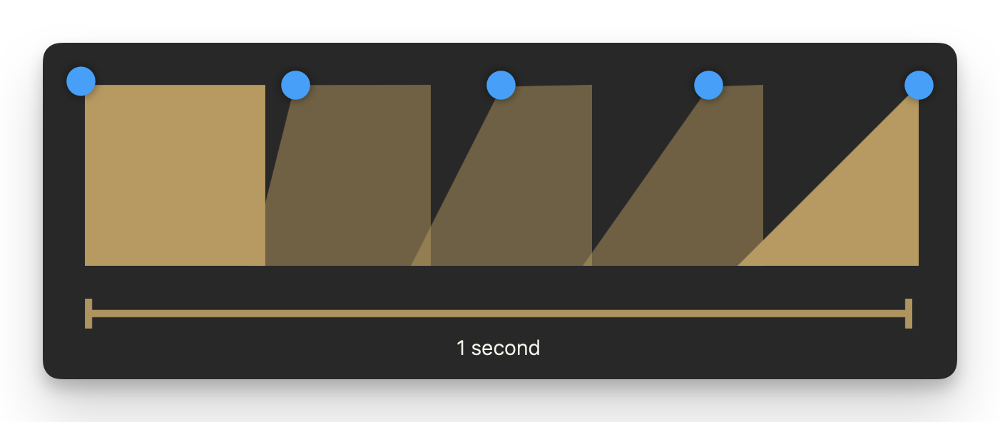

# Making data animatable

## `AnimatableData`

当你更改值时，SwiftUI 不知道你想用自定义形状做什么动画。使用 `AnimatableData` 协议，你可以告诉 SwiftUI 为自定义形状动画哪些数据

动画的是数字类型的属性。例如 `Double` 或 `CGFloat` 类型。这样 SwiftUI 就可以在一段时间内计算如何从一个数字到另一个数字。

这就是动画的工作原理。动画基本上就是将一个数字更改为另一个数字。



```swift
struct AnimatableDataView: View {
    
    @State private var startingPoint: CGFloat = 0.0
    
    var body: some View {
        
        VStack(spacing: 50) {
            Picker("选择", selection: $startingPoint) {
                Text("Triangle").tag(CGFloat(200))
                Text("Trapezium").tag(CGFloat(100))
                Text("Square").tag(CGFloat(0))
            }.pickerStyle(.segmented)
            
            RightAngleShape(startingPoint: startingPoint)
                .frame(width: 200, height: 200)
                .animation(.easeIn, value: startingPoint)
        }.padding()
        
    }
}

struct RightAngleShape: Shape {
    var startingPoint:CGFloat = 0.0
    
    var animatableData: CGFloat {
        get {startingPoint}
        set {startingPoint = newValue}
    }
    
    
    func path(in rect: CGRect) -> Path {
        var path = Path()
        
        path.move(to: CGPoint(x: startingPoint, y: 0))
        
        path.addLine(to: CGPoint(x: rect.maxX, y: 0))
        
        path.addLine(to: CGPoint(x: rect.maxX, y: rect.maxY))
        
        path.addLine(to: CGPoint(x: 0, y: rect.maxY))
        
        path.closeSubpath()
        
        return path
    }
    
}
```
<video src="../../video/AnimatableData.mp4" controls="controls"></video>


## `AnimatablePair`

一对可动画的值，本身也是可动画的。

在上例中，只有一个 `AnimatableData` 属性用于动画一个值，但是如果想要动画多个值呢？这就是 `AnimatablePair` 的作用所在。

```swift
@frozen
struct AnimatablePair<First, Second> where First : VectorArithmetic, Second : VectorArithmetic
```

```swift
struct AnimatablePairView: View {
    @State private var xOffset: CGFloat = 0.0
    
    @State private var yOffset: CGFloat = 0.0
        
    var body: some View {
        
        Button("Animate") {
            withAnimation(.spring(response: 0.4, dampingFraction: 0.2)) {
                xOffset = xOffset == 60 ? 0 : 60
                yOffset = yOffset == 90 ? 0 : 90
            }
        }
        
        Blobshape(xOffset: xOffset, yOffset: yOffset).fill()
            .frame(height: 500)
            .padding()
    }
}


struct Blobshape: Shape {
    
    var xOffset: CGFloat = 0.0
    var yOffset: CGFloat = 0.0
    
    var animatableData: AnimatablePair<CGFloat, CGFloat>{
        get {AnimatablePair(xOffset, yOffset)}
        set {
            xOffset = newValue.first
            yOffset = newValue.second
        }
    }
    
    func path(in rect: CGRect) -> Path {
        
        let startPoint = CGPoint(x: rect.width * 0.5, y: 0)
        
        var path = Path()
        
        path.move(to: startPoint)
        
        path.addCurve(to: CGPoint(x: rect.width, y: rect.height / 2), 
                    control1: CGPoint(x:  (rect.width * 0.85) + xOffset, y: 0),
                    control2: CGPoint(x: rect.width - xOffset, y: (rect.height * 0.1)))
        path.addCurve(to: CGPoint(x: rect.width / 2, y: rect.height),
                    control1: CGPoint(x: rect.width + xOffset, y: (rect.height * 0.8) + yOffset),
                    control2: CGPoint(x: rect.width * 0.75, y: rect.height))
        
        path.addCurve(to: CGPoint(x: 0, y: rect.height * 0.7),
                    control1: CGPoint(x: (rect.width * 0.35) - xOffset, y: rect.height),
                    control2: CGPoint(x: 0, y: rect.height - yOffset))
        
        path.addCurve(to: CGPoint(x: rect.width * 0.3, y: rect.height * 0.3),
                    control1: CGPoint(x: 0, y: (rect.height * 0.4) + yOffset),
                    control2: CGPoint(x: (rect.width * 0.17) + xOffset, y: rect.height * 0.45))
        
        path.addCurve(to: startPoint,
                    control1: CGPoint(x: (rect.width * 0.4) - xOffset, y: rect.height * 0.16),
                    control2: CGPoint(x: (rect.width * 0.35) - xOffset, y: 0))
        
        return path
        
    }
    
}
```
<video src="../../video/AnimatablePair.mp4" controls="controls"></video>


## `VectorArithmetic`

「可动画类型的动画数据」是指在 SwiftUI 中表示几何形状或位置的类型，如 `CGPoint` 或 `CGSize`。这些类型支持基本的向量运算，例如加法和乘法，以便在动画中平滑地过渡它们的值。


`VectorArithmetic` 扩展了 `AdditiveArithmetic` 协议，增加了标量乘法和查询值的向量大小的方法。将此类型用作符合 `Animatable` 协议的类型的关联 `AnimatableData` 类型。

```swift
import SwiftUI
import enum Accelerate.vDSP

struct AnimatableVector: VectorArithmetic {
    static var zero = AnimatableVector(values: [0.0])

    static func + (lhs: AnimatableVector, rhs: AnimatableVector) -> AnimatableVector {
        let count = min(lhs.values.count, rhs.values.count)
        return AnimatableVector(values: vDSP.add(lhs.values[0..<count], rhs.values[0..<count]))
    }

    static func += (lhs: inout AnimatableVector, rhs: AnimatableVector) {
        let count = min(lhs.values.count, rhs.values.count)
        vDSP.add(lhs.values[0..<count], rhs.values[0..<count], result: &lhs.values[0..<count])
    }

    static func - (lhs: AnimatableVector, rhs: AnimatableVector) -> AnimatableVector {
        let count = min(lhs.values.count, rhs.values.count)
        return AnimatableVector(values: vDSP.subtract(lhs.values[0..<count], rhs.values[0..<count]))
    }

    static func -= (lhs: inout AnimatableVector, rhs: AnimatableVector) {
        let count = min(lhs.values.count, rhs.values.count)
        vDSP.subtract(lhs.values[0..<count], rhs.values[0..<count], result: &lhs.values[0..<count])
    }

    var values: [Double]

    mutating func scale(by rhs: Double) {
        values = vDSP.multiply(rhs, values)
    }

    var magnitudeSquared: Double {
        vDSP.sum(vDSP.multiply(values, values))
    }
}

struct LineChart: Shape {
    var vector: AnimatableVector

    var animatableData: AnimatableVector {
        get { vector }
        set { vector = newValue }
    }

    func path(in rect: CGRect) -> Path {
        Path { path in
            let xStep = rect.width / CGFloat(vector.values.count)
            var currentX: CGFloat = xStep
            path.move(to: .zero)

            vector.values.forEach {
                path.addLine(to: CGPoint(x: currentX, y: CGFloat($0)))
                currentX += xStep
            }
        }
    }
}

struct VectorArithmeticView: View {
    @State private var vector: AnimatableVector = .zero

    var body: some View {
        LineChart(vector: vector)
            .stroke(Color.red)
            .animation(.easeInOut.repeatForever(), value: vector)
            .padding()
            .onAppear {
                self.vector = AnimatableVector(values: [50, 100, 75, 100])
            }
    }
}
```
<video src="../../video/VectorArithmetic.mp4" controls="controls"></video>

## `EmptyAnimatableData`

一个用于可动画数据的空类型。

这种类型适用于没有任何可动画属性的类型，将其用作 `animatableData` 属性。