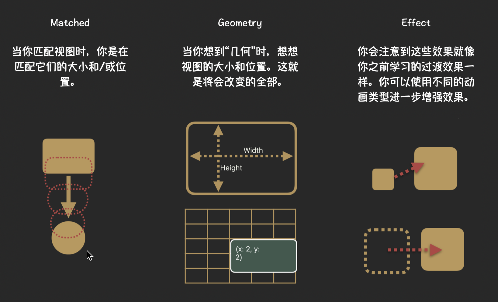

# Synchronizing geometries



## `matchedGeometryEffect(id:in:properties:anchor:isSource:)`

使用你提供的标识符和命名空间定义一组具有同步几何的视图。

```swift
func matchedGeometryEffect<ID>(
    id: ID,
    in namespace: Namespace.ID,
    properties: MatchedGeometryProperties = .frame,
    anchor: UnitPoint = .center,
    isSource: Bool = true
) -> some View where ID : Hashable
```


- `id`：标识符，通常源自视图显示的数据的标识符。
- `namespace`：定义 `id` 的命名空间。通过向视图类型添加 `@Namespace` 变量并在视图的 `body` 方法中读取其值来创建新的命名空间。
- `properties`：要从源视图复制的属性。
- `anchor`：用于生成其共享位置值的视图中的相对位置。
- `isSource`：如果视图应用作组中其他视图的几何源，则为 `true`。

此方法从插入的视图中设置组中每个视图的几何图形，其中 `isSource = true`（称为“源”视图），并更新由 `properties` 标记的值。

如果在与删除具有相同键的另一个视图的同一事务中插入视图，系统将在窗口空间内对它们的框架矩形进行插值，使其看起来好像有一个视图从其旧位置移动到新位置。通常的过渡机制定义了两个视图在过渡期间如何呈现（例如淡入/淡出、缩放等），`matchedGeometryEffect()` 修饰符仅安排视图的几何图形链接，而不是它们的渲染。

如果当前插入组中 `isSource = true` 的视图数量不精确为一个，则结果未定义，因为不清楚哪个是源视图。


```swift
struct MatchedGeometryEffectView: View {
    
    @State private var change: Bool = false
    
    @Namespace var namespace
    
    var body: some View {
        
        VStack {
            
            Spacer()
            if change {
                
                Rectangle()
                    .fill(.green)
                    .overlay {
                        Text("View2")
                    }
                    .matchedGeometryEffect(id: "change", in: namespace)
                    .onTapGesture {
                        change.toggle()
                    }
                
            } else {
                Circle()
                    .fill(.green)
                    .overlay {
                        Text("View1")
                    }
                    .matchedGeometryEffect(id: "change", in: namespace)
                    .frame(width: 100)
                    .onTapGesture {
                        change.toggle()
                    }
            }
        }.font(.title)
            .animation(.linear, value: change)
            
        
    }
}
```
<video src="../../video/MatchedGeometryEffect.mp4" controls="controls"></video>


## `MatchedGeometryProperties`

使用 `View.matchedGeometryEffect()` 函数可以在视图之间同步的一组视图属性。

- `frame`: 位置和大小属性。
- `position`: 视图的位置，在窗口坐标中。
- `size`: 视图的大小，在本地坐标中。

## `GeometryEffect`

一种主要在不改变视图的祖先或后代的情况下改变视图的视觉外观的效果。

```swift
protocol GeometryEffect : Animatable, ViewModifier where Self.Body == Never
```

该效果对视图的祖先和后代所做的唯一更改是更改与它们之间的坐标转换。

- `effectValue(size:)`: 返回效果的当前值。
- `ignoredByLayout()`: 返回一个效果，该效果产生与此效果相同的几何变换，但仅在渲染其视图时应用变换。使用此方法在过渡期间禁用布局更改。视图在执行布局计算时忽略此方法返回的变换。

## `Namespace`

一种动态属性类型，允许访问由包含属性的对象的持久标识定义的命名空间（例如视图）。

```swift
@frozen @propertyWrapper
struct Namespace
```

## `geometryGroup()`

将视图的几何形状（例如位置和大小）与父视图隔离。

默认情况下，SwiftUI 视图将位置和大小更改向下推送到视图层次结构中，以便只有绘制某些内容的视图（称为叶视图）将当前动画应用于其框架矩形。但是在某些情况下，这种合并行为可能会产生不良结果；插入一个几何组可以纠正这种情况。组在父视图和其子视图之间充当屏障，强制父视图解析和动画化位置和大小值，然后将其传递给每个子视图。

下面的示例显示了此函数的一种用途：确保堆叠中每行的成员视图从其祖先视图应用（并作为）单个几何变换，而不是将祖先视图的效果分别应用于每个叶视图。如果 `ItemView` 的成员可能在不同时间添加和删除，则组可确保在应用动画时它们保持锁定在一起。

```swift
VStack {
    ForEach(items) { item in
        ItemView(item: item)
            .geometryGroup()
    }
}
```

返回：一个新视图，其几何形状与父视图的几何形状隔离。