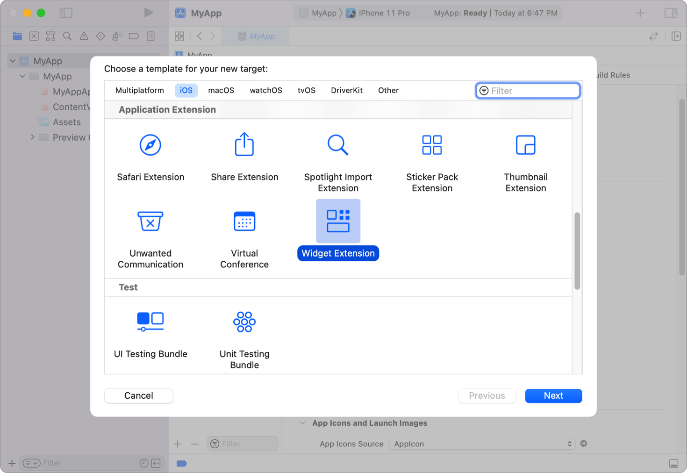

# Creating a widget extension


在不同设备上以便捷、信息丰富的小组件形式展示你的应用内容。

小组件可以显示相关且一目了然的内容，用户能快速访问获取更多详细信息。你的应用程序可以提供多种小组件，让用户能够专注于对他们来说最重要的信息。

开始使用小组件和 `WidgetKit` 的好方法是向你的应用添加一个静态小组件。静态小组件无需用户进行任何配置。例如，一个静态小组件可能显示股市概览，或者用户日历上的下一个事件。小组件显示的数据是动态的，但显示的数据类型是固定的。考虑一下你的应用所呈现的信息，选择一种用户会觉得在他们的设备上一眼就能看到很有用的信息。

小组件可以以多种大小显示数据，从小巧的手表复杂功能或动态岛展示，到超大的 iPad 和 macOS 小组件。下面的例子重点关注单一尺寸的小组件，即小型系统尺寸（ `WidgetFamily.systemSmall` ）。这个示例小组件展示了假设游戏的状态，比如玩家回合或角色的生命值。

当你使用 SwiftUI 构建小组件时，虽然在呈现应用视图方面与常规方式有相似之处，但在开发小组件时有些方面是独特的。但是，并非所有 SwiftUI 视图都适用于小组件。要查看适用于小组件的视图列表，请参阅「[SwiftUI views for widgets](https://developer.apple.com/documentation/widgetkit/swiftui-views)」。

## Add a widget target to your app

在 Xcode 中创建小组件扩展的起始点是通过使用小组件扩展模板。该模板会创建一个包含单个小组件的扩展目标。随后，你可以向同一扩展中添加额外的小组件，以便展示不同类型的信息或支持其他尺寸的小组件。

具体操作步骤如下：

1. 打开你在 Xcode 中的应用项目，然后选择「文件」>「新建」>「目标」。

2. 从「应用扩展」组中，选择「小组件扩展」，然后点击「下一步」。

3. 输入你的扩展名称。

4. 如果已选中的话，请取消勾选「包括实时活动」和「包括配置App意图」复选框。

5. 点击「完成」。 

这样，Xcode 就会为你在项目中创建一个新的小组件扩展，你可以在此基础上编写代码来实现所需功能的小组件。



::: info 提示
实时活动利用 `WidgetKit` 技术，并且在设计与实现方面与你应用中的小组件共享许多相同特性。若你的应用支持实时活动，在添加小组件的同时，请考虑一并实现实时活动功能。关于实时活动的更多信息，请参阅「[Displaying live data with Live Activities](https://developer.apple.com/documentation/ActivityKit/displaying-live-data-with-live-activities)」。
:::


小组件扩展模板提供了符合Widget协议的基本实现。小组件的 `body` 属性决定了小组件所展示的内容类型。静态小组件在其 `body` 属性中使用 `StaticConfiguration`。其他类型的小组件配置包括：

- `AppIntentConfiguration` 允许用户自定义，例如天气小组件需要输入城市邮编或邮政编码，或者包裹跟踪小组件需要输入追踪号码。
- `ActivityConfiguration` 用于展示实时数据，如体育赛事中的比分更新或食物配送预计到达时间等。

欲了解更多关于这些其他小组件配置的信息，请参阅「[Making a configurable widget](https://developer.apple.com/documentation/widgetkit/making-a-configurable-widget)」以及「[Displaying live data with Live Activities](https://developer.apple.com/documentation/ActivityKit/displaying-live-data-with-live-activities)」。


## Add configuration details

为了配置一个静态小组件，你需要提供以下信息：

- `kind`：一个字符串，用于标识小组件。这是由你自行选择的标识符，应具有描述小组件代表内容的功能。
- `provider`：一个遵循 `TimelineProvider` 协议的对象，该对象生成一个时间线，指示 `WidgetKit` 何时渲染小组件。时间线是一个序列，其中包含你自定义的 `TimelineEntry` 类型。该序列中的条目标识了你希望 `WidgetKit` 更新小组件内容的日期，并在自定义类型中包含了小组件视图渲染所需的各种属性。
- `content`：一个闭包，其中包含 SwiftUI 视图。`WidgetKit` 会调用这个闭包来渲染小组件的内容，并将来自 `provider` 的 `TimelineEntry` 参数传递给它。

此外，你还可以使用修饰器来提供更多配置细节，包括显示名称、描述以及小组件支持的家族类型。以下代码展示了一个提供游戏一般状态信息的小组件示例：

```swift
@main
struct GameStatusWidget: Widget {
    var body: some WidgetConfiguration {
        StaticConfiguration(
            kind: "com.mygame.game-status",
            provider: GameStatusProvider(),
        ) { entry in
            GameStatusView(entry.gameStatus)
        }
        .configurationDisplayName("Game Status")
        .description("Shows an overview of your game status")
        .supportedFamilies([.systemSmall])
    }
}
```


小组件的 `provider` 会为小组件生成一个时间线，并在每个条目中包含游戏状态的具体详情。当时间线中每个条目的日期到达时，`WidgetKit` 会调用内容闭包来展示小组件的内容。最后，通过修饰器指定在小组件库中显示的名称和描述，以及小组件所支持的不同尺寸规格。


::: warning 注意

若要使应用的小组件出现在小组件库中，用户必须在安装该应用后至少启动该应用一次。
:::


请注意在这个小组件上使用的 `@main` 属性。这个属性表示 `GameStatusWidget` 是小组件扩展的入口点，意味着该扩展仅包含一个小组件。若要支持多个小组件，请参考 「[`WidgetBundle`](https://developer.apple.com/documentation/SwiftUI/WidgetBundle)」。

## Provide timeline entries

你所定义的时间线提供者会生成一系列时间线条目。每个条目都指定了更新小组件内容的日期和时间，并包含了小组件渲染视图所需的数据。对于游戏状态小组件而言，它可以定义其时间线条目包含代表游戏状态的字符串，如下所示：


```swift
struct GameStatusEntry: TimelineEntry {
    var date: Date
    var gameStatus: String
}

```

`WidgetKit` 通过调用 `getTimeline(in:completion:)` 来从提供者那里请求时间线。该时间线由一个或多个时间线条目以及一个重载策略组成，这个策略用于告知 `WidgetKit` 何时应请求下一条时间线。

下面的例子展示了游戏状态小组件的提供者如何生成一个包含来自服务器当前游戏状态的单一时间线条目，以及一个在 $15$ 分钟后请求新时间线的重载策略：

```swift
struct GameStatusProvider: TimelineProvider {
    func getTimeline(in context: Context, completion: @escaping (Timeline<GameStatusEntry>) -> Void) {
        // Create a timeline entry for "now."
        let date = Date()
        let entry = GameStatusEntry(
            date: date,
            gameStatus: gameStatusFromServer
        )

        // Create a date that's 15 minutes in the future.
        let nextUpdateDate = Calendar.current.date(byAdding: .minute, value: 15, to: date)!

        // Create the timeline with the entry and a reload policy with the date
        // for the next update.
        let timeline = Timeline(
            entries:[entry],
            policy: .after(nextUpdateDate)
        )

        // Call the completion to pass the timeline to WidgetKit.
        completion(timeline)
    }
}

```

在这个示例中，如果小组件还未获取到服务器上的当前状态，它可以存储对完成处理程序的引用，执行异步请求以从服务器获取游戏状态，并在网络请求完成后调用该完成处理程序。

关于生成时间线的更多信息，请参阅「[Keeping a widget up to date](https://developer.apple.com/documentation/widgetkit/keeping-a-widget-up-to-date)」。有关处理网络请求的更多信息，请参阅「[Making network requests in a widget extension](https://developer.apple.com/documentation/widgetkit/making-network-requests-in-a-widget-extension)」。

## Generate a preview for the widget gallery

为了让人们能够使用你的小组件，它需要在小组件库中可用。为了在小组件库中展示你的小组件，`WidgetKit` 会向提供者请求一个预览快照来显示通用数据。`WidgetKit` 通过调用提供者的 `getSnapshot(in:completion:)` 方法并设置上下文参数 `isPreview` 属性为 `true` 来进行这一请求。

作为响应，你需要快速创建预览快照。如果小组件通常需要花费较长时间生成或从服务器获取的资源或信息，这时应使用示例数据替代。

在以下代码中，游戏状态小组件的提供者实现了 `snapshot` 方法，当游戏状态可用时会显示状态信息，如果尚未从服务器获取到状态，则回退为空状态：

```swift
struct GameStatusProvider: TimelineProvider {
    var hasFetchedGameStatus: Bool
    var gameStatusFromServer: String


    func getSnapshot(in context: Context, completion: @escaping (Entry) -> Void) {
        let date = Date()
        let entry: GameStatusEntry

        if context.isPreview && !hasFetchedGameStatus {
            entry = GameStatusEntry(date: date, gameStatus: "—")
        } else {
            entry = GameStatusEntry(date: date, gameStatus: gameStatusFromServer)
        }
        completion(entry)
    }
}
```

## Display content in your widget


小组件使用 SwiftUI 视图来定义其内容，通常通过组合其他 SwiftUI 视图来完成。如「添加配置详情」部分所示，小组件的配置包含了 `WidgetKit` 调用来渲染小组件内容的闭包。

当用户从小组件库中添加你的小组件时，他们将从你小组件所支持的类型（例如小型或中型）中做出选择。小组件的内容闭包必须能够为该小组件所支持的所有类型进行渲染。`WidgetKit` 会在 SwiftUI 环境内设置相应的类型（家族样式）以及附加属性，比如颜色方案（浅色或深色）等。

在上述游戏状态小组件的配置中，内容闭包使用了 `GameStatusView` 来展示游戏状态。由于此小组件仅支持 `.systemSmall` 类型，因此它使用了一个组合的 `GameTurnSummary` SwiftUI 视图来显示游戏当前状态的摘要信息。对于任何其他尺寸的家族样式，它则显示默认视图，表明游戏状态不可用。

```swift
truct GameStatusView : View {
    @Environment(\.widgetFamily) var family: WidgetFamily
    var gameStatus: GameStatus
    var selectedCharacter: CharacterDetail

    @ViewBuilder
    var body: some View {
        switch family {
        case .systemSmall: GameTurnSummary(gameStatus)
        default: GameDetailsNotAvailable()
        }
    }
}
```

在你的小组件中，随着你为小组件配置添加更多支持的家族样式，你需要在小组件视图的 `body` 属性中为每种新增的家族样式添加相应的额外情况处理。

::: info

该视图使用 `@ViewBuilder` 声明其 `body` 属性，因为其所使用的视图类型是可变的。
:::

## Display a placeholder widget

占位符视图类似于预览快照，但与显示示例数据以便让人们看到小组件所展示的数据类型不同，它显示的是一个无特定内容的通用视觉表示形式。当 `WidgetKit` 渲染你的小组件时，可能需要将其内容以占位符形式呈现，例如，在后台加载数据期间，或者当你告知系统小组件包含敏感信息时。

## Hide sensitive content


小组件和手表复杂功能可能会显示敏感信息，并且具有高度可见性，特别是在配备始终开启显示功能的设备上。当你创建小组件或手表复杂功能时，应审查其内容并考虑隐藏敏感信息。

为了让用户决定小组件是否应在锁定设备上显示敏感数据，你可以使用 `privacySensitive(_:)` 修饰符标记包含敏感信息的视图。在 iOS 中，用户可以在「设置」>「面容ID与密码」下的「锁定屏幕时允许访问」部分配置小组件是否在锁定屏幕上以及始终开启状态下显示敏感数据。在 Apple Watch 上，用户可以通过选择「设置」>「显示与亮度」>「始终开启」>「隐藏敏感复杂功能」，配置始终开启状态下是否显示敏感数据。他们可以选择为所有或单个复杂功能显示经过编辑的内容。

如果用户选择隐藏隐私敏感内容，`WidgetKit` 会根据你配置的占位符或编辑内容进行渲染。要配置编辑内容，请实现 `redacted(reason:)` 回调函数，读取 `privacy` 属性，并提供自定义占位符视图。你也可以通过使用 `unredacted()` 视图修饰符选择将视图作为未编辑内容进行渲染。

作为一种替代方案，如果你的小组件内容整体上都包含隐私敏感信息，可以向小组件扩展程序添加数据保护功能。在用户解锁设备以匹配你选择的隐私级别之前，`WidgetKit` 将显示占位符而非小组件内容。首先，在 Xcode 中为你的小组件扩展程序启用数据保护功能，然后将数据保护权限 `Entitlement` 设置为你希望提供的隐私级别对应的值：

- `NSFileProtectionComplete`：当设备被锁定时，`WidgetKit` 会隐藏小组件内容。此外，iOS 小组件不会在 Mac 上作为 iPhone 小组件可用。
- `NSFileProtectionCompleteUnlessOpen`：当设备被密码锁定时，`WidgetKit` 会隐藏小组件内容。此外，iOS 小组件不会在 Mac 上作为 iPhone 小组件可用。

如果你为小组件扩展程序选择 `NSFileProtectionCompleteUntilFirstUserAuthentication` 或 `NSFileProtectionNone` 保护级别：

- `WidgetKit` 将采用默认行为，在用户重启设备后首次验证身份前，显示占位符。
- iOS 小组件可在 Mac上 作为 iPhone 小组件使用。


## Add dynamic content to your widget

小组件通常仅展示只读信息，一般不支持滚动列表或文本输入等交互元素。但从 iOS 17 和 macOS 14 开始，小组件开始支持一些交互元素和动画效果。有关如何向小组件添加交互性的详细信息，请参阅「[Adding interactivity to widgets and Live Activities](https://developer.apple.com/documentation/widgetkit/adding-interactivity-to-widgets-and-live-activities)」。

欲了解 `WidgetKit` 支持的一系列视图，请参阅「[SwiftUI views for widgets](https://developer.apple.com/documentation/widgetkit/swiftui-views)」。当 `WidgetKit` 渲染小组件内容时，会忽略其他视图。

尽管小组件的显示基于视图的快照，但你仍然可以使用各种 SwiftUI 视图，即使在小组件可见时它们也能持续更新。有关提供动态内容的更多信息，请参阅「[Keeping a widget up to date.](https://developer.apple.com/documentation/widgetkit/keeping-a-widget-up-to-date)」。

## Respond to user interactions


当用户与你的小组件进行交互，除了上述所述的交互元素之外，系统会启动你的应用程序来处理请求。一旦系统激活你的应用，应该导航至与小组件内容相对应的详细信息页面。你的小组件可以指定一个 `URL`，以便告知应用程序应当显示什么内容。

要在小组件中配置自定义 `URL`，请按照以下步骤操作：

对于所有类型的小组件，在你小组件视图层级中的任意视图上添加 `widgetURL(_:)` 视图修饰器。如果小组件视图层级中包含多个 `widgetURL` 修饰器，其行为将是未定义的。

对于使用 `WidgetFamily.systemMedium`、`WidgetFamily.systemLarge` 或 `WidgetFamily.systemExtraLarge` 类型的小组件，在小组件的视图层级中添加一个或多个 `Link` 控件。你可以同时使用 `widgetURL` 视图修饰器和 `Link` 控件。如果交互作用针对的是`Link`控件，则系统会使用该控件内的URL。而在小组件其余任何位置的交互作用中，系统则会使用 `widgetURL` 视图修饰器所指定的 `URL`。

若要了解更多关于如何从小组件链接至你的应用程序的具体场景，请参阅「[Linking to specific app scenes from your widget or Live Activity](https://developer.apple.com/documentation/widgetkit/linking-to-specific-app-scenes-from-your-widget-or-live-activity)」。


## Preview widgets in Xcode

Xcode 允许你在不需在模拟器或测试设备上运行应用的情况下查看你的小组件预览。

以下示例展示了来自「[Building Widgets Using WidgetKit and SwiftUI](https://developer.apple.com/documentation/widgetkit/building_widgets_using_widgetkit_and_swiftui)」示例代码项目的 `Emoji Rangers` 小组件的预览代码。请注意，它如何利用 `widgetFamily` 环境值来避免手动为每个小组件指定名称。

```swift
@Environment(\.widgetFamily) var family
        
Group {
    EmojiRangerWidgetEntryView(entry: SimpleEntry(date: Date(), relevance: nil, character: .panda))
        .previewContext(WidgetPreviewContext(family: .systemSmall))
        .previewDisplayName("\(family)")
}
```

随着你在小组件中支持更多类型的 `widget` 家族（如 `WidgetFamily.systemSmall`、`WidgetFamily.systemMedium` 等），你可以添加更多的预览视图，以便在一个预览界面中查看多种尺寸的表现形式。


## Expand your widget’s capabilities

为了给用户提供灵活访问你应用内容的方式，你可以支持额外的 `widget` 家族，添加更多类型的 `widget`，使你的小组件可由用户自定义配置，或者如果你的应用展示实时数据，还可以添加对 `Live Activities` 的支持。为了探索支持附加功能的计划，请参考「[Developing a WidgetKit strategy](https://developer.apple.com/documentation/widgetkit/developing-a-widgetkit-strategy)」。

首次接触 `WidgetKit` 代码时，可以参考以下示例代码项目：

- [Building Widgets Using WidgetKit and SwiftUI](https://developer.apple.com/documentation/widgetkit/building_widgets_using_widgetkit_and_swiftui)：这是与 WWDC20 代码实践环节相关的示例代码项目，在此学习如何构建你的第一个小组件：

    - [Widgets Code-along, part 1: The adventure begins](https://developer.apple.com/videos/play/wwdc2020/10034/)
    - [Widgets Code-along, part 2: Alternate timelines](https://developer.apple.com/videos/play/wwdc2020/10035/)
    - [Widgets Code-along, part 3: Advancing timelines](https://developer.apple.com/videos/play/wwdc2020/10036/)

- [Emoji Rangers: Supporting Live Activities, interactivity, and animations](https://developer.apple.com/documentation/widgetkit/emoji-rangers-supporting-live-activities-interactivity-and-animations)：支持 `Live Activities` 、交互性和动画：这个项目是在 `Emoji Rangers` 示例代码项目基础上拓展的，包含了锁屏小组件、`Live Activities`、交互性和动画等功能。

- [Fruta: Building a Feature-Rich App with SwiftUI](https://developer.apple.com/documentation/swiftui/fruta_building_a_feature-rich_app_with_swiftui) 和 [Backyard Birds: Building an app with SwiftData and widgets](https://developer.apple.com/documentation/SwiftUI/Backyard-birds-sample)：使用 `SwiftData` 和小组件构建应用的两个示例代码项目，除了支持小组件外，还支持 `App Clips` 等其他技术。


## Create multiple widget extensions

在你的小组件扩展程序中，你可以包含多种类型的小组件，尽管你的应用程序中可以包含多个扩展程序。例如，如果你的一些小组件使用位置信息，而其他小组件则不使用，那么请将使用位置信息的小组件放在单独的扩展中。这样，系统就能仅针对使用位置信息的小组件所在的扩展程序向用户请求位置信息授权。有关如何在一个扩展中打包多个小组件的详细信息，请参阅 [WidgetBundle](https://developer.apple.com/documentation/SwiftUI/WidgetBundle)。