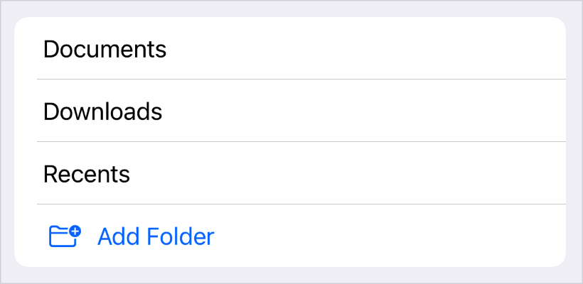
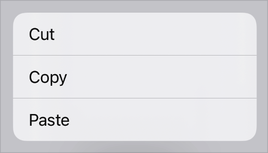
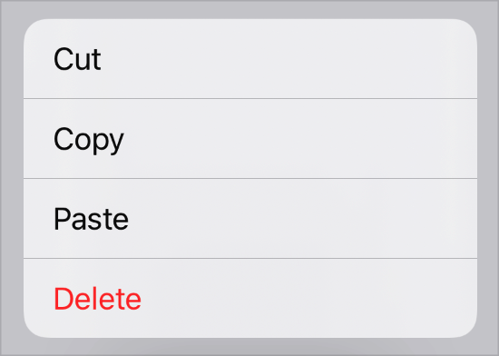
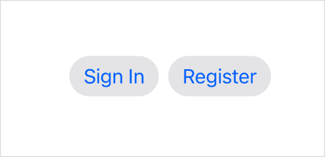

# 创建按钮

## `Button`

启动操作的控件。

```swift
struct Button<Label> where Label : View
```

你可以通过提供操作和标签来创建按钮。操作是一个方法或闭包属性，当用户点击或点击按钮时会执行一些操作。标签是一个描述按钮操作的视图，例如，通过显示文本、图标或两者兼而有之。

按钮的标签可以是任何类型的视图，例如仅用于文本标签的 `Text` 视图：


```swift
Button(action: signIn) {
    Text("Sign In")
}
```

或者 `Label` 视图，用于同时具有标题和图标的按钮：

```swift
Button(action: signIn) {
    Label("Sign In", systemImage: "arrow.up")
}
```

对于那些常见情况，你还可以使用便利初始化器，它们将标题字符串或 `LocalizedStringKey` 作为第一个参数，并可选地将系统图像名称或 `ImageResource` 作为第二个参数，而不是尾随闭包：

```swift
Button("Sign In", systemImage: "arrow.up", action: signIn)
```

在同时提供标题和图标时，更喜欢使用这些便利初始化器或 `Label` 视图。这允许按钮动态调整其外观，以在工具栏和菜单等容器中正确呈现其标题和图标。例如，在 iOS 上，按钮默认情况下仅在放置在工具栏中时显示其图标，但在菜单中同时显示前置标题和后置图标。以这种方式定义标签也有助于提高可访问性——例如，将带有 `iconOnly` 样式的 `labelStyle(_:)` 修饰符应用于按钮将导致它仅在视觉上显示其图标，但在 VoiceOver 等辅助功能模式下仍使用其标题来描述按钮：


```swift
Button("Sign In", systemImage: "arrow.up", action: signIn)
.labelStyle(.iconOnly)
```

避免使用仅使用图像或完全没有辅助功能标签的纯视觉组件的标签。

用户激活按钮的方式因平台而异：

- 在 iOS 和 watchOS 中，用户点击按钮。
- 在 macOS 中，用户点击按钮。
- 在 tvOS 中，用户在聚焦于按钮时按下外部遥控器（如 Siri 遥控器）上的“选择”。

按钮的外观取决于多种因素，例如你放置它的位置、是否为其分配角色以及如何设置样式。

### 将按钮添加到容器中

使用按钮作为启动操作的任何用户界面元素。按钮会自动调整其视觉样式，以匹配这些不同容器和上下文中的预期样式。例如，要创建一个在用户选择时启动操作的列表单元格，请将按钮添加到列表的内容中：

```swift
List {
    // Cells that show all the current folders.
    ForEach(folders) { folder in
        Text(folder.title)
    }


    // A cell that, when selected, adds a new folder.
    Button(action: addItem) {
        Label("Add Folder", systemImage: "folder.badge.plus")
    }
}
```



同样，要创建一个启动操作的上下文菜单项，请将按钮添加到 `contextMenu(_:)` 修饰符的内容闭包中：

```swift
.contextMenu {
    Button("Cut", action: cut)
    Button("Copy", action: copy)
    Button("Paste", action: paste)
}
```



这种模式扩展到了 SwiftUI 中的大多数其他具有可定制的交互式内容的容器视图，如 `Form` 实例。

### 分配角色

你可以选择使用 `ButtonRole` 初始化按钮，以描述按钮的用途。例如，你可以为删除操作创建一个破坏性按钮：

```swift
 Button("Delete", role: .destructive, action: delete)
```

系统会在每个上下文中使用按钮的角色来适当地设置按钮的样式。例如，上下文菜单中的破坏性按钮会显示为红色前景色：



如果你没有为按钮指定角色，系统会应用适当的默认外观。

### 设置按钮样式

你可以使用标准按钮样式之一（如 `bordered`）自定义按钮的外观，并使用 `buttonStyle(_:)` 修饰符应用样式：


```swift
HStack {
    Button("Sign In", action: signIn)
    Button("Register", action: register)
}
.buttonStyle(.bordered)
```

如果你将样式应用于容器视图，如上面的示例所示，则容器中的所有按钮都将使用该样式：



你还可以创建自定义样式。要使用标准交互行为添加自定义外观，请创建符合 `ButtonStyle` 协议的样式。要自定义外观和交互行为，请创建符合 `PrimitiveButtonStyle` 协议的样式。自定义样式还可以读取按钮的角色并使用它来调整按钮的外观。


## 从配置创建按钮

根据具有自定义外观和自定义交互行为的样式的配置创建按钮。

```swift
init(_ configuration: PrimitiveButtonStyleConfiguration)
```

在 `PrimitiveButtonStyle` 的 `makeBody(configuration:)` 方法中使用此初始化器创建要设置样式的按钮实例。这对于修改当前按钮样式而不是实现全新样式的自定义按钮样式很有用。

例如，以下样式在按钮周围添加了红色边框，但除此之外保留了按钮的当前样式：

```swift
struct RedBorderedButtonStyle: PrimitiveButtonStyle {
    func makeBody(configuration: Configuration) -> some View {
        Button(configuration)
            .border(Color.red)
    }
}
```

## `buttonStyle(_:)`

将此视图内的按钮样式设置为具有自定义外观和标准交互行为的按钮样式。

- `automatic`: 基于按钮上下文的默认按钮样式。
- `accessoryBar`: 一种按钮样式，通常用于辅助工具栏（有时称为“范围栏”）的上下文中，用于缩小搜索或其他操作的焦点的按钮。
- `accessoryBarAction`: 一种按钮样式，用于在辅助工具栏中执行额外的操作。
- `bordered`: 一种基于按钮上下文应用标准边框图形的按钮样式。
- `borderedProminent`: 一种基于按钮上下文应用标准边框突出显示图形的按钮样式。
- `borderless`: 一种不应用边框的按钮样式。
- `card`: 一种不填充内容的按钮样式，并在按钮获得焦点时应用运动效果。
- `link`: 一种用于模拟链接的按钮样式。
- `plain`: 一种在空闲时不对其内容进行样式设置或修饰，但可能应用视觉效果来指示按钮的按下、聚焦或启用状态的按钮样式。

## `buttonBorderShape(_:)`

设置此视图中按钮的边框形状。

```swift
func buttonBorderShape(_ shape: ButtonBorderShape) -> some View
```

边框形状用于绘制带边框按钮的盘片。在 macOS 上，指定的边框形状仅应用于小部件中的带边框按钮。

- `automatic`: 一种形状，它委托系统根据给定的上下文和平台确定适当的形状。
- `capsule`: 胶囊形状。
- `circle`: 圆形。
- `roundedRectangle`: 圆角矩形形状。

## `buttonRepeatBehavior(_:)`

设置此视图中的按钮是否应在长时间交互时重复触发其操作。

```swift
func buttonRepeatBehavior(_ behavior: ButtonRepeatBehavior) -> some View
```

- `behavior`: `behavior` 的值为 `enabled` 表示按钮应启用重复行为，值为 `disabled` 表示按钮应禁止重复行为。

将此应用于递增或递减值或执行其他固有迭代操作的按钮。诸如按下并按住按钮、按住按钮的键盘快捷键或在按钮聚焦时按住空格键等交互将触发此重复行为。

```swift
Button {
    playbackSpeed.advance(by: 1)
} label: {
    Label("Speed up", systemImage: "hare")
}
.buttonRepeatBehavior(.enabled)

```

这会影响所有系统按钮样式，并自动影响符合 `ButtonStyle` 的自定义类型。这不会自动应用于符合 `PrimitiveButtonStyle` 的自定义类型，并且应使用 `EnvironmentValues.buttonRepeatBehavior` 值来适当地调整其自定义手势。