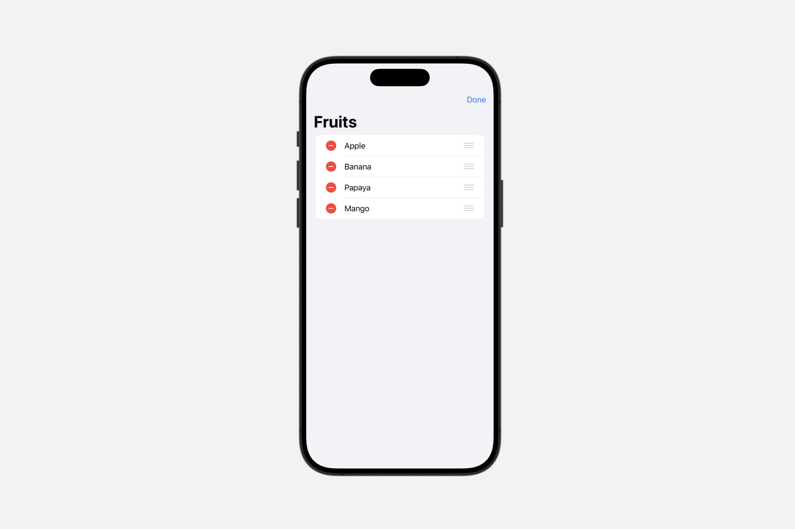
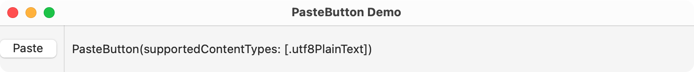

# 创建专用按钮

## `EditButton`

一个切换编辑模式环境值的按钮。

```swift
struct EditButton
```

编辑按钮切换支持编辑模式的容器内内容的环境的 `editMode` 值。在下面的示例中，放置在 `NavigationView` 中的编辑按钮支持编辑 `List`：

```swift
@State private var fruits = [
    "Apple",
    "Banana",
    "Papaya",
    "Mango"
]


var body: some View {
    NavigationView {
        List {
            ForEach(fruits, id: \.self) { fruit in
                Text(fruit)
            }
            .onDelete { fruits.remove(atOffsets: $0) }
            .onMove { fruits.move(fromOffsets: $0, toOffset: $1) }
        }
        .navigationTitle("Fruits")
        .toolbar {
            EditButton()
        }
    }
}
```

因为上面示例中的 `ForEach` 为 `onDelete(perform:)` 和 `onMove(perform:)` 定义了行为，所以当用户点击“编辑”时，可编辑列表会显示删除和移动用户界面。请注意，在编辑模式处于活动状态时，“编辑”按钮会显示“完成”标题：



你还可以创建对编辑模式状态的变化做出反应的自定义视图，如 `EditMode` 中所述。

## `PasteButton`

一个系统按钮，从粘贴板读取项目并将其传递给一个闭包。

```swift
@MainActor
struct PasteButton
```

当你想提供一个按钮，用于将项目从系统粘贴板粘贴到你的应用程序中时，使用粘贴按钮。系统会提供适合当前环境的按钮外观和标签。但是，你可以在某些上下文中使用视图修饰符，如 `buttonBorderShape(_:)`、`labelStyle(_:)` 和 `tint(_:)` 来自定义按钮。

你声明你的应用程序将接受什么类型的项目；使用符合 `Transferable` 协议的类型。当用户点击或单击按钮时，你的闭包会以指定的类型接收粘贴板项目。

在下面的示例中，粘贴按钮声明它接受一个字符串。当用户点击或单击按钮时，示例的闭包会接收一个字符串数组，并将第一个字符串设置为 `pastedText` 的值，这会更新附近的 `Text` 视图。

```swift
@State private var pastedText: String = ""


var body: some View {
    HStack {
        PasteButton(payloadType: String.self) { strings in
            pastedText = strings[0]
        }
        Divider()
        Text(pastedText)
        Spacer()
    }
}
```



粘贴按钮会根据 iOS 上粘贴板的变化自动验证和失效，但在 macOS 上不会。

## `RenameButton`

一个触发标准重命名操作的按钮。

```swift
struct RenameButton<Label> where Label : View
```

重命名按钮从环境中接收其操作。使用 `renameAction(_:)` 修饰符设置操作。如果你没有定义操作，系统将禁用该按钮。

```swift
struct RowView: View {
    @State private var text = ""
    @FocusState private var isFocused: Bool


    var body: some View {
        TextField(text: $text) {
            Text("Prompt")
        }
        .focused($isFocused)
        .contextMenu {
            RenameButton()
            // ... your own custom actions
        }
        .renameAction { $isFocused = true }
    }
}
```

当有人在上下文菜单中点击重命名按钮时，重命名操作通过将 `isFocused` 属性设置为 `true` 来聚焦文本字段。

你可以在导航标题菜单中使用此按钮，导航标题修饰符会自动使用适当的重命名操作配置环境。


```swift
ContentView()
    .navigationTitle($contentTitle) {
        // ... your own custom actions
        RenameButton()
    }
```