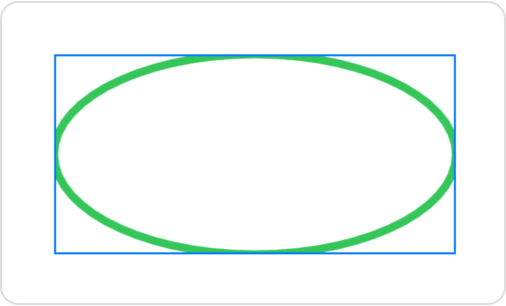
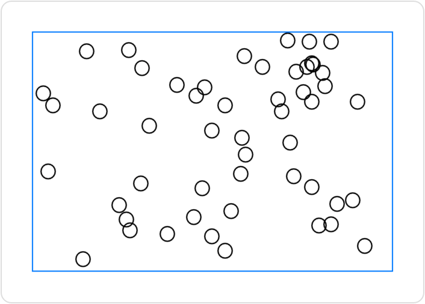
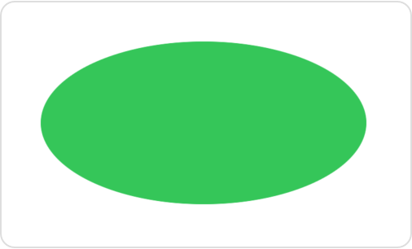
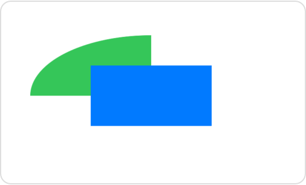

# 即时模式绘图

## `Canvas`

支持即时模式绘图的视图类型。

```swift
struct Canvas<Symbols> where Symbols : View
```

使用画布在 SwiftUI 视图内绘制丰富而动态的 2D 图形。画布将 `GraphicsContext` 传递给闭包，你可以使用该闭包执行即时模式绘图操作。画布还传递了一个 `CGSize` 值，你可以使用该值来自定义绘制内容。例如，你可以使用上下文的 `stroke(_:with:lineWidth:)` 命令来绘制 `Path` 实例：


```swift
Canvas { context, size in
    context.stroke(
        Path(ellipseIn: CGRect(origin: .zero, size: size)),
        with: .color(.green),
        lineWidth: 4)
}
.frame(width: 300, height: 200)
.border(Color.blue)
```

上面的示例绘制了一个椭圆的轮廓，该椭圆恰好内接一个带有蓝色边框的画布：




除了轮廓和填充路径，你还可以绘制图像、文本和完整的 SwiftUI 视图。要绘制视图，请使用 `init(opaque:colorMode:rendersAsynchronously:renderer:symbols:)` 方法提供可以在渲染器内部引用的视图。你还可以添加蒙版、应用滤镜、执行变换、控制混合等。有关如何绘制的信息，请参阅 `GraphicsContext`。

画布不提供单个元素的交互性或可访问性，包括你作为符号传递的视图。但是，对于涉及动态数据的复杂绘图，它可能会提供更好的性能。使用画布来提高主要不涉及文本或不需要交互元素的绘图的性能。


### `init(opaque:colorMode:rendersAsynchronously:renderer:)`

```swift
init(
    opaque: Bool = false,
    colorMode: ColorRenderingMode = .nonLinear,
    rendersAsynchronously: Bool = false,
    renderer: @escaping (inout GraphicsContext, CGSize) -> Void
)
```

- `opaque`：一个布尔值，表示画布是否完全不透明。将此值设置为 `true` 可能会提高性能，但随后在上下文中绘制不透明图像会产生不确定的结果。默认值为 `false`。
- `colorMode`：画布的工作颜色空间和存储格式。默认值为 `ColorRenderingMode.nonLinear`。
- `rendersAsynchronously`：一个布尔值，表示画布是否可以异步将其内容呈现给其父视图。默认值为 `false`。
- `renderer`：一个闭包，你可以在其中进行即时模式绘图。闭包接受两个输入：一个用于发出绘图命令的上下文和一个表示画布当前大小的大小，你可以使用该大小来自定义内容。画布在需要重绘内容时随时调用渲染器。

### `init(opaque:colorMode:rendersAsynchronously:renderer:symbols:)`


```swift
init(
    opaque: Bool = false,
    colorMode: ColorRenderingMode = .nonLinear,
    rendersAsynchronously: Bool = false,
    renderer: @escaping (inout GraphicsContext, CGSize) -> Void,
    @ViewBuilder symbols: () -> Symbols
)
```

- `symbols`：一个 `ViewBuilder`，你可以使用它向画布提供 SwiftUI 视图，以便在绘图期间使用。使用 `tag(_:)` 修饰符为每个视图添加唯一标记，以便你可以在渲染器中使用 `resolveSymbol(id:)` 方法找到它们。

此初始化器的行为与 `init(opaque:colorMode:rendersAsynchronously:renderer:)` 初始化器类似，不同之处在于你还为渲染器提供了一组 SwiftUI 视图作为绘图元素。

SwiftUI 存储了你在 `symbols` 视图构建器中指定的每个子视图的渲染版本，并将这些版本提供给画布。为每个子视图添加标记，以便你可以在渲染器中使用 `resolveSymbol(id:)` 方法检索它。例如，你可以使用传入的子视图作为每个数据点的标记来创建散点图：


```swift
struct ScatterPlotView<Mark: View>: View {
    let rects: [CGRect]
    let mark: Mark


    enum SymbolID: Int {
        case mark
    }


    var body: some View {
        Canvas { context, size in
            if let mark = context.resolveSymbol(id: SymbolID.mark) {
                for rect in rects {
                    context.draw(mark, in: rect)
                }
            }
        } symbols: {
            mark.tag(SymbolID.mark)
        }
        .frame(width: 300, height: 200)
        .border(Color.blue)
    }
}
```

你可以使用任何 SwiftUI 视图作为标记输入：

```swift
ScatterPlotView(rects: rects, mark: Image(systemName: "circle"))
```

如果 `rects` 输入包含 $50$ 个随机排列的 `CGRect` 实例，SwiftUI 将绘制如下所示的图：



与你绘制到画布上的所有其他元素一样，符号输入缺乏单独的可访问性和交互性，即使原始的 SwiftUI 视图具有这些属性。但是，你可以将可访问性和交互性修饰符添加到整个画布上。

## `GraphicsContext`

即时模式绘图目标及其当前状态。

```swift
@frozen
struct GraphicsContext
```

使用上下文执行 2D 绘图基元。例如，你可以在 `Canvas` 视图内使用 `fill(_:with:style:)` 方法绘制填充形状：

```swift
Canvas { context, size in
    context.fill(
        Path(ellipseIn: CGRect(origin: .zero, size: size)),
        with: .color(.green))
}
.frame(width: 300, height: 200)
```

上面的示例绘制了一个刚好适合在宽度限制为 300 点、高度限制为 200 点的画布内的椭圆：



除了勾勒或填充路径，你还可以绘制图像、文本和 SwiftUI 视图。你还可以使用上下文执行许多常见的图形操作，例如添加蒙版、应用滤镜和变换以及设置混合模式。例如，你可以使用 `clip(to:style:options:)` 方法添加蒙版：

```swift
let halfSize = size.applying(CGAffineTransform(scaleX: 0.5, y: 0.5))
context.clip(to: Path(CGRect(origin: .zero, size: halfSize)))
context.fill(
    Path(ellipseIn: CGRect(origin: .zero, size: size)),
    with: .color(.green))

```

矩形蒙版隐藏了椭圆的所有部分，只留下一个象限：


操作顺序很重要。你对上下文状态所做的更改，例如添加蒙版或滤镜，将应用于后续的绘图操作。如果你在上面的示例中颠倒填充和剪辑操作的顺序，使填充先进行，蒙版将不会影响椭圆。

每个上下文都引用透明度层树中的特定层，并且还包含绘图状态的完整副本。你可以修改一个上下文的状态，而不会影响任何其他上下文的状态，即使它们引用的是同一层。例如，你可以将前面示例中的蒙版椭圆绘制到主上下文的副本中，然后在主上下文添加一个矩形：

```swift
// Create a copy of the context to draw a clipped ellipse.
var maskedContext = context
let halfSize = size.applying(CGAffineTransform(scaleX: 0.5, y: 0.5))
maskedContext.clip(to: Path(CGRect(origin: .zero, size: halfSize)))
maskedContext.fill(
    Path(ellipseIn: CGRect(origin: .zero, size: size)),
    with: .color(.green))


// Go back to the original context to draw the rectangle.
let origin = CGPoint(x: size.width / 4, y: size.height / 4)
context.fill(
    Path(CGRect(origin: origin, size: halfSize)),
    with: .color(.blue))
```

蒙版不会剪辑矩形，因为蒙版不是主上下文的一部分。然而，两个上下文都绘制到同一个视图中，因为你创建了一个上下文作为另一个的副本：



上下文可以访问一个名为 `environment` 的 `EnvironmentValues` 实例，该实例最初是从其封闭视图的环境中复制的。SwiftUI 使用环境值（如显示分辨率和颜色方案）来解析出现在上下文中的类型，如 `Image` 和 `Color`。你也可以出于自己的目的访问存储在环境中的值。