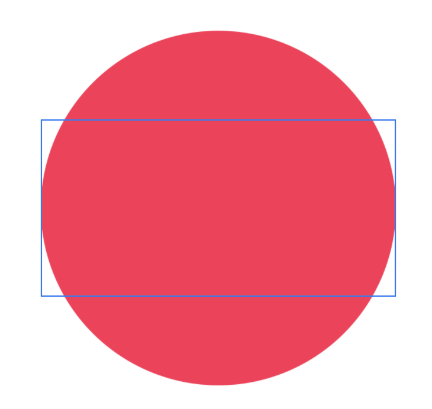
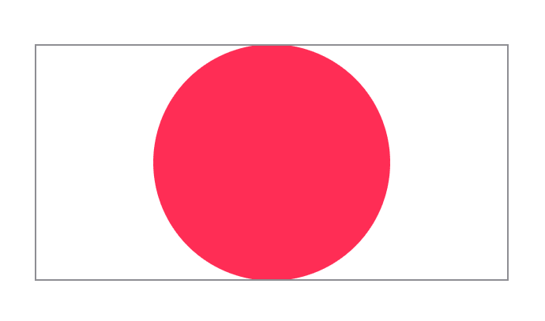
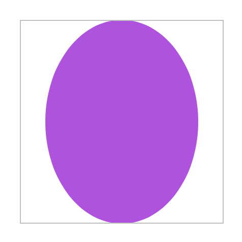
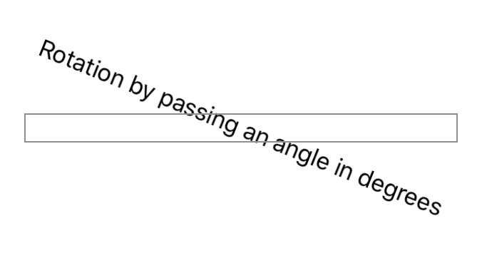
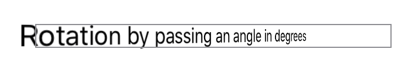
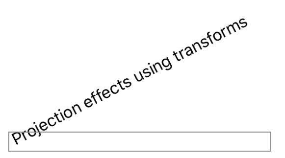

# 缩放、旋转或变换视图

## `scaledToFill()`

缩放此视图以填充其父视图。

```swift
func scaledToFill() -> some View
```

使用 `scaledToFill()` 来缩放此视图以填充其父视图，同时在视图缩放时保持视图的纵横比：


```swift
Circle()
    .fill(Color.pink)
    .scaledToFill()
    .frame(width: 300, height: 150)
    .border(Color(white: 0.75))
```



此方法等同于调用 `aspectRatio(_:contentMode:)`，其中 `aspectRatio` 为 `nil`，`contentMode` 为 `ContentMode.fill`。


## `scaledToFit()`

缩放此视图以适应其父视图。

```swift
func scaledToFit() -> some View
```

使用 `scaledToFit()` 来缩放此视图以适应其父视图，同时在视图缩放时保持视图的纵横比。

```swift
Circle()
    .fill(Color.pink)
    .scaledToFit()
    .frame(width: 300, height: 150)
    .border(Color(white: 0.75))

```



此方法等同于调用 `aspectRatio(_:contentMode:)`，其中 `aspectRatio` 为 `nil`，`contentMode` 为 `ContentMode.fit`。


## `scaleEffect(_:anchor:)`

相对于锚点，在水平和垂直方向上按给定的量缩放此视图的渲染输出。

```swift
func scaleEffect(
    _ s: CGFloat,
    anchor: UnitPoint = .center
) -> some View
```

- `s`: 在水平和垂直方向上缩放视图的量。
- `anchor`: 锚点，默认为 `center`，表示缩放操作的起始位置。

使用 `scaleEffect(_:anchor:)` 对视图应用水平和垂直缩放变换。


```swift
Image(systemName: "envelope.badge.fill")
    .resizable()
    .frame(width: 100, height: 100, alignment: .center)
    .foregroundColor(Color.red)
    .scaleEffect(2, anchor: .leading)
    .border(Color.gray)
```


## `aspectRatio(_:contentMode:)`

将此视图的尺寸约束到指定的纵横比。

```swift
func aspectRatio(
    _ aspectRatio: CGFloat? = nil,
    contentMode: ContentMode
) -> some View
```

- `aspectRatio`: 用于结果视图的宽度与高度的比率。使用 `nil` 可在结果视图中保持当前纵横比。
- `contentMode`: 一个标志，指示此视图是适合还是填充父上下文。

使用 `aspectRatio(_:contentMode:)` 可以使用指定的内容模式将视图的尺寸约束到由 `CGFloat` 指定的纵横比。

如果此视图可调整大小，则结果视图将具有 `aspectRatio` 作为其纵横比。在此示例中，紫色椭圆的宽高比为 3:4，并缩放以适应其框架：

```swift
Ellipse()
    .fill(Color.purple)
    .aspectRatio(0.75, contentMode: .fit)
    .frame(width: 200, height: 200)
    .border(Color(white: 0.75))
```




## `rotationEffect(_:anchor:)`

围绕指定点在二维中旋转视图的渲染输出。


```swift
func rotationEffect(
    _ angle: Angle,
    anchor: UnitPoint = .center
) -> some View
```

- `angle`: 旋转视图的角度。
- `anchor`: 视图内要执行旋转的单位点。默认值为 `center`。

此修饰符围绕指向 $xy$ 平面外的轴旋转视图的内容。它对视图的框架没有影响。以下代码将文本旋转 22˚，然后在修改后的视图周围绘制边框，以显示框架不受旋转修饰符的影响：

```swift
Text("Rotation by passing an angle in degrees")
    .rotationEffect(.degrees(22))
    .border(Color.gray)

```



## `rotation3DEffect(_:axis:anchor:anchorZ:perspective:)`

渲染视图的内容，就好像它围绕指定的轴在三维中旋转一样。


```swift
func rotation3DEffect(
    _ angle: Angle,
    axis: (x: CGFloat, y: CGFloat, z: CGFloat),
    anchor: UnitPoint = .center,
    anchorZ: CGFloat = 0,
    perspective: CGFloat = 1
) -> some View
```

- `angle`: 旋转视图内容的角度。
- `axis`: 旋转轴，指定为具有三个空间维度的每个元素的命名元素的元组。
- `anchor`: 视图内要执行旋转的二维单位点。默认值为 `center`。
- `anchorZ`: 围绕其旋转内容的 $z$ 轴位置。默认值为 $0$。
- `perspective`: 旋转的相对消失点。默认值为 $1$。

使用此方法可以创建围绕指定旋转轴在三维中旋转视图的效果。修饰符将旋转后的内容投影到原始视图的平面上。使用透视值来控制渲染器的消失点。以下示例创建了围绕 $y$ 轴旋转 $45˚$ 的文本外观：

```swift
Text("Rotation by passing an angle in degrees")
    .rotation3DEffect(
        .degrees(45),
        axis: (x: 0.0, y: 1.0, z: 0.0),
        anchor: .center,
        anchorZ: 0,
        perspective: 1)
    .border(Color.gray)
```




## `transformEffect(_:)`

将仿射变换应用于此视图的渲染输出。

```swift
func transformEffect(_ transform: CGAffineTransform) -> some View
```

使用 `transformEffect(_:)` 可以根据提供的 `CGAffineTransform` 旋转、缩放、平移或倾斜视图的输出。

在下面的示例中，文本在 $y$ 轴上逆时针旋转了 $30˚$。

```swift
let transform = CGAffineTransform(rotationAngle: -30 * (.pi / 180))


Text("Projection effect using transforms")
    .transformEffect(transform)
    .border(Color.gray)
```




## `projectionEffect(_:)`

将投影变换应用于此视图的渲染输出。

```swift
func projectionEffect(_ transform: ProjectionTransform) -> some View
```

使用 `projectionEffect(_:)` 对视图应用 3D 变换。

下面的示例将文本围绕 $z$ 轴（即指向屏幕外的轴）旋转 $30˚$：

```swift
// This transform represents a 30˚ rotation around the z axis.
let transform = CATransform3DMakeRotation(
    -30 * (.pi / 180), 0.0, 0.0, 1.0)


Text("Projection effects using transforms")
    .projectionEffect(.init(transform))
    .border(Color.gray)
```

