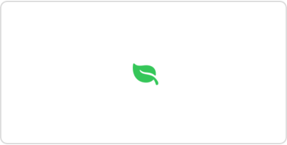

# 设置颜色

## `tint(_:)`

设置此视图内的色调。

```swift
func tint<S>(_ tint: S?) -> some View where S : ShapeStyle
```

使用此方法可以使用给定的样式覆盖此视图的默认强调颜色。与应用程序的强调颜色不同，用户可以根据偏好覆盖强调颜色，而色调始终会受到尊重，应该用作向控件提供额外含义的方式。

无法使用给定类型的 `ShapeStyle` 进行自我样式设置的控件将尝试尽可能近似地进行样式设置（即，无法使用渐变进行自我样式设置的控件将尝试使用渐变的第一站的颜色）。

此示例显示了一个线性仪表板样式的仪表，其色调为从绿色到红色的渐变。

```swift
struct ControlTint: View {
    var body: some View {
        Gauge(value: 75, in: 0...100)
            .gaugeStyle(.linearDashboard)
            .tint(Gradient(colors: [.red, .yellow, .green]))
    }
}
```

某些控件根据其样式、当前平台和周围上下文对色调颜色的适应方式不同。例如，在 macOS 中，具有边框样式的按钮不会为其背景着色，但具有边框突出样式的按钮会。在 macOS 中，这两种按钮样式都不会为其标签着色，但在其他平台上会。

## `Color`

一种适应给定上下文的颜色表示。

```swift
@frozen
struct Color
```

你可以通过以下几种方式创建颜色：

- 从资产目录加载颜色：

```swift
let aqua = Color("aqua") // Looks in your app's main bundle by default.
```

- 指定组件值，如红色、绿色和蓝色；色调、饱和度和亮度；或白色级别：

```swift
let skyBlue = Color(red: 0.4627, green: 0.8392, blue: 1.0)
let lemonYellow = Color(hue: 0.1639, saturation: 1, brightness: 1)
let steelGray = Color(white: 0.4745)
```

- 从另一种颜色创建颜色实例，如 `UIColor` 或 `NSColor`：

```swift
#if os(iOS)
let linkColor = Color(uiColor: .link)
#elseif os(macOS)
let linkColor = Color(nsColor: .linkColor)
#endif
```

- 使用预定义颜色调色板中的一种颜色，如黑色、绿色和紫色。

某些视图修饰符可以接受颜色作为参数。例如，`foregroundStyle(_:)` 使用你提供的颜色来设置视图元素的前景色，如文本或 SF Symbols：

```swift
Image(systemName: "leaf.fill")
.foregroundStyle(Color.green)
```



由于 SwiftUI 将颜色视为 `View` 实例，因此你也可以直接将它们添加到视图层次结构中。例如，你可以使用上面定义的颜色在太阳图像下方添加一个矩形：

```swift
ZStack {
    skyBlue
    Image(systemName: "sun.max.fill")
        .foregroundStyle(lemonYellow)
}
.frame(width: 200, height: 100)
```

用作视图的颜色会扩展以填充其给定的所有空间，如上例中封闭的 `ZStack` 的框架所定义：


SwiftUI 仅在将颜色用于给定环境之前将其解析为具体值。这为系统定义的颜色或从资产目录加载的颜色提供了上下文相关的外观。例如，颜色可以具有系统在渲染时选择的不同的亮色和暗色变体。