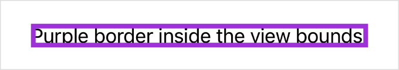
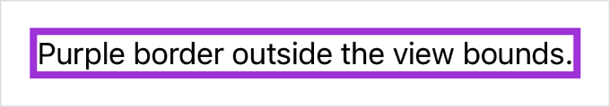
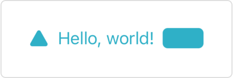
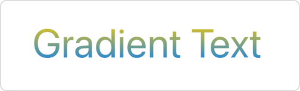
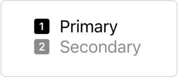
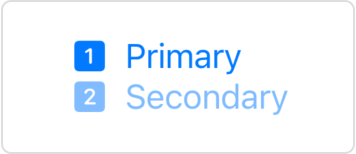
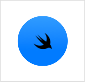
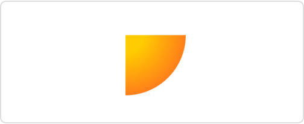
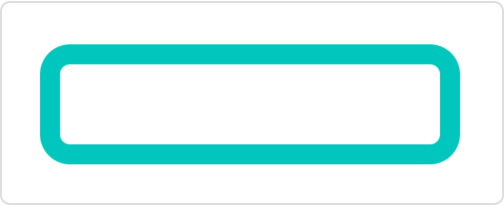
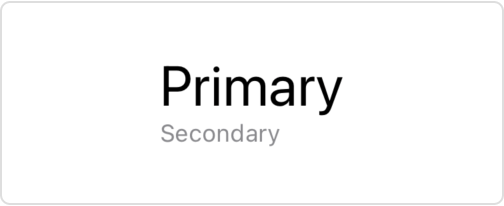

# 样式化内容

## `border(_:width:)`

使用指定的样式和宽度为此视图添加边框。

```swift
func border<S>(
    _ content: S,
    width: CGFloat = 1
) -> some View where S : ShapeStyle
```

- `content`: 符合 `ShapeStyle` 协议的值，如 `Color` 或 `HierarchicalShapeStyle`，SwiftUI 用于填充边框。
- `width`: 边框的厚度。默认值为 $1$ 像素。

使用此修饰符在视图的框架周围绘制指定宽度的边框。默认情况下，边框出现在此视图的边界内。例如，你可以添加一个覆盖文本的四像素宽的边框：


```swift
Text("Purple border inside the view bounds.")
.border(Color.purple, width: 4)
```



要在此视图的外部放置边框，请在添加边框之前应用相同宽度的填充：

```swift
Text("Purple border outside the view bounds.")
    .padding(4)
    .border(Color.purple, width: 4)
```



## `foregroundStyle(_:)`

设置视图的前景元素使用给定的样式。

```swift
func foregroundStyle<S>(_ style: S) -> some View where S : ShapeStyle
```

- `style`: 用于填充前景元素的颜色或图案。要指定特定的值，请使用 `Color` 或 `image(_:sourceRect:scale:)`，或其中一种渐变类型，如 `linearGradient(colors:startPoint:endPoint:)`。要设置相对于包含视图样式的样式，请使用其中一种语义样式，如 `primary`。

使用此方法设置前景内容的样式，如文本、形状和模板图像（包括符号）：

```swift
HStack {
    Image(systemName: "triangle.fill")
    Text("Hello, world!")
    RoundedRectangle(cornerRadius: 5)
        .frame(width: 40, height: 20)
}
.foregroundStyle(.teal)
```

上面的示例创建了一排蓝绿色的前景元素：



你可以使用任何符合 `ShapeStyle` 协议的样式，如上面示例中的蓝绿色，或下面显示的 `linearGradient(colors:startPoint:endPoint:)` 渐变：

```swift
Text("Gradient Text")
    .font(.largeTitle)
    .foregroundStyle(
        .linearGradient(
            colors: [.yellow, .blue],
            startPoint: .top,
            endPoint: .bottom
        )
    )
```



::: tip
如果你想使用样式填充单个 `Shape` 实例，请使用 `fill(style:)` 形状修饰符，因为它更高效。
:::

SwiftUI 为给定的样式创建上下文相关的渲染。例如，从资产目录加载的颜色可以具有不同的亮色和暗色外观，而某些样式也因平台而异。

像 `ShapeStyle/secondary` 这样的分层前景样式不会强加自己的样式，而是修改其他样式。特别是，它们将当前前景样式的主要级别修改为分层样式名称所给定的程度。要查找要修改的当前前景样式，SwiftUI 会查找使用 `foregroundStyle(_:)` 或 `foregroundColor(_:)` 修饰符应用的最内层包含样式。如果您没有指定样式，SwiftUI 将使用默认的前景样式，如以下示例所示：


```swift
VStack(alignment: .leading) {
    Label("Primary", systemImage: "1.square.fill")
    Label("Secondary", systemImage: "2.square.fill")
        .foregroundStyle(.secondary)
}
```



如果在封闭的 `VStack` 上添加前景样式，分层样式将相应地响应：


```swift
VStack(alignment: .leading) {
    Label("Primary", systemImage: "1.square.fill")
    Label("Secondary", systemImage: "2.square.fill")
        .foregroundStyle(.secondary)
}
.foregroundStyle(.blue)
```




当你将自定义样式应用于视图时，该视图会禁用该视图或其任何子视图中前景元素的活力效果，否则这些元素将通过添加背景材料（例如，使用 `background(_:ignoresSafeAreaEdges:)` 修饰符）获得。但是，应用于默认前景的分层样式不会禁用活力。


## `foregroundStyle(_:_:)`

设置子视图中前景样式的主要和次要级别。

```swift
func foregroundStyle<S1, S2>(
    _ primary: S1,
    _ secondary: S2
) -> some View where S1 : ShapeStyle, S2 : ShapeStyle
```


- `primary`: 用于填充前景元素的主要颜色或图案。要指定特定的值，请使用 `Color` 或 `image(_:sourceRect:scale:)`，或其中一种渐变类型，如 `linearGradient(colors:startPoint:endPoint:)`。要设置相对于包含视图样式的样式，请使用其中一种语义样式，如 `primary`。
- `secondary`: 用于填充前景元素的次要颜色或图案。

SwiftUI 在渲染没有显式渲染样式的子视图（如图像、文本、形状等）时使用这些样式。

如果你没有显式指定其他模式，当你应用此修饰符时，视图层次结构中的符号图像将使用调色板渲染模式。

## `backgroundStyle(_:)`

设置指定的样式以在视图内渲染背景。

```swift
func backgroundStyle<S>(_ style: S) -> some View where S : ShapeStyle
```

下面的示例使用此修饰符将 `backgroundStyle` 环境值设置为包含微妙渐变的蓝色。SwiftUI 使用此样式填充用作背景元素的 `Circle` 形状：


```swift
Image(systemName: "swift")
    .padding()
    .background(in: Circle())
    .backgroundStyle(.blue.gradient)

```



要恢复默认背景样式，请使用 `environment(_:_:)` 修饰符将 `backgroundStyle` 环境值设置为 `nil`：


```swift
.environment(\.backgroundStyle, nil)
```

## `ShapeStyle`

渲染形状时使用的颜色或图案。

```swift
protocol ShapeStyle : Sendable
```

你可以通过声明一个符合 `ShapeStyle` 协议的类型并实现所需的 `resolve` 函数来创建自定义形状样式，该函数根据当前环境返回表示所需外观的形状样式。

例如，此形状样式从环境中读取当前颜色方案，以选择其颜色将与之合成的混合模式：

```swift
struct MyShapeStyle: ShapeStyle {
    func resolve(in environment: EnvironmentValues) -> some ShapeStyle {
        if environment.colorScheme == .light {
            return Color.red.blendMode(.lighten)
        } else {
            return Color.red.blendMode(.darken)
        }
    }
}
```

除了创建自定义形状样式外，你还可以使用 SwiftUI 定义的具体样式之一。要指定特定的颜色或图案，你可以使用 `Color` 或 `image(_:sourceRect:scale:)` 返回的样式，或其中一种渐变类型，如 `radialGradient(_:center:startRadius:endRadius:)` 返回的样式。要在给定平台上的给定上下文中设置合适的颜色，可以使用其中一种语义样式，如 `background` 或 `primary`。

你可以通过以下方式使用形状样式：

- 使用 `fill(_:style:)` 修饰符用样式填充形状：

```swift
Path { path in
    path.move(to: .zero)
    path.addLine(to: CGPoint(x: 50, y: 0))
    path.addArc(
        center: .zero,
        radius: 50,
        startAngle: .zero,
        endAngle: .degrees(90),
        clockwise: false)
}
.fill(.radial(
    Gradient(colors: [.yellow, .red]),
    center: .topLeading,
    startRadius: 15,
    endRadius: 80))
```



- 使用 `stroke(_:lineWidth:)` 或 `stroke(_:style:)` 修饰符用样式描边形状的轮廓：

```swift
RoundedRectangle(cornerRadius: 10)
    .stroke(.mint, lineWidth: 10)
    .frame(width: 200, height: 50)
```



- 使用 `foregroundStyle(_:)` 修饰符设置视图中前景元素的样式：

```swift
VStack(alignment: .leading) {
    Text("Primary")
        .font(.title)
    Text("Secondary")
        .font(.caption)
        .foregroundStyle(.secondary)
}
```

