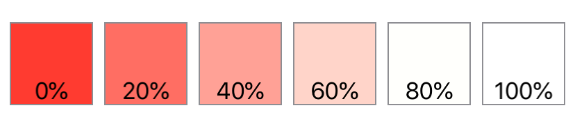
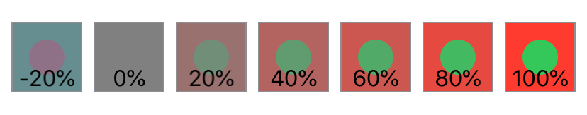
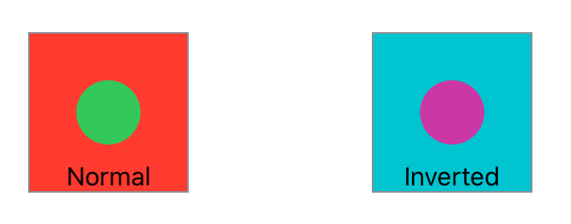
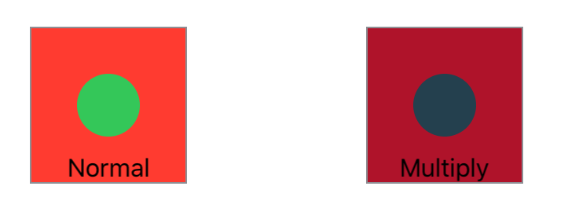
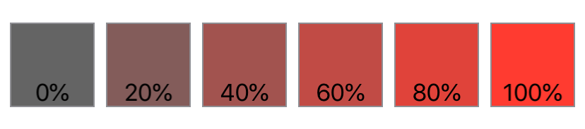
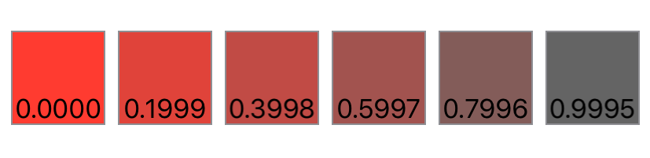
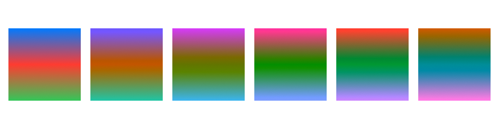
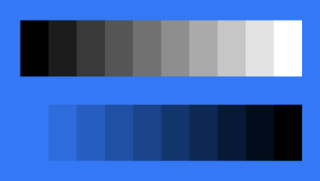

# 转换颜色

## `brightness(_:)`


将此视图提亮指定的量。

```swift
func brightness(_ amount: Double) -> some View
```

- `amount`: 一个介于 $0$（无效果）和 $1$（完全白色提亮）之间的值，表示亮度效果的强度。

使用 `brightness(_:)` 来提亮视图中颜色的强度。下面的示例显示了一系列红色正方形，它们的亮度从 0（完全红色）增加到 100%（白色），每次增加 20%。


```swift
struct Brightness: View {
    var body: some View {
        HStack {
            ForEach(0..<6) {
                Color.red.frame(width: 60, height: 60, alignment: .center)
                    .brightness(Double($0) * 0.2)
                    .overlay(Text("\(Double($0) * 0.2 * 100, specifier: "%.0f")%"),
                            alignment: .bottom)
                    .border(Color.gray)
            }
        }
    }
}
```




## `contrast(_:)`

设置此视图中相似颜色之间的对比度和分离度。


```swift
func contrast(_ amount: Double) -> some View
```

- `amount`: 要应用的颜色对比度强度。负值除了应用对比度外，还会反转颜色。

将对比度应用于视图，以增加或减少视图中相似颜色之间的分离度。

在下面的示例中，`contrast(_:)` 修饰符应用于一组红色正方形，每个正方形都包含一个对比鲜明的绿色内圆。在循环的每个步骤中，`contrast(_:)` 修饰符以 20% 的增量改变圆形/正方形视图的对比度。这范围从-20% 的对比度（产生反转的颜色——将红色正方形变成淡绿色，将绿色圆圈变成紫红色），到 0% 的中性灰色，再到 100% 的对比度（亮红色正方形/亮绿色圆圈）。如-20% 正方形所示，应用负对比度值将在反转颜色的同时应用对比度。


```swift
struct CircleView: View {
    var body: some View {
        Circle()
            .fill(Color.green)
            .frame(width: 25, height: 25, alignment: .center)
    }
}


struct Contrast: View {
    var body: some View {
        HStack {
            ForEach(-1..<6) {
                Color.red.frame(width: 50, height: 50, alignment: .center)
                    .overlay(CircleView(), alignment: .center)
                    .contrast(Double($0) * 0.2)
                    .overlay(Text("\(Double($0) * 0.2 * 100, specifier: "%.0f")%")
                                .font(.callout),
                            alignment: .bottom)
                    .border(Color.gray)
            }
        }
    }
}
```




## `colorInvert()`

反转此视图中的颜色。

```swift
func colorInvert() -> some View
```

`colorInvert()` 修饰符反转视图中的所有颜色，使每种颜色都显示为其互补色。例如，蓝色转换为黄色，白色转换为黑色。

在下面的示例中，两个红色正方形各有一个内部绿色圆圈。反转的正方形显示了正方形颜色的效果：红色和绿色的互补色——青色和紫色。


```swift
struct InnerCircleView: View {
    var body: some View {
        Circle()
            .fill(Color.green)
            .frame(width: 40, height: 40, alignment: .center)
    }
}


struct ColorInvert: View {
    var body: some View {
        HStack {
            Color.red.frame(width: 100, height: 100, alignment: .center)
                .overlay(InnerCircleView(), alignment: .center)
                .overlay(Text("Normal")
                            .font(.callout),
                        alignment: .bottom)
                .border(Color.gray)


            Spacer()


            Color.red.frame(width: 100, height: 100, alignment: .center)
                .overlay(InnerCircleView(), alignment: .center)
                .colorInvert()
                .overlay(Text("Inverted")
                            .font(.callout),
                        alignment: .bottom)
                .border(Color.gray)
        }
        .padding(50)
    }
}
```



## `colorMultiply(_:)`

为此视图添加颜色乘法效果。

```swift
func colorMultiply(_ color: Color) -> some View
```

下面的例子并排显示了同一图像的两个版本；左边是原始图像，右边是应用了 `colorMultiply(_:)` 修饰符并使用紫色的副本。


```swift
struct InnerCircleView: View {
    var body: some View {
        Circle()
            .fill(Color.green)
            .frame(width: 40, height: 40, alignment: .center)
    }
}


struct ColorMultiply: View {
    var body: some View {
        HStack {
            Color.red.frame(width: 100, height: 100, alignment: .center)
                .overlay(InnerCircleView(), alignment: .center)
                .overlay(Text("Normal")
                            .font(.callout),
                        alignment: .bottom)
                .border(Color.gray)


            Spacer()


            Color.red.frame(width: 100, height: 100, alignment: .center)
                .overlay(InnerCircleView(), alignment: .center)
                .colorMultiply(Color.purple)
                .overlay(Text("Multiply")
                            .font(.callout),
                        alignment: .bottom)
                .border(Color.gray)
        }
        .padding(50)
    }
}
```




## `saturation(_:)`

调整此视图的颜色饱和度。


```swift
func saturation(_ amount: Double) -> some View
```

使用颜色饱和度可以增加或减少视图中颜色的强度。

下面的示例显示了一系列红色正方形，它们的饱和度从 0（灰色）增加到 100%（全红），每次增加 20%：

```swift
struct Saturation: View {
    var body: some View {
        HStack {
            ForEach(0..<6) {
                Color.red.frame(width: 60, height: 60, alignment: .center)
                    .saturation(Double($0) * 0.2)
                    .overlay(Text("\(Double($0) * 0.2 * 100, specifier: "%.0f")%"),
                            alignment: .bottom)
                    .border(Color.gray)
            }
        }
    }
}
```




## `grayscale(_:)`

为此视图添加灰度效果。

```swift
func grayscale(_ amount: Double) -> some View
```

- `amount`: 要应用的灰度强度，范围从 $0.0$ 到小于 $1.0$。值越接近 $0.0$ 颜色越丰富，值越接近 $1.0$ 颜色越不丰富。

灰度效果会降低此视图中颜色的强度。

下面的示例显示了一系列红色正方形，它们的灰度效果从 0（最红）增加到 99%（完全去饱和），大约以 20% 的增量增加：

```swift
struct Saturation: View {
    var body: some View {
        HStack {
            ForEach(0..<6) {
                Color.red.frame(width: 60, height: 60, alignment: .center)
                    .grayscale(Double($0) * 0.1999)
                    .overlay(Text("\(Double($0) * 0.1999 * 100, specifier: "%.4f")%"),
                            alignment: .bottom)
                    .border(Color.gray)
            }
        }
    }
}
```




## `hueRotation(_:)`

对此视图应用色相旋转效果。

```swift
func hueRotation(_ angle: Angle) -> some View
```

使用色相旋转效果可以根据你指定的角度移动视图中的所有颜色。

下面的示例显示了一系列填充有线性渐变的正方形。每个正方形都显示了 36˚ 色相旋转（5 个正方形共 180˚）对渐变的影响：

```swift
struct HueRotation: View {
    var body: some View {
        HStack {
            ForEach(0..<6) {
                Rectangle()
                    .fill(.linearGradient(
                        colors: [.blue, .red, .green],
                        startPoint: .top, endPoint: .bottom))
                    .hueRotation((.degrees(Double($0 * 36))))
                    .frame(width: 60, height: 60, alignment: .center)
            }
        }
    }
}
```



## `luminanceToAlpha()`

为此视图添加亮度到透明度效果。

```swift
func luminanceToAlpha() -> some View
```

使用此修饰符创建半透明蒙版，其中修改后的视图的每个部分的不透明度由原始视图的相应部分的亮度控制。亮度较低的区域变得更加透明，而较高的亮度则产生更高的不透明度。

特别是，该修饰符将每个输入像素颜色的红色、绿色和蓝色分量映射到灰度值，该值成为输出中黑色像素的 alpha 分量。此修饰符产生的效果等同于使用具有 `luminanceToAlpha` 类型属性的 `feColorMatrix` 滤镜原语，如可缩放矢量图形 (SVG) 2 规范所定义。

下面的示例将 `Palette` 视图定义为一系列矩形，每个矩形都由具有特定白色值的 `Color` 组成，然后在蓝色背景上显示该调色板的两个版本：

```swift
struct Palette: View {
    var body: some View {
        HStack(spacing: 0) {
            ForEach(0..<10) { index in
                Color(white: Double(index) / Double(9))
                    .frame(width: 20, height: 40)
            }
        }
    }
}


struct LuminanceToAlphaExample: View {
    var body: some View {
        VStack(spacing: 20) {
            Palette()


            Palette()
                .luminanceToAlpha()
        }
        .padding()
        .background(.blue)
    }
}
```

调色板的未修改版本包含从纯黑色到纯白色的矩形，因此亮度增加。应用了 luminanceToAlpha() 修饰符的调色板的第二个版本允许背景以与输入亮度成反比的量显示出来。

