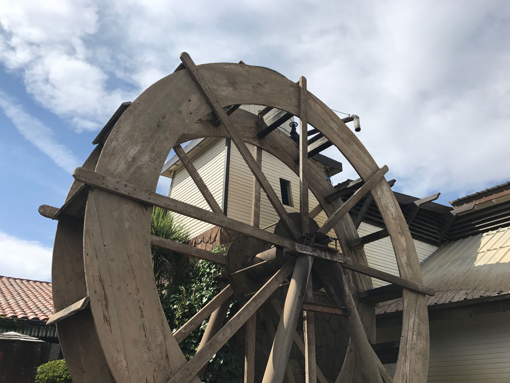
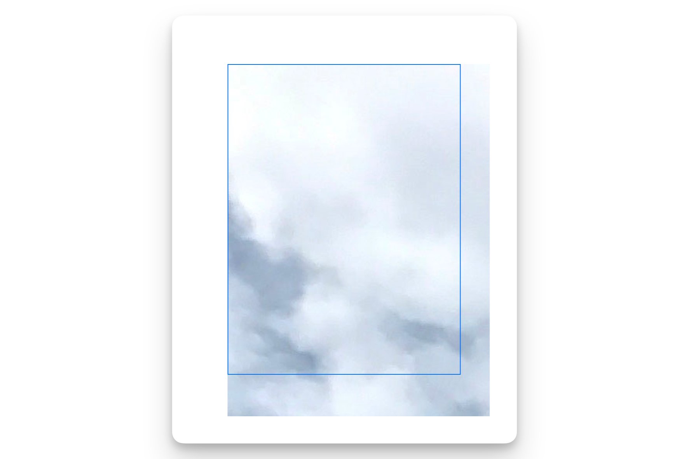
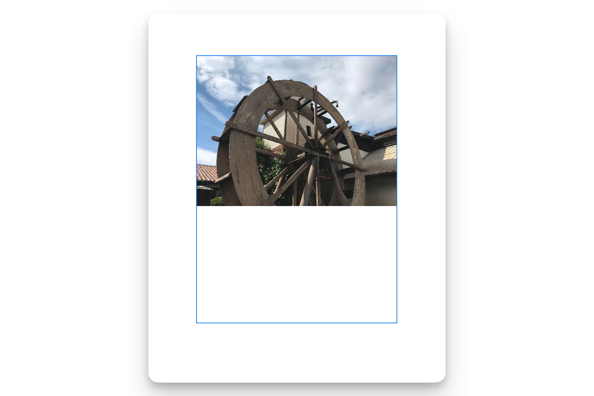
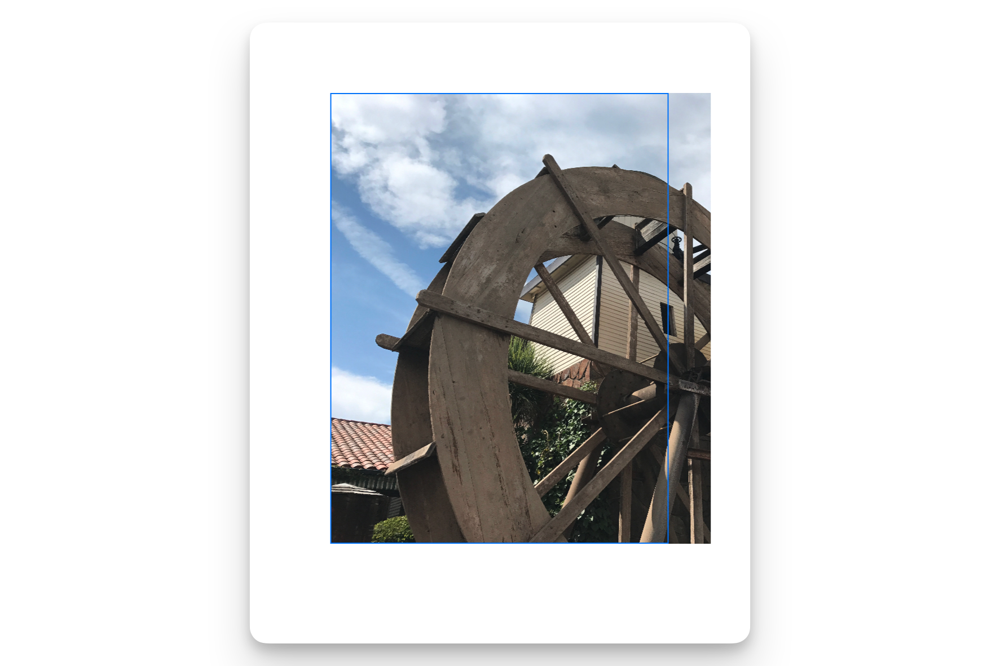
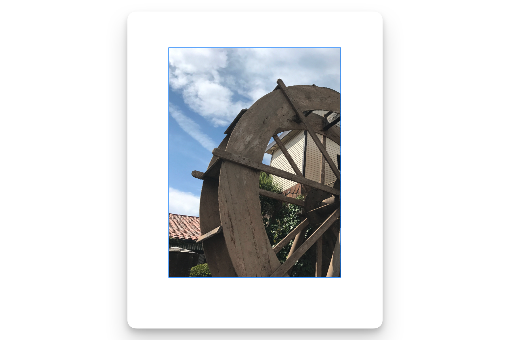
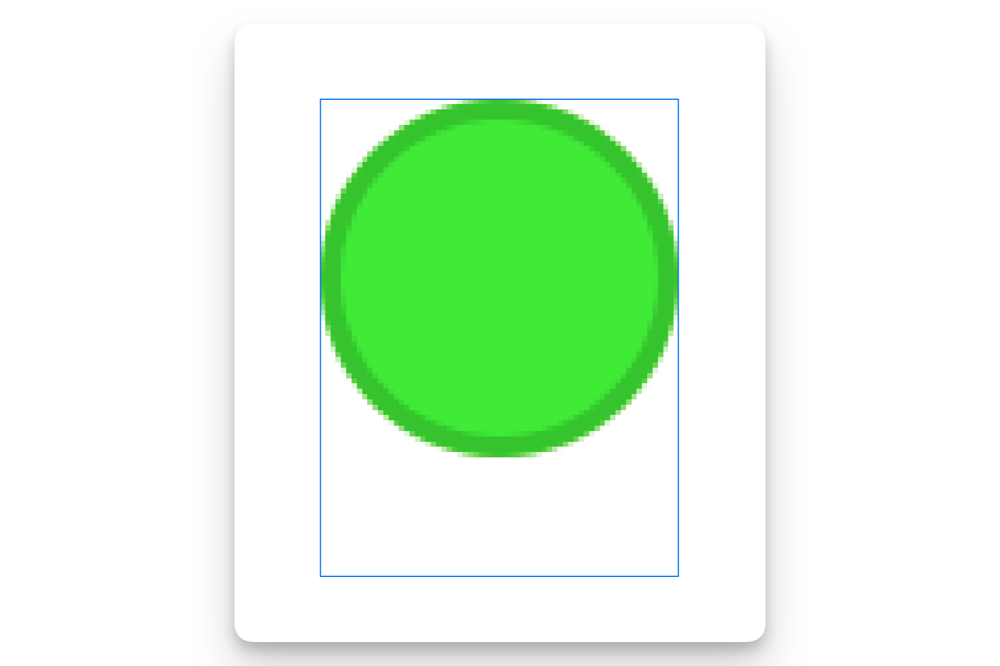
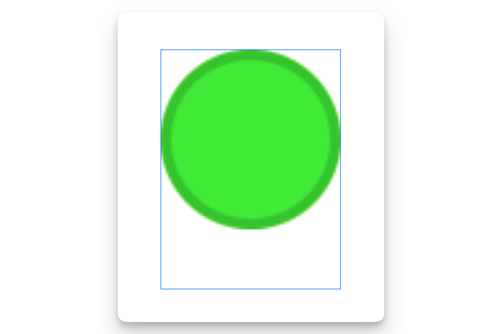
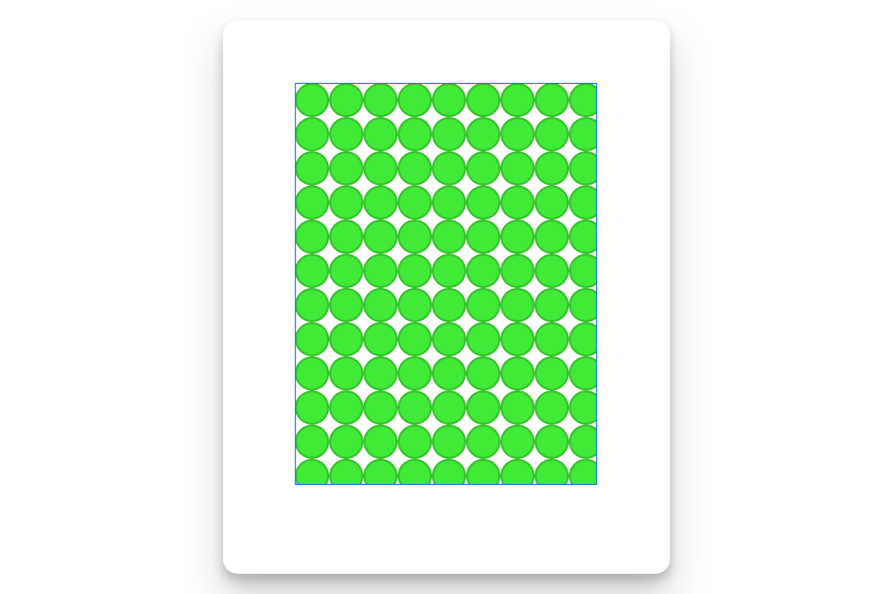
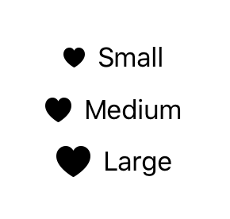

# Configuring an image

[[toc]]

## Fitting images into available space

通过应用视图修饰符来调整应用程序用户界面中图像的大小和形状。

图像大小差异很大，从单像素 PNG 文件到具有数百万像素的数字摄影图像。由于设备尺寸也各不相同，应用程序通常需要在运行时调整图像大小，以便它们适合可见的用户界面。SwiftUI 提供了一些修饰符来缩放、裁剪和转换图像，以完美地适合你的界面。

### 使用调整大小将大图像缩放到适合其容器

考虑图像 `landscape_4.jpg`，这是一张尺寸为 4032 x 3024 的照片，显示了一个水轮、周围的建筑物和上方的天空。



下面的示例将图像直接加载到 `Image` 视图中，然后将其放置在 300 x 400 点的框架中，并带有蓝色边框：

```swift
 Image("Landscape_4")
    .frame(width: 300, height: 400, alignment: .topLeading)
    .border(.blue)
```

如下面的截图所示，图像数据以全尺寸加载到视图中，因此只能看到原始图像左上角的云。因为图像以全尺寸渲染，而蓝色框架小于原始图像，所以图像会显示在框架边界之外的区域。



要解决此问题，你需要向 `Image` 应用两个修饰符：

- `resizable(capInsets:resizingMode:)` 告诉图像视图调整图像表示以匹配视图的大小。默认情况下，此修饰符通过减小较大图像的尺寸并放大小于视图的图像来缩放图像。仅此修饰符会独立缩放图像的每个轴。
- `aspectRatio(_:contentMode:)` 纠正了图像在每个轴上的缩放行为不同的问题。它使用 `ContentMode` 枚举定义的两种策略之一来保留图像的原始纵横比。`ContentMode.fit` 沿一个轴缩放图像以适合视图大小，可能会在另一个轴上留下空白。`ContentMode.fill` 缩放图像以填充整个视图。

```swift
 Image("Landscape_4")
    .resizable()
    .aspectRatio(contentMode: .fit)
    .frame(width: 300, height: 400, alignment: .topLeading)
    .border(.blue)
```



### 使用裁剪将图像数据保持在视图边界内

如果你在缩放图像时使用 `ContentMode.fill`，则部分图像可能会超出视图边界，除非视图与图像的纵横比完全匹配。下面的示例说明了这个问题：

```swift
Image("Landscape_4")
    .resizable()
    .aspectRatio(contentMode: .fill)
    .frame(width: 300, height: 400, alignment: .topLeading)
    .border(.blue)
```



为了防止这个问题，添加 `clipped(antialiased:)` 修饰符。此修饰符只是在视图的边界框处切断多余的图像渲染。可选地，你可以添加抗锯齿行为以对裁剪矩形的边缘应用平滑处理；此参数默认为 `false`。下面的示例显示了将裁剪添加到前面的填充模式示例中的效果：

```swift
 Image("Landscape_4")
    .resizable()
    .aspectRatio(contentMode: .fill)
    .frame(width: 300, height: 400, alignment: .topLeading)
    .border(.blue)
    .clipped()
```



### 使用插值标志来调整渲染图像质量


以原始大小以外的任何尺寸渲染图像都需要插值：使用现有图像数据来近似表示不同大小的图像。执行插值的不同方法在计算复杂度和渲染图像的视觉质量之间有不同的权衡。你可以使用 `interpolation(_:)` 修饰符为 SwiftUI 渲染行为提供提示。

当将较小的图像缩放到较大的空间时，更容易看到插值的效果，因为渲染的图像需要比可用图像数据更多的数据。考虑下面的示例，它将一个名为 `dot_green` 的 $34 \times 34$ 图像渲染到与之前相同的 $300 \times 400$ 容器框架中：


```swift
Image("dot_green")
    .resizable()
    .interpolation(.none)
    .aspectRatio(contentMode: .fit)
    .frame(width: 300, height: 400, alignment: .topLeading)
    .border(.blue)

```

将 `Image.Interpolation.none` 值传递给 `interpolation(_:)` 会在渲染时产生高度像素化的图像。



如果你将插值值更改为 `Image.Interpolation.medium`，SwiftUI 会平滑像素数据，以产生不那么像素化的图像：



::: tip

你还可以在缩小图像时指定插值行为，以确保获得尽可能高质量的图像、最快的渲染时间或介于两者之间的行为。
:::

### 使用平铺填充空间

当你的图像比你想要渲染的空间小得多时，另一个填充空间的选项是平铺：一遍又一遍地重复相同的图像。要平铺图像，请将 `Image.ResizingMode.tile` 参数传递给 `resizable(capInsets:resizingMode:)` 修饰符：


```swift
Image("dot_green")
    .resizable(resizingMode: .tile)
    .frame(width: 300, height: 400, alignment: .topLeading)
    .border(.blue)
```



当使用一个图像时，平铺特别有用，当它与自身的副本首尾相接放置时，会创建一个没有视觉不连续性的更大图案。

## `imageScale(_:)`

根据可用的相对大小（包括小、中和大图像大小）之一在视图内缩放图像。

```swift
func imageScale(_ scale: Image.Scale) -> some View
```

下面的示例显示了相对缩放效果。系统根据要缩放的图像的可用空间和配置选项，以相对大小呈现图像。

```swift
VStack {
    HStack {
        Image(systemName: "heart.fill")
            .imageScale(.small)
        Text("Small")
    }
    HStack {
        Image(systemName: "heart.fill")
            .imageScale(.medium)
        Text("Medium")
    }


    HStack {
        Image(systemName: "heart.fill")
            .imageScale(.large)
        Text("Large")
    }
}
```




## `Image.Orientation`

许多图像格式（如 JPEG）在图像数据中包含方向元数据。在其他情况下，你可以在代码中指定图像方向。正确指定方向对于显示图像和某些类型的图像处理通常都很重要。

在 SwiftUI 中，你在从现有 CGImage 初始化 Image 时提供方向值。

### 获取图像方向

- `up`: 一个值，指示原始像素数据与图像的预期显示方向匹配。
- `down`: 一个值，指示图像相对于其原始像素数据的方向旋转了 180°。
- `left`: 一个值，指示图像相对于其原始像素数据的方向逆时针旋转了 90°。
- `right`: 一个值，指示图像相对于其原始像素数据的方向顺时针旋转了 90°。

### 获取镜像图像方向

- `upMirrored`: 一个值，指示图像相对于其原始像素数据的方向水平翻转。
- `downMirrored`: 一个值，指示图像相对于其原始像素数据的方向垂直翻转。
- `leftMirrored`: 一个值，指示图像相对于其原始像素数据的方向顺时针旋转 90°并水平翻转。
- `rightMirrored`: 一个值，指示图像相对于其原始像素数据的方向逆时针旋转 90°并水平翻转。