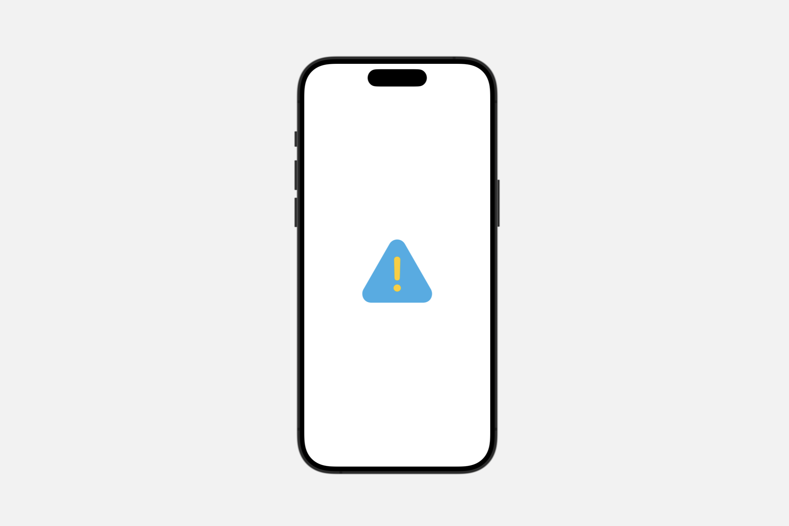

# Creating an image

## `Image`

一个显示图像的视图。

```swift
@frozen
struct Image
```

当你想向你的 SwiftUI 应用程序添加图像时，可以使用 `Image` 实例。你可以从许多来源创建图像：

- 应用程序资产库或包中的图像文件。支持的类型包括 PNG、JPEG、HEIC 等。
- 特定于平台的图像类型的实例，如 `UIImage` 和 `NSImage`。
- 存储在 `Core Graphics CGImage` 实例中的位图。
- 来自 `SF Symbols` 集的系统图形。

下面的示例展示了如何从应用程序的资产库或包中加载图像并将其缩放以适应其容器：


```swift
Image("Landscape_4")
    .resizable()
    .aspectRatio(contentMode: .fit)
Text("Water wheel")
```


你可以使用 `Image` 类型的方法以及标准视图修饰符来调整图像的大小以适应你的应用程序界面。在这里，`Image` 类型的 `resizable(capInsets:resizingMode:)` 方法将图像缩放以适应当前视图。然后，`aspectRatio(_:contentMode:)` 视图修饰符调整此缩放行为，以保持图像的原始纵横比，而不是独立缩放 x 轴和 y 轴以填充视图的所有四个边。文章“将图像适配到可用空间”展示了如何对不同大小的 `Image` 实例应用缩放、裁剪和平铺。

`Image` 是一个后期绑定令牌；系统仅在即将在环境中使用图像时才解析其实际值。

### Making images accessible

要将图像用作控件，请使用带有标签参数的初始化器之一。这允许系统的辅助功能框架将标签用作使用 `VoiceOver` 等功能的用户的控件名称。对于仅出于美学原因存在的图像，请使用带有装饰性参数的初始化器；辅助功能系统会忽略这些图像。

## `init(_:bundle:)`

创建一个带标签的图像，你可以将其用作控件的内容。

```swift
init(
    _ name: String,
    bundle: Bundle? = nil
)
```

- `name`: 要查找的图像资源的名称，以及用于标记图像的本地化键。
- `bundle`: 要搜索图像资源和本地化内容的包。如果为 `nil`，则 SwiftUI 使用主包。默认值为 `nil`。

## `init(_:variableValue:bundle:)`

创建一个带标签的图像，你可以将其用作控件的内容，并带有一个变量值。

```swift
init(
    _ name: String,
    variableValue: Double?,
    bundle: Bundle? = nil
)
```

- `name`: 要查找的图像资源的名称，以及用于标记图像的本地化键。
- `variableValue`: 一个可选的值，在 $0.0$ 和 $1.0$ 之间，如果指定，渲染图像可以使用该值来定制其外观。如果符号不支持变量值，则此参数无效。
- `bundle`: 要搜索图像资源和本地化内容的包。如果为 `nil`，则 SwiftUI 使用主包。默认值为 `nil`。

## `init(_:scale:orientation:label:)`

创建一个基于 `Core Graphics` 图像实例的带标签图像，可用作控件的内容。

```swift
init(
    _ cgImage: CGImage,
    scale: CGFloat,
    orientation: Image.Orientation = .up,
    label: Text
)
```

- `cgImage`: 基础图形图像。
- `scale`: 图像的比例因子，值如 $1.0$、$2.0$ 或 $3.0$。
- `orientation`: 图像的方向。默认值为 `Image.Orientation.up`。
- `label`: 与图像相关联的标签。SwiftUI 将标签用于辅助功能。
## `init(systemName:)`

创建一个系统符号图像。

```swift
init(systemName: String)
```

- `systemName`: 系统符号图像的名称。使用 SF Symbols 应用程序查找系统符号图像的名称。


此初始化器使用系统提供的符号创建图像。使用 SF Symbols 查找符号及其相应的名称。

要从应用程序的资产目录中创建自定义符号图像，请使用 `init(_:bundle:)` 代替。

## `init(systemName:variableValue:)`

创建一个具有变量值的系统符号图像。

```swift
init(
    systemName: String,
    variableValue: Double?
)
```

- `systemName`: 系统符号图像的名称。使用 SF Symbols 应用程序查找系统符号图像的名称。

- `variableValue`: 一个可选的值，在 $0.0$ 和 $1.0$ 之间，如果指定，渲染图像可以使用该值来定制其外观。如果符号不支持变量值，则此参数无效。使用 SF Symbols 应用程序查找支持变量值的符号。

此初始化器使用系统提供的符号创建图像。渲染的符号可能会改变其外观以表示 `variableValue` 中提供的值。使用 SF Symbols（版本 4.0 或更高版本）查找支持变量值的系统符号及其相应的名称。

下面的示例显示了使用不同值创建 "chart.bar.fill" 符号的效果。

```swift
HStack{
    Image(systemName: "chart.bar.fill", variableValue: 0.3)
    Image(systemName: "chart.bar.fill", variableValue: 0.6)
    Image(systemName: "chart.bar.fill", variableValue: 1.0)
}
.font(.system(.largeTitle))

```


## `init(size:label:opaque:colorMode:renderer:)`

初始化给定大小的图像，其内容由自定义渲染闭包提供。

```swift
init(
    size: CGSize,
    label: Text? = nil,
    opaque: Bool = false,
    colorMode: ColorRenderingMode = .nonLinear,
    renderer: @escaping (inout GraphicsContext) -> Void
)
```

- `size`: 新创建图像的大小。
- `label`: 与图像相关联的标签。SwiftUI 将标签用于辅助功能。
- `opaque`: 一个布尔值，指示图像是否完全不透明。如果为 true，则可能会提高性能。不要将非不透明像素渲染到声明为不透明的图像上。默认值为 false。
- `colorMode`: 图像的工作颜色空间和存储格式。默认值为 `ColorRenderingMode.nonLinear`。
- `renderer`: 一个用于绘制图像内容的闭包。闭包接收一个 `GraphicsContext` 作为其参数。


使用此初始化器通过在提供给渲染器闭包的 `GraphicsContext` 上调用绘图命令来创建图像。

下面的示例显示了一个自定义图像，通过传递 `GraphicContext` 绘制一个椭圆并用渐变填充它来创建：


```swift
let mySize = CGSize(width: 300, height: 200)
let image = Image(size: mySize) { context in
    context.fill(
        Path(
            ellipseIn: CGRect(origin: .zero, size: mySize)),
            with: .linearGradient(
                Gradient(colors: [.yellow, .orange]),
                startPoint: .zero,
                endPoint: CGPoint(x: mySize.width, y:mySize.height))
    )
}
```


## `resizable(capInsets:resizingMode:)`

设置 SwiftUI 调整图像大小以适应其空间的模式。

```swift
func resizable(
    capInsets: EdgeInsets = EdgeInsets(),
    resizingMode: Image.ResizingMode = .stretch
) -> Image
```

- `capInsets`: 插入值，表示 SwiftUI 不调整大小的图像部分。
- `resizingMode`: SwiftUI 调整图像大小的模式。

### `Image.ResizingMode`

SwiftUI 用于调整图像大小以使其适合其包含视图的模式。

- `stretch`: 一种放大或缩小图像大小以使其填充可用空间的模式。
- `tile`: 一种以原始大小重复图像的模式，根据需要重复多次以填充可用空间。


## `antialiased(_:)`

指定 SwiftUI 在渲染图像时是否应用抗锯齿。

```swift
func antialiased(_ isAntialiased: Bool) -> Image
```

- `isAntialiased`: 一个布尔值，指定是否允许抗锯齿。传递 `true` 以允许抗锯齿，否则传递 `false`。


## `symbolRenderingMode(_:)`

设置此视图内符号图像的渲染模式。

```swift
func symbolRenderingMode(_ mode: SymbolRenderingMode?) -> Image
```

### `SymbolRenderingMode`

::: info `hierarchical`
一种将符号渲染为多个层的模式，对前景样式应用不同的不透明度。

SwiftUI 用前景样式填充第一层，用前景样式的次要和第三变体填充其他层。你可以使用 `foregroundStyle(_:_:)` 和 `foregroundStyle(_:_:_:)` 修饰符显式指定这些样式。如果你只指定了主要前景样式，SwiftUI 会自动从该样式派生其他样式。例如，你可以用紫色作为感叹号的色调颜色，用较低不透明度的紫色作为三角形的渲染一个填充的感叹号三角形：

```swift
Image(systemName: "exclamationmark.triangle.fill")
    .symbolRenderingMode(.hierarchical)
    .foregroundStyle(Color.purple)
```


:::

::: info `monochrome`
一种将符号渲染为填充前景样式的单个层的模式。

例如，你可以用紫色渲染一个填充的感叹号三角形：

```swift
Image(systemName: "exclamationmark.triangle.fill")
    .symbolRenderingMode(.monochrome)
    .foregroundStyle(Color.purple)
```


:::

::: info `multicolor`
一种将符号渲染为具有其继承样式的多个层的模式。

这些层可以用它们自己的固有样式或前景样式填充。例如，你可以用其固有颜色渲染一个填充的感叹号三角形，三角形为黄色，感叹号为白色：


```swift
Image(systemName: "exclamationmark.triangle.fill")
.symbolRenderingMode(.multicolor)
```


:::

::: info `palette`
一种将符号渲染为多个层的模式，对这些层应用不同的样式。

在这种模式下，SwiftUI 将图像中连续定义的每个层映射到前景样式的主要、次要和第三变体中的下一个。你可以使用 `foregroundStyle(_:_:)` 和 `foregroundStyle(_:_:_:)` 修饰符显式指定这些样式。如果你只指定了主要前景样式，SwiftUI 会自动从该样式派生其他样式。例如，你可以用黄色作为感叹号的色调颜色，用青色填充三角形来渲染一个填充的感叹号三角形：

```swift
Image(systemName: "exclamationmark.triangle.fill")
    .symbolRenderingMode(.palette)
    .foregroundStyle(Color.yellow, Color.cyan)
```



你也可以省略符号渲染模式，因为指定多个前景样式意味着切换到调色板渲染模式：
```swift
Image(systemName: "exclamationmark.triangle.fill")
.foregroundStyle(Color.yellow, Color.cyan)
```

:::


## `renderingMode(_:)`

指示 SwiftUI 是按原样渲染图像，还是使用不同的模式进行渲染。

```swift
func renderingMode(_ renderingMode: Image.TemplateRenderingMode?) -> Image
```

`Image.TemplateRenderingMode` 枚举有两种情况：`Image.TemplateRenderingMode.original` 和 `Image.TemplateRenderingMode.template`。原始模式按原始源图像中的像素显示进行渲染。模板模式将所有不透明像素渲染为前景色，你可以将其用于创建图像蒙版等目的。

下面的示例展示了这两种渲染模式，应用于一个带有深绿色边框的绿色圆圈的图标图像：

```swift
Image("dot_green")
    .renderingMode(.original)
Image("dot_green")
    .renderingMode(.template)
```


你还可以使用 `renderingMode` 从 SF Symbols 集中生成多色系统图形。使用 `Image.TemplateRenderingMode.original` 模式将前景色应用于符号的所有部分，除了图形中具有明显颜色的部分。下面的示例展示了 `person.crop.circle.badge.plus` 符号的三种用法，以实现不同的效果：

- `default`: 未指定前景色或模板渲染模式的默认外观。该符号在浅色模式下全部为黑色，在深色模式下全部为白色。
- `original`: 使用原始模板渲染模式和蓝色前景色实现的多色行为。此模式导致图形覆盖图像的独特部分的前景色，在本例中为加号图标。
- `template`: 使用带有蓝色前景色的模板渲染模式实现的单色模板行为。此模式将前景色应用于整个图像，而不管用户的外观偏好如何。


```swift
HStack {
Image(systemName: "person.crop.circle.badge.plus")
Image(systemName: "person.crop.circle.badge.plus")
    .renderingMode(.original)
    .foregroundColor(.blue)
Image(systemName: "person.crop.circle.badge.plus")
    .renderingMode(.template)
    .foregroundColor(.blue)
}
.font(.largeTitle)
```


使用 SF Symbols 应用程序查找提供多色功能的系统图像。请记住，一些多色符号同时使用前景色和强调色。

## `interpolation(_:)`

指定需要插值的图像的当前渲染质量级别。

```swift
func interpolation(_ interpolation: Image.Interpolation) -> Image
```

- `interpolation`: 质量级别，表示为 `Interpolation` 类型的值，SwiftUI 在插值图像时应用该级别。

### `Image.Interpolation`

- `high`: 一个值，表示插值质量的高水平，这可能会减慢图像渲染速度。
- `low`: 一个值，表示插值质量的低水平，这可能会加快图像渲染速度。
- `medium`: 一个值，表示插值质量的中等水平，介于低质量和高质量值之间。
- `none`: 一个值，表示 SwiftUI 不插值图像数据。

## `allowedDynamicRange(_:)`

返回配置了指定允许动态范围的新图像。

```swift
func allowedDynamicRange(_ range: Image.DynamicRange?) -> Image
```

下面的示例为特定的图像视图启用 HDR 渲染，假设图像具有 HDR（ITU-R 2100）色彩空间并且输出设备支持它：

```swift
Image("hdr-asset").allowedDynamicRange(.high)
```

### `Image.DynamicRange`

- `standard`: 将图像内容动态范围限制为标准范围。
- `high`: 允许图像内容使用不受限制的扩展范围。
- `constrainedHigh`: 允许图像内容使用一些扩展范围。这适用于将 HDR 内容与 SDR 内容并排放置。