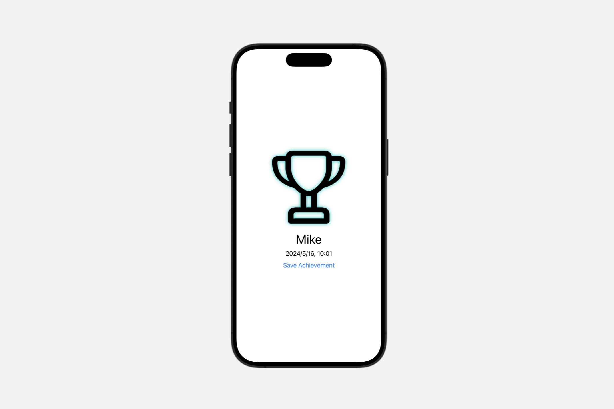

# 将视图渲染为图像

[[toc]]

## `ImageRenderer`

一个从 SwiftUI 视图创建图像的对象。

```swift
final class ImageRenderer<Content> where Content : View
```

使用 `ImageRenderer` 从 SwiftUI 视图导出位图图像数据。你可以使用视图初始化渲染器，然后根据需要渲染图像，方法是调用 `render(rasterizationScale:renderer:)` 方法，或者使用渲染器的属性创建 `CGImage`、`NSImage` 或 `UIImage`。

通过绘制到 `Canvas` 并使用 `ImageRenderer` 导出，你可以从任何程序渲染的内容生成图像，例如路径、形状、渐变等等。你还可以渲染标准的 SwiftUI 视图，如 `Text` 视图，或多种视图类型的容器。

下面的示例使用一个私有 `createAwardView(forUser:date:)` 方法创建一个游戏应用的奖杯符号视图，其中包含用户名和日期。这个视图将一个应用了阴影滤镜的 `Canvas` 和两个 `Text` 视图组合到一个 `VStack` 中。一个 `Button` 允许用户保存这个视图。按钮的操作使用 `ImageRenderer` 光栅化一个 `CGImage`，然后调用一个私有 `uploadAchievementImage(_:)` 方法对图像进行编码和上传。

```swift

struct ImageRendererView: View {
    var playerName: String
    
    var achievementDate: Date
    
    func uploadAchievementImage(_ cgImage: CGImage){
        
    }

    var body: some View {
        let trophyAndDate = createAwardView(forUser: playerName,
                                            date: achievementDate)
        VStack {
            trophyAndDate
            Button("Save Achievement") {
                let renderer = ImageRenderer(content: trophyAndDate)
                if let image = renderer.cgImage {
                    uploadAchievementImage(image)
                }
            }
        }
    }


    private func createAwardView(forUser: String, date: Date) -> some View {
        VStack {
            Image(systemName: "trophy")
                .resizable()
                .frame(width: 200, height: 200)
                .frame(maxWidth: .infinity, maxHeight: .infinity)
                .shadow(color: .mint, radius: 5)
            Text(playerName)
                .font(.largeTitle)
            Text(achievementDate.formatted())
        }
        .multilineTextAlignment(.center)
        .frame(width: 200, height: 290)
    }
}

#Preview {
    ImageRendererView(playerName: "Mike", achievementDate: Date())
}

```



由于 `ImageRenderer` 符合 `ObservableObject`，你可以使用它在其属性更改时生成图像流。订阅渲染器的 `objectWillChange` 发布者，然后在订阅者每次收到更新时使用渲染器光栅化新图像。

::: warning
`ImageRenderer` 输出仅包括 SwiftUI 渲染的视图，例如文本、图像、形状以及这些类型的复合视图。它不渲染本地平台框架（AppKit 和 UIKit）提供的视图，例如 Web 视图、媒体播放器和某些控件。对于这些视图，`ImageRenderer` 显示占位符图像，类似于 `drawingGroup(opaque:colorMode:)` 的行为。
:::

### 渲染到 PDF 上下文

`render(rasterizationScale:renderer:)` 方法将指定的视图渲染到任何 `CGContext`。这意味着你不仅限于创建光栅化的 `CGImage`。例如，你可以通过渲染到 PDF 上下文来生成 PDF 数据。生成的 PDF 对于视图层次结构中支持的成员（如文本、符号图像、线条、形状和填充）保持分辨率独立性。

下面的示例使用前面示例中的 `createAwardView(forUser:date:)` 方法，并将其内容导出为 $800 \times 600$ 点的 PDF 到文件 URL `renderURL`。它使用发送到渲染闭包的 `size` 参数将 `trophyAndDate` 视图在页面上垂直和水平居中。


```swift
struct ImageRendererView: View {
    var playerName: String
    
    var achievementDate: Date
    
    var renderURL: URL

    var body: some View {
        let trophyAndDate = createAwardView(forUser: playerName,
                                            date: achievementDate)
        VStack {
            trophyAndDate
            Button("Save Achievement") {
                let renderer = ImageRenderer(content: trophyAndDate)
                renderer.render { size, renderer in
                    var mediaBox = CGRect(origin: .zero,
                                        size: CGSize(width: 800, height: 600))
                    guard let consumer = CGDataConsumer(url: renderURL as CFURL),
                        let pdfContext =  CGContext(consumer: consumer,
                                                    mediaBox: &mediaBox, nil)
                    else {
                        return
                    }
                    pdfContext.beginPDFPage(nil)
                    pdfContext.translateBy(x: mediaBox.size.width / 2 - size.width / 2,
                                        y: mediaBox.size.height / 2 - size.height / 2)
                    renderer(pdfContext)
                    pdfContext.endPDFPage()
                    pdfContext.closePDF()
                }
            }
        }
    }

    private func createAwardView(forUser: String, date: Date) -> some View {
        VStack {
            Image(systemName: "trophy")
                .resizable()
                .frame(width: 200, height: 200)
                .frame(maxWidth: .infinity, maxHeight: .infinity)
                .shadow(color: .mint, radius: 5)
            Text(playerName)
                .font(.largeTitle)
            Text(achievementDate.formatted())
        }
        .multilineTextAlignment(.center)
        .frame(width: 200, height: 290)
    }
}

#Preview {
    ImageRendererView(playerName: "Mike", achievementDate: Date(), renderURL: URL(string: "www.apple.com")!)
}
```

### 根据绘图指令创建图像

`ImageRenderer` 可以通过在 `Canvas` 中绘图、从其中渲染 `CGImage` 并使用该图像初始化 `Image` 来创建自定义图像。为了简化此过程，可以使用 `Image` 初始化器 `init(size:label:opaque:colorMode:renderer:)`，它接受一个闭包，其参数是一个 `GraphicsContext`，你可以直接在其中绘图。


## `ImageRenderer.properties`

### `proposedSize`

建议根视图的大小。

此属性的默认值 `unspecified` 生成的图像与原始视图大小匹配。你可以提供自定义的 `proposedViewSize` 来覆盖一个或两个维度上的视图大小。

### `scale`

渲染图像的比例。

此值是视图点与图像像素的比率。这种关系意味着大于 $1.0$ 的值会创建比原始内容视图大的图像，小于 $1.0$ 的值会创建较小的图像。下面的示例显示了一个 $100 \times 50$ 的矩形视图和一个以 $2.0$ 比例从它渲染的图像，结果是一个 $200 \times 100$ 的图像大小。

```swift
let rectangle = Rectangle()
    .frame(width: 100, height: 50)
let renderer = ImageRenderer(content: rectangle)
renderer.scale = 2.0
if let rendered = renderer.cgImage {
    print("Scaled image: \(rendered.width) x \(rendered.height)")
}
// Prints "Scaled image: 200 x 100"
```

此属性的默认值是 1.0。

### `isOpaque`

一个布尔值，表示图像的 `alpha` 通道是否完全不透明。

将此值设置为 `true`，表示 `alpha` 通道不透明，可能会提高性能。不要将不透明像素渲染到声明为不透明的渲染器上。此属性默认为 `false`。


### `colorMode`

图像的工作色彩空间和存储格式。

- `extendedLinear`: 扩展的线性 sRGB 工作色彩空间。保留范围[0, 1]之外的颜色分量值。此色彩空间未进行伽马校正。
- `linear`: 线性 sRGB 工作色彩空间。范围[0, 1]之外的颜色分量值会产生未定义的结果。此色彩空间未进行伽马校正。
- `nonLinear`: 非线性 sRGB 工作色彩空间。范围[0, 1]之外的颜色分量值会产生未定义的结果。此色彩空间进行了伽马校正。

## 渲染图像

### `render(rasterizationScale:renderer:)`

将渲染器的当前内容绘制到任意的 Core Graphics 上下文。

```swift
@MainActor
final func render(
    rasterizationScale: CGFloat = 1,
    renderer: (CGSize, (CGContext) -> Void) -> Void
)
```

- `rasterizationScale`: 在光栅化无法表示为原生 Core Graphics 绘图命令的视图部分时，将用户界面点转换为像素的比例因子。
- `renderer`: 设置 Core Graphics 上下文并渲染视图的闭包。此闭包接收两个参数：视图的大小和在闭包中调用以按报告大小渲染视图的函数。此函数接受一个 `CGContext` 参数，并假定左下角坐标空间原点。

使用此方法将渲染器的内容光栅化到你提供的 `CGContext`。渲染器闭包接收两个参数：视图的当前大小和将视图渲染到你的 `CGContext` 的函数。实现闭包以提供合适的 `CGContext`，然后调用该函数将内容渲染到该上下文。