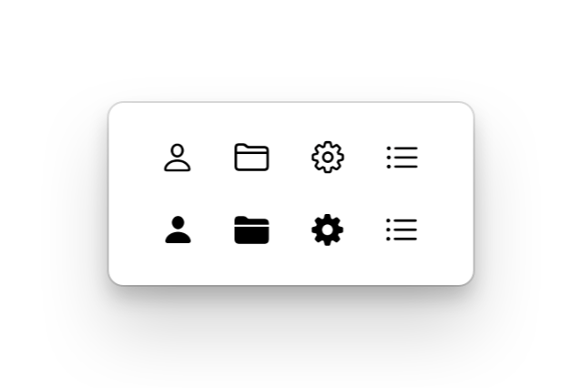
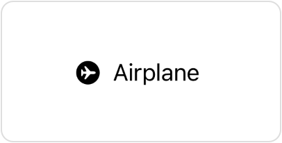
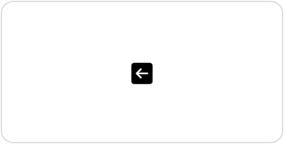

# 设置符号变体

## `symbolVariant(_:)`

使视图内的符号显示特定的变体。

```swift
func symbolVariant(_ variant: SymbolVariants) -> some View
```

当你希望应用程序用户界面的一部分中的所有 SF Symbols 使用相同的变体时，使用带有 `SymbolVariants` 值的 `symbolVariant(_:)` 修饰符，例如 `fill`：

```swift
VStack(spacing: 20) {
    HStack(spacing: 20) {
        Image(systemName: "person")
        Image(systemName: "folder")
        Image(systemName: "gearshape")
        Image(systemName: "list.bullet")
    }


    HStack(spacing: 20) {
        Image(systemName: "person")
        Image(systemName: "folder")
        Image(systemName: "gearshape")
        Image(systemName: "list.bullet")
    }
    .symbolVariant(.fill) // Shows filled variants, when available.
}
```

没有指定变体的符号不受影响。在上面的示例中，`list.bullet` 符号没有填充变体，因此 `symbolVariant(_:)` 修饰符没有效果。



如果你多次应用该修饰符，其效果会累积。或者，你可以在一次调用中应用多个变体：

```swift
Label("Airplane", systemImage: "airplane.circle.fill")


Label("Airplane", systemImage: "airplane")
    .symbolVariant(.circle)
    .symbolVariant(.fill)


Label("Airplane", systemImage: "airplane")
    .symbolVariant(.circle.fill)
```

上面代码中的所有标签都会产生相同的输出：



你可以以任何顺序应用所有这些变体，但如果你应用多个形状变体，则最接近符号的变体优先。例如，以下图像使用方形：

```swift
Image(systemName: "arrow.left")
    .symbolVariant(.square) // This shape takes precedence.
    .symbolVariant(.circle)
    .symbolVariant(.fill)
```



要使符号忽略当前环境中的变体，请使用 `environment(_:_:)` 修饰符直接将 `symbolVariants` 环境值设置为 `none`。

### `SymbolVariants`

- `none`: 符号没有变体。
- `circle`: 将符号封装在圆中的变体。
- `square`: 将符号封装在正方形中的变体。
- `rectangle`: 将符号封装在矩形中的变体。
- `fill`: 填充符号的变体。
- `slash`: 在符号上绘制斜线的变体。