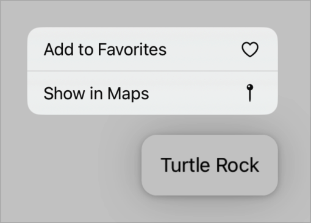

# 创建上下文菜单

## `contextMenu(menuItems:)`

向视图添加上下文菜单。

```swift
func contextMenu<MenuItems>(@ViewBuilder menuItems: () -> MenuItems) -> some View where MenuItems : View
```

使用此修饰符向应用程序用户界面中的视图添加上下文菜单。通过从 `menuItems` 闭包中返回 `Button`、`Toggle` 和 `Picker` 等控件来组成菜单。你还可以使用 `Menu` 定义子菜单或使用 `Section` 对项目进行分组。

下面的示例创建了一个 `Text` 视图，该视图具有一个包含两个按钮的上下文菜单：

```swift
Text("Turtle Rock")
    .padding()
    .contextMenu {
        Button {
            // Add this item to a list of favorites.
        } label: {
            Label("Add to Favorites", systemImage: "heart")
        }
        Button {
            // Open Maps and center it on this item.
        } label: {
            Label("Show in Maps", systemImage: "mappin")
        }
    }
```

人们可以通过 `Control-clicking` 等操作或在 iOS 和 iPadOS 中使用触摸并按住手势来激活菜单：



如果有人进行选择，或在菜单外点击或单击，系统将关闭菜单。

如果你想在菜单旁边显示预览，请使用 `contextMenu(menuItems:preview:)`。要向支持选择的容器（如 `List` 或 `Table`）添加上下文菜单，并区分在选择上激活菜单和在容器的空白区域激活菜单，请使用 `contextMenu(forSelectionType:menu:primaryAction:)`。

## `contextMenu(menuItems:preview:)`

向视图添加带有预览的上下文菜单。

```swift
func contextMenu<M, P>(
    @ViewBuilder menuItems: () -> M,
    @ViewBuilder preview: () -> P
) -> some View where M : View, P : View
```

当你使用此修饰符向应用程序用户界面中的视图添加上下文菜单时，系统会在菜单旁边显示一个预览。通过从 `menuItems` 闭包中返回 `Button`、`Toggle` 和 `Picker` 等控件来组成菜单。你还可以使用 `Menu` 来定义子菜单，或使用 `Section` 对项目进行分组。

通过从 `preview` 闭包中返回视图来定义预览。系统会根据预览内容的大小调整预览的大小。例如，你可以向 `Text` 视图添加一个包含两个按钮的上下文菜单，并包含一个 `Image` 作为预览：

```swift
Text("Turtle Rock")
    .padding()
    .contextMenu {
        Button {
            // Add this item to a list of favorites.
        } label: {
            Label("Add to Favorites", systemImage: "heart")
        }
        Button {
            // Open Maps and center it on this item.
        } label: {
            Label("Show in Maps", systemImage: "mappin")
        }
    } preview: {
        Image("turtlerock") // Loads the image from an asset catalog.
    }

```

当有人在 iOS 或 iPadOS 中通过触摸并按住等操作激活上下文菜单时，系统会显示图像和菜单：


如果你不需要预览，请使用 `contextMenu(menuItems:)` 代替。如果你想向支持选择的容器（如 `List` 或 `Table`）添加上下文菜单，并且你想区分在选择上激活菜单和在容器的空白区域激活菜单，请使用 `contextMenu(forSelectionType:menu:primaryAction:)`。

## `contextMenu(forSelectionType:menu:primaryAction:)`

向视图添加上下文菜单。

```swift
func contextMenu<I, M>(
    forSelectionType itemType: I.Type = I.self,
    @ViewBuilder menu: @escaping (Set<I>) -> M,
    primaryAction: ((Set<I>) -> Void)? = nil
) -> some View where I : Hashable, M : View
```

- `itemType`: 项目的标识符类型。确保这与容器的选择类型匹配。
- `menu`: 一个闭包，用于生成菜单。闭包的单个参数包含要操作的项目集。空集表示在可选容器的空白区域上激活菜单，而非空集表示在选定项目上激活菜单。使用 `Button`、`Picker` 和 `Toggle` 等控件来定义菜单项。你还可以使用 `Menu` 创建子菜单，或使用 `Section` 对项目进行分组。你可以通过从闭包中返回空来停用上下文菜单。
- `primaryAction`: 一个闭包，用于定义响应主要交互的操作。闭包的单个参数包含要操作的项目集。

你可以向支持选择的容器（如 `List` 或 `Table`）添加上下文菜单。在用于定义菜单的闭包中，你会收到一个项目集合，具体取决于容器的选择状态以及用户点击或轻点以激活菜单的位置。该集合包含：

- 当用户从任何选定项目启动上下文菜单时，包含选定的一个或多个项目。
- 如果用户点击或轻点容器的空白部分以激活上下文菜单，则不包含任何项目。即使当前选择了一个或多个项目，也是如此。

你可以根据选定项目的数量来改变菜单内容。例如，以下代码有一个列表，定义了一个空白区域菜单、一个单项目菜单和一个多项目菜单：


```swift
struct ContextMenuItemExample: View {
    
    struct Item: Identifiable {
        var id = UUID()
        var name: String
    }
    
    var items: [Item] = [Item(name: "Mike"), Item(name: "John"), Item(name: "Tom")]
    @State private var selection = Set<Item.ID>()


    var body: some View {
        List(selection: $selection) {
            ForEach(items) { item in
                Text(item.name)
            }
        }
        .contextMenu(forSelectionType: Item.ID.self) { items in
            if items.isEmpty { // Empty area menu.
                Button("New Item") { }


            } else if items.count == 1 { // Single item menu.
                Button("Copy") { }
                Button("Delete", role: .destructive) { }


            } else { // Multi-item menu.
                Button("Copy") { }
                Button("New Folder With Selection") { }
                Button("Delete Selected", role: .destructive) { }
            }
        }
    }
}
```


<video src="../../video/ContextMenu.mp4" controls="controls"></video>


上面的示例假设 `Item` 类型符合 `Identifiable `协议，并依赖于相关联的 `ID` 类型进行选择和上下文菜单显示。

如果你将修饰符添加到没有支持选择的容器的视图层次结构中，上下文菜单将永远不会激活。要添加不依赖于选择行为的上下文菜单，请使用 `contextMenu(menuItems:)`。要向表中的特定行添加上下文菜单，请使用 `contextMenu(menuItems:)`。

### 添加主要操作

你可以选择向上下文菜单添加自定义主要操作。在 macOS 中，在可选容器中的一行上单击一次可选择该行，双击则执行主要操作。在 iOS 和 iPadOS 中，点击行将激活主要操作。要选择一行而不执行操作，可以进入编辑模式，或者在点击行时按住键盘上的 shift 或 command 键。

例如，你可以修改上一个示例中的上下文菜单，以便在 macOS 上双击行时为选定项目打开一个新窗口。从环境中获取 `OpenWindowAction`：

```swift
@Environment(\.openWindow) private var openWindow
```

然后在每个项目的 `primaryAction` 闭包内调用 `openWindow`：

```swift
.contextMenu(forSelectionType: Item.ID.self) { items in
    // ...
} primaryAction: { items in
    for item in items {
        openWindow(value: item)
    }
}
```

打开窗口操作取决于你的应用程序中声明的 `WindowGroup` 场景，该场景响应 `Item` 类型：

```swift
WindowGroup("Item Detail", for: Item.self) { $item in
    // ...
}
```
<video src="../../video/ContextMenuPrimaryAction.mp4" controls="controls"></video>

