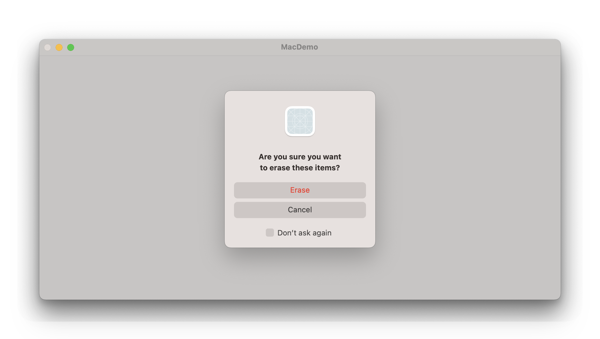
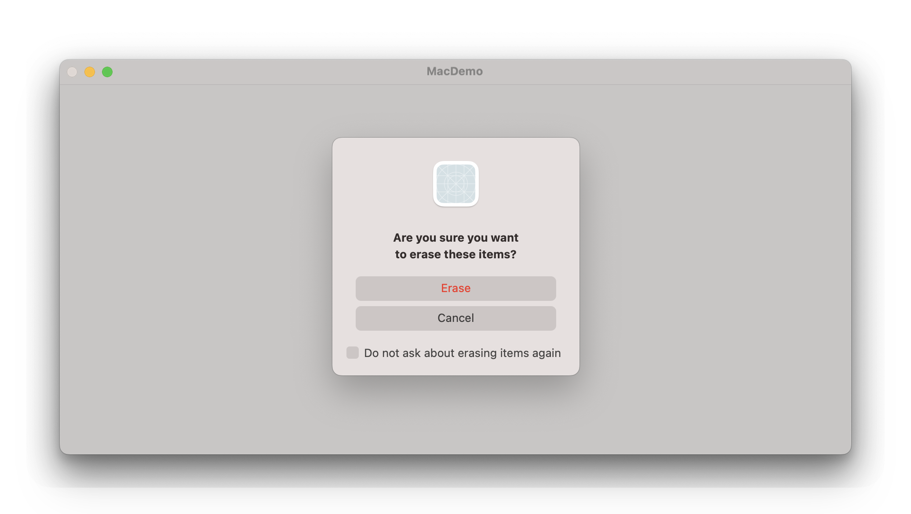

# Configuring a dialog

## `dialogIcon(_:)`

配置此视图中对话框使用的图标。

```swift
func dialogIcon(_ icon: Image?) -> some View
```


以下示例使用自定义图像配置确认对话框。

```swift
struct ContentView: View {

    @State private var isShowingDialog = false


    var body: some View {
        
        Button("Delete items") {
            isShowingDialog = true
        }
        .confirmationDialog(
            "Are you sure you want to erase these items?",
                isPresented: $isShowingDialog
        ) {
            Button("Erase", role: .destructive) {
                // Handle item deletion.
            }
            Button("Cancel", role: .cancel) {
                isShowingDialog = false
            }
        }.dialogIcon(Image(systemName: "star.fill"))
        
    }
}
```


在 macOS 上，此图标替换应用程序的默认图标。

<video src="../../video/DialogIcon.mp4" controls="controls"></video>


在 watchOS 上，此图标将显示在出现的任何对话框中。

<video src="../../video/DialogIconWatch.mp4" controls="controls"></video>

该修改器对其他平台没有影响。


## `dialogSeverity(_:)` <Badge type="tip" text="macOS / watchOS / visionOS" />

用于确认对话框和警报的严重性。

```swift
func dialogSeverity(_ severity: DialogSeverity) -> some View
```

- `automatic`: 默认对话框严重性。出现错误的警报将使用 `.critic`，所有其他警报将使用 `.standard`。
- `standard`: 一种严重性等级，表明对话框显示的目的是向用户呈现信息。
- `critical`: 一个指示需要特别注意对话的严重性级别，例如当采取的行动可能导致意外的数据丢失时。


## `dialogSuppressionToggle(isSuppressed:)`

允许用户在自身内部抑制对话框和警告，macOS上带有默认的抑制信息，在其他平台上未使用。

```swift
func dialogSuppressionToggle(isSuppressed: Binding<Bool>) -> some View
```

应用对话框抑制会在 macOS 上的对话框中添加一个切换开关，允许用户请求不再显示该警告。

通常，是否抑制某个对话框会存储在 `AppStorage` 中，并用来决定将来是否展示该对话框。

以下示例配置了一个带有抑制切换的确认对话框。切换的状态存储在 `AppStorage` 中，并用来确定当按下「`Delete Items`」按钮时是否显示对话框。


```swift
struct ConfirmEraseItems: View {
    @State private var isShowingDialog = false


    @AppStorage("suppressEraseItemAlert")
    private var suppressAlert = false


    var body: some View {
        Button("Delete Items") {
            if !suppressAlert {
                isShowingDialog = true
            } else {
                // Handle item deletion.
            }
        }
        .confirmationDialog(
            "Are you sure you want to erase these items?",
            isPresented: $isShowingDialog
        ) {
            Button("Erase", role: .destructive) {
                // Handle item deletion.
            }
            Button("Cancel", role: .cancel) {
                isShowingDialog = false
            }
        }
        .dialogSuppressionToggle(isSuppressed: $suppressAlert)
    }
}
```




## `dialogSuppressionToggle(_:isSuppressed:)`

指定「是否忽略弹窗」的提示信息。

```swift{28}
struct ConfirmEraseItems: View {
    @State private var isShowingDialog = false


    @AppStorage("suppressEraseItemAlert")
    private var suppressAlert = false


    var body: some View {
        Button("Delete Items") {
            if !suppressAlert {
                isShowingDialog = true
            } else {
                // Handle item deletion.
            }
        }
        .confirmationDialog(
            "Are you sure you want to erase these items?",
            isPresented: $isShowingDialog
        ) {
            Button("Erase", role: .destructive) {
                // Handle item deletion.
            }
            Button("Cancel", role: .cancel) {
                isShowingDialog = false
            }
        }
        .dialogSuppressionToggle("Do not ask about erasing items again",isSuppressed: $suppressAlert)
    }
}
```

