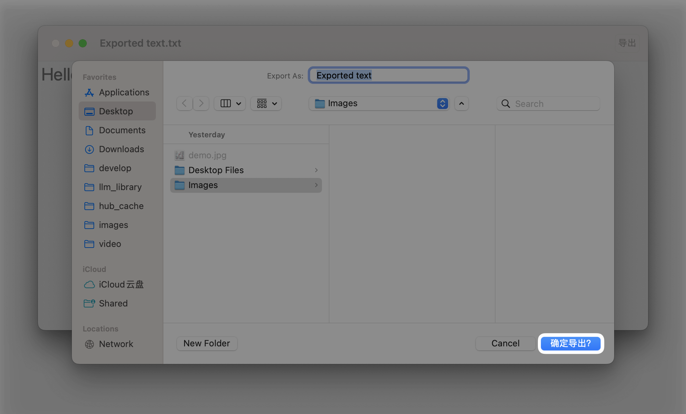
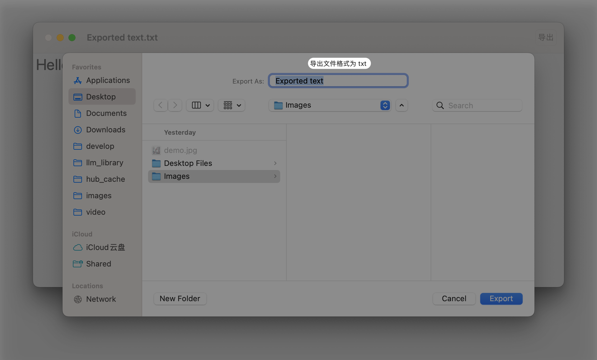

# Configuring a file dialog

## `fileDialogBrowserOptions(_:)`

在 macOS 上，配置 `fileExporter`、`fileImporter` 或 `fileMover` 以提供精细化的 URL 搜索体验：包括或排除隐藏文件，允许通过标签进行搜索等。

```swift
func fileDialogBrowserOptions(_ options: FileDialogBrowserOptions) -> some View
```

- `displayFileExtensions`: 在 iOS 上，配置 `fileExporter`、`fileImporter` 或 `fileMover` 以显示或隐藏文件扩展名。 默认行为是隐藏它们，在 macOS 上，此选项无效。
- `enumeratePackages`: 允许枚举包内容，与默认行为形成对比，其中包被平面化地表示，类似于文件。
- `includeHiddenFiles`: 显示默认隐藏的文件。


## `fileDialogConfirmationLabel(_:)`

在 macOS 上，使用自定义确认按钮标签配置 `fileExporter`、`fileImporter` 或 `fileMover`。


```swift
func fileDialogConfirmationLabel<S>(_ label: S) -> some View where S : StringProtocol
```

```swift
.fileExporter(isPresented: $showingExporter, document: document, contentType: .plainText) { result in
    ...
}
.fileDialogConfirmationLabel("确定导出？")
```





## `fileDialogCustomizationID(_:)`

在 macOS 上，配置 `fileExporter`、`fileImporter` 或 `fileMover` 以保留和恢复文件对话框配置。


```swift
func fileDialogCustomizationID(_ id: String) -> some View
```

这段文字的中文翻译是：

除了其他参数外，它存储当前目录、视图样式（例如，图标、列表、列视图）、最近访问位置和扩展的窗口大小。

这使得用户体验更加精细；例如，在导入图片时，用户可能切换到图标视图，但在其他情境中列表视图可能更方便。文件对话框会存储这些设置，并在每次显示面板之前应用它们。如果没有提供设置，文件对话框在每次启动时都使用默认配置。


## `fileDialogDefaultDirectory(_:)`

配置 `fileExporter`、`fileImporter` 或 `fileMover` 以使用指定的默认目录打开。


```swift
func fileDialogDefaultDirectory(_ defaultDirectory: URL?) -> some View
```

- `defaultDirectory`: 系统文件对话框启动时显示的目录。如果给定的文件对话框具有 `fileDialogCustomizationID`，则存储用户选择的目录并随后使用它打开，忽略此修饰符中提供的默认值。

## `fileDialogImportsUnresolvedAliases(_:)`

在 macOS 上，配置用户选择别名时的 `fileExporter`、`fileImporter` 或 `fileMover` 行为。

- `imports`: 一个布尔值，指示当用户选择别名时应用程序是否收到未解析或已解析的 `URL`。

默认情况下，文件对话框解析别名并提供所选别名引用的项目的 `URL`。

此修饰符允许控制此行为：如果应用程序不希望文件对话框解析别名，则传递 `true`。


## `fileDialogMessage(_:)`

在 macOS 上，使用向用户显示的自定义消息（类似于标题）配置 `fileExporter`、`fileImporter` 或 `fileMover`。


```swift
func fileDialogMessage<S>(_ message: S) -> some View where S : StringProtocol
```


```swift
.fileExporter(isPresented: $showingExporter, document: document, contentType: .plainText) { result in
    ...
.fileDialogMessage("导出文件格式为 txt")
```




## `fileDialogURLEnabled(_:)`

在 macOS 上，配置 `fileImporter` 或 `fileMover` 以有条件地禁用显示的 URL。


```swift
func fileDialogURLEnabled(_ predicate: Predicate<URL>) -> some View
```

- `predicate`: 评估呈现给用户的 URL，并有条件地禁用它们。该实现预期具有恒定的复杂度，且不应访问文件内容或元数据，一个常见的用例是检查路径或文件名。

```swift
.fileExporter(isPresented: $showingExporter, document: document, contentType: .plainText) { result in
    ...
}
.fileDialogURLEnabled(#Predicate {
    return $0.hasDirectoryPath && $0.isFileURL
})
```