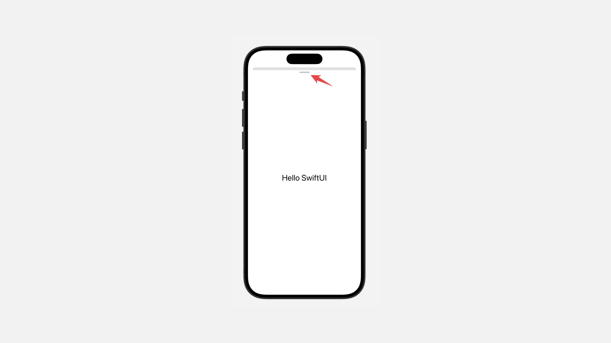

# Configuring a sheet’s height

## `presentationDetents(_:)`

设置封闭表单的可用位置点。

```swift
func presentationDetents(_ detents: Set<PresentationDetent>) -> some View
```

`detents`: 表单支持的位置点集合。如果你提供了多个位置点，用户可以通过拖动来调整表单的大小。


默认情况下，`sheet` 是 `large` 位置点。

```swift
struct ContentView: View {
    
    @State private var showSettings = false

    var body: some View {
        Button("Show Sheet") {
            showSettings.toggle()
        }
        .sheet(isPresented: $showSettings) {
            Text("Hello SwiftUI")
                .padding()
                .presentationDetents([.medium, .large])
        }
    }
}
```
<video src="../../video/PresentationDetents.mp4" controls="controls"></video>


## `presentationDetents(_:selection:)`

设置 `sheet` 的可用定位，使你能够以编程方式控制当前选定的定位。

```swift
func presentationDetents(
    _ detents: Set<PresentationDetent>,
    selection: Binding<PresentationDetent>
) -> some View
```

- `selection`: 绑定到当前选定的位置点。确保该值与你为位置点参数提供的位置点之一匹配。

```swift
struct ContentView: View {
    
    @State private var showSettings = false
    
    @State private var settingsDetent = PresentationDetent.fraction(0.25)

    var body: some View {
        Button("Show Sheet") {
            showSettings.toggle()
        }
        .sheet(isPresented: $showSettings) {
            Text("Hello SwiftUI")
                .padding()
                .presentationDetents([.medium, .large, .fraction(0.25)],
                selection: $settingsDetent)
        }
    }
}
```

<video src="../../video/PresentationDetentsSelection.mp4" controls="controls"></video>


## `presentationContentInteraction(_:)`

配置 `presentation` 上滑动手势的行为。

```swift
func presentationContentInteraction(_ behavior: PresentationContentInteraction) -> some View
```

默认情况下，当用户在可调整大小的 `presentation` 中向上滑动滚动视图时，`presentation` 将增长到下一个定位点。

`presentation` 中嵌入的滚动视图仅在 `presentation` 达到其最大尺寸后才会滚动。

使用此修饰符可以控制优先执行哪个操作。

例如，你可以请求滑动手势首先滚动内容，仅在到达滚动视图末尾后才调整 `sheet` 大小，方法是将滚动值传递给此修饰符：


```swift
struct ContentView: View {
    
    @State private var showSettings = false
    
    @State private var settingsDetent = PresentationDetent.fraction(0.25)

    var body: some View {
        
        Button("Show Sheet") {
            showSettings.toggle()
        }
        .sheet(isPresented: $showSettings) {
            List{
                ForEach(0..<20, id: \.self){index in
                    Text("index:\(index)")
                }
            }
            .font(.title)
            .padding()
            .presentationDetents([.medium, .large])
            .presentationContentInteraction(.scrolls)
        }
    }
}
```

<video src="../../video/PresentationContentInteraction.mp4" controls="controls"></video>


## `presentationDragIndicator(_:)`

设置 `sheet` 顶部拖动指示器的可见性。

```swift
func presentationDragIndicator(_ visibility: Visibility) -> some View
```

当工作表无法明显调整大小或工作表无法交互式关闭时，你可以手动指定显示拖动指示器。

```swift
struct ContentView: View {
    
    @State private var showSettings = false
    
    @State private var settingsDetent = PresentationDetent.fraction(0.25)

    var body: some View {
        
        Button("Show Sheet") {
            showSettings.toggle()
        }
        .sheet(isPresented: $showSettings) {
            Text("Hello SwiftUI")
            .font(.title)
            .padding()
            .presentationDragIndicator(.visible)
        }
    }
}
```

