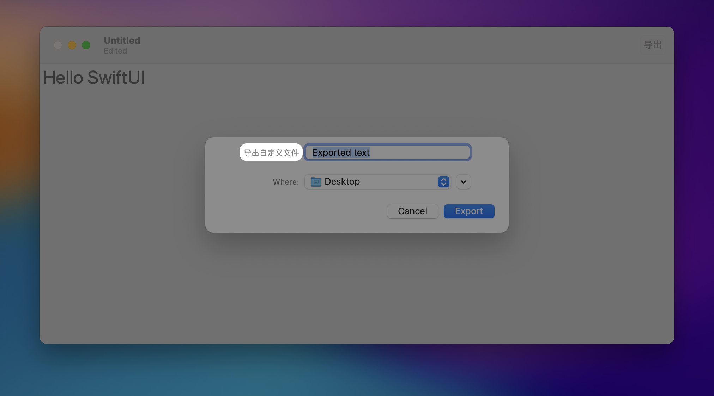

# Exporting to file

## `fileExporter(isPresented:documents:contentType:onCompletion:)`

展示一个系统界面，用于将存储在值类型（如结构体）中的文档导出到磁盘上的文件。


```swift
func fileExporter<C>(
    isPresented: Binding<Bool>,
    documents: C,
    contentType: UTType,
    onCompletion: @escaping (Result<[URL], any Error>) -> Void
) -> some View where C : Collection, C.Element : ReferenceFileDocument
```

- `isPresented` : 是否应显示界面的绑定。
- `document` : 要导出的内存中文档。
- `contentType` : 用于导出文件的内容类型。
- `onCompletion` : 当操作成功或失败时将调用的回调。

::: tip 提示
- 为了让界面出现，`isPresented` 必须为 `true`，并且 `document` 不能为 `nil`。
- 当操作完成时，在调用 `onCompletion` 之前，`isPresented` 将被设置为 `false`。
- 如果用户取消操作，`isPresented` 将被设置为 `false`，并且 `onCompletion` 将不会被调用。
- 提供的 `contentType` 必须包含在文档类型的 `writableContentTypes` 中，否则将使用第一个有效的可写内容类型。
:::

定义一个自定义的文件格式:


```swift
import SwiftUI
import UniformTypeIdentifiers

struct TextFile: FileDocument {
    // tell the system we support only plain text
    static var readableContentTypes = [UTType.plainText]

    // by default our document is empty
    var text = ""

    // a simple initializer that creates new, empty documents
    init(initialText: String = "") {
        text = initialText
    }

    // this initializer loads data that has been saved previously
    init(configuration: ReadConfiguration) throws {
        if let data = configuration.file.regularFileContents {
            text = String(decoding: data, as: UTF8.self)
        } else {
            throw CocoaError(.fileReadCorruptFile)
        }
    }

    // this will be called when the system wants to write our data to disk
    func fileWrapper(configuration: WriteConfiguration) throws -> FileWrapper {
        let data = Data(text.utf8)
        return FileWrapper(regularFileWithContents: data)
    }
}
```

使用文档 `Document` 场景

```swift
@main
struct MacDemoApp: App {
    var body: some Scene {
        DocumentGroup(newDocument: TextFile()) { file in
            ContentView(document: file.$document)
        }
    }
}
```

导出文件

```swift
struct ContentView: View {

    @Binding var document: TextFile

    @State private var showingExporter = false

    var body: some View {
        
        TextEditor(text: $document.text)
            .font(.largeTitle)
            .toolbar(content: {
                ToolbarItem {
                    Button("导出") {
                        showingExporter = true
                    }.fileExporter(isPresented: $showingExporter, document: document, contentType: .plainText) { result in
                        switch result {
                        case .success(let url):
                            print("Saved to \(url)")
                        case .failure(let error):
                            print(error.localizedDescription)
                        }
                    }
                }
            })
    }
}
```

<video src="../../video/FileExporter.mp4" controls="controls"></video>


## `fileExporterFilenameLabel(_:)`

在 macOS 上，使用 `fileExporterFileNameLabel(_:)` 来配置文件导出器的文件名字段标签。


```swift
.fileExporter(isPresented: $showingExporter, document: document, contentType: .plainText) { result in
    switch result {
    case .success(let url):
        print("Saved to \(url)")
    case .failure(let error):
        print(error.localizedDescription)
    }
}
.fileExporterFilenameLabel("导出自定义文件")
```


