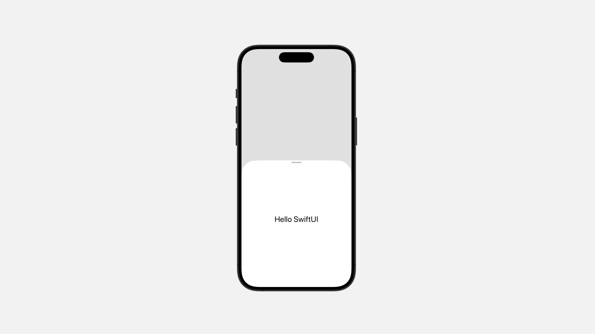
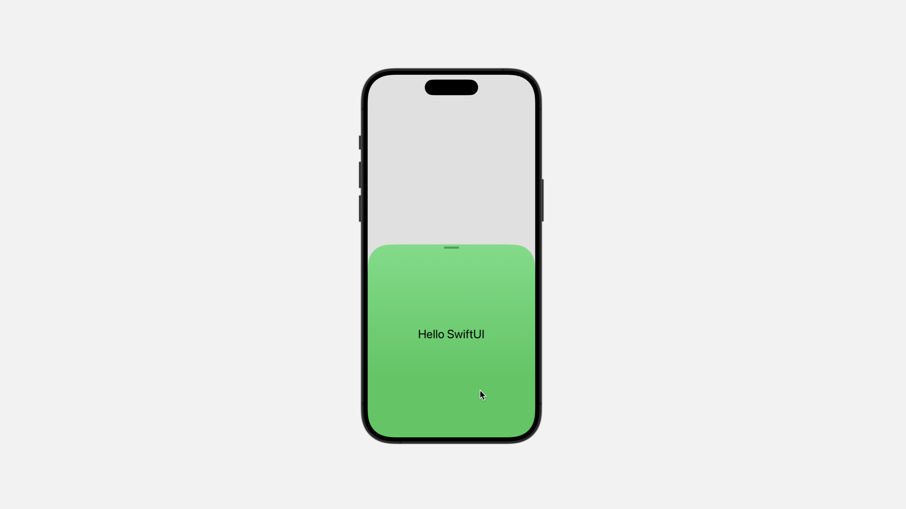
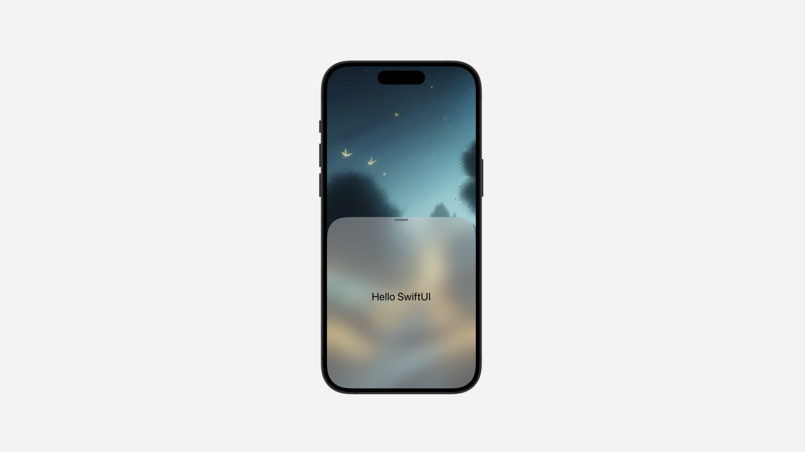
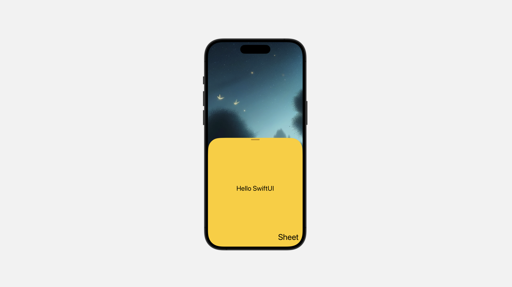

# Styling a sheet and its background

## `presentationCornerRadius(_:)`

要求 `presentation` 具有特定的圆角半径。

```swift
func presentationCornerRadius(_ cornerRadius: CGFloat?) -> some View
```

使用此修改器可以更改 `presentation` 的圆角半径。

```swift{17}
struct ContentView: View {
    
    @State private var showSettings = false
    
    @State private var settingsDetent = PresentationDetent.fraction(0.25)

    var body: some View {
        
        Button("Show Sheet") {
            showSettings.toggle()
        }
        .sheet(isPresented: $showSettings) {
            Color.green
                .ignoresSafeArea()
                .font(.title)
                .presentationDetents([.medium, .large])
                .presentationCornerRadius(50)
        }
    }
}
```



## `presentationBackground(_:)`

使用形状样式设置 `sheet` 的背景。

```swift
func presentationBackground<S>(_ style: S) -> some View where S : ShapeStyle
```

以下示例使用 `.green.gradient` 作为 `sheet` 背景：

```swift{16}
struct ContentView: View {
    
    @State private var showSettings = false
    
    @State private var settingsDetent = PresentationDetent.fraction(0.25)

    var body: some View {
        
        Button("Show Sheet") {
            showSettings.toggle()
        }
        .sheet(isPresented: $showSettings) {
            Text("Hello SwiftUI")
                .ignoresSafeArea()
                .font(.title)
                .presentationBackground(.green.gradient)
                .presentationDetents([.medium, .large])
                .presentationCornerRadius(50)
        }
    }
}
```



`presentationBackground(_:)` 修饰符在几个关键方面与 `background(_:ignoresSafeAreaEdges:)` 修饰符不同。

- 自动填充整个 `presentation`。
- 允许通过半透明样式显示 `presentation` 背后的视图。




## `presentationBackground(alignment:content:)`

可以指定内部视图的对齐方式。

```swift
func presentationBackground<V>(
    alignment: Alignment = .center,
    @ViewBuilder content: () -> V
) -> some View where V : View
```

隐式 `ZStack` 的对齐方式，默认为 `.center`。

```swift{21-27}
struct ContentView: View {
    
    @State private var showSettings = false
    
    @State private var settingsDetent = PresentationDetent.fraction(0.25)

    var body: some View {
        
        Image("demo")
            .resizable()
            .scaledToFill()
            .ignoresSafeArea()
            .overlay {
            Button("Show Sheet") {
                showSettings.toggle()
            }
            .sheet(isPresented: $showSettings) {
                Text("Hello SwiftUI")
                    .ignoresSafeArea()
                    .font(.title)
                    .presentationBackground(alignment: .bottomTrailing){
                        Color.yellow
                        Text("Sheet")
                            .font(.largeTitle)
                            .padding()
                            
                    }
                    .presentationDetents([.medium, .large])
                    .presentationCornerRadius(50)
            }
        }
    
    }
}
```



## `presentationBackgroundInteraction(_:)`

控制是否可以与 `presentation` 背后的视图进行交互。

```swift
func presentationBackgroundInteraction(_ interaction: PresentationBackgroundInteraction) -> some View
```

在许多平台上，SwiftUI 会自动禁用你展示的 `sheet` 后面的视图，以便在人们关闭 `sheet`  之前不能与后面的视图进行交互。如果你想要启用交互，请使用这个修饰符。

以下示例允许人们在表单处于最小位置点时与表单后面的视图进行交互，但在其他位置点时则不允许：

```swift
struct ContentView: View {
    
    @State private var showSettings = false

    @State private var isOn: Bool = false

    var body: some View {
        
        VStack {
            Toggle("开关", isOn: $isOn)
                .padding()
            
            Spacer()
            
            
            Button("View Settings") {
                showSettings.toggle()
            }
            .sheet(isPresented: $showSettings) {
                Text("Hello SwiftUI")
                    .presentationDetents(
                        [.height(120), .medium, .large])
                    .presentationBackgroundInteraction(
                        .enabled(upThrough: .height(120)))
            }
        }
        
    }
}
```
<video src="../../video/PresentationBackgroundInteraction.mp4" controls="controls"></video>

