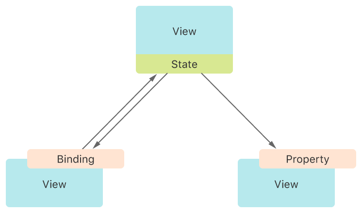

# Model data

管理驱动应用界面所需的数据。

SwiftUI 提供了一种声明式的用户界面设计方法。在你构建一系列视图层次结构的过程中，同时也指明了视图的数据依赖关系。一旦数据发生变化，无论是由于外部事件触发还是用户执行的操作导致，SwiftUI 都会自动更新受影响的界面部分。因此，该框架自动完成了传统上视图控制器所做的大部分工作。

该框架提供了一些工具，如状态变量和绑定，用于将应用程序数据与用户界面连接起来。这些工具有助于你维护应用程序中每一部分数据的单一真实来源，部分原因是减少了所需的粘合逻辑编写量。请选择最适合你任务需求的工具：

1. 通过将值类型包装为 `State` 属性，在视图内部本地管理短暂的UI状态。

2. 通过使用 `Binding` 属性包装器，共享对真相源（如本地状态）的引用。

3. 通过在模型数据类型上应用 `Observable()` 宏，在视图中连接并观察引用模型数据。直接在视图中使用 `State` 属性实例化可观察的模型数据类型。

4. 通过使用 `Environment` 属性包装器，在不传递引用的情况下，将可观察模型数据与视图层次结构中的其他视图共享。

## Leveraging property wrappers

SwiftUI 实现了许多数据管理类型，如 `State` 和 `Binding`，它们都是作为 Swift 属性包装器来实现的。要应用一个属性包装器，只需在属性声明时添加一个带有包装器名称的属性属性。


```swift
@State private var isVisible = true // Declares isVisible as a state variable.
```

应用了属性包装器后，该属性就会具备包装器所定义的行为。SwiftUI中的状态和数据流属性包装器会监视数据的变化，并在必要时自动更新受影响的视图。当你在代码中直接引用该属性时，你访问的是被包装的值。比如在上面的例子中，`isVisible` 状态属性的被包装值就是存储的布尔值。

```swift
if isVisible == true {
    Text("Hello") // Only renders when isVisible is true.
}
```


或者，你可以通过在属性名前加上美元符号 ( `$` ) 来访问属性包装器的投射值。SwiftUI 中的状态和数据流属性包装器投射出一个 `Binding`，这是一个与被包装值的双向连接，使得其他视图能够访问并修改单一的真实来源。

```swift
Toggle("Visible", isOn: $isVisible) // The toggle can update the stored value.
```


## Managing user interface state


将视图特有的数据封装在应用的视图层级结构中，以实现视图的可重用性。

### Overview

将数据作为状态存储在需要该数据的视图的最低共同祖先中，以此来建立一个跨视图共享的单一数据源。通过 Swift 属性以只读形式提供这些数据，或使用绑定创建与状态的双向连接。SwiftUI 会监视数据的变更，并在需要时自动更新受影响的任何视图。



不要使用状态属性进行持久化存储，因为状态变量的生命周期与视图的生命周期相匹配。相反，应使用它们来管理仅影响用户界面的临时状态，例如按钮的高亮状态、过滤器设置或当前选中的列表项。在你准备好对应用程序的数据模型进行更改之前，你可能会发现在原型设计阶段这种存储方式非常方便。

### Manage mutable values as state


如果一个视图需要存储可以修改的数据，可以使用 `State` 属性包装器声明一个变量。例如，你可以在播客播放器视图中创建一个 `isPlaying` 布尔值，用来追踪播客何时正在播放：


```swift
struct PlayerView: View {
    @State private var isPlaying: Bool = false
    
    var body: some View {
        // ...
    }
}
```

将属性标记为状态（ `state` ）告诉框架管理底层的存储。你的视图通过属性名读取和写入状态的 `wrappedValue` 属性中找到的数据。当你改变这个值时，SwiftUI 会更新视图的受影响部分。例如，你可以在 `PlayerView` 中添加一个按钮，当点击时切换存储的值，并根据存储的值显示不同的图像：

```swift
Button(action: {
    self.isPlaying.toggle()
}) {
    Image(systemName: isPlaying ? "pause.circle" : "play.circle")
}
```

通过将状态变量声明为 `private` 来限制它们的作用域。这确保了这些变量保留在声明它们的视图层级结构中，从而实现封装。

### Declare Swift properties to store immutable values

为了向视图提供该视图不修改的数据，可以声明一个标准的 Swift 属性。例如，可以扩展播客播放器，使其包含一个输入结构，该结构包含剧集标题和节目名称的字符串：

```swift
struct PlayerView: View {
    let episode: Episode // The queued episode.
    @State private var isPlaying: Bool = false
    
    var body: some View {
        VStack {
            // Display information about the episode.
            Text(episode.title)
            Text(episode.showTitle)


            Button(action: {
                self.isPlaying.toggle()
            }) {
                Image(systemName: isPlaying ? "pause.circle" : "play.circle")
            }
        }
    }
}
```


虽然 `episode` 属性对于 `PlayerView` 来说是一个常量，但在其父视图中并不需要是常量。当用户在父视图中选择不同的剧集时，SwiftUI 会检测到状态变化，并使用新的输入重新创建 `PlayerView`。

### Share access to state with bindings

如果一个视图需要与其子视图共享状态控制权，可以在子视图中使用 `Binding` 属性包装器声明一个属性。绑定代表对现有存储的引用，为底层数据保持单一的真相来源。例如，如果你将播客播放器视图的按钮重构为一个名为 `PlayButton` 的子视图，你可以为其提供一个指向 `isPlaying` 属性的绑定：

```swift
struct PlayButton: View {
    @Binding var isPlaying: Bool
    
    var body: some View {
        Button(action: {
            self.isPlaying.toggle()
        }) {
            Image(systemName: isPlaying ? "pause.circle" : "play.circle")
        }
    }
}
```

如上所示，你可以直接通过引用属性来读取和写入绑定的 `wrappedValue`，就像处理 `state` 一样。但与 `state` 属性不同的是，绑定没有自己的存储空间。相反，它引用存储在别处的 `state` 属性，并为此存储提供了双向连接。

当你实例化 `PlayButton` 时，通过在其前面加上美元符号（ `$` ）来提供一个与父视图中声明的对应 `state` 变量的绑定：

```swift
struct PlayerView: View {
    var episode: Episode
    @State private var isPlaying: Bool = false
    
    var body: some View {
        VStack {
            Text(episode.title)
            Text(episode.showTitle)
            PlayButton(isPlaying: $isPlaying) // Pass a binding.
        }
    }
}
```

 `$` 前缀用于请求封装属性的投影值，对于状态（ `state` ）而言，它是一个绑定到底层存储的绑定。类似地，你也可以使用 `$` 前缀从一个绑定中获得另一个绑定，这样就可以将绑定通过任意数量的视图层级传递下去。

你还可以获取状态变量中某个特定值的绑定。例如，如果你在播放器的父视图中声明了一个 `episode` 状态变量，并且该 `episode` 结构中还包含一个你想通过切换按钮控制的 `isFavorite` 布尔值，那么你可以通过引用 `$episode.isFavorite` 来获得对剧集收藏状态的绑定：

```swift
struct Podcaster: View {
    @State private var episode = Episode(title: "Some Episode",
                                        showTitle: "Great Show",
                                        isFavorite: false)
    var body: some View {
        VStack {
            Toggle("Favorite", isOn: $episode.isFavorite) // Bind to the Boolean.
            PlayerView(episode: episode)
        }
    }
}
```

### Animate state transitions

当视图状态发生改变时，SwiftUI 会立即更新受影响的视图。如果你想使视觉转换更加平滑，可以通过将触发这些转换的状态改变包裹在 `withAnimation(_:duration:)` 函数的调用中来告诉 SwiftUI 对其进行动画处理。例如，你可以对由 `isPlaying` 布尔值控制的变化进行动画处理：

```swift
withAnimation(.easeInOut(duration: 1)) {
    self.isPlaying.toggle()
}
```

通过在动画函数的尾随闭包内部更改 `isPlaying`，你指示 SwiftUI 对任何依赖于封装值的内容进行动画处理，比如按钮图像上的缩放效果：


```swift
Image(systemName: isPlaying ? "pause.circle" : "play.circle")
.scaleEffect(isPlaying ? 1 : 1.5)
```

SwiftUI 会在给定的值 $1$ 和 $1.5$ 之间随时间过渡缩放效果，使用的曲线和持续时间可以由你指定，如果你没有提供，则使用合理的默认值。另一方面，图像内容不受动画影响，即使同一个布尔值决定了要显示哪个系统图像。这是因为 SwiftUI 无法在 `pause.circle` 和 `play.circle` 这两个字符串之间以有意义的方式逐步过渡。

你可以向状态属性添加动画，或者像上述示例那样，向绑定添加动画。无论哪种方式，只要底层存储值发生变化时发生的视图变化，SwiftUI 都会对这些变化进行动画处理。例如，如果你在 `PlayerView` 中添加一个背景颜色——位于动画块所在视图层次结构的更高级别——SwiftUI 也会对该背景颜色进行动画处理：

```swift
VStack {
    Text(episode.title)
    Text(episode.showTitle)
    PlayButton(isPlaying: $isPlaying)
}
.background(isPlaying ? Color.green : Color.red) // Transitions with animation.
```

当你想将动画应用于特定视图，而不是由状态更改触发的所有视图时，请改用 `animation(_:value:)` 视图修饰符。


## `State`

属性包装器类型，可用于读取和写入由 SwiftUI 管理的值。

```swift
@frozen @propertyWrapper
struct State<Value>
```

### Overview


将 `state` 用作存储在视图层级中的给定值类型的单一数据源。通过在属性声明上应用 @State 属性并提供初始值，在 `App`、`Scene` 或 `View` 中创建一个状态值。将状态声明为私有（ `private` ），以防止在成员初始化器中设置它，这可能与 SwiftUI 提供的存储管理冲突：


```swift
struct PlayButton: View {
    @State private var isPlaying: Bool = false // Create the state.


    var body: some View {
        Button(isPlaying ? "Pause" : "Play") { // Read the state.
            isPlaying.toggle() // Write the state.
        }
    }
}
```

SwiftUI 负责管理该属性的存储。当值发生变化时，SwiftUI 会更新依赖于该值的视图层级的部分。要访问状态的底层值，可以使用其 `wrappedValue` 属性。然而，Swift 提供了一种快捷方式，允许你通过直接引用状态实例来访问封装的值。上面的例子通过直接引用属性来读取和写入 `isPlaying` 状态属性的封装值。

在需要访问该值的视图层级中最高的视图中，将状态声明为私有。然后，可以将状态与任何也需要访问它的子视图共享，对于只读访问可以直接分享，对于读写访问则需提供绑定。可以从任何线程安全地修改状态属性。

### Share state with subviews

如果你将一个状态属性传递给子视图，每当容器视图中的值发生变化时，SwiftUI 都会更新子视图，但子视图不能修改这个值。要让子视图能够修改状态的存储值，应该传递一个 `Binding`。

例如，可以从上述示例中的播放按钮移除 `isPlaying` 状态，并改为让按钮接受一个绑定：

```swift
struct PlayButton: View {
    @Binding var isPlaying: Bool // Play button now receives a binding.

    var body: some View {
        Button(isPlaying ? "Pause" : "Play") {
            isPlaying.toggle()
        }
    }
}
```

然后，你可以定义一个播放器视图，该视图声明状态并为该状态创建一个绑定。通过访问状态的 `projectedValue` 来获取状态值的绑定，这可以通过在属性名前加上美元符号 ( `$` ) 来实现：

```swift
struct PlayerView: View {
    @State private var isPlaying: Bool = false // Create the state here now.

    var body: some View {
        VStack {
            PlayButton(isPlaying: $isPlaying) // Pass a binding.


            // ...
        }
    }
}
```

与 `StateObject` 相同，将 `State` 声明为私有（ `private` ），以防止在成员初始化器中设置它，这可能与 SwiftUI 提供的存储管理产生冲突。与状态对象不同的是，状态总是在声明时通过提供默认值来初始化，如上例所示。请仅将状态用于视图及其子视图的本地存储。


### Store observable objects

你也可以在 `State` 中存储使用 `@Observable()` 宏创建的可观察对象；例如：

```swift
@Observable
class Library {
    var name = "My library of books"
    // ...
}

struct ContentView: View {
    @State private var library = Library()


    var body: some View {
        LibraryView(library: library)
    }
}
```

`State` 属性在 SwiftUI 实例化视图时总会创建其默认值。因此，初始化默认值时应避免副作用和性能密集型工作。例如，如果视图频繁更新，每次视图初始化时都分配一个新的默认对象可能会变得开销很大。作为替代，可以使用 `task(priority:_)` 修饰符延迟对象的创建，它仅在视图首次出现时被调用一次：

```swift
struct ContentView: View {
    @State private var library: Library?


    var body: some View {
        LibraryView(library: library)
            .task {
                library = Library()
            }
    }
}
```


延迟可观察状态对象的创建确保了每次 SwiftUI 初始化视图时不会发生不必要的对象分配。使用 `task(priority:_:)` 修饰符也是推迟创建视图初始状态所需其他类型工作的有效方法，比如网络请求或文件访问。

::: info
可以将遵循 `ObservableObject` 协议的对象存储在 `State` 属性中。但是，视图仅在其对象引用发生变化时更新，例如当使用另一个对象的引用设置属性时。如果对象的任何已发布属性发生变化，视图则不会更新。若要同时跟踪对象引用及其已发布属性的更改，请在存储对象时使用 `StateObject` 而非 `State`。
:::


### Share observable state objects with subviews

要将存储在 `State` 中的可观察对象与子视图共享，可以将对象引用传递给子视图。当对象的可观察属性发生变化时，SwiftUI 会随时更新子视图，但前提是子视图的 `body` 中读取了该属性。例如，在以下代码中，每当 `title` 变化时，`BookView` 都会更新，但当 `isAvailable` 变化时则不会更新：

```swift
@Observable
class Book {
    var title = "A sample book"
    var isAvailable = true
}


struct ContentView: View {
    @State private var book = Book()


    var body: some View {
        BookView(book: book)
    }
}


struct BookView: View {
    var book: Book


    var body: some View {
        Text(book.title)
    }
}
```

状态（ `State` ）属性为其值提供了绑定。当存储一个对象时，你可以获得对该对象的绑定，特别是对该对象引用的绑定。当需要在其他子视图中更改状态中存储的引用时，这非常有用，比如将引用设置为 `nil`：

```swift
struct ContentView: View {
    @State private var book: Book?

    var body: some View {
        DeleteBookView(book: $book)
            .task {
                book = Book()
            }
    }
}


struct DeleteBookView: View {
    @Binding var book: Book?

    var body: some View {
        Button("Delete book") {
            book = nil
        }
    }
}
```

但是，当你需要更改存储在 `State` 中的对象的属性时，传递该对象的绑定通常是不必要的。例如，你可以通过传递对象引用而非引用的绑定到子视图中，直接为对象的属性设置新值：

```swift
struct ContentView: View {
    @State private var book = Book()

    var body: some View {
        BookCheckoutView(book: book)
    }
}


struct BookCheckoutView: View {
    var book: Book

    var body: some View {
        Button(book.isAvailable ? "Check out book" : "Return book") {
            book.isAvailable.toggle()
        }
    }
}

```


如果你需要对象特定属性的绑定，你可以选择传递对象的绑定并在需要的地方提取特定属性的绑定，或者传递对象引用并使用 `@Bindable` 属性包装器来创建特定属性的绑定。以下是一个例子，其中 `BookEditorView` 使用 `@Bindable` 包装了 `book`。然后，视图使用 `$` 语法向 `TextField` 传递了对 `title` 的绑定：

```swift
struct ContentView: View {
    @State private var book = Book()

    var body: some View {
        BookView(book: book)
    }
}

struct BookView: View {
    let book: Book

    var body: some View {
        BookEditorView(book: book)
    }
}

struct BookEditorView: View {
    @Bindable var book: Book

    var body: some View {
        TextField("Title", text: $book.title)
    }
}
```

### `wrappedValue`

状态变量所引用的基础值。

```swift
var wrappedValue: Value { get nonmutating set }
```

此属性提供了对值数据的主要访问途径。然而，通常情况下，你不需要明确地访问 `wrappedValue`。相反，通过引用使用 `@State` 属性创建的属性变量，你就能访问到封装的值。

在以下示例中，按钮的标签依赖于 `isPlaying` 的值，按钮的动作切换 `isPlaying` 的值。这两种情况都隐式地访问了状态属性的封装值：

```swift
struct PlayButton: View {
    @State private var isPlaying: Bool = false

    var body: some View {
        Button(isPlaying ? "Pause" : "Play") {
            isPlaying.toggle()
        }
    }
}
```

### `projectedValue`

对状态值的绑定。

```swift
var projectedValue: Binding<Value> { get }
```

使用投影值来获取存储值的绑定。这个绑定提供了与存储值的双向连接。要访问投影值，需在属性变量前加上美元符号 ( `$` )。

在以下示例中，`PlayerView` 将状态属性 `isPlaying` 的绑定通过 `$isPlaying` 投影到 `PlayButton` 视图中，使得播放按钮既能读取也能修改这个值：

```swift
struct PlayerView: View {
    var episode: Episode
    @State private var isPlaying: Bool = false

    var body: some View {
        VStack {
            Text(episode.title)
                .foregroundStyle(isPlaying ? .primary : .secondary)
            PlayButton(isPlaying: $isPlaying)
        }
    }
}

```

## `Bindable`

一种属性包装器类型，支持创建到可观察对象的可变属性的绑定。

```swift
@dynamicMemberLookup @propertyWrapper
struct Bindable<Value>
```


使用此属性包装器可以针对遵循 `Observable` 协议的数据模型对象的可变属性创建绑定。例如，以下代码使用 `@Bindable` 包裹了 `book` 输入。然后，它使用 `TextField` 改变书籍的标题属性，并使用 `Toggle` 改变 `isAvailable` 属性，通过 `$` 语法分别为这些控件传递每个属性的绑定：

```swift
@Observable
class Book: Identifiable {
    var title = "Sample Book Title"
    var isAvailable = true
}

struct BookEditView: View {
    @Bindable var book: Book
    @Environment(\.dismiss) private var dismiss

    var body: some View {
        Form {
            TextField("Title", text: $book.title)

            Toggle("Book is available", isOn: $book.isAvailable)

            Button("Close") {
                dismiss()
            }
        }
    }
}
```

可以将 `Bindable` 属性包装器应用于可观察对象的属性和变量上。这包括全局变量、存在于 SwiftUI 类型之外的属性，甚至是局部变量。例如，你可以在视图的 `body` 内部创建一个 `@Bindable` 变量：

```swift
struct LibraryView: View {
    @State private var books = [Book(), Book(), Book()]

    var body: some View {
        List(books) { book in
            @Bindable var book = book
            TextField("Title", text: $book.title)
        }
    }
}
```


`@Bindable` 变量 `book` 提供了一个绑定，将 `TextField` 与书籍的 `title` 属性相连，以便用户能直接对模型数据进行修改。

当你需要对存储在视图环境中的可观察对象的属性创建绑定时，可以采用相同的方法。例如，下面的代码使用 `Environment` 属性包装器来检索一个 `Book` 类型的实例。然后，代码创建了一个 `@Bindable` 变量 `book`，并使用 `$` 语法将 `title` 属性的绑定传递给 `TextField`：

```swift
struct TitleEditView: View {
    @Environment(Book.self) private var book

    var body: some View {
        @Bindable var book = book
        TextField("Title", text: $book.title)
    }
}
```

## `Binding`

属性包装器类型，用于读取和写入由单一数据源拥有的值。

```swift
@frozen @propertyWrapper @dynamicMemberLookup
struct Binding<Value>
```


使用绑定在存储数据的属性和显示及更改数据的视图之间创建双向连接。绑定将属性与存储在别处的真相来源相连接，而不是直接存储数据。例如，一个在播放和暂停之间切换的按钮可以通过 `Binding` 属性包装器创建到其父视图的属性的绑定。

```swift
struct PlayButton: View {
    @Binding var isPlaying: Bool

    var body: some View {
        Button(isPlaying ? "Pause" : "Play") {
            isPlaying.toggle()
        }
    }
}
```

父视图声明一个属性来保存播放状态，并使用 `State` 属性包装器来指示该属性是该值的「单一数据源」（ `source of truth` ）。

```swift
struct PlayerView: View {
    var episode: Episode
    @State private var isPlaying: Bool = false


    var body: some View {
        VStack {
            Text(episode.title)
                .foregroundStyle(isPlaying ? .primary : .secondary)
            PlayButton(isPlaying: $isPlaying) // Pass a binding.
        }
    }
}
```

当 `PlayerView` 初始化 `PlayButton` 时，它将其状态属性的绑定传递给了按钮的绑定属性。对包装值应用 `$` 前缀会返回其投影值，而对于 `State` 属性包装器，这会返回对值的绑定。

每当用户点击 `PlayButton` 时，`PlayerView` 就会更新其 `isPlaying` 状态。

::: info
要为遵循 `Observable` 协议的类型创建属性绑定，请使用 `Bindable` 属性包装器。有关更多信息，请参阅「[ Migrating from the Observable Object protocol to the Observable macro](https://developer.apple.com/documentation/swiftui/migrating-from-the-observable-object-protocol-to-the-observable-macro)」。

:::


## `Observable()`

定义并实现 Observable 协议的遵循。

```swift
@attached(member, names: named(_$observationRegistrar), named(access), named(withMutation)) @attached(memberAttribute) @attached(extension, conformances: Observable) macro Observable()
```


此宏向自定义类型添加观察支持，并使该类型遵循 `Observable` 协议。例如，以下代码将 `Observable` 宏应用于 `Car` 类型，使其成为可观察的：

```swift
@Observable 
class Car {
    var name: String = ""
    var needsRepairs: Bool = false

    init(name: String, needsRepairs: Bool = false) {
        self.name = name
        self.needsRepairs = needsRepairs
    }
}
```

## `StateObject`

一个属性包装器类型，用于实例化一个可观测对象。

```swift
@frozen @propertyWrapper
struct StateObject<ObjectType> where ObjectType : ObservableObject
```

使用状态对象作为存储在视图层级中的引用类型单一真相来源。你可以在 `App`、`Scene` 或 `View` 中通过将 `@StateObject` 属性应用于属性声明并提供一个遵循 `ObservableObject` 协议的初始值来创建一个状态对象。将状态对象声明为私有( `private` )，以防止从成员初始化器中设置它们，这可能与 SwiftUI 提供的存储管理冲突：

```swift
class DataModel: ObservableObject {
    @Published var name = "Some Name"
    @Published var isEnabled = false
}

struct MyView: View {
    @StateObject private var model = DataModel() // Create the state object.

    var body: some View {
        Text(model.name) // Updates when the data model changes.
        MySubView()
            .environmentObject(model)
    }
}

```

在声明状态对象的容器生命周期中，SwiftUI 仅在容器的生存期内为模型对象创建一次新实例。例如，如果视图的输入发生变化，SwiftUI 不会创建新实例；但如果有视图的身份发生变化，则会创建新的实例。当可观测对象的已发布属性发生更改时，SwiftUI 会更新依赖于这些属性的任何视图，就像上述示例中的 `Text` 视图一样。


::: info

如果你需要存储一个值类型，比如结构体、字符串或整数，请改用 `State` 属性包装器。同样，如果你需要存储遵循 `ObservableObject` 协议的引用类型，也应使用 `State`。要想了解更多关于 SwiftUI 中观察机制的信息，请参阅「[ Managing model data in your app](https://developer.apple.com/documentation/swiftui/managing-model-data-in-your-app)」。

:::


### Share state objects with subviews

你可以通过带有 `ObservedObject` 属性的属性将状态对象传入子视图。或者，通过向视图层次结构中的视图（如上述代码中的 `MySubView` ）应用 `environmentObject(_:)` 修饰符，将对象添加到环境之中。然后，你可以在 `MySubView` 或其任何后代视图中使用 `@EnvironmentObject` 属性来读取该对象：

这意味着，要在一个子视图中使用由父视图管理的状态对象，有两种方式：一是直接将带有 `@ObservedObject` 属性的该对象作为参数传递给子视图；二是利用环境（ `environment` ），通过在父视图上调用 `environmentObject(_:)` 方法将对象注入环境，之后在子视图及子视图的下级中，通过声明 `@EnvironmentObject` 属性来访问该对象。这种方式使得数据在视图间传递更加灵活和解耦。

```swift
struct MySubView: View {
    @EnvironmentObject var model: DataModel

    var body: some View {
        Toggle("Enabled", isOn: $model.isEnabled)
    }
}
```


使用美元符号( `$` )操作符获取到状态对象属性的 `Binding`。当你希望创建双向连接时使用绑定。在上面的代码中，`Toggle` 控件通过一个绑定控制着模型的 `isEnabled` 值。

### Initialize state objects using external data

当状态对象的初始状态依赖于其容器外部的数据时，你可以在容器的初始化器内部显式地调用该对象的初始化器。例如，假设之前的示例中的数据模型在初始化期间需要一个名称输入，而你想使用来自视图外部的值作为该名称。你可以在为视图创建的显式初始化器内部，通过对状态对象的初始化器进行调用来实现这一点：

```swift
struct MyInitializableView: View {
    @StateObject private var model: DataModel

    init(name: String) {
        // SwiftUI ensures that the following initialization uses the
        // closure only once during the lifetime of the view, so
        // later changes to the view's name input have no effect.
        _model = StateObject(wrappedValue: DataModel(name: name))
    }

    var body: some View {
        VStack {
            Text("Name: \(model.name)")
        }
    }
}
```


进行此操作时需谨慎。SwiftUI 仅在给定视图中首次调用状态对象的初始化器时初始化该对象。这样可以确保即使视图的输入发生变化，该对象也能提供稳定的存储。但是，如果你显式地初始化状态对象，可能会导致意外的行为或产生不希望的副作用。

在上述示例中，如果传给 `MyInitializableView` 的名称输入发生变化，SwiftUI 会使用新值重新运行视图的初始化器。然而，你提供给状态对象初始化器的自动闭包仅在首次调用状态对象的初始化器时执行，因此模型中存储的名称值不会改变。

当状态对象所依赖的外部数据在其容器的每个实例中都不变时，显式状态对象初始化工作得很好。例如，你可以使用不同的固定名称创建两个视图：

```swift
var body: some View {
    VStack {
        MyInitializableView(name: "Ravi")
        MyInitializableView(name: "Maria")
    }
}
```


::: warning 注意
即使是对可配置的状态对象，你也应将其声明为私有( `private` )。这样做可以确保不会不小心通过视图的成员初始化器来设置参数，因为这样做可能会与框架的存储管理冲突，并导致不可预料的结果。
:::

### Force reinitialization by changing view identity

如果你希望当视图的输入发生变化时，SwiftUI 能够重新初始化状态对象，确保此时视图的身份也随之改变。实现这一目的的一种方法是使用 `id(_:)` 修饰符将视图的身份绑定到发生变化的值上。例如，你可以确保当 `MyInitializableView` 的名称输入改变时，其实例的身份会发生变化：

```swift
MyInitializableView(name: name)
.id(name) // Binds the identity of the view to the name property.
```

::: info
如果你的视图出现在 `ForEach` 中，它会隐式地接收一个使用相应数据元素标识符的 `id(_:)` 修饰符。
:::

如果你需要视图根据多个值的变化来重新初始化状态，你可以使用 `Hasher` 将这些值组合成一个单一的标识符。例如，如果你想在 `MyInitializableView` 中当 `name` 或 `isEnabled` 的值发生变化时更新数据模型，你可以将这两个变量合并成一个哈希值：


```swift
var hash: Int {
    var hasher = Hasher()
    hasher.combine(name)
    hasher.combine(isEnabled)
    return hasher.finalize()
}
```

然后将组合后的哈希值作为标识符应用于视图中：

```swift
MyInitializableView(name: name, isEnabled: isEnabled)
.id(hash)
```

每次输入变化时重新初始化状态对象请注意其带来的性能开销。此外，改变视图身份可能会带来副作用。例如，如果视图的身份同时发生变化，SwiftUI 不会自动对视图内部的变化进行动画处理。而且，改变身份会重置视图保存的所有状态，包括你作为 `State`、`FocusState`、`GestureState` 等管理的值。


## `ObservedObject`

一种属性包装器类型，它订阅一个可观测对象并在该对象发生改变时使视图失效。

```swift
@propertyWrapper @frozen
struct ObservedObject<ObjectType> where ObjectType : ObservableObject
```


当输入是一个 `ObservableObject` 且你希望视图在对象的已发布属性变化时更新时，向 SwiftUI 视图的参数添加 `@ObservedObject` 属性。通常，这是为了将一个 `StateObject` 传入子视图。

以下示例定义了一个作为可观测对象的数据模型，在视图中实例化该模型为状态对象，然后将其实例作为被观察对象传递给子视图：


```swift
class DataModel: ObservableObject {
    @Published var name = "Some Name"
    @Published var isEnabled = false
}

struct MyView: View {
    @StateObject private var model = DataModel()

    var body: some View {
        Text(model.name)
        MySubView(model: model)
    }
}

struct MySubView: View {
    @ObservedObject var model: DataModel

    var body: some View {
        Toggle("Enabled", isOn: $model.isEnabled)
    }
}
```

当可观测对象的任何已发布属性发生变化时，SwiftUI 会更新依赖于该对象的任何视图。子视图也可以对模型属性进行更新，正如上述示例中的 `Toggle` 那样，这些更新会传播到视图层级结构中的其他观察者。

对于被观察对象，不要指定默认值或初始值。此属性仅应用于作为视图输入的属性，如上述示例所示。

::: danger 注意

不要使用 `@ObservedObject` 包裹遵循 `Observable` 协议的对象。SwiftUI 会自动跟踪在 `body` 内部使用的可观测对象的依赖关系，并在数据变化时更新相关依赖视图。尝试使用 `@ObservedObject` 包裹一个可观测对象可能会导致编译错误，因为它要求被包裹的对象必须遵循 `ObservableObject` 协议。

如果视图在其 `body` 中需要绑定到可观测对象的某个属性，应改用 `@Bindable` 属性包装器来包裹该对象；例如，`@Bindable var model: DataModel`。更多信息，请参阅「[Managing model data in your app](https://developer.apple.com/documentation/swiftui/managing-model-data-in-your-app)」。

:::

## `ObservableObject`

一种具有发布者类型的对象，在对象发生更改之前发出信号。

```swift
protocol ObservableObject : AnyObject
```

默认情况下，`ObservableObject` 会合成一个 `objectWillChange` 发布者，该发布者在它的任何 `@Published` 属性更改之前发出即将更改的通知。

```swift
class Contact: ObservableObject {
    @Published var name: String
    @Published var age: Int

    init(name: String, age: Int) {
        self.name = name
        self.age = age
    }

    func haveBirthday() -> Int {
        age += 1
        return age
    }
}

let john = Contact(name: "John Appleseed", age: 24)
cancellable = john.objectWillChange
    .sink { _ in
        print("\(john.age) will change")
}
print(john.haveBirthday())
// Prints "24 will change"
// Prints "25"
```

## `onChange(of:initial:_:)`

为该视图添加一个修饰符，当特定值发生变化时触发一个动作。

```swift
func onChange<V>(
    of value: V,
    initial: Bool = false,
    _ action: @escaping () -> Void
) -> some View where V : Equatable
```


你可以使用 `onChange` 在某个值变化时触发副作用，比如环境键( `Environment key` )或绑定( `Binding` )的变化。

系统可能会在主线程执行器上调用动作闭包，因此请避免在闭包中执行长时间运行的任务。如果需要执行这类任务，请分离出一个异步后台任务。

当值发生变化时，闭包的新版本会被调用，所以任何被捕获的值都将采用观察值拥有新值时的值。在下面的代码示例中，当 `playState` 变化时，`PlayerView` 会调用其模型( `model` )。

```swift
struct PlayerView: View {
    var episode: Episode
    @State private var playState: PlayState = .paused

    var body: some View {
        VStack {
            Text(episode.title)
            Text(episode.showTitle)
            PlayButton(playState: $playState)
        }
        .onChange(of: playState) {
            model.playStateDidChange(state: playState)
        }
    }
}
```

## `onReceive(_:perform:)`

当此视图检测到由给定发布者发出的数据时，添加一个执行的动作。

```swift
func onReceive<P>(
    _ publisher: P,
    perform action: @escaping (P.Output) -> Void
) -> some View where P : Publisher, P.Failure == Never
```

假设你有一个定时器作为数据源，它每秒发出当前的日期和时间。你可以这样使用 `onReceive` 来更新你的视图：

```swift
import SwiftUI
import Combine

struct ContentView: View {
    @State private var currentTime = Date()

    var body: some View {
        Text("Current time: \(currentTime)")
            .onReceive(Timer.publish(every: 1, on: .main, in: .common).autoconnect(), perform: { time in
                self.currentTime = time
            })
    }
}

```

## `environmentObject(_:)`

为视图层次结构提供一个可观测对象。

```swift
func environmentObject<T>(_ object: T) -> some View where T : ObservableObject
```

使用此修饰符将一个可观测对象添加到视图的环境之中。该对象必须遵循 `ObservableObject` 协议。

将对象添加到视图的环境后，视图层级中的子视图就可以访问到这个对象。要在子视图中检索这个对象，使用 `@EnvironmentObject` 属性包装器。

::: info
如果可观测对象遵循 `Observable` 协议，可以使用 `environment(_:)` 或 `environment(_:default:)` 修饰符将对象添加到视图的环境中。
:::

