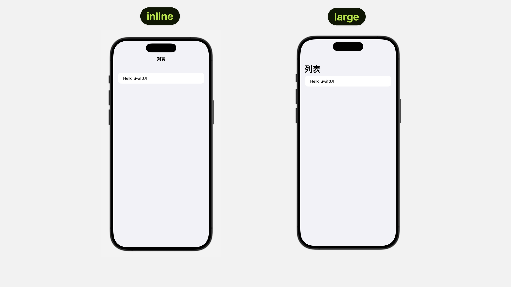
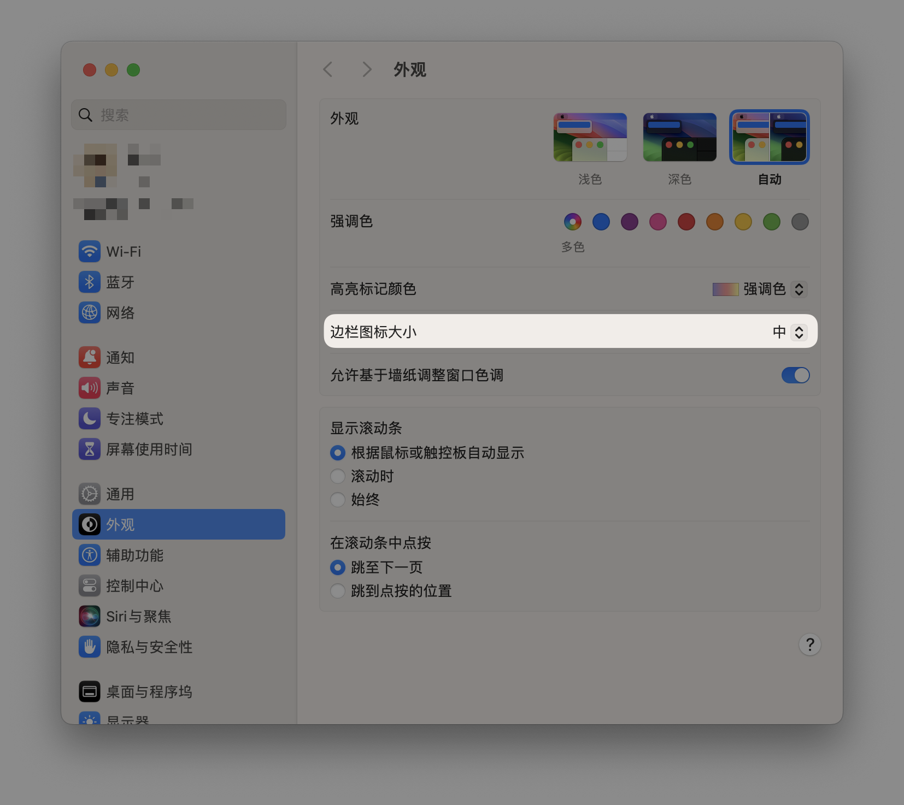
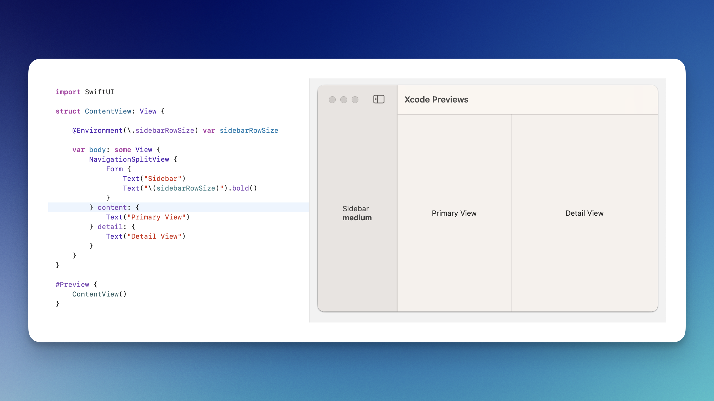

# Configuring the navigation bar

## `navigationBarBackButtonHidden(_:)`

隐藏视图的导航栏后退按钮。

```swift
func navigationBarBackButtonHidden(_ hidesBackButton: Bool = true) -> some View
```

::: warning 注意
仅当此视图位于 `NavigationView` 内部且在 `NavigationView` 中可见时，此修饰符才会生效。
:::


```swift
NavigationStack {
    Form{
        NavigationLink {
            CustomizedBackButtonView()
        } label: {
            Text("Hello SwiftUI")
        }
    }.navigationTitle("列表")
}


struct CustomizedBackButtonView: View {

    @Environment(\.dismiss) var dismiss

    var body: some View {
        Text("Hello, World!")
            .toolbar(content: {
                ToolbarItem(placement: .cancellationAction) {
                    Button("后退") {
                        dismiss()
                    }
                }
            })
            .navigationBarBackButtonHidden()
    }
}
```

<video src="../../video/NavigationBarBackButtonHidden.mp4" controls="controls"></video>


## `navigationBarTitleDisplayMode(_:)`

配置该视图的标题显示模式。

```swift
func navigationBarTitleDisplayMode(_ displayMode: NavigationBarItem.TitleDisplayMode) -> some View
```
- `automatic`: 继承上一个导航项的显示模式。
- `inline`: 在导航栏的标准范围内显示标题。
- `large`: 在扩展的导航栏中显示大标题。



## `sidebarRowSize`

侧边栏行的当前大小。

```swift
var sidebarRowSize: SidebarRowSize { get set }
```

在 macOS 上，侧边栏行具有三种不同的大小：小、中和大。

大小主要由当前用户在外观设置中的「边栏图标大小」控制，适用于所有应用程序。



在所有其他平台上（除了 macOS），唯一支持的侧边栏大小是 `.medium`。

可以使用 `EnvironmentValues.sidebarRowSize` 在环境中读取此大小。




