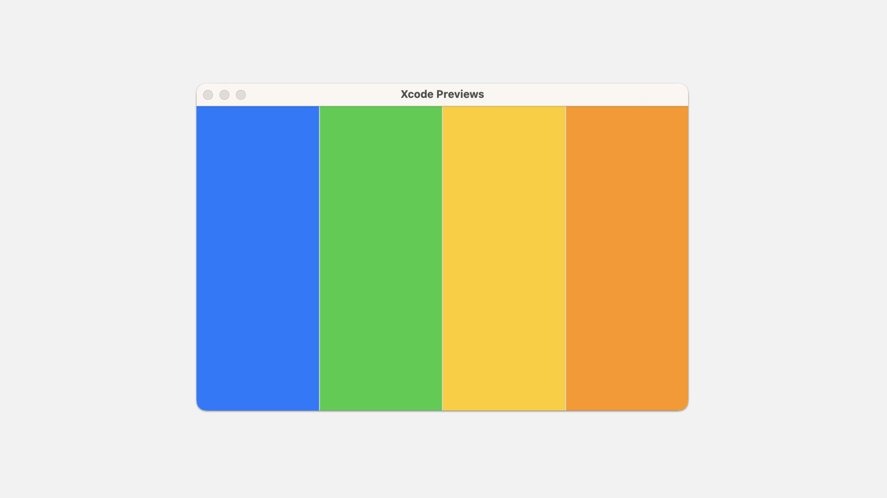
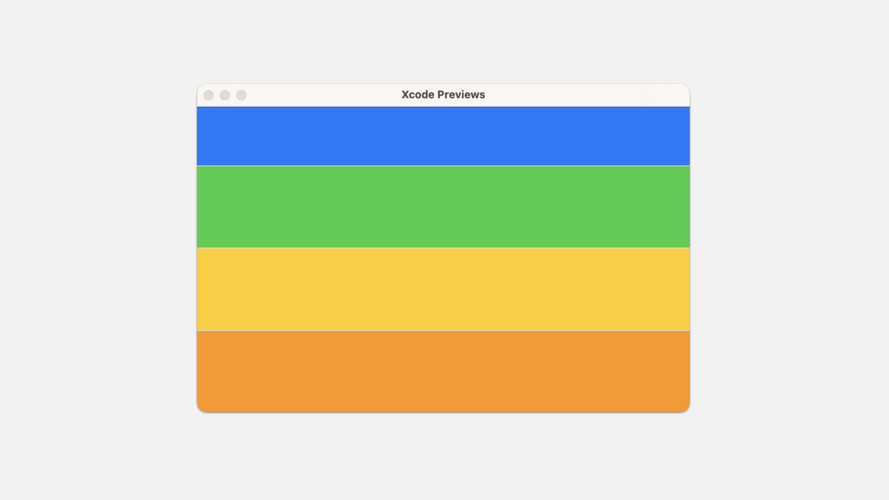

# Displaying views in multiple panes <Badge type="tip" text="macOS" />

## `HSplitView`

```swift
struct HSplitView<Content> where Content : View
```

一个布局容器，将其子级排列在水平线上，并允许用户使用放置在它们之间的分隔线来调整它们的大小。

```swift
HSplitView(content: {
    Color.blue
    Color.green
    Color.yellow
    Color.orange
})
```




## `VSplitView`

```swift
struct VSplitView<Content> where Content : View
```

一个布局容器，将其子项排列在垂直线上，并允许用户使用放置在它们之间的分隔线来调整它们的大小。

```swift
VSplitView(content: {
    Color.blue
    Color.green
    Color.yellow
    Color.orange
})
```

