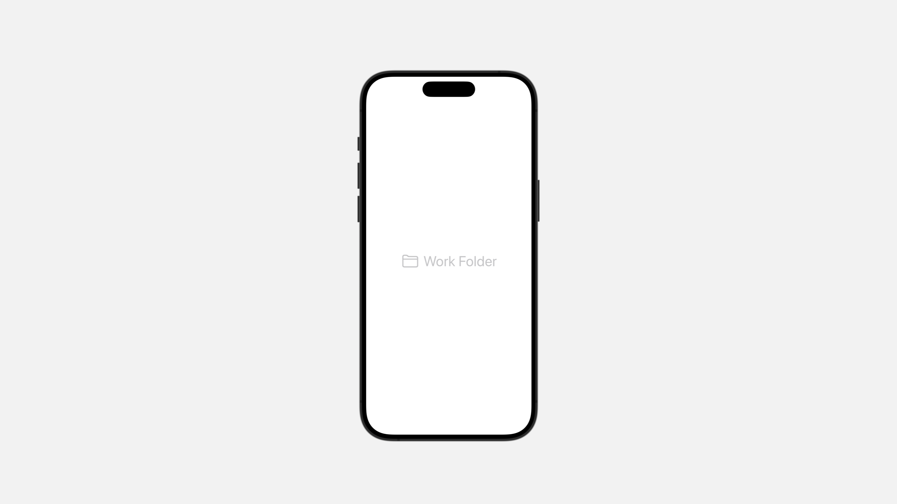

# Presenting views in columns

使用导航容器为应用程序的用户界面提供结构，使人们能够轻松地在应用程序的各个部分之间移动。

例如，人们可以使用 `NavigationStack` 在一堆视图中向前和向后移动，或者使用 `TabView` 从选项卡栏中选择要显示的视图。


通过向容器添加诸如 `navigationSplitViewStyle(_:)` 之类的视图修饰符来配置导航容器。

在容器内的视图上使用其他修饰符可以影响容器在显示该视图时的行为。

例如，你可以在视图上使用 `navigationTitle(_:)` 来提供在显示该视图时显示的工具栏标题。


## `NavigationSplitView`

以两列或三列表示视图的视图，其中前导列中的选择控制后续列的表示。

```swift
struct NavigationSplitView<Sidebar, Content, Detail> where Sidebar : View, Content : View, Detail : View
```

你可以创建一个包含两到三列的导航分屏视图，并通常将其用作场景中的根视图。

人们在前导列中选择一个或多个项目，以便在后续列中显示有关这些项目的详细信息。


要创建一个两列导航的分屏视图，使用 `init(sidebar:detail:)` 初始化器:

```swift
NavigationSplitView {
    Text("Sidebar")
} content: {
    Text("Primary View")
} detail: {
    Text("Detail View")
}
```

<video src="../../video/NavigationSplitView.mp4" controls="controls"></video>

你还可以将 `NavigationStack` 嵌入到列中，点击或单击出现在较早列中的 `NavigationLink` 可设置堆栈在其根视图上显示的视图，激活同一列中的链接会将视图添加到堆栈中。

无论哪种方式，链接都必须提供一种数据类型，堆栈具有相应的 `navigationDestination(for:destination:)` 修饰符。
在 watchOS 和 tvOS 上，以及 iPhone 或 iPad 上的 Slide Over 等窄尺寸情况下，导航分割视图会将其所有列折叠成一个堆栈，并显示显示有用信息的最后一列。


### Control column visibility

你可以通过创建 `NavigationSplitViewVisibility` 类型的 `State` 值以编程方式控制导航拆分视图列的可见性。

然后将该状态的 `Binding` 传递给适当的初始化程序 - 例如两列的 `init(columnVisibility:sidebar:detail:)` 或三列的 `init(columnVisibility:sidebar:content:detail:)`。

以下代码更新了上面的第一个示例，以在视图出现时始终隐藏第一列：


```swift
@State private var employeeIds: Set<Employee.ID> = []
@State private var columnVisibility =
    NavigationSplitViewVisibility.detailOnly


var body: some View {
    NavigationSplitView(columnVisibility: $columnVisibility) {
        List(model.employees, selection: $employeeIds) { employee in
            Text(employee.name)
        }
    } detail: {
        EmployeeDetails(for: employeeIds)
    }
}
```

<video src="../../video/NavigationSplitViewVisibility.mp4" controls="controls"></video>

当分割视图将其列折叠成堆栈时，它会忽略可见性控制。

### Collapsed split views

在狭窄的尺寸类别中，例如在 iPhone 或 Apple Watch 上，导航拆分视图会折叠成单个堆栈。

通常，SwiftUI 根据拆分视图列的内容自动选择要在该单个堆栈顶部显示的视图。

对于自定义导航体验，你可以提供更多信息来帮助 SwiftUI 选择正确的列。

创建 `NavigationSplitViewColumn` 类型的 `State` 值，然后将该状态的 `Binding` 传递给适当的初始值设定项，例如 `init(preferredCompactColumn:sidebar:detail:)` 或 `init(preferredCompactColumn:sidebar:content:detail:)`。


以下代码显示在 iPhone 上运行时的蓝色详细视图。 当使用该应用程序的人点击后退按钮时，他们会看到黄色视图。 `PreferredPreferredCompactColumn` 的值将从 `.detail` 更改为 `.sidebar`：


```swift
@State private var preferredColumn =
    NavigationSplitViewColumn.detail


var body: some View {
    NavigationSplitView(preferredCompactColumn: $preferredColumn) {
        Color.yellow
    } detail: {
        Color.blue
    }
}
```
<video src="../../video/PreferredPreferredCompactColumn.mp4" controls="controls"></video>


## `NavigationSplitViewVisibility`

导航拆分视图中前导列的可见性。

```swift
struct NavigationSplitViewVisibility
```

使用此类型的值可以控制 `NavigationSplitView` 的列的可见性。

创建具有此类型值的 `State` 属性，并在创建导航拆分视图时将该状态的 `Binding` 传递给 `init(columnVisibility:sidebar:detail:)` 或 `init(columnVisibility:sidebar:content:detail:)` 初始值设定项。然后，你可以将代码中其他位置的值修改为：

- 使用 `detailOnly` 隐藏除尾随列之外的所有列。
- 使用 `doubleColumn` 隐藏三列导航拆分视图的前导列。
- 显示所有列 `all`。
- 使用自动依赖当前上下文的自动行为 `automatic`。

::: tip 提示
有些平台并不适配每个选项。 例如，macOS 始终显示内容列。
:::

## `NavigationLink`

控制导航展示的视图。

```swift
struct NavigationLink<Label, Destination> where Label : View, Destination : View
```

通过点击 `NavigationLink` 以在 `NavigationStack` 或 `NavigationSplitView` 内呈现视图。

你可以通过在 `NavigationLink` 的闭合方法中提供视图内容来控制 `NavigationLink` 的视觉外观。

例如，你可以使用 `Label` 来显示链接：

```swift
NavigationLink {
    FolderDetail(id: workFolder.id)
} label: {
    Label("Work Folder", systemImage: "folder")
        .font(.largeTitle)
}
```



对于仅由文本组成的链接，你可以使用便利构造器的初始值设定项，它采用字符串并为你创建文本视图：


### Link to a destination view

你可以通过使用「目标」闭包中提供的目标视图初始化链接来执行导航。

例如，考虑一个用颜色填充自身的 `ColorDetail` 视图：

```swift
struct ColorDetail: View {
    var color: Color


    var body: some View {
        color.navigationTitle(color.description)
    }
}
```


以下 `NavigationStack` 提供了三个颜色详细视图的链接：

```swift
NavigationStack {
    List {
        NavigationLink("Mint") { ColorDetail(color: .mint) }
        NavigationLink("Pink") { ColorDetail(color: .pink) }
        NavigationLink("Teal") { ColorDetail(color: .teal) }
    }
    .navigationTitle("Colors")
}
```

<video src="../../video/NavigationDestination.mp4" controls="controls"></video>

### Create a presentation link

或者，你可以使用导航链接根据显示的数据值执行导航。

为了支持这一点，请在导航堆栈 `NavigationStack` 中使用 `navigationDestination(for:destination:)` 视图修饰符将视图与某种数据关联起来，然后从导航链接显示该数据类型的值。

以下示例将前面的示例重新实现为一系列演示链接：

```swift
NavigationStack {
    List {
        NavigationLink("Mint", value: Color.mint)
        NavigationLink("Pink", value: Color.pink)
        NavigationLink("Teal", value: Color.teal)
    }
    .navigationDestination(for: Color.self) { color in
        ColorDetail(color: color)
    }
    .navigationTitle("Colors")
}
```

::: tip 提示
将视图与数据分离有利于使用程序式的方式来导航，因为你可以通过记录所呈现的数据来管理导航状态。
:::


### Control a presentation link programmatically

要以编程方式导航，需引入一个跟踪堆栈上的项目的状态变量。

例如，你可以创建一个颜色数组来存储上一个示例中的堆栈状态，并将其初始化为空数组以从空堆栈开始：

```swift
@State private var colors: [Color] = []
```

然后将状态的 `Binding` 传递给导航堆栈：

```swift
NavigationStack(path: $colors) {
    // ...
}
```

你可以使用数组来观察堆栈的当前状态，你还可以修改数组来更改堆栈的内容。

例如，你可以通过编程方式将蓝色添加到数组中，并使用以下方法导航到新的颜色详细信息视图：

```swift
func showBlue() {
    colors.append(.blue)
}
```
<video src="../../video/LinkProgrammatically.mp4" controls="controls"></video>


### Coordinate with a list

你还可以使用导航链接来控制 `NavigationSplitView` 中的列表选择：


```swift
let colors: [Color] = [.mint, .pink, .teal]
@State private var selection: Color? // Nothing selected by default.

var body: some View {
    NavigationSplitView {
        List(colors, id: \.self, selection: $selection) { color in
            NavigationLink(color.description, value: color)
        }
    } detail: {
        if let color = selection {
            ColorDetail(color: color)
        } else {
            Text("Pick a color")
        }
    }
}
```

该列表与导航逻辑相协调，因此在代码的其他部分更改选择状态变量时，可以激活与相应颜色对应的导航链接。

类似地，如果有人选择与特定颜色关联的导航链接，列表将更新选择值，以便代码的其他部分可以读取。

