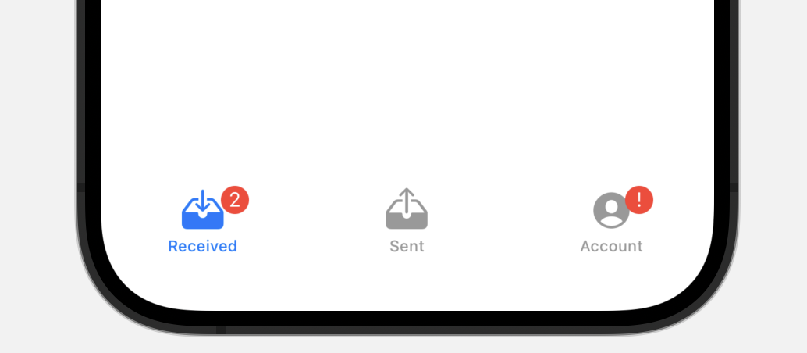

# Presenting views in tabs

## `TabView`

使用交互式用户界面元素在多个子视图之间切换的视图。

```swift
struct TabView<SelectionValue, Content> where SelectionValue : Hashable, Content : View
```


要创建带有选项卡的用户界面，需将视图放置在 `TabView` 中，并将 `tabItem(_:)` 修饰符应用于每个选项卡的内容。

在 iOS 上，你还可以使用徽章修饰符之一（例如 `badge(_:)` ）为每个选项卡分配徽章。


以下示例创建一个包含三个选项卡的选项卡视图，每个选项卡呈现一个自定义子视图，第一个选项卡有一个数字徽章，第三个选项卡有一个字符串徽章。




::: warning 注意
对每个选项卡项使用标签，或者可选地使用文本、图像或图像后跟文本。

传递任何其他类型的视图都会导致可见但空的选项卡项。

:::

## `tabViewStyle(_:)`

设置当前环境中选项卡视图的样式。

### `automatic`

默认样式

### `page`

分页滚动样式。

```swift
TabView {
    ...
}.tabViewStyle(.page)
```

<video src="../../video/PageTabView.mp4" controls="controls"></video>


### `verticalPage` <Badge type="tip" text="watchOS" />

实现垂直页面的交互和外观的样式。

```swift
TabView {
    ...
}.tabViewStyle(.verticalPage)
```
<video src="../../video/VerticalPageTabView.mp4" controls="controls"></video>

## `tabItem(_:)`

设置与此视图关联的选项卡栏项目。

```swift
func tabItem<V>(@ViewBuilder _ label: () -> V) -> some View where V : View
```

使用 `tabItem(_:)` 将视图配置为 `TabView` 中的选项卡栏项目。

下面的示例在 `TabView` 中添加两个视图作为选项卡：

```swift
struct View1: View {
    var body: some View {
        Text("View 1")
    }
}


struct View2: View {
    var body: some View {
        Text("View 2")
    }
}


struct TabItem: View {
    var body: some View {
        TabView {
            View1()
                .tabItem {
                    Label("Menu", systemImage: "list.dash")
                }


            View2()
                .tabItem {
                    Label("Order", systemImage: "square.and.pencil")
                }
        }
    }
}
```

<video src="../../video/TabItem.mp4" controls="controls"></video>
