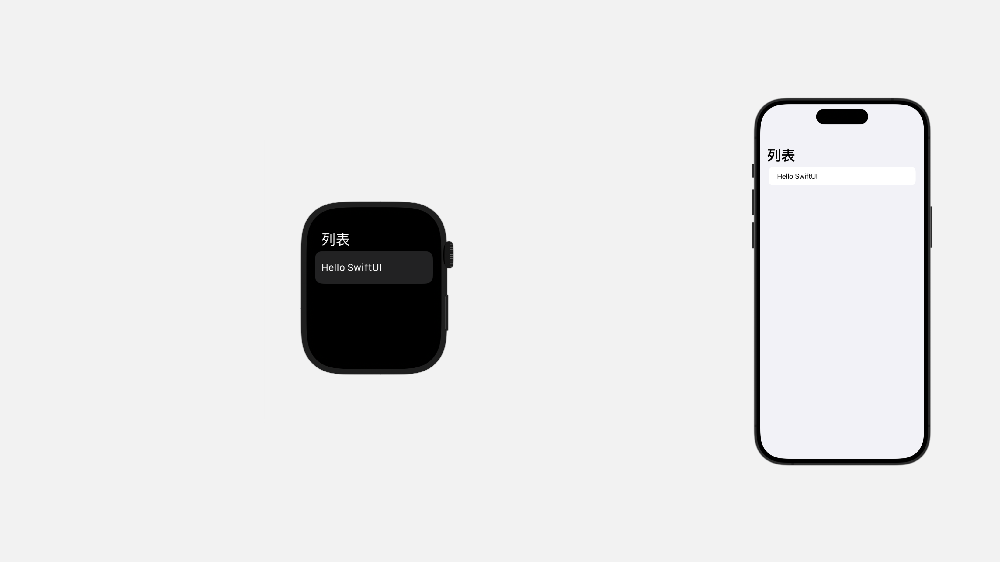
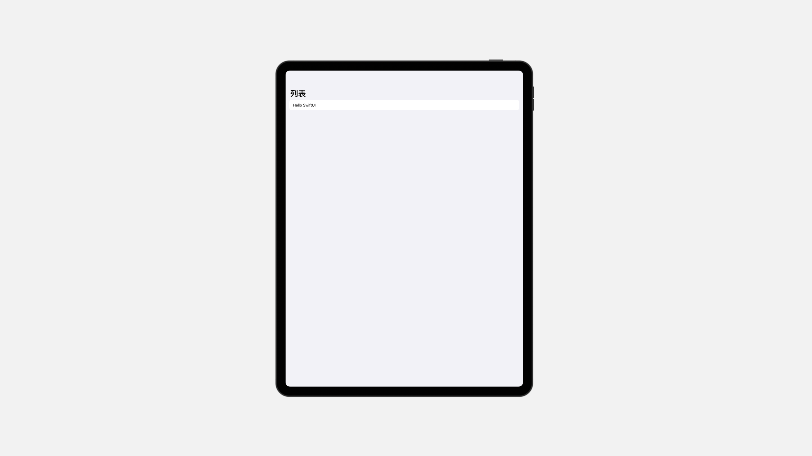
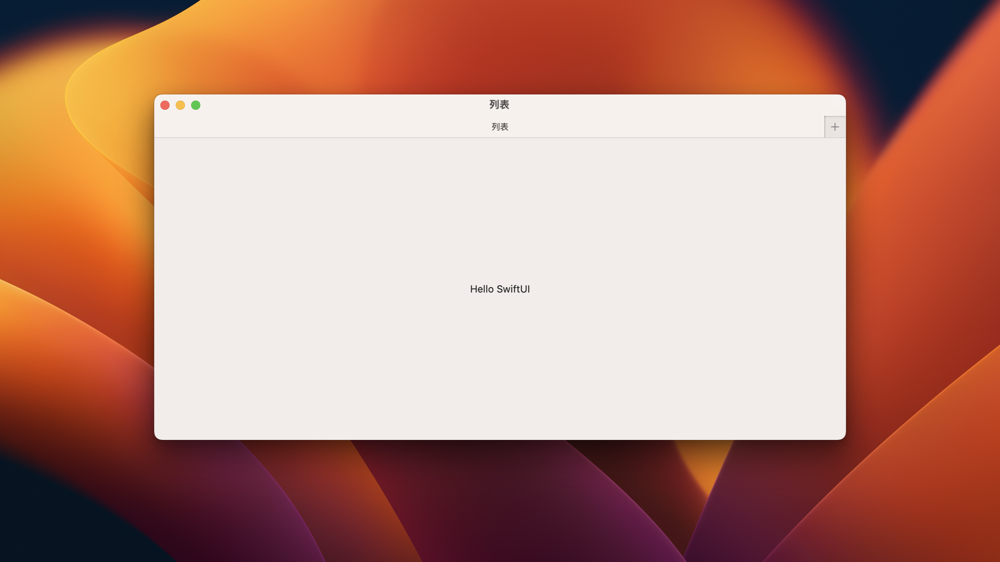
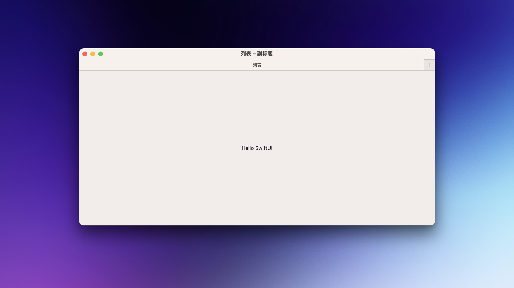
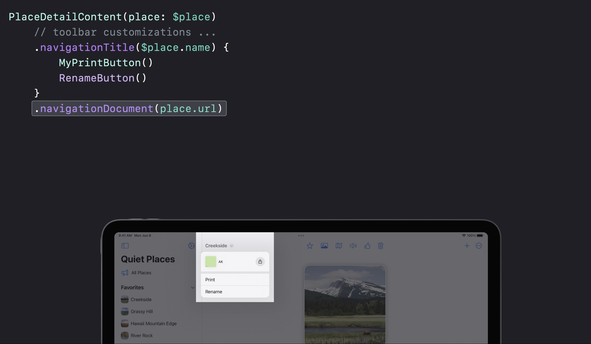

# Setting titles for navigation content

## `navigationTitle(_:)`

使用字符串配置用于导航目的的视图标题。

```swift
NavigationStack {
    Form{
        Text("Hello SwiftUI")
    }.navigationTitle("列表")
}
```

视图的导航标题用于直观地显示界面当前的导航状态。

- 在 iOS 和 watchOS 上，当视图导航到导航视图内部时，该视图的标题将显示在导航栏中。



- 在 iPadOS 上，主要目的地的导航标题在应用程序切换器中反映为窗口标题。



- 与 macOS 类似，主要目的地的标题用作标题栏、Windows 菜单和任务控制中的窗口标题。



## `navigationTitle(_ title: Binding<String>)`

可以通过绑定值，动态修改导航标题。

```swift
@State var title: String = "列表"

NavigationStack {
    Form{
        Text("Hello SwiftUI")
    }.navigationTitle($title)
}
```

## `navigationSubtitle(_:)` <Badge type="tip" text="macOS" />

使用字符串配置用于导航目的的视图副标题。

```swift
NavigationStack {
    Form{
        Text("Hello SwiftUI")
    }.navigationTitle("列表")
    .navigationSubtitle("副标题")
}
```

视图的导航副标题用于在导航标题旁边提供附加上下文信息。

在 macOS 上，主要目的地的副标题与标题栏中的导航标题一起显示。




## `navigationDocument(_:)`

配置视图的用以导航的文档。

```swift
ContentView()
    .navigationTitle("My Title")
    .navigationDocument(myURL)
```

```swift
ContentView()
    .navigationTitle("My Title")
    .navigationDocument(
        myDocument,
        preview: SharePreview(
            "My Preview Title", image: myDocument.image))
```

- 在 iOS、iPadOS 中，这会使用预览文档的标题填充标题菜单。
- 在 macOS 中，这会充当代理图标。

