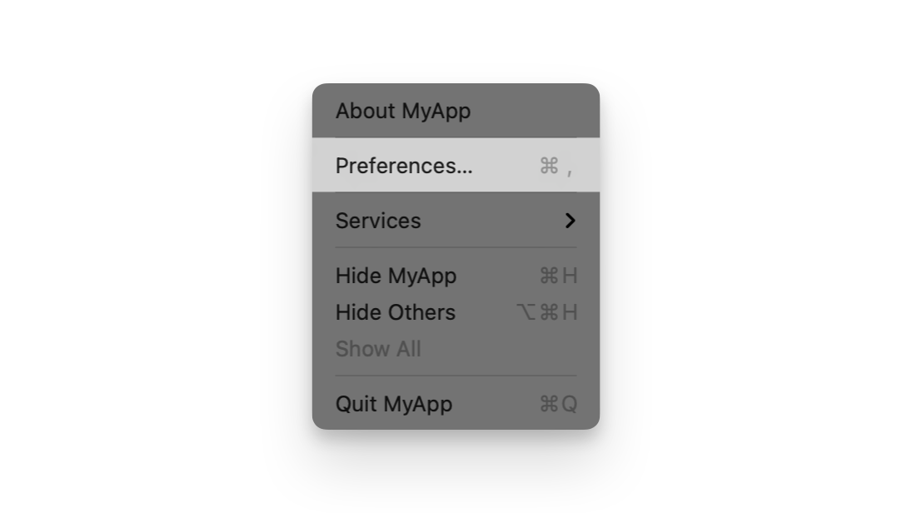
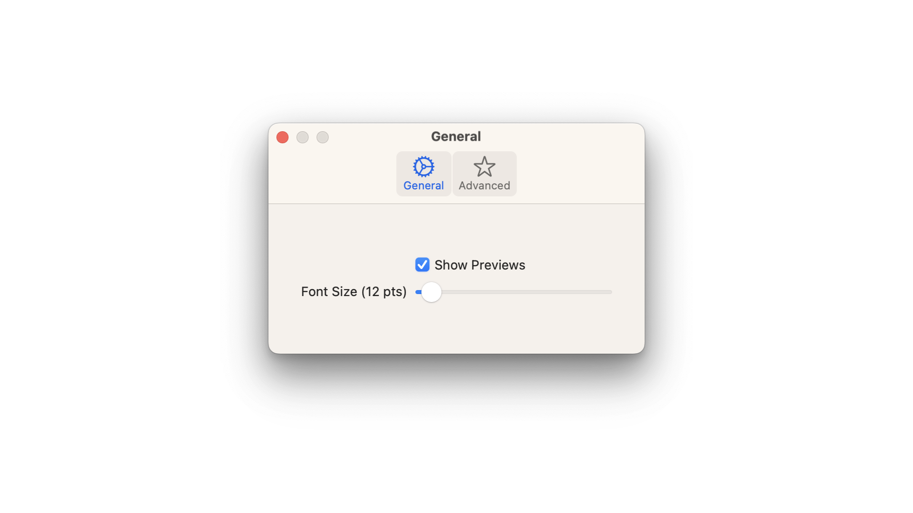
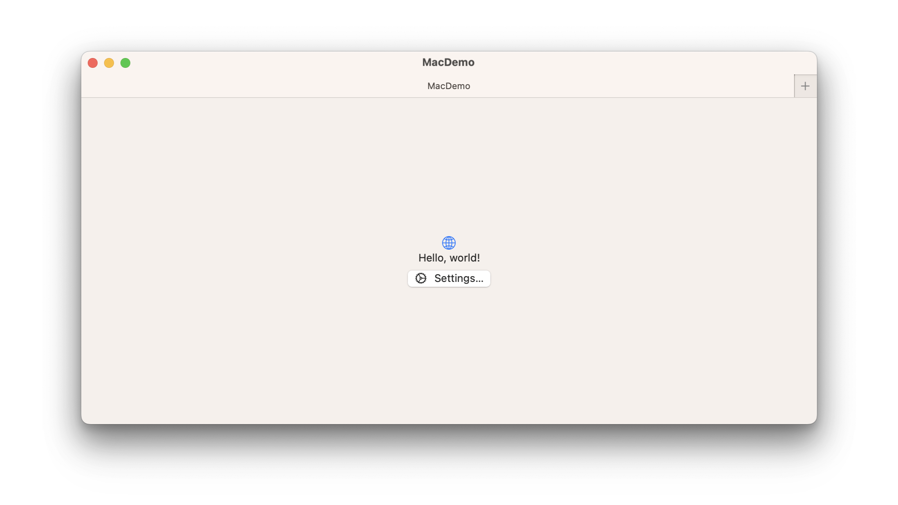
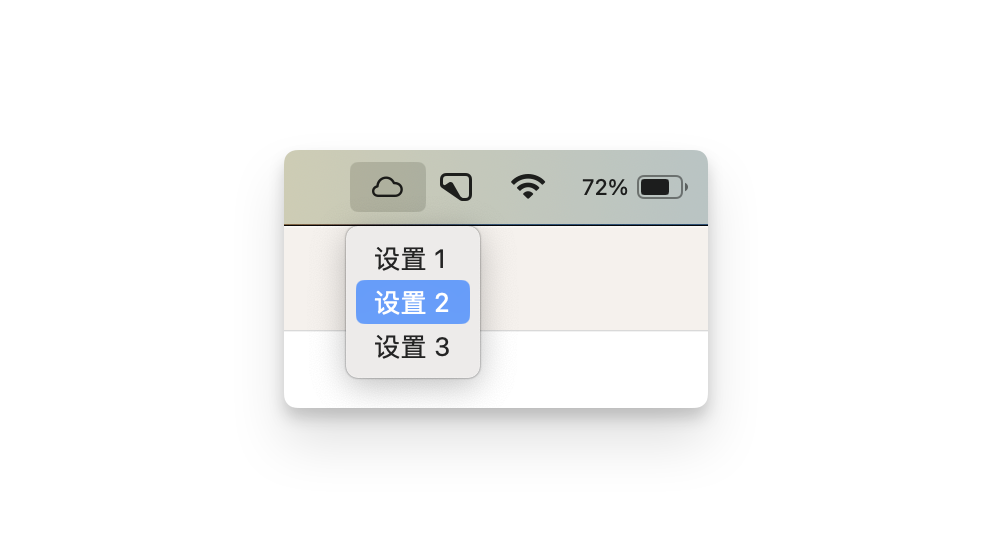
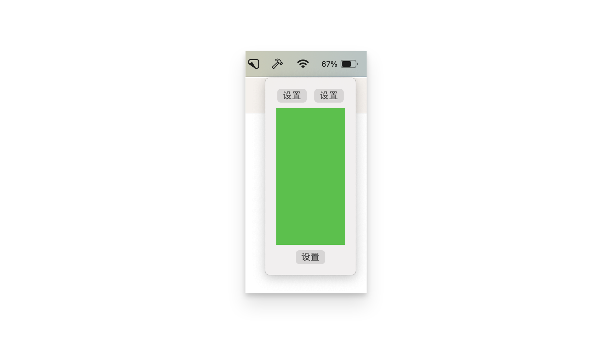

# Scenes 场景

## Creating scenes 创建场景

需要遵循 `Scene` 协议，实现计算属性 `body` 并提供场景内容即可创建一个自定义的场景：

```swift
struct MyScene: Scene {//遵循 Scene 协议
    var body: some Scene { //实现 body 属性 
        WindowGroup {
            MyRootView() //提供场景内容
        }
    }
}

```


## Monitoring scene life cycle 监控场景的生命周期

SwiftUI 提供了一个环境变量 `scenePhase` 访问当前场景的状态：

- `active`: 应用程序处于前台并可接收用户输入。
- `inactive`: 应用程序处于正在转换状态，不是完全活跃也不是完全在后台。
- `background`: 应用程序完全处于后台。

可以通过 `onChange` 方法来监控场景的变化：

```swift
@main
struct MyApp: App {
    @Environment(\.scenePhase) private var scenePhase

    var body: some Scene {
        WindowGroup {
            MyRootView()
        }
        .onChange(of: scenePhase) { phase in
            if phase == .background {
                // Perform cleanup when all scenes within
                // MyApp go to the background.
            }
        }
    }
}
```

::: warning MyScene
如果在自定义场景中使用 `scenePhase`，其同样可返回自定义场景下的状态。
:::

## Managing a settings window  管理设置窗口 <Badge type="tip" text="macOS" />

呈现用于查看和修改应用程序设置的界面的场景。

这个设置只应用于 macOS 平台，当提供了这个场景后，会自动启用应用程序的「设置」菜单：


```swift
@main
struct MyApp: App {
    var body: some Scene {
        WindowGroup {
            ContentView()
        }
        #if os(macOS)
        Settings {
            SettingsView()
        }
        #endif
    }
}
```




场景内容可以是 `TabView`、`Form`等任何视图，不只是容器视图，这里以 `TabView` 为例：

```swift
struct SettingsView: View {
    private enum Tabs: Hashable {
        case general, advanced
    }
    var body: some View {
        TabView {
            GeneralSettingsView()
                .tabItem {
                    Label("General", systemImage: "gear")
                }
                .tag(Tabs.general)
            AdvancedSettingsView()
                .tabItem {
                    Label("Advanced", systemImage: "star")
                }
                .tag(Tabs.advanced)
        }
        .padding(20)
        .frame(width: 375, height: 150)
    }
}
```



### SettingsLink

`SettingsLink` 允许你在应用的其它位置，打开「设置」菜单：

```swift{12}
struct ContentView: View {
    
    @State private var title: String = "title"

    var body: some View {
        VStack {
            Image(systemName: "globe")
                .imageScale(.large)
                .foregroundStyle(.tint)
            Text("Hello, world!")
            
            SettingsLink()
        }
        .padding()
    }
}
```



::: info 重命名
可以通过构造器 `init(label:)` 来修改 `SettingLink` 链接的名称。

```swift
SettingsLink(label: {
    Text("设置")
})
```
:::

## Creating a menu bar extra 创建一个额外的菜单栏 <Badge type="tip" text="macOS" />

将自身呈现为系统菜单栏中的持久控件的场景：

```swift{10-18}
@main
struct MacDemoApp: App {
    
    @AppStorage("showMenuBarExtra") private var showMenuBarExtra = true
        
    var body: some Scene {
        WindowGroup() {
            ContentView()
        }
        MenuBarExtra("App Menu Bar Extra", systemImage: "cloud",isInserted: $showMenuBarExtra){
            
            Button("设置 1", systemImage: "cloud.drizzle") {}
            
            Button("设置 2", systemImage: "cloud.snow") {}
            
            Button("设置 3", systemImage: "cloud.bolt") {}

        }
    }
}
```



如果你是一个纯工具类的应用，甚至可以只展示菜单而无需窗口界面：

```swift
@main
struct UtilityApp: App {
    var body: some Scene {
        MenuBarExtra("Utility App", systemImage: "hammer") {
            AppMenu()
        }
    }
}
```

对于更复杂或数据丰富的菜单栏附加功能，可以使用窗口样式 `window`：

```swift
MenuBarExtra("Utility App", systemImage: "hammer") {
    Grid {
        GridRow {
            Button("设置") {}
            Button("设置") {}
        }
        
        Color.green.frame(width: 100, height: 200)
        
        GridRow {
            Button("设置") {}.gridCellColumns(2)
        }
    }.padding()
}
.menuBarExtraStyle(.window)
```



## Creating watch notifications 创建手表通知 <Badge type="tip" text="watchOS" />

响应接收指定类别的远程或本地通知而出现的场景。

导入 `UserNotifications` 框架：

```swift
import UserNotifications
```

创建控制器 `NotificationController` : 用于管理通知内容。该控制器根据接收到的通知详情准备并更新视图。

```swift
class NotificationController: WKUserNotificationHostingController<NotificationView> {
    var notification: UNNotification?

    override var body: NotificationView {
        return NotificationView(notification: notification)
    }

    override func didReceive(_ notification: UNNotification) {
        self.notification = notification
    }
}
```

创建 `NotificationView` 展示通知的界面：

```swift
struct NotificationView: View {
    let notification: UNNotification?

    var body: some View {
        VStack {
            if let notification = notification {
                Text(notification.request.content.title)
                Text(notification.request.content.body)
            } else {
                Text("You have a new notification")
            }
        }
    }
}
```

最后使用 `WKNotificationScene` 场景，关联控制器和通知策略：

```swift
@main
struct PopQuizApp : App {
    var body: some Scene {
        MainScene {
            RootView()
        }

        WKNotificationScene(
            controller: NotificationController.self,
            category: "com.example.notifaction"
        )

        WKNotificationScene(
            controller: QuizTimeController.self,
            category: "com.example.quiztime"
        )

        WKNotificationScene(
            controller: QuizResultsController.self,
            category: "com.example.results"
        )
    }
}
```

::: tip
每个 `WKNotificationScene` 声明都会引用 `WKUserNotificationHostingController` 和你提供的类别字符串。

托管控制器在收到本地或 `PushKit` 通知后显示通知的内容视图。

你指定的类别字符串对应于通知字典中的类别名称，并描述包含通知视图显示的内容的特定通知。

:::