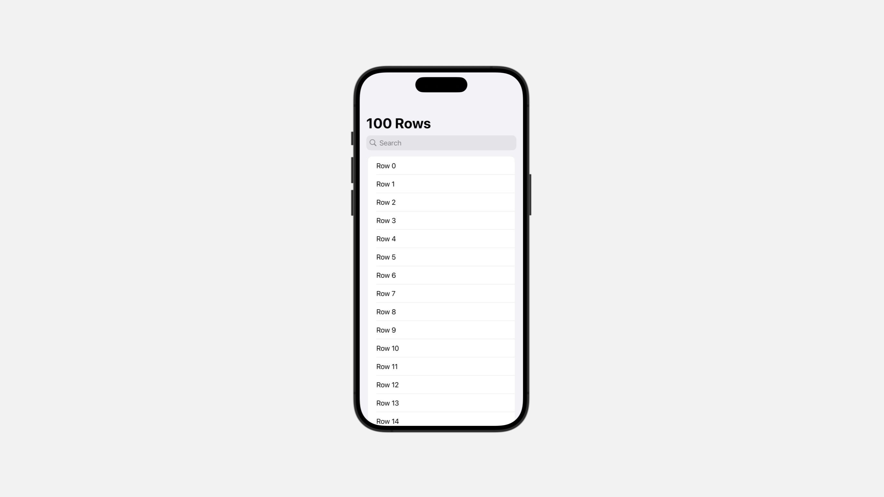
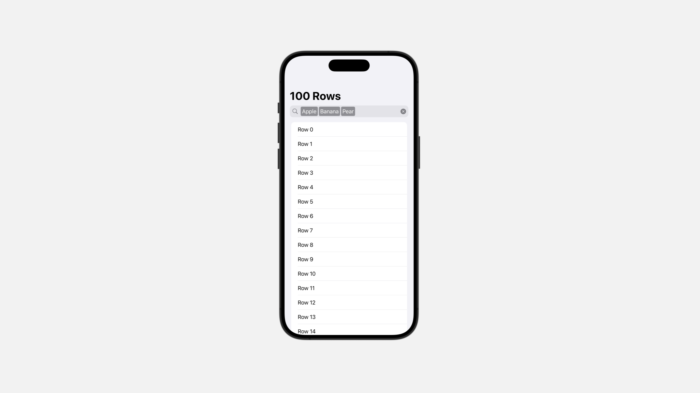
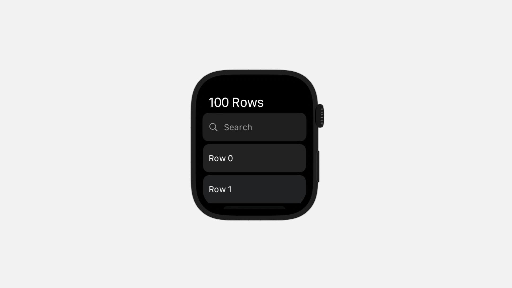
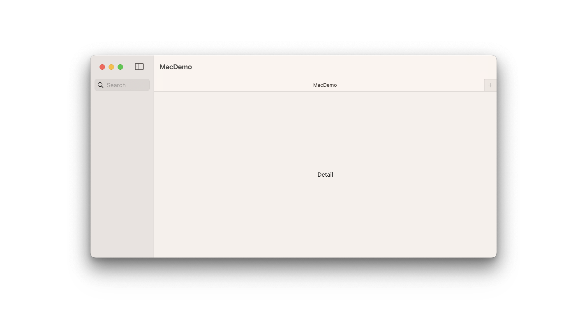
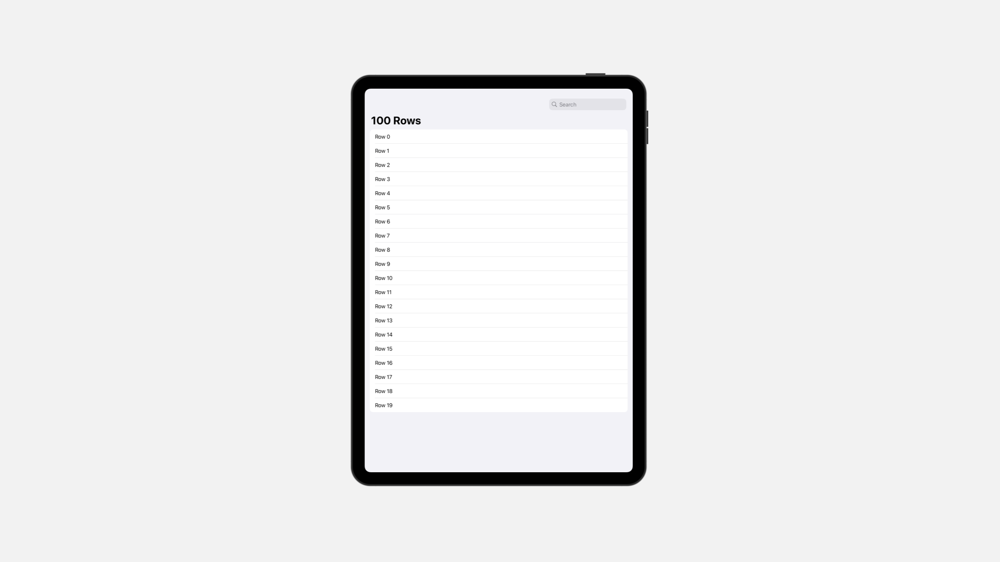
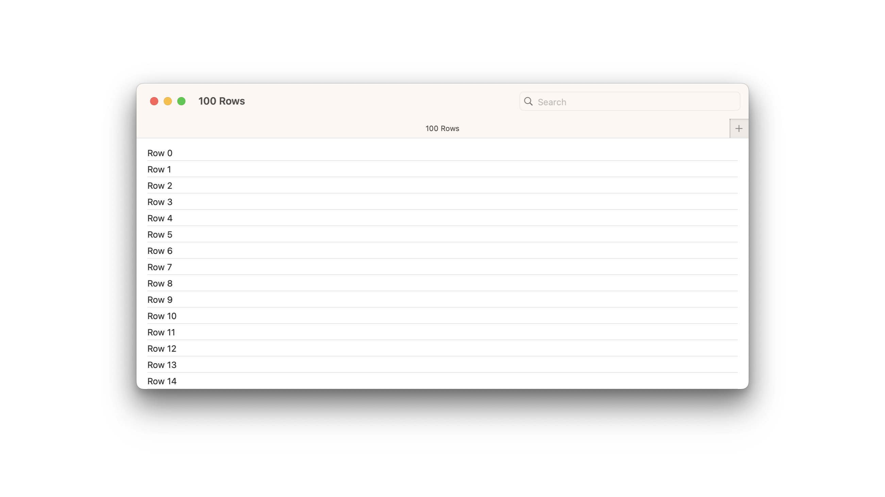
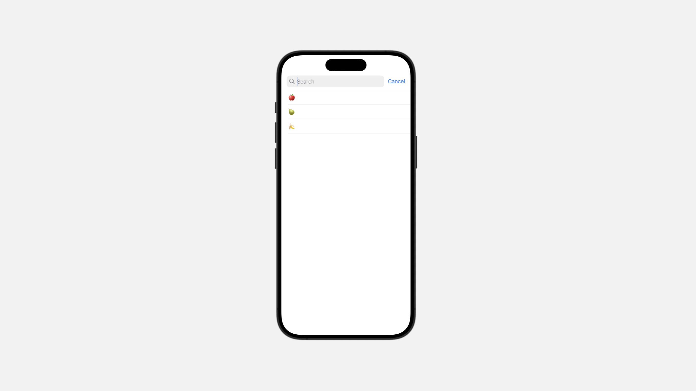
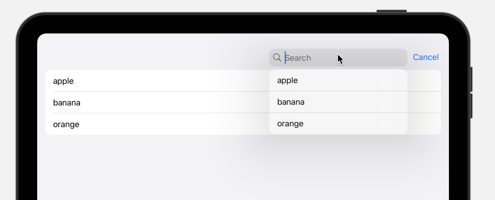
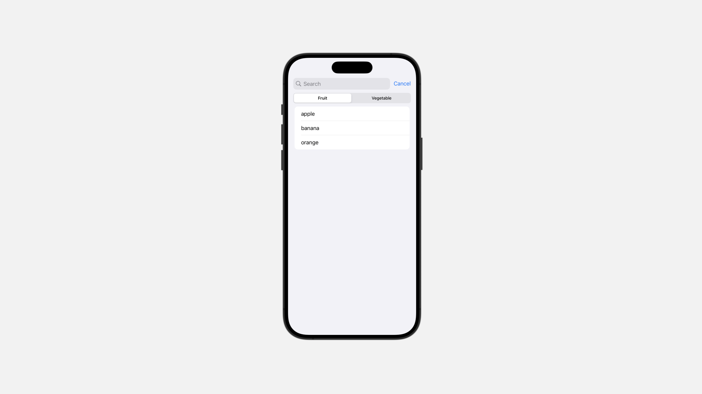

# Search

在你的应用程序中添加一个搜索栏，首先需要创建和管理一个用于保存搜索文本的存储，并可以选择性地为独立的搜索关键词（即「令牌」）提供存储空间。接下来，通过在应用内的某个视图上应用 `searchable` 视图修饰符，将此存储空间与搜索栏进行绑定。

当用户与搜索框交互时，他们实际上是在修改底层存储，从而改变搜索参数。相应地，你的应用程序会更新其界面的其他部分。为了增强搜索互动体验，你还可以：

- 在搜索过程中为文本和令牌提供搜索建议。
- 实现搜索范围功能，帮助用户缩小搜索范围。
- 检测用户何时激活搜索字段，并利用环境值以编程方式关闭搜索字段。


## Searching your app’s data model


### `searchable(text:placement:prompt:)`

将此视图标记为可搜索，这将配置搜索字段的显示。 

换句话说，在 SwiftUI 中，当你将 `searchable` 视图修饰符应用到一个视图时，这个视图将会被配置为包含一个搜索字段，允许用户输入搜索内容，并且可以根据搜索内容动态更新相关界面或数据。这个修饰符可以帮助你在应用中轻松实现搜索功能。


```swift
func searchable(
    text: Binding<String>,
    placement: SearchFieldPlacement = .automatic,
    prompt: Text? = nil
) -> some View
```

例如:

```swift
struct ContentView: View {

    @State var text: String = ""
    
    var body: some View {
        
        NavigationStack {
            List(0..<20) {
                Text("Row \($0)")
            }.navigationTitle("100 Rows")
                .searchable(text: $text)
        }
    }
    
}
```




### `searchable(text:tokens:placement:prompt:token:)`

```swift
func searchable<C, T>(
    text: Binding<String>,
    tokens: Binding<C>,
    placement: SearchFieldPlacement = .automatic,
    prompt: LocalizedStringKey,
    @ViewBuilder token: @escaping (C.Element) -> T
) -> some View where C : RandomAccessCollection, C : RangeReplaceableCollection, T : View, C.Element : Identifiable
```


确实，在使用诸如 `searchable(text:tokens:placement:prompt:token:)` 这样带有 `tokens` 参数的可搜索修饰符时，除了搜索字符串之外，搜索字段还可以显示令牌（ `tokens` ）。这些令牌通常用于多值筛选或者收藏常用查询等功能。

例如，要创建一组水果类型的令牌，你可以首先定义一个遵循 `Identifiable` 协议的枚举类型，然后实例化这个枚举集合：

```swift
enum FruitToken: String, Identifiable, Hashable, CaseIterable {
    case apple
    case pear
    case banana
    var id: Self { self }
}
```

接着，添加一个新的发布属性来存储令牌集合：
```swift
@State var tokens: [FruitToken] = [.apple, .banana, .pear]
```

要显示令牌，请向搜索修饰符的 `tokens` 输入参数提供一个对令牌数组的绑定，并通过 `token` 闭包描述如何绘制每个令牌。在该闭包内部，根据输入返回代表该令牌的视图。例如，你可以使用 `Text` 视图来表示每个令牌：


```swift
NavigationStack {
    List(0..<20) {
        Text("Row \($0)")
    }.navigationTitle("100 Rows")
        .searchable(text: $text, tokens: $tokens) { token in
            switch token {
                case .apple: Text("Apple")
                case .pear: Text("Pear")
                case .banana: Text("Banana")
            }
        }
}
```




### `SearchFieldPlacement`


在视图层级中搜索字段的位置。

```swift
struct SearchFieldPlacement
```


#### `automatic`

搜索字段的位置依据不同平台有所差异：

在 iOS、iPadOS 和 macOS 平台上，搜索字段会出现在工具栏中。


而在 tvOS 和 watchOS 上，搜索字段则会与其内容一起内联显示。



#### `navigationBarDrawer`

搜索字段会出现在导航栏中。

该搜索字段位于任何导航栏标题下方，并采用自动显示模式来设置何时隐藏搜索区域。若要选择其他显示模式，可以改用 `navigationBarDrawer(displayMode:)` 方法。

```swift
NavigationStack {
    List(0..<20) {
        Text("Row \($0)")
    }.navigationTitle("100 Rows")
        .searchable(text: $text, placement: .navigationBarDrawer(displayMode: .always))
}
```
<video src="../video/NavigationBarDrawer.mp4" controls="controls"></video>

#### `sidebar`

搜索字段出现在导航视图的侧边栏中。

搜索字段的确切位置取决于所使用的平台：

在 iOS 和 iPadOS 中，搜索字段会出现在与侧边栏关联的导航栏区域。

```swift
struct ContentView: View {

    @State var text: String = ""
    
    var body: some View {
        
        NavigationSplitView {
            Text("Sidebar").searchable(text: $text, placement: .automatic)
        } detail: {
            Text("Detail")
                
        }
    }
}
```

<video src="../video/SearchableSidebar.mp4" controls="controls"></video>

而在 macOS 中，搜索字段则会与侧边栏的内容内联显示。



如果当前环境中没有可用的侧边栏（例如，当你将搜索修饰符应用到除导航分割视图以外的其他视图时），SwiftUI 将自动确定搜索字段的位置。


#### `toolbar`

搜索字段会出现在工具栏中。

搜索字段的确切位置因平台而异：

在 iOS 和 watchOS 中，搜索字段会出现在导航栏下方，并可通过滚动显示出来。
    
在 iPadOS 中，搜索字段会出现在导航栏的右侧部分。


    
在 macOS 中，搜索字段会出现在工具栏的尾部。




## Making search suggestions

### `searchSuggestions(_:)`

配置此视图的搜索建议。

```swift
func searchSuggestions<S>(@ViewBuilder _ suggestions: () -> S) -> some View where S : View
```

在搜索过程中，你可以通过向该修饰符提供一系列视图来提出搜索建议。当用户激活搜索界面时，界面会将这些视图展示为一系列可供选择的建议项。通过向视图添加 `searchCompletion(_:)` 修饰符，可以将每个建议视图与一个字符串关联起来。

例如，你可以通过显示各种水果的 `emoji` 图标来给出水果类型的搜索建议，并在每个情况下提供相应的搜索字符串作为搜索完成项：


```swift
NavigationStack {
    List(0..<20) {
        Text("Row \($0)")
    }.navigationTitle("100 Rows")
        .searchable(text: $text)
        .searchSuggestions {
            Text("🍎").searchCompletion("apple")
            Text("🍐").searchCompletion("pear")
            Text("🍌").searchCompletion("banana")
        }
}
```



当用户选择一个建议时，SwiftUI 会将搜索字段中的文本替换为搜索完成字符串。

<video src="../video/SearchSuggestions.mp4" controls="controls"></video>

::: tip

当你在SwiftUI中使用搜索建议功能时，如果用户选择了一个建议，SwiftUI 会将搜索框中的文本替换为该建议字符串。这是通过使用 `searchCompletion` 修饰符来实现的。

如果你没有为某个建议视图添加 `searchCompletion` 修饰符，SwiftUI 仍会显示这个建议，但是用户点击或者触碰该建议时，不会有任何反应，即这个建议不会被用来替换搜索框中的文本。

这就意味着，没有 `searchCompletion` 修饰符的建议是不可选择的，用户的交互（点击或触碰）不会导致搜索框中的文本改变。

简单来说，`searchCompletion` 修饰符让建议可以被激活并用来替换搜索框的内容。如果省略了这个修饰符，建议虽然显示，但是不能被选择或使用。

:::

你可以随着条件变化更新所提供的搜索建议。

例如，你可以在模型中存储一个建议数组：

```swift
ProductList()
    .searchable(text: $text)
    .searchSuggestions {
        ForEach(model.suggestedSearches) { suggestion in
            Label(suggestion.title,  image: suggestion.image)
                .searchCompletion(suggestion.text)
        }
    }
```


如果模型中的 `suggestedSearches` 初始为空数组，则界面开始时不会显示任何搜索建议。随后，你可以提供基于某种条件更新数组的逻辑。例如，你可以根据当前搜索文本更新建议内容。

::: danger 注意
某些事件或动作，如在 macOS 中移动窗口，可能会导致搜索建议视图消失。

:::

### `searchSuggestions(_:for:)`

配置在此视图中如何展示搜索建议。

```swift
func searchSuggestions(
    _ visibility: Visibility,
    for placements: SearchSuggestionsPlacement.Set
) -> some View
```

在 SwiftUI 中，搜索建议的展现方式会根据不同因素（如平台、搜索字段的位置及大小类）有所不同。当你希望在特定条件下以特定方式展示搜索建议时，可以使用这一修饰符。例如，你可能希望在条件允许时以菜单形式展示搜索建议，而在其他情况下则直接对数据源进行过滤展示。这意味着你可以根据不同的场景和设备特性定制搜索建议的展现样式，以提升用户体验。


```swift
.searchable(text: $text) {
    ForEach(suggestions) { suggestion in
        Text(suggestion.rawValue)
            .searchCompletion(suggestion.rawValue)
    }
    .searchSuggestions(.hidden, for: .menu)
}
```




## Limiting search scope

### `searchScopes(_:scopes:)`

配置此视图的搜索范围。

```swift
func searchScopes<V, S>(
    _ scope: Binding<V>,
    @ViewBuilder scopes: () -> S
) -> some View where V : Hashable, S : View
```

为了让用户能够缩小搜索范围，你可以创建一种表示可能搜索范围的类型，然后创建一个状态变量来保存当前的选择。例如，你可以限制产品搜索范围只包括水果或蔬菜：


```swift
enum ProductScope {
    case fruit
    case vegetable
}


@State private var scope: ProductScope = .fruit
```

提供一个指向搜索范围的绑定，以及一个表示每个搜索范围的视图：


```swift
ProductList()
    .searchable(text: $text, tokens: $tokens) { token in
        switch token {
            case .apple: Text("Apple")
            case .pear: Text("Pear")
            case .banana: Text("Banana")
        }
    }
    .searchScopes($scope) {
        Text("Fruit").tag(ProductScope.fruit)
        Text("Vegetable").tag(ProductScope.vegetable)
    }
```



当搜索处于激活状态时，SwiftUI 会利用这个绑定和视图在搜索字段下添加一个选择器（ `Picker` ）。

为了确保选择器能正常工作，在 iOS、iPadOS、macOS 和 tvOS 中，你需要将搜索范围绑定的类型与每个视图标签的类型相匹配。接下来，根据搜索范围状态属性的当前值来调整搜索功能。


::: info Example

```swift
struct UserModel: Codable {
    let id: Int
    let name: String
    let age: Int
    let group: UserGroupScope
}
enum UserGroupScope: String, Codable, CaseIterable {
    case all, normal, moderator, admin
}
struct SearchContectView: View {
    var arrayToSearch: [UserModel] = [UserModel(id: 1, name: "John", age: 10, group: .admin),
                                    UserModel(id: 2, name: "Poul", age: 15, group: .admin),
                                    UserModel(id: 3, name: "Maria", age: 20, group: .normal),
                                    UserModel(id: 4, name: "Emma", age: 25, group: .normal),
                                    UserModel(id: 5, name: "Ella", age: 30, group: .moderator),
                                    UserModel(id: 6, name: "James", age: 35, group: .normal)]
    @State var searchText: String = ""
    @State var searchScope = UserGroupScope.all
    var searchResults: [UserModel] {
        if searchText.isEmpty {
            return arrayToSearch
        }else {
            var scopedResults = arrayToSearch
            if searchScope != .all {
                scopedResults = arrayToSearch.filter({ $0.group == searchScope })
            }
            return scopedResults.filter( {
                $0.name.localizedCaseInsensitiveContains(searchText) ||
                $0.age == Int(searchText)
            })
        }
    }
    var body: some View {
        NavigationStack {
            List(searchResults, id: \.id) { result in
                Text("\(result.name) - \(result.age)")
            }
        }
        .searchable(text: $searchText, placement:
                .navigationBarDrawer, prompt: "Search for something")
        .searchScopes($searchScope) {
            ForEach(UserGroupScope.allCases, id: \.self) { scope in
                Text(scope.rawValue)
            }
        }
    }
}
```

<video src="../video/SearchScopes.mp4" controls="controls"></video>

:::


### `searchScopes(_:activation:_:)`

为该视图配置具有指定激活策略的搜索范围。

```swift
func searchScopes<V, S>(
    _ scope: Binding<V>,
    activation: SearchScopeActivation,
    @ViewBuilder _ scopes: () -> S
) -> some View where V : Hashable, S : View
```


SwiftUI 使用提供的绑定和视图在搜索字段下方添加一个选择器（Picker）。在 iOS、macOS 和 tvOS 中，当搜索处于激活状态时，选择器会出现在搜索字段下方。为了确保选择器正确运作，你需要将搜索范围绑定的类型与每个视图标签的类型保持一致。之后，根据搜索范围状态属性的当前值来调整搜索条件。

默认情况下，搜索范围的展示方式因平台而异：

- 在 iOS 和 iPadOS 中，当用户在搜索字段中输入文本时，搜索范围会出现；当用户取消搜索时，搜索范围会消失。
- 在 macOS 中，当 SwiftUI 展示搜索功能时，搜索范围会出现；当用户取消搜索时，搜索范围会消失。

不过，你可以通过使用 `activation` 参数，设置其值为 `onTextEntry` 或 `onSearchPresentation` 来配置这种行为：

- `automatic` : 默认情况下，在 iOS 中是 `onTextEntry`，在 macOS 中是 `onSearchPresentation`。
- `onSearchPresentation` : 一种激活策略，其中系统会在搜索展示后显示出搜索范围，并在搜索取消后隐藏搜索范围。
- `onTextEntry` : 一种激活策略，当在搜索字段中开始输入时，系统会显示出搜索范围，并在搜索取消后隐藏搜索范围。

```swift
.searchScopes($searchScope, activation: .onSearchPresentation) {
    ForEach(UserGroupScope.allCases, id: \.self) { scope in
        Text(scope.rawValue)
    }
}
```

<video src="../video/SearchScopesActivation.mp4" controls="controls"></video>

## Detecting, activating, and dismissing search

### `isSearching`


一个布尔值属性，它表明用户是否正在进行搜索操作。

```swift
var isSearching: Bool { get }
```

你可以像读取其他 `EnvironmentValues` 一样读取此布尔值，只需通过创建一个使用 `Environment` 属性包装器的属性即可：

```swift
@Environment(\.isSearching) private var isSearching
```

获取一个值来确定用户何时与由诸如 `searchable(text:placement:prompt:)` 这样的搜索修饰符生成的搜索字段进行交互。


```swift
struct SearchingExample: View {
    @State private var searchText = ""

    var body: some View {
        NavigationStack {
            SearchedView()
                .searchable(text: $searchText)
        }
    }
}

struct SearchedView: View {
    @Environment(\.isSearching) private var isSearching

    var body: some View {
        Text(isSearching ? "Searching!" : "Not searching.")
    }
}
```

当用户首次点击或触摸由 `searchable(text:placement:prompt:)` 等搜索修饰符创建的搜索框时，`isSearching` 属性会变为 `true`。而当用户取消搜索操作时，该属性又会变为 `false`。

若要通过编程方式设置该值为 `false` 并关闭搜索操作，可以使用 `dismissSearch` 方法。


::: warning 重要
正如上述示例所示，应该从被搜索的视图内部访问该值，而不是从被搜索视图的父视图中访问。SwiftUI 将该值设置在应用了 `searchable` 修饰符的视图的环境中，而不会将该值沿视图层级向上传播。因此，要在用户与搜索字段交互时做出响应，应当在包含搜索功能的视图内部读取 `isSearching` 属性的值。
:::


### `dismissSearch`

一个结束当前搜索交互的动作。

使用这个环境值可以从当前环境中获取到 `DismissSearchAction` 实例，然后调用该实例以结束当前的搜索交互。

由于 `DismissSearchAction` 定义了一个 `callAsFunction()` 方法，所以可以直接调用该实例，Swift 会自动调用其 `callAsFunction()` 方法。

当你调用该方法来结束搜索时，SwiftUI 会执行以下操作：

- 将 `isSearching` 设置为 `false`。
- 清除搜索字段中的任何文本内容。
- 移除搜索字段的焦点。

::: tip
如果用户当前并未与搜索字段进行交互，调用这个实例将不会产生任何效果。
:::

你可以使用这个动作来基于用户的其他交互来关闭搜索操作。例如，假设有一个带有搜索功能的视图，视图中还有一个按钮，该按钮的作用是显示集合中第一个匹配项的更多详细信息：


```swift
struct ContentView: View {
    @State private var searchText = ""


    var body: some View {
        NavigationStack {
            SearchedView(searchText: searchText)
                .searchable(text: $searchText)
        }
    }
}


private struct SearchedView: View {
    let searchText: String


    let items = ["a", "b", "c"]
    var filteredItems: [String] { items.filter { $0 == searchText.lowercased() } }


    @State private var isPresented = false
    @Environment(\.dismissSearch) private var dismissSearch


    var body: some View {
        if let item = filteredItems.first {
            Button("Details about \(item)") {
                isPresented = true
            }
            .sheet(isPresented: $isPresented) {
                NavigationStack {
                    DetailView(item: item, dismissSearch: dismissSearch)
                }
            }
        }
    }
}

private struct DetailView: View {
    var item: String
    var dismissSearch: DismissSearchAction


    @Environment(\.dismiss) private var dismiss


    var body: some View {
        Text("Information about \(item).")
            .toolbar {
                Button("Add") {
                    // Store the item here...


                    dismiss()
                    dismissSearch()
                }
            }
    }
}
```
<video src="../video/DismissSearch.mp4" controls="controls"></video>

用户可以通过向下拖动来关闭表单（ `sheet` ），这实际上相当于取消了当前操作，但保留了正在进行的搜索交互状态。另外，用户也可以点击“添加”按钮来保存该条目。考虑到用户在点击保存后很可能既完成了详情查看也结束了搜索操作，因此按钮的闭包除了关闭表单之外，还会使用 `dismissSearch` 属性重置搜索字段，使得搜索视图恢复至初始状态。


::: warning
如同上面的示例所示，应当从被搜索视图自身内部访问这个动作，而不是从被搜索视图的父视图或其他视图层级（例如弹出窗口 `sheet` 的层级）中访问。

SwiftUI 将这个动作值设置在应用了 `searchable` 修饰符的视图环境中，且不向上级视图层级传播该值。因此，只有在包含了搜索功能的视图中才能直接访问并调用 `dismissSearch` 动作来结束搜索交互。

:::


### `searchable(text:isPresented:placement:prompt:)`


标记此视图具有可编程性地显示搜索字段的搜索功能。


```swift
func searchable(
    text: Binding<String>,
    isPresented: Binding<Bool>,
    placement: SearchFieldPlacement = .automatic,
    prompt: LocalizedStringKey
) -> some View
```


你可以通过向 `searchable` 修饰符的 `isPresented` 参数提供一个绑定到布尔值的 `Binding`，以程序化地控制搜索界面的激活。

例如，为了显示一个已经激活搜索界面的弹出视图（ `sheet` ），可以创建一个初始值为 `true` 的绑定：


```swift
struct SheetView: View {

    @State private var isPresented = false

    @State private var text = ""


    var body: some View {
        NavigationStack {
            Form{

                Toggle("是否搜索", isOn: $isPresented)
            }.searchable(text: $text, isPresented: $isPresented)
        }
    }
}
```
<video src="../video/SearchableIsPresented.mp4" controls="controls"></video>


### React to search submission

若要指定当用户提交搜索查询（通常是按回车键）时 SwiftUI 调用的动作，可以添加 `onSubmit(of:_:)` 修饰符：

```swift
SearchedView()
    .searchable(text: $searchText)
    .onSubmit(of: .search) {
        submitCurrentSearchQuery()
    }
```


根据你的应用程序结构，你可以以多种方式使用搜索提交功能。例如，你可以利用提交搜索查询的机会，在搜索字符串中查找子串，并将其转换为令牌。另外，对于那些可能因为需要网络访问而导致速度较慢的搜索操作，你可以等到接收到提交事件后再执行搜索。


## `Displaying toolbar content during search`


### `searchPresentationToolbarBehavior(_:)`

配置此视图中任何搜索修饰符的搜索工具栏展示行为。


```swift
func searchPresentationToolbarBehavior(_ behavior: SearchPresentationToolbarBehavior) -> some View
```


默认情况下，在 iOS 平台上，当展示搜索功能时，工具栏可能会隐藏部分内容以聚焦于搜索。若要覆盖这一默认行为，你可以为此修饰符提供一个 `avoidHidingContent` 值。

```swift
NavigationStack {
    List {
        Text("Hello World")
    }.navigationTitle("100 Rows")
        .searchable(text: $text)
        .searchPresentationToolbarBehavior(.avoidHidingContent)
}
```
<video src="../video/SearchPresentationToolbarBehavior.mp4" controls="controls"></video>

## Searching for text in a view with find and replace

### `findNavigator(isPresented:)`

以编程方式展示文本编辑器视图上的查找和替换界面。

```swift
func findNavigator(isPresented: Binding<Bool>) -> some View
```


向 `TextEditor` 或至少包含一个文本编辑器的视图层级添加此修饰符，以控制查找和替换界面的展示。当你将 `isPresented` 绑定设置为 `true` 时，系统会显示该界面，而设置为 `false` 时，系统则会隐藏该界面。

下面的示例展示了如何基于工具栏按钮的状态显示或隐藏界面：

```swift
struct ContentView: View {

    @State private var text = "Hello SwiftUI"

    @State private var isPresented = false

    var body: some View {
        NavigationStack {
            TextEditor(text: $text)
                .findNavigator(isPresented: $isPresented)
                .toolbar {
                    Toggle(isOn: $isPresented) {
                        Label("Find", systemImage: "magnifyingglass")
                    }
                }
        }
    }
}
```
<video src="../video/FindNavigator.mp4" controls="controls"></video>


### `findDisabled(_:)`

阻止在文本编辑器中进行查找和替换操作。

```swift
func findDisabled(_ isDisabled: Bool = true) -> some View
```


```swift
TextEditor(text: $text)
    .findDisabled(isDisabled)
    .findNavigator(isPresented: $isPresented)
```

### `replaceDisabled(_:)`

防止在文本编辑器中进行替换操作。

```swift
func replaceDisabled(_ isDisabled: Bool = true) -> some View
```

```swift
TextEditor(text: $text)
    .replaceDisabled(isDisabled)
    .findNavigator(isPresented: $isPresented)
```