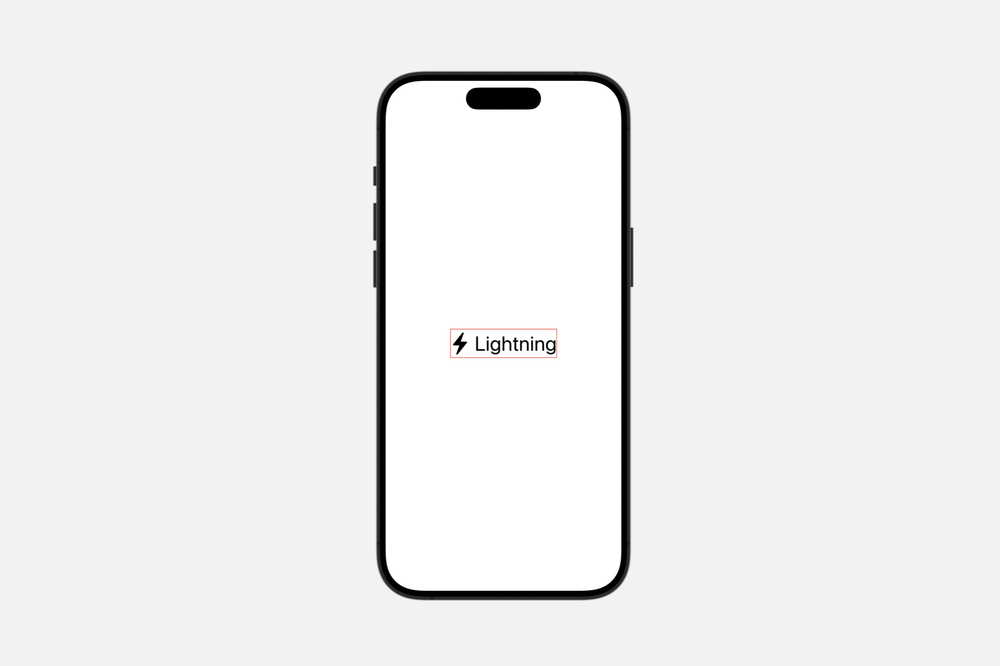
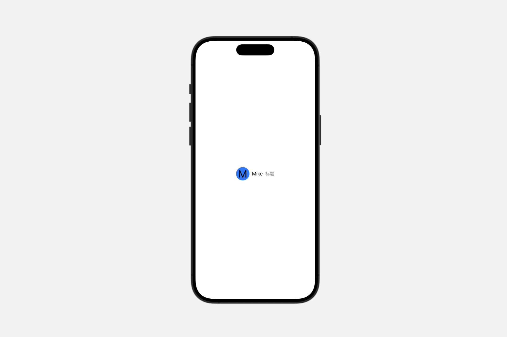

# Displaying text

[[toc]]

## `Text`

一个显示一行或多行只读文本的视图。

```swift
@frozen
struct Text
```

文本视图使用适合当前平台的正文字体在应用程序的用户界面中绘制字符串。你可以使用 `font(_:)` 视图修饰符选择其他标准字体，如标题或标题。

```swift
Text("Hamlet")
    .font(.title)
```


如果你需要更精细地控制文本的样式，可以使用相同的修饰符来配置系统字体或选择自定义字体。你还可以应用 `view` 修饰符，如 `bold()` 或 `italic()` 来进一步调整格式。

```swift
Text("by William Shakespeare")
    .font(.system(size: 48, weight: .light, design: .serif))
    .italic()
```


```swift
let attributedString = try! AttributedString(
    markdown: "_Hamlet_ by William Shakespeare")


var body: some View {
    Text(attributedString)
        .font(.system(size: 36, weight: .light, design: .serif))
}
```


文本视图始终只使用显示其渲染内容所需的精确空间，但你可以影响视图的布局。例如，你可以使用 `frame(width:height:alignment:)` 修饰符向视图提出特定的尺寸。如果视图接受该建议，但文本不适合可用空间，视图将使用换行、收紧、缩放和截断的组合来使其适合。宽度为 $100$ 点但高度没有限制的文本视图可能会换行显示长字符串：

```swift
Text("To be, or not to be, that is the question:")
.frame(width: 100)
```


使用 `lineLimit(_:)`、`allowsTightening(_:)`、`minimumScaleFactor(_:)` 和 `truncationMode(_:)` 等修饰符来配置视图如何处理空间限制。例如，将固定宽度和 $1$ 行限制结合起来会导致无法适应该空间的文本被截断：

```swift
Text("Brevity is the soul of wit.")
    .frame(width: 100)
    .lineLimit(1)
```


### Localizing strings

如果你使用字符串字面量初始化一个文本视图，视图将使用 `init(_:tableName:bundle:comment:)` 初始化器，该初始化器将字符串解释为本地化键，并在你指定的表中或在默认表中（如果你没有指定表）搜索该键。

```swift
Text("pencil") // Searches the default table in the main bundle.
```

对于同时以英语和西班牙语进行本地化的应用程序，上述视图分别为英语和西班牙语用户显示“pencil”和“lápiz”。如果视图无法执行本地化，它将显示 `key`值。例如，如果同一应用程序缺少丹麦本地化，该视图将为该地区的用户显示“pencil”。同样，缺少任何本地化信息的应用程序在任何地区都会显示“pencil”。

要显式绕过字符串字面量的本地化，请使用 `init(verbatim:)` 初始化器。

```swift
Text(verbatim: "pencil") // Displays the string "pencil" in any locale.
```

如果你使用变量值初始化一个文本视图，视图将使用 `init(_:)` 初始化器，该初始化器不会对字符串进行本地化。但是，你可以通过首先创建一个 `LocalizedStringKey` 实例来请求本地化，这将触发 `init(_:tableName:bundle:comment:)` 初始化器：

```swift
// Don't localize a string variable...
Text(writingImplement)


// ...unless you explicitly convert it to a localized string key.
Text(LocalizedStringKey(writingImplement))
```

在本地化字符串变量时，你可以省略可选的初始化参数来使用默认表——就像上面的示例中一样——就像对字符串字面量一样。

### AttributedString


```swift
init(_ attributedContent: AttributedString)
```

使用此初始化程序根据指定 `AttributedString` 中的属性设置文本样式。`attributed string` 中的属性优先于视图修饰符添加的样式。例如，尽管在下面的示例中使用 `foregroundColor(_:)` 修饰符在整个包含的 `VStack` 中使用红色，但属性化文本仍然显示为蓝色：

```swift
var content: AttributedString {
    var attributedString = AttributedString("Blue text")
    attributedString.foregroundColor = .blue
    return attributedString
}


var body: some View {
    VStack {
        Text(content)
        Text("Red text")
    }
    .foregroundColor(.red)
    .font(.largeTitle)
}
```


SwiftUI 尽可能将文本属性与 SwiftUI 修饰符结合起来。例如，以下清单创建了既粗体又红色的文本：

```swift
var content: AttributedString {
    var content = AttributedString("Some text")
    content.inlinePresentationIntent = .stronglyEmphasized
    return content
}


var body: some View {
    Text(content).foregroundColor(Color.red).font(.largeTitle)
}
```


SwiftUI `Text` 视图呈现 `Foundation` 属性 `inlinePresentationIntent` 定义的大多数样式，例如 `stronglyEmphasized` 值，SwiftUI 将其呈现为粗体文本。

::: warning
`Text` 仅使用 `AttributeScopes.FoundationAttributes` 中定义的属性的子集。`Text` 呈现除了 `lineBreak` 和 `softBreak` 之外的所有 `InlinePresentationIntent` 属性。它还将 `link` 属性呈现为可点击的链接。`Text` 忽略属性字符串中的任何其他 `Foundation` 定义的属性。
:::

SwiftUI 还在属性范围 `AttributeScopes.SwiftUIAttributes` 中定义了其他属性，你可以从属性字符串的 `swiftUI` 属性访问这些属性。SwiftUI 属性优先于其他框架（如 `AttributeScopes.UIKitAttributes` 和 `AttributeScopes.AppKitAttributes`）中的等效属性。

你可以使用 Markdown 语法创建一个 `AttributedString`，它允许你在 `Text` 视图中为不同的运行设置样式：


```swift
let content = try! AttributedString(
    markdown: "**Thank You!** Please visit our [website](http://example.com).")


var body: some View {
    Text(content).font(.largeTitle)
}
```

**“Thank You!”** 周围的 `**` 应用了一个值为 `stronglyEmphasized` 的 `inlinePresentationIntent` 属性。如前所述，SwiftUI 将其呈现为粗体文本。**“website”** 周围的链接语法创建了一个链接属性，Text 会对此进行样式设置以表示它是一个链接；默认情况下，点击或轻点链接会在用户的默认浏览器中打开链接的 URL。或者，你可以通过在文本视图的环境中放置一个 `OpenURLAction` 来执行自定义链接处理。


你也可以在本地化字符串键中使用 Markdown 语法，这意味着你可以编写上面的示例，而无需显式创建一个 `AttributedString`：

```swift
var body: some View {
    Text("**Thank You!** Please visit our [website](https://example.com).")
}
```

在你的应用程序的字符串文件中，使用 Markdown 语法对应用程序的本地化字符串应用样式。当你希望对本地化字符串执行自动语法一致性时，你也可以使用这种方法，使用 `^[text](inflect:true)` 语法。

### Creating a text view for a date

#### `init(_ dates: ClosedRange<Date>)`

创建一个显示两个日期之间本地化范围的实例。

```swift
Text(Date()...Date())
```

#### `init(_ interval: DateInterval)`

创建一个显示本地化时间间隔的实例。

```swift
Text(DateInterval())
```


#### `init(_:style:)`

创建一个使用特定样式显示本地化日期和时间的实例。

```swift
init(
    _ date: Date,
    style: Text.DateStyle
)
```

```swift
Text(Date(), style: .date)
```


### Creating a text view with formatting

#### `init(_:format:)`

创建一个文本视图，显示由相应格式样式支持的非字符串类型的格式化表示。

```swift
init<F>(
    _ input: F.FormatInput,
    format: F
) where F : FormatStyle, F.FormatInput : Equatable, F.FormatOutput == String
```

使用此初始化程序创建一个由非字符串值支持的文本视图，使用 `FormatStyle` 将类型转换为字符串表示。对值的任何更改都会更新文本视图显示的字符串。

在下面的示例中，三个 `Text` 视图通过使用不同的 `Date.FormatStyle` 选项，以不同的日期和时间字段组合呈现日期。


```swift
@State private var myDate = Date()
    
var body: some View {
    VStack {
        Text(myDate, format: Date.FormatStyle(date: .numeric, time: .omitted))
        Text(myDate, format: Date.FormatStyle(date: .complete, time: .complete))
        Text(myDate, format: Date.FormatStyle().hour(.defaultDigits(amPM: .abbreviated)).minute())
    }.font(.title)
}
```


### Creating a text view from an image

创建一个包装 `Image` 的实例，适合与其他 `Text` 连接。

```swift
init(_ image: Image)
```

```swift
Text(Image(systemName: "checkmark"))
```

### Creating a text view with a timer

创建一个显示在提供的时间间隔内计数的计时器的实例。

```swift
init(
    timerInterval: ClosedRange<Date>,
    pauseTime: Date? = nil,
    countsDown: Bool = true,
    showsHours: Bool = true
)
```

- `timerInterval`：运行计时器的时间间隔。
- `pauseTime`：如果存在，要暂停计时器的日期。默认值为 `nil`，表示永远不要暂停。
- `countsDown`：是向上计数还是向下计数。默认值为 `true`。
- `showsHours`：如果计时器上还剩下超过 $60$ 分钟，是否包括小时组件。默认值为 `true`。

```swift
Text(
    timerInterval: Date.now...Date(timeInterval: 12 * 60, since: .now),
    pauseTime: Date.now + (10 * 60))
```


<video src="../../video/TextTimer.mp4" controls="controls"></video>

### Choosing a font

#### `font(_:)`

设置视图中文本的默认字体。

```swift
func font(_ font: Font?) -> Text
```

使用 `.font(_:)` 将特定字体应用于单个 `Text` 视图，或容器中的所有 `Text` 视图。

在下面的示例中，第一个文本字段直接设置了字体，而应用于下面容器的字体适用于该容器内的所有 `Text` 视图：

```swift
VStack {
    Text("Font applied to a text view.")
        .font(.largeTitle)


    VStack {
        Text("These two text views have the same font")
        Text("applied to their parent view.")
    }
    .font(.system(size: 16, weight: .light, design: .default))
}
```


#### `fontWeight(_:)`

设置文本的字体粗细。

```swift
func fontWeight(_ weight: Font.Weight?) -> Text
```

- `black`
- `bold`
- `heavy`
- `light`
- `medium`
- `regular`
- `semibold`
- `thin`
- `ultraLight`

#### `fontDesign(_:)`

设置文本的字体设计。

```swift
func fontDesign(_ design: Font.Design?) -> Text
```

- `default`
- `monospaced`
- `rounded`
- `serif`


#### `fontWidth(_:)`

设置文本的字体宽度。

```swift
func fontWidth(_ width: Font.Width?) -> Text
```

- `compressed`
- `condensed`
- `expanded`
- `standard`


### Styling the view’s text

#### `foregroundStyle(_:)`

设置此视图显示的文本的样式。

```swift
func foregroundStyle<S>(_ style: S) -> Text where S : ShapeStyle
```

使用此方法更改文本视图渲染的文本的渲染样式。

例如，你可以以各自的颜色显示颜色红色、绿色和蓝色的名称：

```swift
HStack {
    Text("Red").foregroundStyle(.red)
    Text("Green").foregroundStyle(.green)
    Text("Blue").foregroundStyle(.blue)
}.font(.largeTitle)
```


#### `bold()`

将粗体字体重量应用于文本。

```swift
func bold() -> Text
```


#### `italic()`

对文本应用斜体。

```swift
func italic() -> Text
```


#### `strikethrough(_:color:)`

对文本应用删除线。

```swift
func strikethrough(
    _ isActive: Bool = true,
    color: Color? = nil
) -> Text
```

- `isActive`：一个布尔值，指示文本是否应用了删除线。
- `color`：删除线的颜色。如果 `color` 为 `nil`，则删除线使用默认前景色。


#### `strikethrough(_:pattern:color:)`

```swift
func strikethrough(
    _ isActive: Bool = true,
    pattern: Text.LineStyle.Pattern,
    color: Color? = nil
) -> Text
```

```swift
Text("Hello SwiftUI")
    .font(.system(size: 48)).strikethrough(pattern: .dot, color: .red)
```


- `solid`: 绘制一条实线。
- `dot`: 绘制一条点线。
- `dash`: 绘制一条虚线。
- `dashDot`: 虚线+点线
- `dashDotDot`: 绘制一条由交替的破折号和两个点组成的线。

#### `underline(_:color:)`

对文本应用下划线。

```swift
func underline(
    _ isActive: Bool = true,
    color: Color? = nil
) -> Text
```

#### `underline(_:pattern:color:)`

对文本应用下划线。

```swift
func underline(
    _ isActive: Bool = true,
    pattern: Text.LineStyle.Pattern,
    color: Color? = nil
) -> Text
```

```swift
Text("Hello SwiftUI")
.font(.system(size: 48)).underline(pattern: .dashDotDot, color: .red)
```


#### `monospaced(_:)`

如果可能，将文本的字体修改为当前字体的固定宽度变体。

```swift
func monospaced(_ isActive: Bool = true) -> Text
```

```swift
VStack {
    Text("Hello SwiftUI")
        .font(.system(size: 48))
    
    Text("Hello SwiftUI")
        .font(.system(size: 48)).monospaced()
}
```


#### `monospacedDigit()`

修改文本视图的字体以使用固定宽度的数字，同时使其他字符保持比例间距。

```swift
func monospacedDigit() -> Text
```

此修饰符仅影响数字字符，其他所有字符保持不变。

以下示例显示了 `.monospacedDigit()` 对文本视图的影响。它在 `VStack` 中排列了两个文本视图，每个视图都显示一个包含许多字符 $1$ 的格式化日期。第二个文本视图使用 `.monospacedDigit()`。由于 $1$ 在比例字体中通常是一个较窄的字符，应用修饰符会加宽所有的 $1$，以及整个文本视图。文本视图中的非数字字符不受影响。

```swift
let myDate = DateComponents(
    calendar: Calendar(identifier: .gregorian),
    timeZone: TimeZone(identifier: "EST"),
    year: 2011,
    month: 1,
    day: 11,
    hour: 11,
    minute: 11
).date!


var body: some View {
    VStack(alignment: .leading) {
        Text(myDate.formatted(date: .long, time: .complete))
            .font(.system(size: 20))
        Text(myDate.formatted(date: .long, time: .complete))
            .font(.system(size: 20))
            .monospacedDigit()
    }
    .padding()
    .navigationTitle("monospacedDigit() Modifier")
}
```


如果文本视图的基本字体不支持固定宽度数字，则字体保持不变。


#### `kerning(_:)`

设置字符之间的间距或字距调整。

```swift
func kerning(_ kerning: CGFloat) -> Text
```

- `kerning`:在此文本中单个字符之间使用的间距。值 $0$ 将字距调整设置为系统默认值。

字距调整定义了文本视图应从默认间距偏移字符的点数。使用正字距调整来加宽字符之间的间距。使用负字距调整来缩小字符之间的间距。

```swift
VStack(alignment: .leading) {
    Text("ABCDEF").kerning(-6)
    Text("ABCDEF")
    Text("ABCDEF").kerning(6)
}.font(.largeTitle)
```


字距调整试图保持连字。例如，`Hoefler Text` 字体对字母组合 `ffl`（如单词 `raffle` 中的）使用连字，如下所示，带有小的负字距调整和小的正字距调整：


无论其他字母是靠拢还是分开，`ffl` 字母组合都保持不变的形状。然而，在任一方向超过一定程度后，字距调整确实会禁用非必要的连字。


::: warning
如果你将 `.tracking(_:)` 和 `.kerning(_:)` 修饰符都添加到视图中，视图将应用跟踪并忽略字距调整。
:::


#### `tracking(_:)`

设置文本的跟踪。

```swift
func tracking(_ tracking: CGFloat) -> Text
```

- `tracking`：布局后视图应向每个字符簇添加的额外空间（以点为单位）。值 0 将跟踪设置为系统默认值。

跟踪在文本视图中的字符之间添加以点为单位的空间。正值增加字符之间的间距，而负值使字符更靠近。


```swift
VStack(alignment: .leading) {
    Text("ABCDEF").tracking(-6)
    Text("ABCDEF")
    Text("ABCDEF").tracking(6)
}.font(.largeTitle)
```


跟踪的效果类似于 `.kerning(_:)` 修饰符，但添加或删除尾随空格，而不是更改字符偏移量。此外，使用任何非零量的跟踪都会禁用非必要的连字，而字距调整则试图保持连字。

#### `baselineOffset(_:)`

设置文本相对于其基线的垂直偏移。

```swift
func baselineOffset(_ baselineOffset: CGFloat) -> Text
```

- `baselineOffset`：将文本相对于其基线垂直移动（向上或向下）的量。

更改基线偏移量，以将视图中的文本（以点为单位）相对于其基线向上或向下移动。视图的边界会扩展以包含移动的文本。


```swift
HStack(alignment: .top) {
    Text("Hello")
        .baselineOffset(-10)
        .border(Color.red)
    Text("Hello")
        .border(Color.green)
    Text("Hello")
        .baselineOffset(10)
        .border(Color.blue)
}
.background(Color(white: 0.9))
.font(.largeTitle)
```

通过在每个文本视图周围绘制边框，可以看到文本的移动方式，以及这对视图的影响。


具有负偏移的第一个视图向下生长以处理降低的文本。具有正偏移的最后一个视图向上生长。显示为灰色的封闭 `HStack` 实例确保所有文本视图无论偏移量如何都保持在其顶部边缘对齐。


### Fitting text into available space

#### `textScale(_:isEnabled:)`

对文本应用文本缩放。

```swift
func textScale(
    _ scale: Text.Scale,
    isEnabled: Bool = true
) -> Text
```

- `scale`：要应用的文本缩放比例。
- `isEnabled`：如果为 `true`，则应用文本缩放；否则，文本缩放比例不变。


::: info `Text.Scale`
- `default`: 定义默认文本缩放比例
- `secondary`: 定义次要文本缩放比例

:::


#### `Text.TruncationMode`

当一行文本太长而无法适应可用空间时，要应用于该文本行的截断类型。

```swift
enum TruncationMode
```

当文本视图包含的文本超出其能够显示的范围时，视图可能会截断文本，并在截断点处放置省略号 (…)。使用 `.truncationMode(_:)` 修饰符和 `TruncationMode` 的其中一个值来指示要截断文本的哪个部分，要么在开头，要么在中间，要么在结尾。


- `head`: 在一行的开头截断。
- `middle`: 在一行的中间截断。
- `tail`: 在一行的结尾截断。

```swift
VStack {
    Text("Hello SwiftUI")
        .truncationMode(.head)
    Text("Hello SwiftUI")
        .truncationMode(.middle)
    Text("Hello SwiftUI")
        .truncationMode(.tail)
}.frame(width: 150)
.font(.largeTitle)
.lineLimit(1)
```


### Localizing text

#### `typesettingLanguage(_:isEnabled:)`

指定排版的语言。

```swift
func typesettingLanguage(
    _ language: TypesettingLanguage,
    isEnabled: Bool = true
) -> Text
```

- `language`：用于排版的语言。
- `isEnabled`：一个布尔值，指示是否添加文本语言。

在某些情况下，`Text` 可能包含与设备 UI 语言不匹配的特定语言的文本。在这种情况下，指定一种语言是有用的，以便行高、换行和间距将尊重该语言使用的脚本。例如：

```swift
Text(verbatim: "แอปเปิล").typesettingLanguage(
.explicit(.init(languageCode: .thai)))
.font(.largeTitle)
```


::: warning

此语言不会影响本地化的文本。
:::


### Configuring voiceover

#### `speechAdjustedPitch(_:)`

提高或降低朗读文本的音调。

```swift
func speechAdjustedPitch(_ value: Double) -> Text
```

- `value`：要提高或降低音调的量。介于 -1 和 0 之间的值会导致音调降低，而介于 0 和 1 之间的值会导致音调升高。该方法将值限制在 -1 到 1 的范围内。

当你想要更改朗读文本的音调时使用此修饰符。该值表示要更改音调的高低程度。


#### `speechAlwaysIncludesPunctuation(_:)`

设置 `VoiceOver` 是否应始终朗读文本视图中的所有标点符号。

```swift
func speechAlwaysIncludesPunctuation(_ value: Bool = true) -> Text
```

- `value`：一个布尔值，如果你希望 `VoiceOver` 朗读文本中的所有标点符号，则将其设置为 `true`。默认为 `true`。

```swift
Text("All the world's a stage, " +
    "And all the men and women merely players;")
    .speechAlwaysIncludesPunctuation()
```

`VoiceOver` 会朗读“All the world's a stage, and all the men and women merely players;”。

默认情况下，`VoiceOver` 根据周围上下文朗读标点符号。

#### `speechAnnouncementsQueued(_:)`

控制是否将待处理的公告排在现有语音后面，而不是中断正在进行的语音。

```swift
func speechAnnouncementsQueued(_ value: Bool = true) -> Text
```

- `value`：一个布尔值，用于确定 `VoiceOver` 是立即朗读文本的更改，还是将它们排在现有语音后面。默认为 `true`。

当你想要影响辅助功能系统传递朗读文本的顺序时使用此修饰符。当辅助功能元素的标签或值更改时，公告可以自动发生。

#### `speechSpellsOutCharacters(_:)`

设置 `VoiceOver` 是否应逐个字符地朗读文本视图的内容。

```swift
func speechSpellsOutCharacters(_ value: Bool = true) -> Text
```

- `value`：一个布尔值，当其为 `true` 时，表示 `VoiceOver` 应该将文本作为单个字符朗读。默认为 `true`。


当你希望 `VoiceOver` 将文本作为单个字母逐个朗读时使用此修饰符。这对于不打算一起朗读的文本很重要，例如：

不是单词的缩写，如 `APPL`，读作“A-P-P-L”。

表示一系列数字的数字，如 $25$，读作“two-five”而不是“twenty-five”。


### `Providing accessibility information`

#### `accessibilityHeading(_:)`

设置此标题的可访问性级别。


```swift
func accessibilityHeading(_ level: AccessibilityHeadingLevel) -> Text
```

- `level`：要与此元素关联的标题级别，来自可用的 `AccessibilityHeadingLevel` 级别。

使用此修饰符设置此标题相对于其他标题的级别。系统会说出 `AccessibilityHeadingLevel.h1` 到 `AccessibilityHeadingLevel.h6` 的级别数以及文本。

如果不使用此修饰符，默认标题级别为 `AccessibilityHeadingLevel.unspecified`。


#### `accessibilityLabel(_:)`

向视图添加一个描述其内容的标签。

```swift
func accessibilityLabel<S>(_ label: S) -> Text where S : StringProtocol
```

- `label`：替代可访问性标签的字符串。

使用此方法为显示的文本提供替代可访问性标签。例如，你可以为导航标题提供替代标签：


```swift
var body: some View {
    NavigationView {
        ContentView()
            .navigationTitle(Text("􀈤").accessibilityLabel("Inbox"))
    }
}
```

#### `accessibilityTextContentType(_:)`

设置可访问性文本内容类型。

```swift
func accessibilityTextContentType(_ value: AccessibilityTextContentType) -> Text
```

- `value`：来自可用 `AccessibilityTextContentType` 选项的可访问性内容类型。

使用此修饰符设置此可访问性元素的内容类型。辅助技术可以使用此属性选择输出文本的适当方式。例如，当遇到源编码上下文时，`VoiceOver` 可以选择说出所有标点符号。

如果你不使用此方法设置值，则默认内容类型为普通。

### Combining text views

#### `+(_:_:)`

将两个文本视图中的文本连接到一个新的文本视图中。

```swift
static func + (lhs: Text, rhs: Text) -> Text
```


```swift
Text("Hello ")+Text("SwiftUI")
```

## Label

用户界面项目的标准标签，由一个带有标题的图标组成。

```swift
struct Label<Title, Icon> where Title : View, Icon : View
```

最常见和可识别的用户界面组件之一是图标和标签的组合。这种习惯用法出现在许多类型的应用程序中，出现在集合、列表、操作项菜单和可展开列表中，仅举几例。

要创建一个标签，最简单的形式是提供一个标题和一个图像的名称，例如 SF Symbols 集合中的图标：

```swift
Label("Lightning", systemImage: "bolt.fill")
```


你还可以通过多种方式对标签应用样式。在设备旋转或窗口大小更改后视图发生动态更改的情况下，你可能希望仅使用 `titleOnly` 标签样式显示标签的文本部分：

```swift
Label("Lightning", systemImage: "bolt.fill")
.labelStyle(.titleOnly)
```


相反，还有一种仅图标的标签样式：

```swift
Label("Lightning", systemImage: "bolt.fill")
.labelStyle(.iconOnly)
```


某些容器可能应用不同的默认标签样式，例如在 macOS 和 iOS 上的工具栏中仅显示图标。要选择同时显示标题和图标，可以应用 `titleAndIcon` 标签样式：

```swift
Label("Lightning", systemImage: "bolt.fill")
.labelStyle(.titleAndIcon)
```


你还可以通过修改现有样式来创建自定义标签样式；此示例向默认标签样式添加了一个红色边框：

```swift
struct LabelView: View {
    var body: some View {
        Label("Lightning", systemImage: "bolt.fill")
        .labelStyle(RedBorderedLabelStyle())
    }
}

struct RedBorderedLabelStyle: LabelStyle {
    func makeBody(configuration: Configuration) -> some View {
        Label(configuration)
            .border(Color.red)
    }
}
```



要进行更广泛的自定义或创建全新的标签样式，你需要采用 `LabelStyle` 协议并为新样式实现 `LabelStyleConfiguration`。

要将常见的标签样式应用于一组标签，请将样式应用于包含标签的视图层次结构：

```swift
VStack {
    Label("Rain", systemImage: "cloud.rain")
    Label("Snow", systemImage: "snow")
    Label("Sun", systemImage: "sun.max")
}
.labelStyle(.iconOnly)
```


也可以使用视图以编程方式组合标签的图标，而不是使用预制的图像来创建标签。在这个例子中，标签的图标部分使用一个填充的圆形覆盖用户的首字母：

```swift
struct LabelView: View {

    let person = Person(fullName: "Mike", title: "标题")

    struct Person {
        var fullName: String
        var title: String
        var profileColor: Color = .blue
        var initials: String = "M"
    }

    var body: some View {
        Label {
            Text(person.fullName)
                .font(.body)
                .foregroundColor(.primary)
            Text(person.title)
                .font(.subheadline)
                .foregroundColor(.secondary)
        } icon: {
            Circle()
                .fill(person.profileColor)
                .frame(width: 44, height: 44, alignment: .center)
                .overlay(Text(person.initials))
        }
    }
}
```

