# Getting text input

[[toc]]

## `TextField`

一个显示可编辑文本界面的控件。

```swift
struct TextField<Label> where Label : View
```

你可以使用标签和绑定到值的值创建一个文本字段。如果该值是字符串，则当用户键入或其他方式编辑字段中的文本时，文本字段会不断更新该值。对于非字符串类型，当用户提交编辑时，例如按下回车键时，它会更新该值。

下面的示例显示了一个接受用户名的文本字段，以及下面的一个 `Text` 视图，该视图会不断更新用户名的值。当用户开始和结束编辑时，`Text` 视图会改变颜色。当用户将其完成的条目提交到文本字段时，`onSubmit(of:_:)` 修饰符会调用内部 `validate(name:)` 方法。

```swift
@State private var username: String = ""
@FocusState private var emailFieldIsFocused: Bool = false


var body: some View {
    TextField(
        "User name (email address)",
        text: $username
    )
    .focused($emailFieldIsFocused)
    .onSubmit {
        validate(name: username)
    }
    .textInputAutocapitalization(.never)
    .disableAutocorrection(true)
    .border(.secondary)


    Text(username)
        .foregroundColor(emailFieldIsFocused ? .red : .blue)
}
```

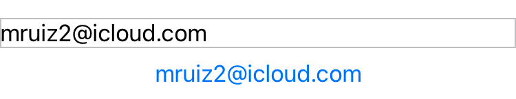

绑定的值不一定是字符串。通过使用`FormatStyle`，你可以将文本字段绑定到非字符串类型，使用格式样式将键入的文本转换为绑定类型的实例。下面的示例使用`PersonNameComponents.FormatStyle`将在文本字段中键入的名称转换为`PersonNameComponents`实例。文本字段下方的`Text`视图显示了该实例的调试描述字符串。

```swift
@State private var nameComponents = PersonNameComponents()

var body: some View {
    TextField(
        "Proper name",
        value: $nameComponents,
        format: .name(style: .medium)
    )
    .onSubmit {
        validate(components: nameComponents)
    }
    .disableAutocorrection(true)
    .border(.secondary)
    Text(nameComponents.debugDescription)
}

```

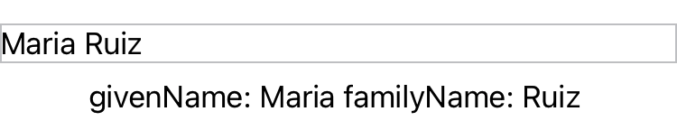


### Text field prompts

你可以在文本字段上设置一个明确的提示，以指导用户应该提供什么文本。每个文本字段样式都决定了文本字段在何处以及何时使用提示和标签。例如，macOS 上的表单始终将标签放置在字段的前沿，并在可用时将提示用作字段本身内的占位符文本。在 iOS 上的相同上下文中，文本字段根据初始化器是否提供提示，将提示或标签用作占位符文本。

下面的示例显示了一个带有两个文本字段的表单，每个字段都提供了一个提示，表明该字段是必填的，还有一个视图构建器来提供标签：

```swift
struct TextFieldView: View {
    
    @State private var username: String = ""
    
    @State private var password: String = ""

    var body: some View {
        Form {
            TextField(text: $username, prompt: Text("Required")) {
                Text("Username")
            }
            SecureField(text: $password, prompt: Text("Required")) {
                Text("Password")
            }
        }
    
    }
}
```

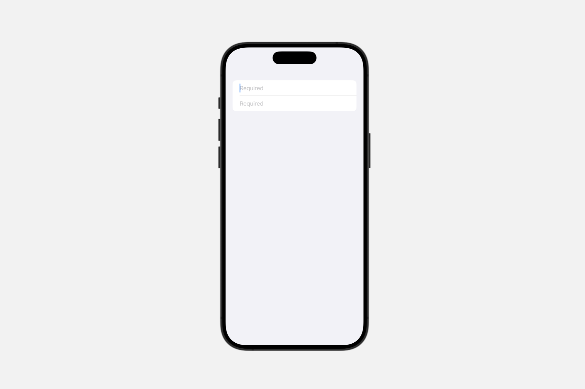

### Styling text fields

SwiftUI 提供了一种默认的文本字段样式，该样式反映了适合平台的外观和行为。默认样式还考虑了当前上下文，例如文本字段是否在以特殊样式呈现文本字段的容器中。除此之外，你还可以使用 `textFieldStyle(_:)` 修饰符来自定义文本字段的外观和交互，传入 `TextFieldStyle` 的实例。下面的示例将 `roundedBorder` 样式应用于 `VStack` 中的两个文本字段。

```swift
struct TextFieldView: View {
    
    @State private var givenName: String = ""
    @State private var familyName: String = ""


    var body: some View {
        VStack {
            TextField(
                "Given Name",
                text: $givenName
            )
            .disableAutocorrection(true)
            TextField(
                "Family Name",
                text: $familyName
            )
            .disableAutocorrection(true)
        }
        .textFieldStyle(.roundedBorder)
        .padding()
    }

}
```


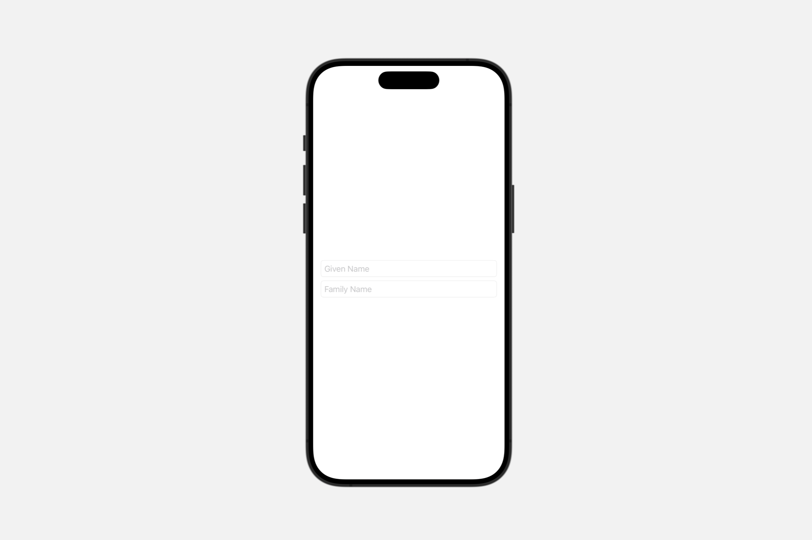


### Creating a scrollable text field

```swift
init(
    _ titleKey: LocalizedStringKey,
    text: Binding<String>,
    axis: Axis
)
```

创建一个带有首选轴和从本地化标题字符串生成的文本标签的文本字段。

- `titleKey`: 文本字段本地化标题的键，描述其用途。
- `text`: 要显示和编辑的文本。
- `axis`: 当文本不适合可用空间时要滚动的轴。

指定文本字段内容在不适合可用空间时应该滚动的首选轴。根据字段的样式，此轴可能不被遵守。

使用 `onSubmit(of:_:)` 修饰符，在用户提交此文本字段时调用一个动作。


### Creating a text field with a value

#### `init(_:value:format:prompt:)`


创建一个文本字段，该字段将格式样式应用于绑定值，并使用从本地化标题字符串生成的标签。

```swift
init<F>(
    _ titleKey: LocalizedStringKey,
    value: Binding<F.FormatInput>,
    format: F,
    prompt: Text? = nil
) where F : ParseableFormatStyle, F.FormatOutput == String
```

- `titleKey`: 文本字段的标题，描述其用途。
- `value`: 要编辑的基础值。
- `format`: 在用户编辑的字符串和`F.FormatInput`类型的基础值之间进行转换时使用的`F`类型的格式样式。如果`format`无法执行转换，则文本字段将`binding.value`保持不变。如果用户在无效状态下停止编辑文本，则文本字段会将字段的文本更新为最后一个已知的有效值。
- `prompt`: 为用户提供关于在文本字段中输入什么的指导的`Text`。

使用此初始化器创建一个文本字段，该字段绑定到一个绑定值，并使用可解析的格式样式来实现类型的双向转换。绑定值的变化会更新文本字段显示的字符串。编辑文本字段会更新绑定值，前提是格式样式能解析文本。如果格式样式不能解析输入，绑定值保持不变。

使用 `onSubmit(of:_:)` 修饰符，在用户提交此文本字段时调用一个操作。

以下示例使用 `Double` 作为绑定值，并使用 `FloatingPointFormatStyle` 实例来实现字符串的双向转换。当用户输入时，绑定值会更新，这反过来又更新了使用不同格式样式的三个 `Text` 视图。如果用户输入的文本不代表一个有效的 `Double`，绑定值不会更新。


```swift
@State private var myDouble: Double = 0.673
var body: some View {
    VStack {
        TextField(
            "Double",
            value: $myDouble,
            format: .number
        ).textFieldStyle(.roundedBorder)
        Text(myDouble, format: .number)
        Text(myDouble, format: .number.precision(.significantDigits(5)))
        Text(myDouble, format: .number.notation(.scientific))
    }.padding().font(.largeTitle)
}
```

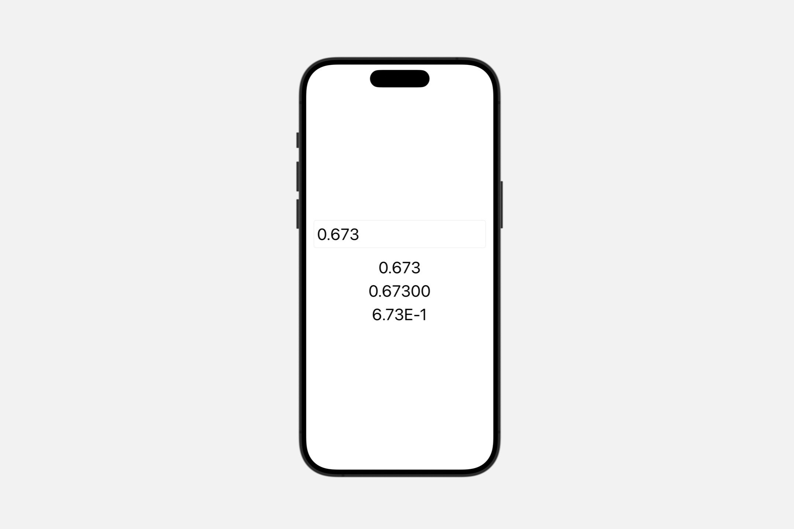


#### `init(_:value:formatter:)`

创建一个实例，它绑定一个任意类型 `V`。

```swift
init<S, V>(
    _ title: S,
    value: Binding<V>,
    formatter: Formatter
) where S : StringProtocol
```

- `title`: 文本视图的标题，描述其用途。
- `value`: 要编辑的底层值。
- `formatter`: 在用户编辑的字符串与类型为 `V` 的底层值之间转换时使用的格式化器。如果格式化器不能执行转换，文本字段不会修改绑定的值。

使用这个初始化器创建一个绑定到可选值的文本字段，使用一个格式化器来实现该类型的双向转换。绑定值的变化会更新文本字段显示的字符串。编辑文本字段会更新绑定值，只要格式化器能解析文本。如果格式化器不能解析输入，绑定值保持不变。

使用 `onSubmit(of:_:)` 修饰符，在用户提交此文本字段时调用一个操作。

以下示例使用 `Double` 作为绑定值，并使用 `NumberFormatter` 实例来实现字符串的双向转换。格式化器使用 `NumberFormatter.Style.decimal` 样式，允许输入小数部分。当用户输入时，绑定值会更新，这反过来又更新了使用不同格式样式的三个 `Text` 视图。如果用户输入的文本不代表一个有效的 `Double`，绑定值不会更新。

```swift
@State private var myDouble: Double = 0.673
@State private var numberFormatter: NumberFormatter = {
    var nf = NumberFormatter()
    nf.numberStyle = .decimal
    return nf
}()


var body: some View {
    VStack {
        TextField(
            value: $myDouble,
            formatter: numberFormatter
        ) {
            Text("Double")
        }.textFieldStyle(.roundedBorder)
        Text(myDouble, format: .number)
        Text(myDouble, format: .number.precision(.significantDigits(5)))
        Text(myDouble, format: .number.notation(.scientific))
    }.padding().font(.largeTitle)
}
```


### Creating a text field with an optional

```swift
init<F>(
    _ titleKey: LocalizedStringKey,
    value: Binding<F.FormatInput?>,
    format: F,
    prompt: Text? = nil
) where F : ParseableFormatStyle, F.FormatOutput == String

```

创建一个文本字段，该字段应用格式样式到一个绑定的可选值，并使用本地化的标题字符串生成标签。

- `titleKey`: 文本字段的标题，描述其用途。
- `value`: 要编辑的底层值。
- `format`: 用于在用户编辑的字符串与类型为 `F.FormatInput` 的底层值之间转换的类型 `F` 的格式样式。如果 `format`  不能执行转换，文本字段将 `value` 设置为 `nil`。
- `prompt`: 提供用户输入指导的 `Text`。


使用这个初始化器创建一个文本字段，它绑定到一个可选值，并使用可解析的格式样式来进行类型的双向转换。绑定值的变化会更新文本字段显示的字符串。编辑文本字段会更新绑定值，只要格式样式能解析文本。如果格式样式不能解析输入，文本字段将绑定值设置为 nil。

使用 `onSubmit(of:_:)` 修饰符，在用户提交这个文本字段时调用一个操作。

以下示例使用一个可选的 `Double` 作为绑定的货币值，并使用 `FloatingPointFormatStyle.Currency` 实例来实现作为美元的字符串表示的双向转换。当用户输入时，一个 `View.onChange(of:_:)` 修饰符会将新值记录到控制台。如果用户输入了无效的货币值，如字母或表情符号，控制台输出是 `Optional(nil)`。

```swift
@State private var myMoney: Double? = 300.0
    
var body: some View {
    TextField(
        "Currency (USD)",
        value: $myMoney,
        format: .currency(code: "USD")
    )
    .onChange(of: myMoney) {
        print ("myMoney: \(myMoney ?? 0.0)")
    }
}
```

## `SecureField`

一个控件，用于人们安全地输入私密文本。

```swift
struct SecureField<Label> where Label : View
```

当你想要一个文本字段的行为，但想隐藏字段中的文本时，使用安全字段。通常，这用于输入密码和其他敏感信息，如下图中的第二个字段所示：

macOS

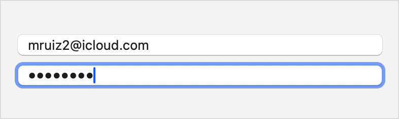

iOS

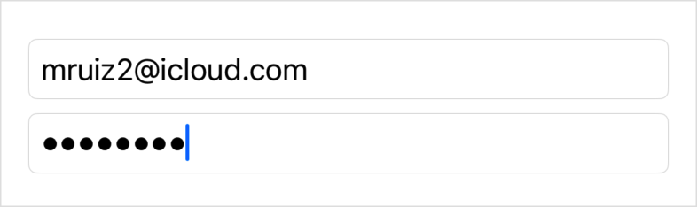


该字段：

- 为输入的每个字符显示一个点。
- 当在 iOS 中进行截屏时，隐藏这些点。
- 阻止任何人剪切或复制字段内容。
- 当大写锁定被启用时显示一个指示器。

### Bind to a string

安全字段绑定到一个字符串值，并在每次敲击键盘或其他编辑时更新这个字符串，因此你可以随时在代码的其他地方读取其值。以下代码展示了如何创建上述界面，其中安全字段绑定到一个密码字符串：


```swift
@State private var username: String = ""
@State private var password: String = ""


var body: some View {
    VStack {
        TextField("Username", text: $username)
            .autocorrectionDisabled(true)
            #if !os(macOS)
            .textInputAutocapitalization(.never)
            #endif


        SecureField("Password", text: $password)
            .onSubmit {
                handleLogin(username: username, password: password)
            }
    }
    .textFieldStyle(.roundedBorder)
}
```

在上述示例中，字段包含一个 `onSubmit(of:_:)` 修饰符，如果有人在安全字段聚焦时按下返回键，这个修饰符会将用户名和密码字符串发送到一个自定义的 `handleLogin(username:password:)` 方法。你也可以选择提供另一种机制——比如一个按钮——来完成同样的事情。

### Guide people with a prompt

除了你提供作为标签的字符串或视图外，你还可以提供一个文本视图提示，以帮助使用该字段的人，如下面的表单所示：

```swift
Form {
    TextField(text: $username, prompt: Text("Required")) {
        Text("Username")
    }
    .autocorrectionDisabled(true)
    #if !os(macOS)
    .textInputAutocapitalization(.never)
    #endif


    SecureField(text: $password, prompt: Text("Required")) {
        Text("Password")
    }
}
```

系统根据上下文以不同方式使用标签和提示。例如，在 macOS 的表单中，标签放置在字段的前沿，提示作为字段内的占位符文本使用。在 iOS 中的同一表单也使用提示作为占位符文本，但不显示标签：

macOS

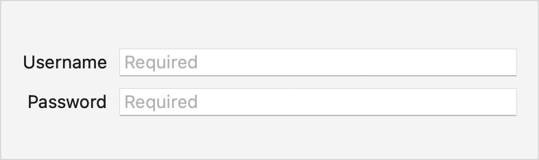

iOS

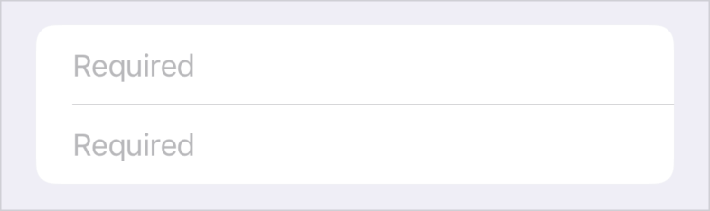


如果从前一个示例中移除提示，macOS 中的字段将保留前沿的标签并省略占位符文本，但在 iOS 中会将标签显示为占位符：

macOS

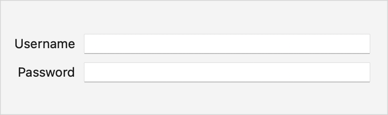

iOS

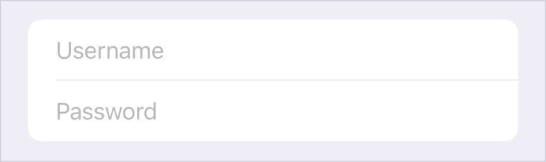

## `TextEditor`

一个可以显示和编辑长文本的视图。

```swift
struct TextEditor
```

文本编辑器视图允许你在应用的用户界面中显示和编辑多行可滚动文本。默认情况下，文本编辑器视图使用从环境继承的特征来样式化文本，例如 `font(_:)`、`foregroundColor(_:)` 和 `multilineTextAlignment(_:)`。

你可以通过在视图的 `body` 中添加一个 `TextEditor` 实例并通过传入一个绑定到应用中字符串变量的 `Binding` 来创建一个文本编辑器：

```swift
struct TextEditingView: View {
    @State private var fullText: String = "This is some editable text..."


    var body: some View {
        TextEditor(text: $fullText)
    }
}
```

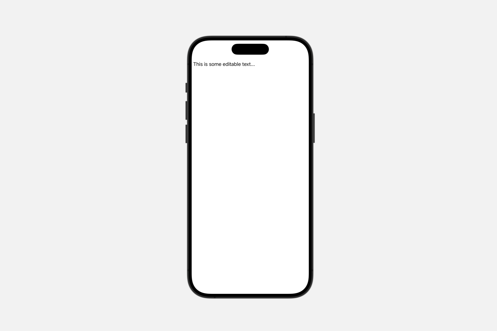

要设置文本样式，使用标准视图修饰符来配置系统字体、设置自定义字体或更改视图文本的颜色。

在这个例子中，视图用自定义字体渲染编辑器的文本为灰色：


```swift
struct TextEditingView: View {
    @State private var fullText: String = "This is some editable text..."


    var body: some View {
        TextEditor(text: $fullText)
            .foregroundColor(Color.gray)
            .font(.custom("HelveticaNeue", size: 36))
    }
}

```


如果你想改变文本的间距或字体缩放方面，可以使用如 `lineLimit(_:)`、`lineSpacing(_:)` 和 `minimumScaleFactor(_:)` 等修饰符来配置视图显示文本的方式，这取决于空间限制。例如，在这里，`lineSpacing(_:)` 修饰符将行间距设置为 $5$ 点：

```swift
struct TextEditingView: View {
    @State private var fullText: String = "This is some editable text..."


    var body: some View {
        TextEditor(text: $fullText)
            .foregroundColor(Color.gray)
            .font(.custom("HelveticaNeue", size: 13))
            .lineSpacing(5)
    }
}
```

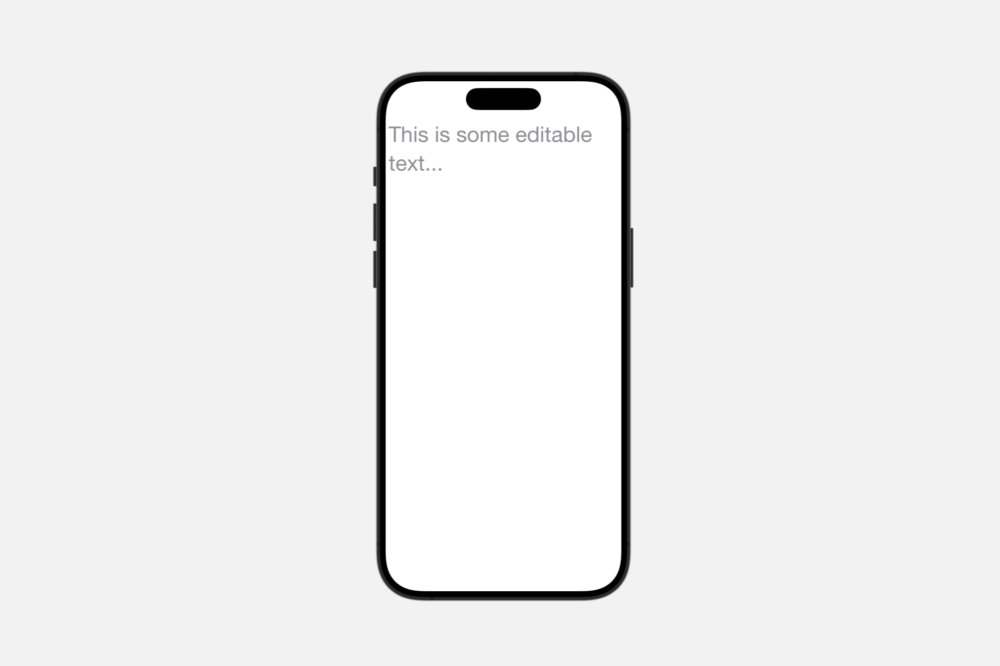


