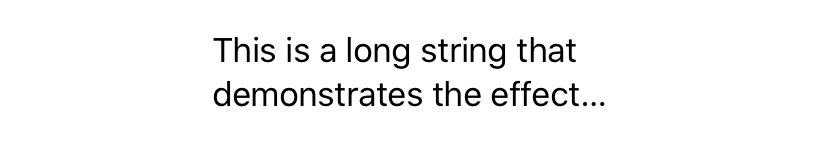
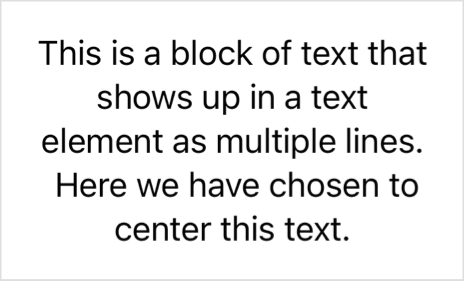

# Limiting line count for multiline text

## `lineLimit(_ number: Int?)`

设置此视图中文本可以占用的最大行数。

```swift
func lineLimit(_ number: Int?) -> some View
```

使用此修饰符限制单个文本元素可以显示的行数。

行限制适用于层次结构中的所有 `Text` 实例。例如，一个带有多行文本的 `HStack`，每行文本都超过三行，则将每行文本限制为三行，而不是限制整个 `HStack` 中的总行数。

在下面的示例中，修饰符将 `Text` 元素中非常长的一行限制为适合视图边界的 $2$ 行：

```swift
Text("This is a long string that demonstrates the effect of SwiftUI's lineLimit(:_) operator.")
    .frame(width: 200, height: 200, alignment: .leading)
    .lineLimit(2)

```




## `lineLimit(_ limit: PartialRangeFrom<Int>)`

设置文本在此视图中可以占用的行数的部分范围。

```swift
func lineLimit(_ limit: PartialRangeFrom<Int>) -> some View
```

使用此修饰符指定 `Text` 视图或垂直 `TextField` 可以占用的部分行数范围。当此类视图的文本占用的空间小于提供的限制时，该视图将扩展以占用最小行数。


```swift
Form {
    TextField("Title", text: $model.title)
    TextField("Notes", text: $model.notes, axis: .vertical)
        .lineLimit(3...)
}
```


## `lineLimit(_ limit: PartialRangeThrough<Int>)`

```swift
func lineLimit(_ limit: PartialRangeThrough<Int>) -> some View
```

使用此修饰符指定 `Text` 视图或垂直 `TextField` 可以占用的部分行数范围。当此类视图的文本占用的空间大于提供的限制时，`Text` 视图将截断其内容，而 `TextField` 将变为可滚动。

```swift
Form {
    TextField("Title", text: $model.title)
    TextField("Notes", text: $model.notes, axis: .vertical)
        .lineLimit(...3)
}
```

## `lineLimit(_ limit: ClosedRange<Int>)`

设置文本在此视图中可以占用的行数的闭合范围。

```swift
func lineLimit(_ limit: ClosedRange<Int>) -> some View
```

```swift
Form {
    TextField("Title", text: $model.title)
    TextField("Notes", text: $model.notes, axis: .vertical)
        .lineLimit(1...3)
}
```

## `lineLimit(_:reservesSpace:)`

设置此视图中文本可以占用的行数限制。

```swift
func lineLimit(
    _ limit: Int,
    reservesSpace: Bool
) -> some View
```

- `limit`：行数限制。
- `reservesSpace`：文本是否保留空间，以便始终占用显示指定行数所需的高度。

使用此修饰符指定 `Text` 或垂直 `TextField` 可以占用的行数限制。如果为 `reservesSpace` 参数传递 `true` 值，并且此类视图的文本占用的空间小于提供的限制，则该视图将扩展以占用最小行数。当文本占用的空间大于提供的限制时，`Text` 视图将截断其内容，而 `TextField` 将变为可滚动。


```swift
GroupBox {
    Text("Title")
        .font(.headline)
        .lineLimit(2, reservesSpace: true)
    Text("Subtitle")
        .font(.subheadline)
        .lineLimit(4, reservesSpace: true)
}
```


## `multilineTextAlignment(_:)`

设置包含多行文本的文本视图的对齐方式。


```swift
func multilineTextAlignment(_ alignment: TextAlignment) -> some View
```

使用此修饰符设置多行文本块的对齐方式。例如，以下 `Text` 视图的内容居中对齐：


```swift
Text("This is a block of text that shows up in a text element as multiple lines.\("\n") Here we have chosen to center this text.")
    .frame(width: 200)
    .multilineTextAlignment(.center)
```

上面示例中的文本跨越多行，原因如下：

- 换行符引入了换行。
- `frame` 修饰符限制了文本视图可用的空间，默认情况下，文本视图会换行显示不适合可用宽度的行。因此，显式换行之前的文本换行到三行，之后的文本使用两行。

该修饰符将对齐方式应用于视图中的所有文本行，无论换行的原因是什么：



该修饰符对仅包含一行文本的 `Text` 视图没有影响，因为文本视图的宽度与其最宽行的宽度完全匹配。如果要对齐整个文本视图而不是其内容，请设置其容器的对齐方式，例如 `VStack` 或使用 `frame(minWidth:idealWidth:maxWidth:minHeight:idealHeight:maxHeight:alignment:)` 修饰符创建的框架。


::: info

你可以使用此修饰符来控制使用 `init(_:style:)` 初始化器创建的 `Text` 视图的对齐方式，以显示本地化的日期和时间，包括当该视图仅使用一行时，但仅当该视图出现在小部件中时。
:::

该修饰符还会影响其他文本容器类型的内容对齐方式，如 `TextEditor` 和 `TextField`。在这些情况下，即使视图仅包含一行，修饰符也会设置对齐方式，因为视图的宽度不是由它所包含的文本的宽度决定的。

该修饰符通过设置环境中的 `multilineTextAlignment` 值来操作，因此它会影响修改后的视图层次结构中的所有文本容器。例如，你可以将修饰符应用于 `VStack`，以配置堆栈内的所有文本视图。