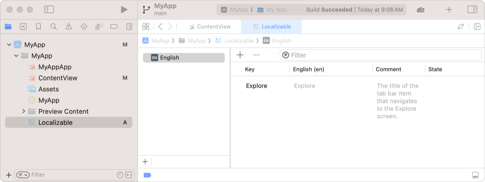
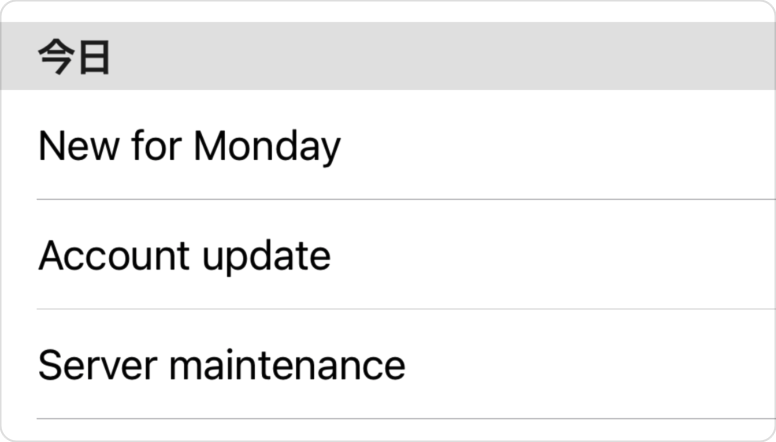

# Localizing text

对 SwiftUI 视图进行本地化，以便用户以他们自己的母语、地区和文化体验你的应用程序。Xcode 在导出本地化目录时会解析 SwiftUI 视图中的字符串以进行本地化。你可以添加提示，以便 Xcode 为你的应用程序生成正确的、带提示的字符串进行本地化。

## Add comments to text views

为了简化翻译过程，向翻译人员提供提示，告知他们你的应用程序如何以及在何处显示 `Text` 视图的字符串。要添加提示，请使用 `Text` 视图初始化器 `init(_:tableName:bundle:comment:)` 的可选 `comment` 参数。当你使用 Xcode 对应用程序进行本地化时，它会将注释字符串与字符串一起包含在内。例如，以下 `Text` 视图包含一个注释：

```swift
Text("Explore",
    comment: "The title of the tab bar item that navigates to the Explore screen.")
```

Xcode 会在你的字符串目录文件中为这个视图创建以下条目：



## Provide additional information with text views

你可以通过提供一个 SwiftUI 解释为 `LocalizedStringKey` 的字符串来本地化许多具有字符串标签的 SwiftUI 视图。系统在运行时使用该键从你的字符串目录中检索本地化的值，或者如果在目录中找不到该键，则直接使用该字符串。例如，SwiftUI 将以下 `Label` 初始化器的字符串输入用作本地化字符串键：

```swift
Label("Message", image: "msgSymbol")
```

如果你还想提供本地化的注释，可以使用显式的 `Text` 视图：

```swift
Label {
    Text("Message",
        comment: "A label that displays 'Message' and a corresponding image.")
} icon: {
    Image("msgSymbol")
}
```

许多 SwiftUI 控件都有视图构建器初始化器，使你能够遵循这种模式。

## `LocalizedStringKey`

用于在字符串文件或字符串字典文件中查找条目的键。

几个 SwiftUI 类型的初始化器（如 `Text`、`Toggle`、`Picker` 等）在你提供字符串字面量时会隐式查找本地化字符串。当你使用初始化器 `Text("Hello")` 时，SwiftUI 会为你创建一个 `LocalizedStringKey`，并使用该键查找 "Hello" 字符串的本地化版本。这是因为 `LocalizedStringKey` 符合 `ExpressibleByStringLiteral`。

其初始化器接受 `LocalizedStringKey` 的类型通常有一个对应的初始化器，该初始化器接受符合 `StringProtocol` 的参数。将 `String` 变量传递给这些初始化器可以避免本地化，这通常适用于变量包含用户提供的值的情况。

一般来说，当你需要本地化时使用字符串字面量参数，当你不需要本地化时使用字符串变量参数。如果你想本地化字符串变量的值，可以使用该字符串创建一个新的 `LocalizedStringKey` 实例。

下面的示例展示了如何创建带本地化和不带本地化的 `Text` 实例。提供给 `Section` 的 `title` 参数是一个字面量字符串，因此 SwiftUI 会为它创建一个 `LocalizedStringKey`。然而，`messageStore.today` 数组中的字符串条目是 `String` 变量，因此列表中的 `Text` 视图将直接使用字符串值。

```swift
List {
    Section(header: Text("Today")) {
        ForEach(messageStore.today) { message in
            Text(message.title)
        }
    }
}
```

如果应用程序被本地化为日语，并使用以下 Localizable.strings 文件进行翻译：

```swift
"Today" = "今日";
```

在日语环境下运行时，该示例会生成一个如下所示的列表，其中“Today”为节标题进行了本地化，但列表项没有本地化。

