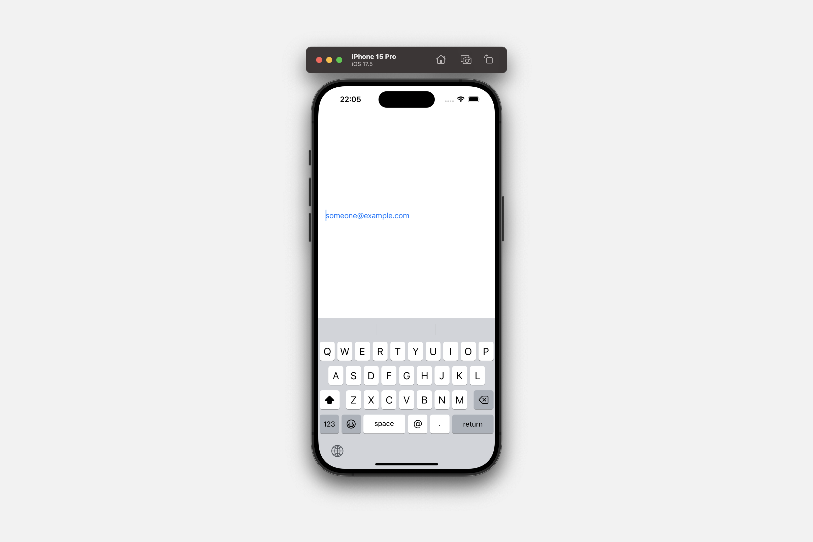

# Managing text entry

## `autocorrectionDisabled(_:)`

设置是否为此视图禁用自动更正。


```swift
func autocorrectionDisabled(_ disable: Bool = true) -> some View
```

当自动更正的效果会使用户更难输入信息时，请使用此方法。输入专有名词和街道地址就是自动更正会对用户完成数据输入任务的能力产生负面影响的例子。

下面的示例配置了一个带有默认键盘的 `TextField`。禁用自动更正允许用户输入任意文本，而自动更正系统不会提供建议或尝试覆盖他们的输入。


```swift
TextField("1234 Main St.", text: $address)
    .keyboardType(.default)
    .autocorrectionDisabled(true)
```

## `keyboardType(_:)`

设置此视图的键盘类型。

```swift
func keyboardType(_ type: UIKeyboardType) -> some View
```


使用 `keyboardType(_:)` 指定用于文本输入的键盘类型。有许多不同的键盘类型可满足特定的输入需求，例如输入电子邮件地址或电话号码。

下面的示例展示了一个用于输入电子邮件地址的 `TextField`。将文本字段的键盘类型设置为 `.emailAddress` 可确保用户只能输入格式正确的电子邮件地址。

```swift
TextField("someone@example.com", text: $emailAddress)
.keyboardType(.emailAddress)
```



通过 `UIKeyboardType` 枚举，有几种不同类型的专用键盘类型可用。要指定默认的系统键盘类型，请使用 `.default`。

## `scrollDismissesKeyboard(_:)`

配置可滚动内容与软件键盘交互的行为。

```swift
func scrollDismissesKeyboard(_ mode: ScrollDismissesKeyboardMode) -> some View
```

你使用此修饰符来自定义可滚动内容与软件键盘的交互方式。例如，你可以指定 `immediately` 值来表示你希望可滚动内容在滚动拖动手势开始时如果存在则立即隐藏键盘。

```swift
@State private var text = ""


ScrollView {
    TextField("Prompt", text: $text)
    ForEach(0 ..< 50) { index in
        Text("\(index)")
            .padding()
    }
}
.scrollDismissesKeyboard(.immediately)
```

<video src="../../video/TextScrollDismissesKeyboard.mp4" controls="controls"></video>

你还可以使用此修饰符来自定义其他类型的可滚动视图（如 `List` 或 `TextEditor`）的键盘隐藏行为。

默认情况下，`TextEditor` 是交互式的，而其他类型的可滚动内容在链接到 iOS 16 或更高版本时始终在滚动时隐藏键盘。传递 `never` 值表示可滚动内容永远不应该自动隐藏键盘。