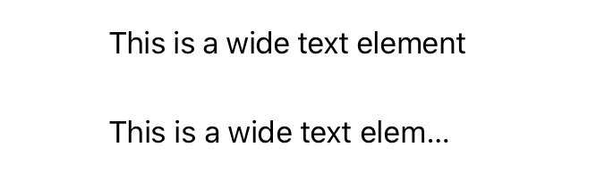
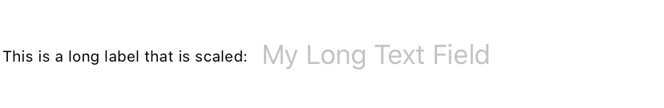

# Managing text layout

## `allowsTightening(_:)`

设置此视图中的文本在必要时是否可以压缩字符之间的空间以适应行中的文本。

```swift
func allowsTightening(_ flag: Bool) -> some View
```

- `flag`: 一个布尔值，指示在必要时是否压缩字符之间的空间。

使用 `allowsTightening(_:)` 来启用视图中文本的字符间间距压缩，以尝试将文本适合视图的边界。

在下面的示例中，两个配置相同的文本视图显示了 `allowsTightening(_:)` 对字符间距压缩的影响：


```swift
VStack {
    Text("This is a wide text element")
        .font(.body)
        .frame(width: 200, height: 50, alignment: .leading)
        .lineLimit(1)
        .allowsTightening(true)


    Text("This is a wide text element")
        .font(.body)
        .frame(width: 200, height: 50, alignment: .leading)
        .lineLimit(1)
        .allowsTightening(false)
}
```




## `minimumScaleFactor(_:)`

设置此视图中的文本缩小以适应可用空间的最小量。

```swift
func minimumScaleFactor(_ factor: CGFloat) -> some View
```

- `factor`: 一个介于 $0$ 和 $1$（包括）之间的分数，用于指定此视图允许的最小文本缩放量。

如果放置在视图中的文本不适合，并且可以缩小文本以适应，则使用 `minimumScaleFactor(_:)` 修饰符。例如，如果需要，具有 $0.5$ 最小缩放因子的标签将以实际字体大小的一半绘制文本。

在下面的示例中，`HStack` 包含一个行限制为 $1$ 的 `Text` 标签，旁边是一个 `TextField`。为了使标签适合可用空间，`minimumScaleFactor(_:)` 修饰符根据需要缩小文本以适合可用空间。


```swift
HStack {
    Text("This is a long label that will be scaled to fit:")
        .lineLimit(1)
        .minimumScaleFactor(0.5)
    TextField("My Long Text Field", text: $myTextField)
}
```




## `flipsForRightToLeftLayoutDirection(_:)`

设置当布局方向为从右到左时，此视图是否水平镜像其内容。

```swift
func flipsForRightToLeftLayoutDirection(_ enabled: Bool) -> some View
```

- `enabled`: 一个布尔值，指示当布局方向为从右到左时，此视图是否应水平翻转其内容。默认情况下，视图将在从右到左的上下文中自动调整其布局，不需要镜像。

当你需要系统在从右到左的布局中呈现时水平镜像视图的内容时，请使用 `flipsForRightToLeftLayoutDirection(_:)`。

要覆盖特定视图的布局方向，请使用 `environment(_:_:)` 视图修饰符显式覆盖视图的 `layoutDirection` 环境值。