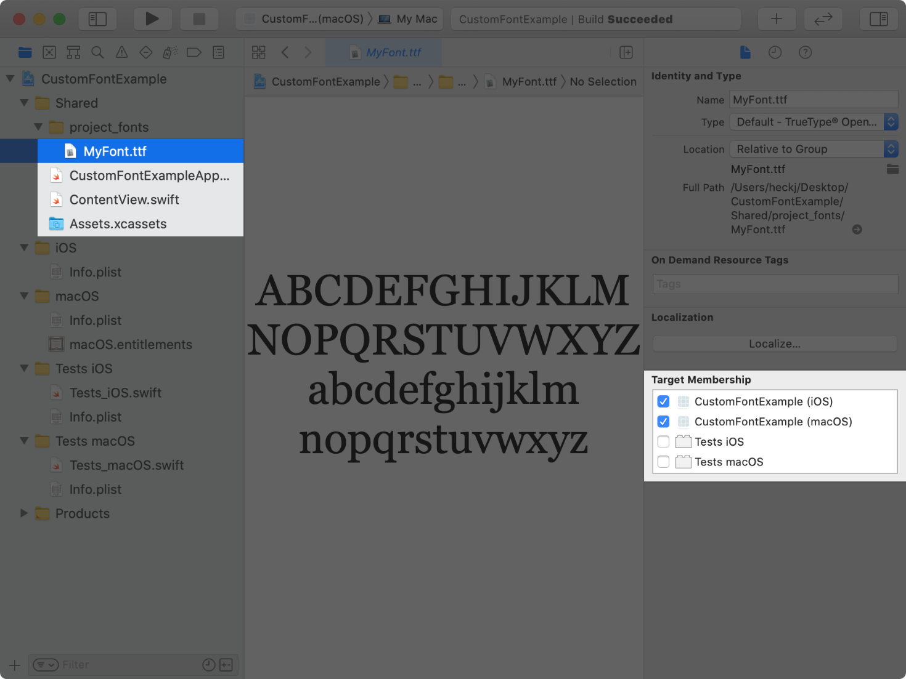
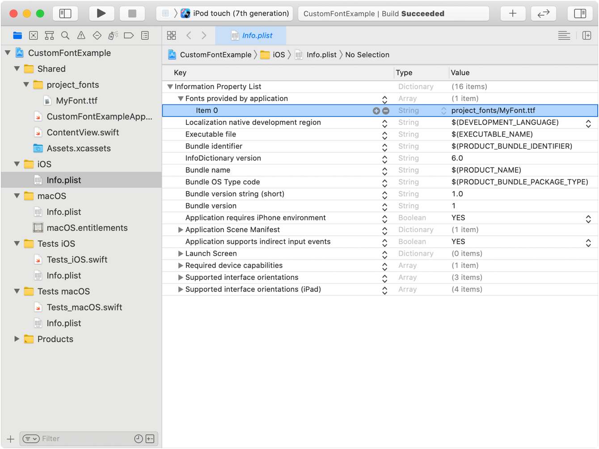
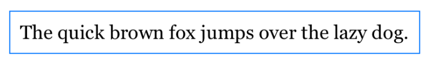
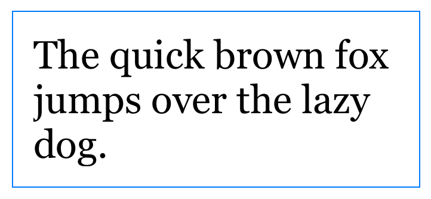

# Setting a font

[[toc]]

## Applying custom fonts to text

在你的应用中添加并使用一种字体，该字体能够与动态类型（Dynamic Type）一起缩放。

SwiftUI 支持使用内置字体来设置文本视图样式，并默认使用系统字体。你可以通过在 Xcode 项目中包含字体文件来使用自定义字体，而不是使用系统提供的字体。要使用自定义字体，请将包含你已授权字体的文件添加到应用中，然后将该字体应用于文本视图或将其设置为容器视图中的默认字体。SwiftUI 的自适应文本显示会使用动态类型（Dynamic Type）自动缩放字体。

动态类型允许用户选择屏幕上显示文本内容的大小。它帮助需要更大文本以便更好阅读的用户，并适应那些能阅读更小文本的用户，允许屏幕上显示更多信息。

### Add the font files to the project


要将字体文件添加到你的 Xcode 项目中：

1. 在 Xcode 中，选择项目导航器。
2. 从 Finder 窗口拖动你的字体文件到你的项目中。这将把字体复制到你的项目里。
3. 选择字体文件或包含字体的文件夹，并验证文件是否已勾选你应用的目标。




### Identify the font files to include in the app bundle
要在应用包中包含字体文件，请按以下步骤操作：

对于 iOS、watchOS、tvOS 或 Mac Catalyst 目标，将 `UIAppFonts` 键添加到应用的 Info.plist 文件中。对于键的值，请提供一个字符串数组，包含任何添加的字体文件的相对路径。对于 macOS 应用目标，使用你的目标 Info.plist 文件中的 `ATSApplicationFontsPath` 键，并为该键提供包含字体的文件夹名称。

在下面的示例中，字体文件位于 project_fonts 目录内，因此你在 Info.plist 文件中使用 `project_fonts/MyFont.ttf` 作为字符串值。




### Apply a font supporting dynamic sizing

要在 SwiftUI 中使用自定义字体并应用到文本视图，请使用 `custom(_:size:)` 方法获取字体实例，并使用 `font(_:)` 修饰符应用它。在使用 `custom(_:size:)` 获取字体时，需要确保字体名称与字体的 PostScript 名称匹配。你可以通过使用 Font Book 应用打开字体并选择 Font Info 标签来找到字体的 PostScript 名称。如果 SwiftUI 无法检索并应用你的字体，它将使用默认的系统字体来渲染文本视图。

以下示例展示了如何将 MyFont 应用到文本视图：

```swift
Text("Hello, world!")
    .font(Font.custom("MyFont", size: 18))
```

此字体将从提供的大小自适应缩放，以匹配默认的文本样式 body。使用 `relativeTo` 参数可以指定除了默认的 body 外的其他文本样式以进行缩放。例如，要设置字体大小为 32 点并相对于标题样式自适应缩放：

```swift
Text("Hello, world!")
    .font(Font.custom("MyFont", size: 32, relativeTo: .title))
```

SwiftUI 不会为字体合成粗体或斜体样式。如果字体支持加权或斜体变体，你可以通过使用 `weight(_:)` 或 `italic()` 修饰符来自定义文本视图的排版风格。

关于选择字体以增强你的应用在目标平台上的设计，可以参阅人机界面指南中的排版部分。

### Scale padding using scaled metric


`@ScaledMetric` 属性包装器在视图属性上提供了一个可缩放的值，该值会根据辅助功能设置自动变化。在使用自适应大小的字体时，你可以利用这个属性包装器来缩放文本间距或围绕文本的间距，以改善视觉设计。

以下示例展示了如何使用 `@ScaledMetric` 来根据 `body` 文本样式相对缩放围绕文本视图的填充值，并添加了蓝色边框以标识填充添加的间距：

```swift
struct ContentView: View {
    @ScaledMetric(relativeTo: .body) var scaledPadding: CGFloat = 10


    var body: some View {
        Text("The quick brown fox jumps over the lazy dog.")
            .font(Font.custom("MyFont", size: 18))
            .padding(scaledPadding)
            .border(Color.blue)
    }
}


struct ContentView_Previews: PreviewProvider {
    static var previews: some View {
        ContentView()
    }
}
```

预览显示了以下图片，没有开启任何辅助功能设置：



使用 `environment(_:_)` 修饰符在预览上设置辅助功能大小类别为 `ContentSizeCategory.accessibilityLarge`：

```swift
struct ContentView_Previews: PreviewProvider {
    static var previews: some View {
        ContentView()
            .environment(\.sizeCategory, .accessibilityLarge)
    }
}
```

然后，预览显示了以下图片，反映了增加的辅助功能大小和缩放的填充：



