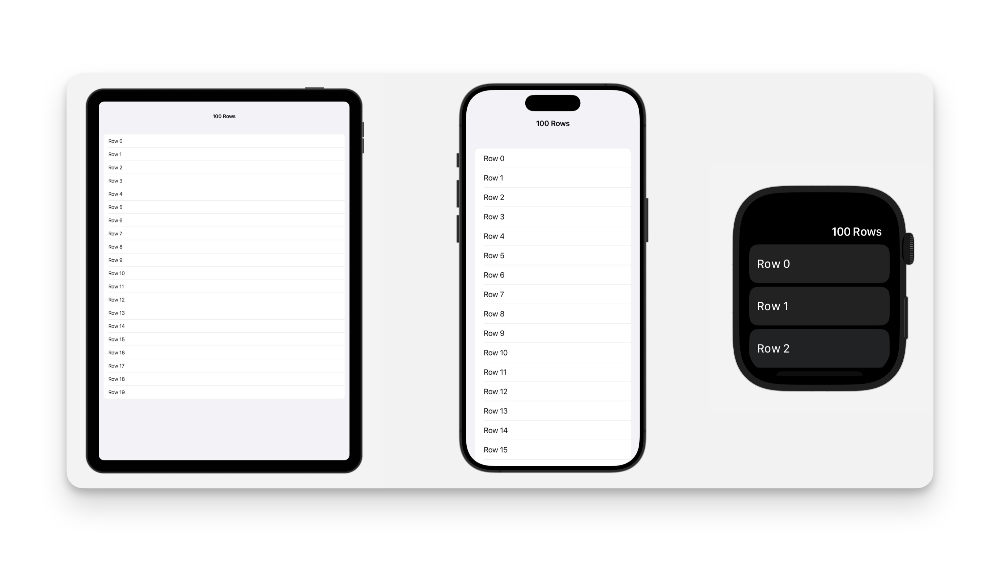
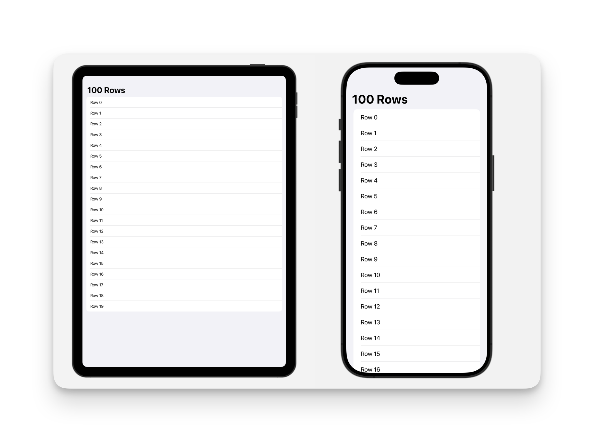

# Configuring the toolbar title display mode

## `toolbarTitleDisplayMode(_:)`


配置此视图的工具栏标题显示模式。

```swift
func toolbarTitleDisplayMode(_ mode: ToolbarTitleDisplayMode) -> some View
```


::: warning
该修饰符在 macOS 上无效。
:::

### `automatic`

对于 iOS、iPadOS 或 tvOS 中导航堆栈中的根内容，其行为表现为：

- 当配置了导航标题时，默认为大尺寸（ `large` ）模式。
    
- 当未提供导航标题时，默认为内联（ `inline` ）模式。

在所有平台中，推送到导航堆栈的内容将采用堆栈中已有内容的行为方式。请注意，此特性在 macOS 系统中无效。


### `inline`

内联模式。

在 iOS、tvOS 以及 watchOS 中，此模式会在工具栏中间以较小的字号显示标题。

```swift
NavigationStack {
    List(0..<20) {
        Text("Row \($0)")
    }.navigationTitle("100 Rows")
    .toolbarTitleDisplayMode(.inline)
}
```




### `inlineLarge`

在 iOS 系统中，这种行为将在工具栏内以大字体显示标题，并将任何靠左或居中的工具栏项目移至工具栏的溢出菜单中。




### `large`

在 iOS 及 watchOS 操作系统中，当滚动内容滚动至顶部时，此模式会使工具栏标题显示在导航栏内容下方；随着滚动内容继续滚动，标题会逐渐过渡到工具栏的中心位置。

<video src="../../video/ToolbarTitleDisplayModeLarge.mp4" controls="controls"></video>


watchOS

<video src="../../video/ToolbarTitleDisplayModeWatchOSLarge.mp4" controls="controls"></video>

