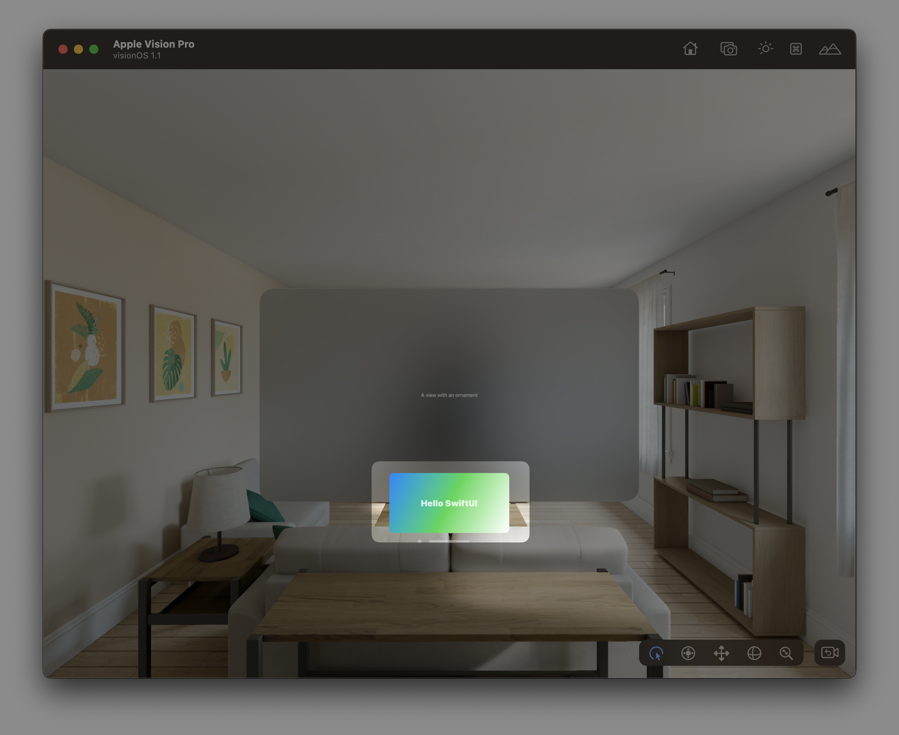

# Creating an ornament

## `ornament(visibility:attachmentAnchor:contentAlignment:ornament:)` <Badge type="info" text="visionOS" />

展示装饰元素。


```swift
func ornament<Content>(
    visibility: Visibility = .automatic,
    attachmentAnchor: OrnamentAttachmentAnchor,
    contentAlignment: Alignment = .center,
    @ViewBuilder ornament: () -> Content
) -> some View where Content : View
```


使用此方法可在指定位置显示装饰元素。下面的示例是在窗口下方显示装饰元素：


```swift
    Text("A view with an ornament")
        .ornament(attachmentAnchor: .scene(.bottom)) {
            OrnamentContent()
        }
```

