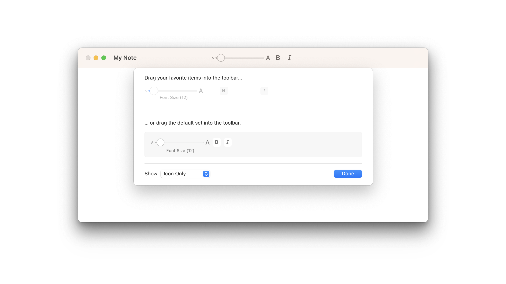

# Populating a customizable toolbar

## `toolbar(id:content:)`

在工具栏或导航栏中添加并展示所指定的项目，以支持用户进行个性化定制。

```swift
func toolbar<Content>(
    id: String,
    @ToolbarContentBuilder content: () -> Content
) -> some View where Content : CustomizableToolbarContent
```

当你想让用户自由调整工具栏中各项组件及其排列方式时，可以采用这个工具栏修饰符。

你需要提供的是一系列的工具栏项，而这些项是以每个项都被封装在 `ToolbarItem` 中的视图集合形式呈现的。

::: tip

在 macOS 与 iOS 操作系统上，应用程序都将展示可自定义的工具栏；然而，只有在 iPad 设备上运行 iPadOS 16.0 及以上版本的应用才具备用户自定义工具栏的功能。

:::

以下示例创建了一个视图，该视图展示了每个工具栏项及其唯一 ID ，这个 ID 是用来在定制编辑器中识别工具栏项的：


```swift
struct ToolsEditorView: View {
    @State private var text = ""
    @State private var bold = false
    @State private var italic = false
    @State private var fontSize = 12.0


    var displayFont: Font {
        let font = Font.system(
        size: CGFloat(fontSize),
            weight: bold == true ? .bold : .regular)
        return italic == true ? font.italic() : font
    }


    var body: some View {
        TextEditor(text: $text)
            .font(displayFont)
            .toolbar(id: "editingtools") {
                ToolbarItem(
                    id: "sizeSelector", placement: .secondaryAction
                ) {
                    Slider(
                        value: $fontSize,
                        in: 8...120,
                        minimumValueLabel:
                            Text("A").font(.system(size: 8)),
                        maximumValueLabel:
                            Text("A").font(.system(size: 16))
                    ) {
                        Text("Font Size (\(Int(fontSize)))")
                    }
                    .frame(width: 150)
                }
                ToolbarItem(
                    id: "bold", placement: .secondaryAction
                ) {
                    Toggle(isOn: $bold) {
                        Image(systemName: "bold")
                    }
                }
                ToolbarItem(
                    id: "italic", placement: .secondaryAction
                ) {
                    Toggle(isOn: $italic) {
                        Image(systemName: "italic")
                    }
                }
            }
            .navigationTitle("My Note")
    }
}
```

在 macOS 系统中，你可以通过使用 `commands(content:)` 场景修饰符将 `ToolbarCommands` 实例添加到场景中，以此来启用工具栏定制的菜单支持：

```swift
@main
struct ToolbarContent_macOSApp: App {
    var body: some Scene {
        WindowGroup {
            ToolsEditorView()
                .frame(maxWidth: .infinity, maxHeight: .infinity)
        }
        .commands {
            ToolbarCommands()
        }
    }
}
```


当你向应用中添加工具栏命令时，系统将会在你的应用主菜单中新增一个菜单项，以实现工具栏自定义功能的支持。

这意味着用户除了可以通过在工具栏上执行 `Control` 键点击操作来打开工具栏自定义编辑器之外，还可以直接从主菜单进行相应的设置调整。





## `defaultCustomization(_:options:)`

此设置用于调整那些带有默认行为的可自定义工具栏项目的具体表现形式。

```swift
func defaultCustomization(
    _ defaultVisibility: Visibility = .automatic,
    options: ToolbarCustomizationOptions = []
) -> some CustomizableToolbarContent
```

默认情况下，可自定义的工具栏项目支持用户进行多种编辑操作。

- 用户可以添加当前不在工具栏中的项目。
- 用户可以移除工具栏中已存在的项目。
- 用户可以在工具栏内部移动项目位置。

默认情况下，所有默认的可自定义工具栏项目最初都会出现在工具栏上。若想让这些项目初始状态下对用户不可见，并要求用户自行决定是否添加至工具栏，可以为此修饰符提供 `Visibility.hidden` 值作为设定。


```swift
ContentView()
    .toolbar(id: "main") {
        ToolbarItem(id: "new") {
            // new button here
        }
        .defaultCustomization(.hidden)
    }

```

为了确保即使用户从可自定义工具栏中移除了某个具有默认可定制性的项目，也能始终使用它，您可以采用 `alwaysAvailable` 选项。与使用 `ToolbarCustomizationBehavior/none` 定制行为始终保持在工具栏内的项目不同，设置了 `alwaysAvailable` 的项目在被用户从工具栏移除后，会保留在溢出菜单中。

要在该修饰符的 `options` 参数中启用此功能，请提供 `alwaysAvailable` 值。

```swift
ContentView()
    .toolbar(id: "main") {
        ToolbarItem(id: "new") {
            // new button here
        }
        .defaultCustomization(options: .alwaysAvailable)
    }
```


## `customizationBehavior(_:)`

此设置用于调整可自定义工具栏内容的个性化设置行为。

```swift
func customizationBehavior(_ behavior: ToolbarCustomizationBehavior) -> some CustomizableToolbarContent
```

可自定义工具栏项目支持多种不同的自定义方式：

- 用户可以添加当前未在工具栏上的项目。
- 用户可以移除已在工具栏上的项目。
- 用户可以在工具栏内移动项目的位置。

根据工具栏项目所设置的定制行为，系统会支持不同的编辑操作。

请使用此修饰符来设置用户可以对工具栏项目执行的自定义行为。下面的示例中，可自定义工具栏项目支持所有类型的工具栏定制，并且初始状态是在工具栏上显示。

如果你希望某个工具栏项目既不能被用户从工具栏中移除，也不能在工具栏内移动位置，只需将此属性的值设为 `disabled` 即可实现这一效果。

```swift
ContentView()
    .toolbar(id: "main") {
        ToolbarItem(id: "new") {
            // new button here
        }
        .customizationBehavior(.disabled)
    }
```

如果你想要创建一个工具栏项目，让它可以被用户在工具栏内部重新排列顺序，但不允许从工具栏中移除，那么只需将此属性的值指定为 `reorderable` 即可。

```swift
ContentView()
    .toolbar(id: "main") {
        ToolbarItem(id: "new") {
            // new button here
        }
        .customizationBehavior(.reorderable)
    }
```

