# Populating a toolbar

## `toolbar(content:)`

使用你提供的视图填充工具栏或导航栏。

```swift
func toolbar<Content>(@ViewBuilder content: () -> Content) -> some View where Content : View
```


使用此修饰符向工具栏添加内容。`toolbar` 修饰符期望得到一组工具栏项，你可以提供的方式有：

- 为每个视图包裹在 `ToolbarItem` 中提供视图集合，
- 或者以 `ToolbarItemGroup` 形式提供视图集合。

下面的示例通过使用工具栏项组添加视图，以支持文本编辑功能：


```swift
struct StructToolbarItemGroupView: View {
    @State private var text = ""
    @State private var bold = false
    @State private var italic = false
    @State private var fontSize = 12.0


    var displayFont: Font {
        let font = Font.system(size: CGFloat(fontSize),
                            weight: bold == true ? .bold : .regular)
        return italic == true ? font.italic() : font
    }

    var body: some View {
        TextEditor(text: $text)
            .font(displayFont)
            .toolbar {
                ToolbarItemGroup {
                    Slider(
                        value: $fontSize,
                        in: 8...120,
                        minimumValueLabel:
                            Text("A").font(.system(size: 8)),
                        maximumValueLabel:
                            Text("A").font(.system(size: 16))
                    ) {
                        Text("Font Size (\(Int(fontSize)))")
                    }
                    .frame(width: 150)
                    Toggle(isOn: $bold) {
                        Image(systemName: "bold")
                    }
                    Toggle(isOn: $italic) {
                        Image(systemName: "italic")
                    }
                }
            }
            .navigationTitle("My Note")
    }
}
```

<video src="../../video/Toolbar.mp4" controls="controls"></video>

## `ToolbarItem`

代表可放置在工具栏或导航栏中的项目的模型。


```swift
struct ToolbarItem<ID, Content> where Content : View
```

### `init(placement:content:)`

创建一个具有指定位置和内容的工具栏项。

```swift
init(
    placement: ToolbarItemPlacement = .automatic,
    @ViewBuilder content: () -> Content
)
```

- `placement`: 该工具栏项应放置在工具栏的哪个区域。
- `content`: 该项目的内容。

```swift
@Environment(\.dismiss) var dismiss

ToolbarItem(placement: .cancellationAction) {
    Button(action: {
        dismiss()
    }, label: {
        Image(systemName: "arrow.backward")
    })
}
```

## `ToolbarItemGroup`

表示一组可放置在工具栏或导航栏中的 `ToolbarItems` 的模型。

```swift
struct ToolbarItemGroup<Content> where Content : View
```

### `init(placement:content:)`

创建一个具有指定位置和内容的工具栏项组。

- `placement`: 该工具栏项应放置在工具栏的哪个区域。
- `content`: 该项目的内容。


```swift
@Environment(\.dismiss) var dismiss

ToolbarItemGroup(placement: .cancellationAction) {
    Button(action: {
        dismiss()
    }, label: {
        Image(systemName: "arrow.backward")
    })
}
```


## `ToolbarItemPlacement`

一种用于定义工具栏项位置的结构。

```swift
struct ToolbarItemPlacement
```

有两种类型的定位方式：

- 语义定位：如主要（ `principal` ）和导航（ `navigation` ），这类定位表示添加项目的意图。SwiftUI 会根据这一意图及其周围上下文（如当前平台）确定项目的适当位置。
- 位置定位：如 `navigationBarLeading`，这种定位方式指定了项目的精确位置，通常适用于特定平台。

在 iOS、iPadOS 和 macOS 系统中，系统在决定工具栏中要渲染多少个项目时，会考虑工具栏可用的空间。如果所有项目都无法适应现有空间，系统可能会创建一个溢出菜单，并将剩余项目放入该菜单中。


### Getting semantic placement


::: info `automatic`

系统会根据多种因素自动放置该项目，这些因素可能包括平台类型、尺寸类别以及其他项目的存在与否。

在 macOS 操作系统以及 Mac Catalyst 应用中，系统会按照从左至右的顺序将项目置于当前工具栏区域内。


而在 watchOS 上，仅第一个项目会被显示，固定在导航栏下方。

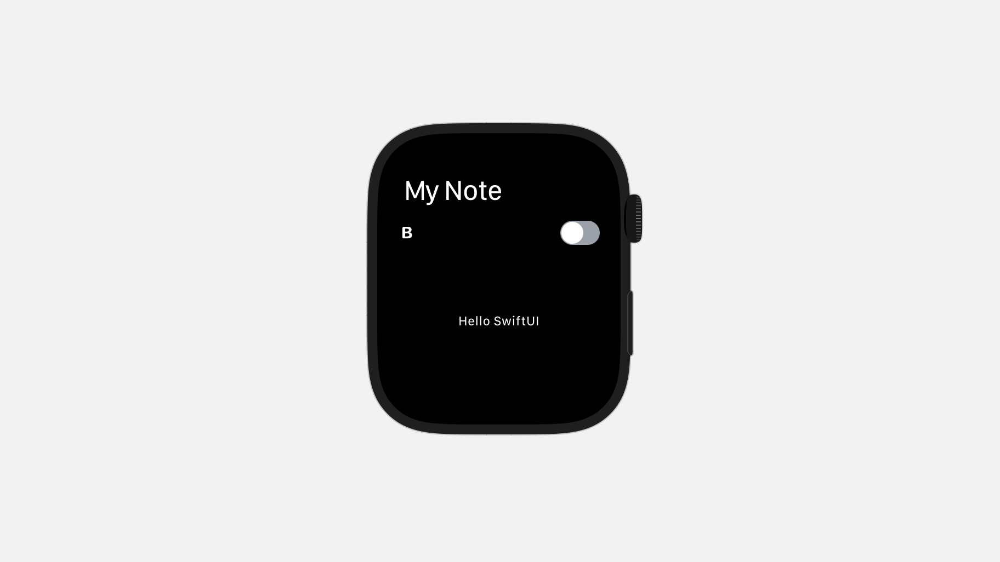


在 iPadOS 系统中，如果导航栏支持自定义，则系统会将项目置于导航栏中央；否则，项目会被放在导航栏的右侧位置。

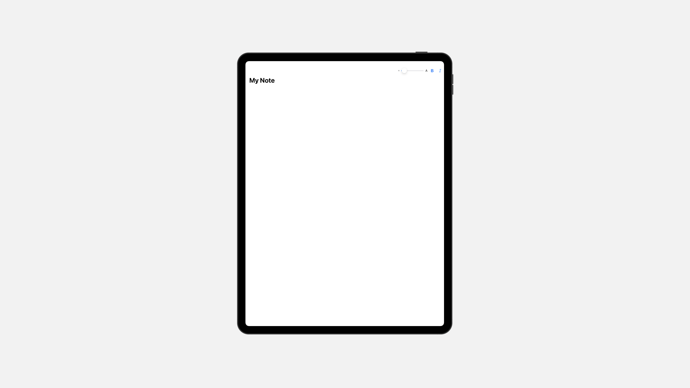

在 iOS 和 tvOS 系统中，系统会将项目置于导航栏的右侧位置。

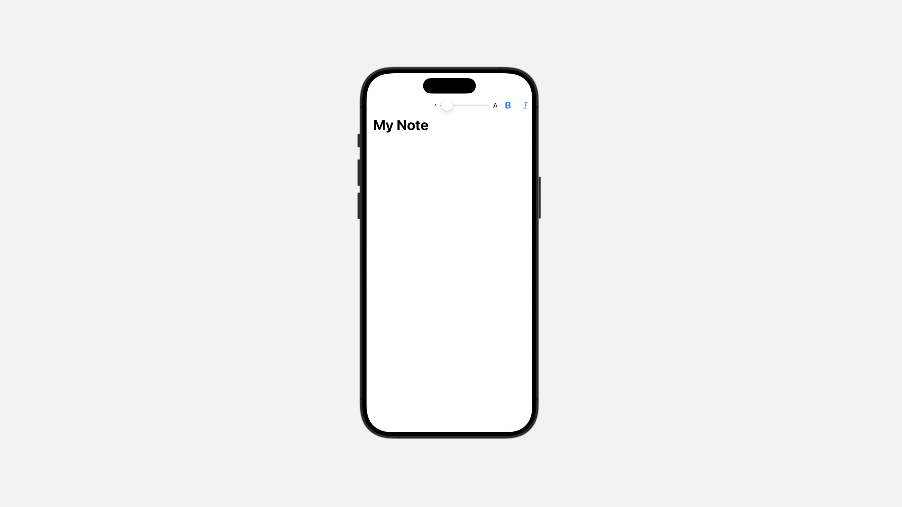

在 iOS、iPadOS 和 macOS 系统中，系统在确定工具栏中应渲染多少个项目时，会依据工具栏可用空间。如果所有项目不能全部适应当前可用空间，则系统可能会创建一个溢出菜单，并将剩余项目放置在这个菜单中。

:::


::: info `principal`

系统将项目放置在主要（ `principal` ）项目区域。

主要操作（ `Principal actions` ）是指那些功能重要且占据显著位置的操作单元。例如，网页浏览器的位置字段就是一个主要项目。

在 macOS 操作系统以及 Mac Catalyst 应用中，系统会将主要项目置于工具栏的中心位置。

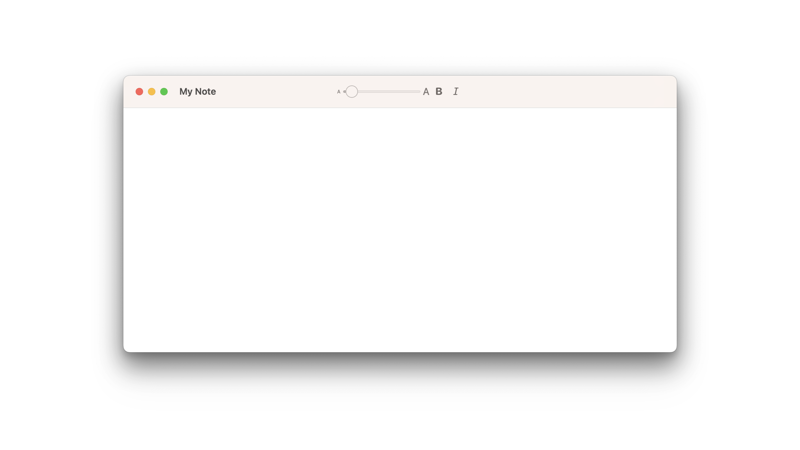

在 iOS、iPadOS 和 tvOS 系统中，系统会将主要项目置于导航栏的中心位置。这个项目优先级高于通过 `View` / `navigationTitle` 所指定的标题。


:::


::: info `status`

该项目表示当前上下文状态的改变。

状态项目本质上属于信息提示性质，不代表用户可以执行的操作。例如，用于显示上次与服务器通信检查新消息时间的消息提示。

在 macOS 操作系统及 Mac Catalyst 应用中，系统会将状态项目置于工具栏中心位置。


在 iOS 和 iPadOS 系统中，系统会将状态项目置于底部工具栏的中心位置。

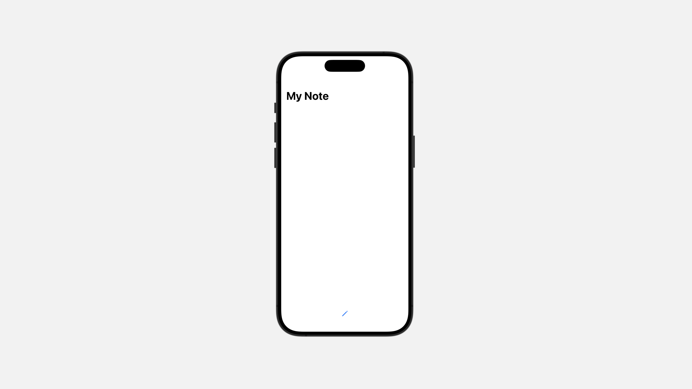
:::

### Getting placement for specific actions

::: info `primaryAction`
该项目代表主要操作。

主要操作是当前上下文中更频繁使用的操作。例如，在聊天应用中，用户点击或轻触以编写新消息的按钮。

在 macOS 和 Mac Catalyst 应用中，主要操作的位置位于工具栏的前缘。


在 iOS、iPadOS 和 tvOS 中，主要操作的位置位于导航栏的尾随边缘。

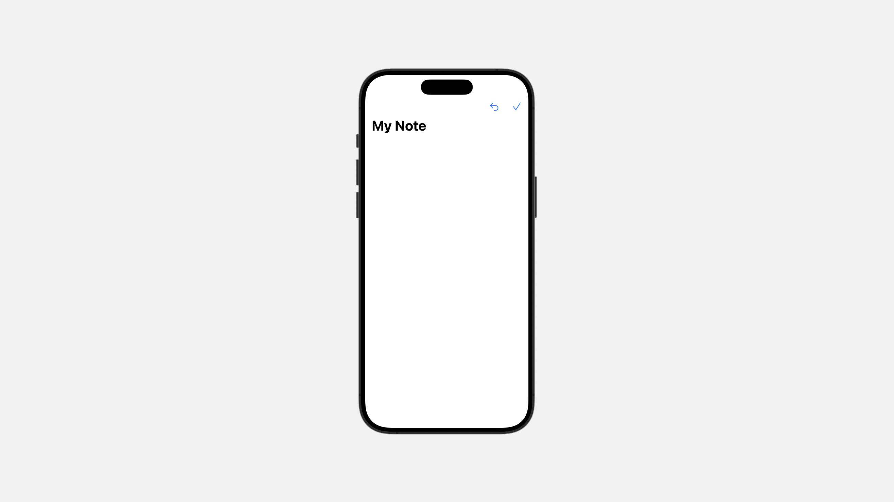

在 watchOS 中，系统将主要操作放置在导航栏下方；用户通过滚动来显示操作。

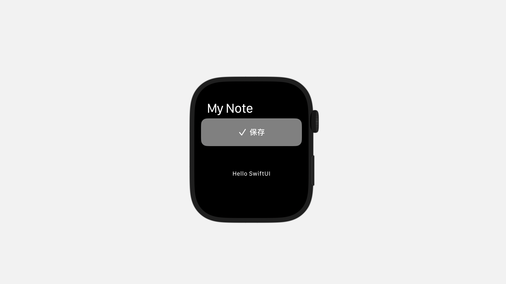

:::


::: info `secondaryAction`

该项目代表次要操作。

次要操作是指在当前场景中较为常用但并非当前功能运行所必需的一项操作。

在 iOS 上中，次要操作的选项会被折叠放入一个多选按钮里。

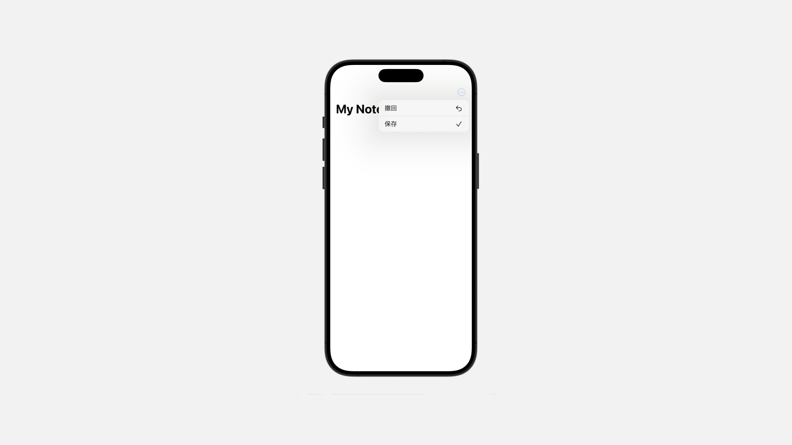

在 macOS 中，次要操作会居于主要操作左边。

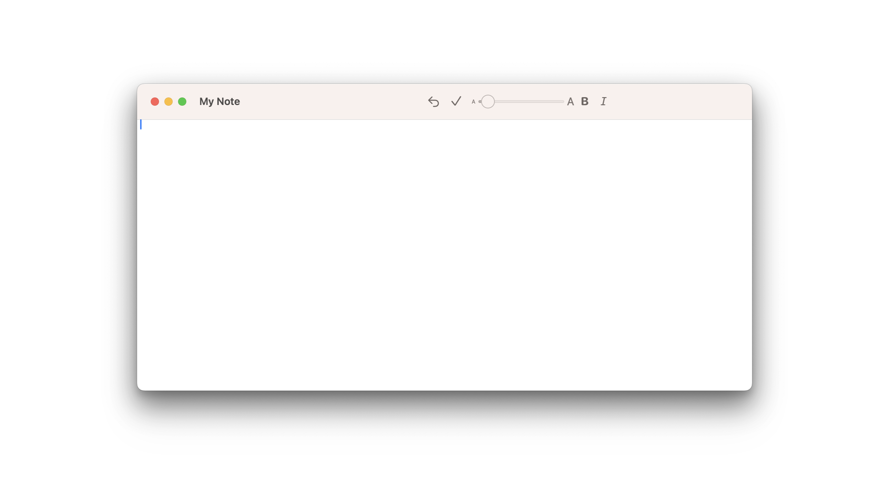

iPadOS 与 watchOS 不支持次要操作


:::


::: info `confirmationAction`


该项目代表模态界面中的确认操作。


在使用时，确认操作用于接收用户对某一特定操作的确认。举例来说，一个带有“添加”标签的确认操作可以用于将新的事件添加至日历。

在 macOS 和 Mac Catalyst 应用中，系统会将 `confirmationAction` 项目放置在 `sheet` 的最右侧边缘，并采用应用的强调色作为背景颜色。

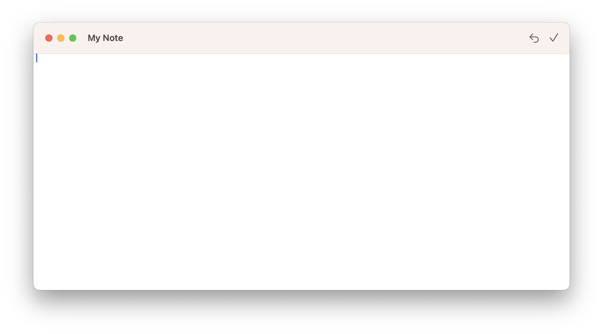

在 iOS、iPadOS 和 tvOS 中，系统将 `confirmationAction` 项目放置在与 `primaryAction` 相同的位置。


在 watchOS 中，系统将 `confirmationAction` 项目放置在导航栏的右侧边缘。

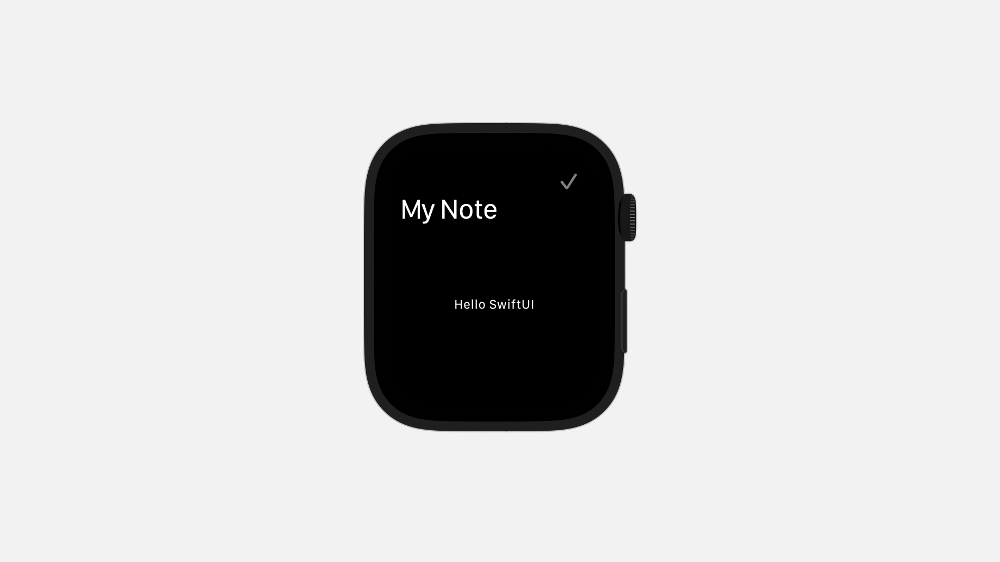

:::


::: info `cancellationAction`

该项目表示模态界面中的取消操作。

取消操作通过点击或轻触“取消”按钮等方式，不执行任何操作即可关闭模态界面。

在 macOS 和 Mac Catalyst 应用中，系统将 `cancellationAction` 项目置于 `sheet` 的右侧边缘，并将其放置在任何 `confirmationAction` 项目之前。


在 iOS、iPadOS、tvOS 和 watchOS 中，系统将 `cancellationAction` 项目置于导航栏的左侧边缘。

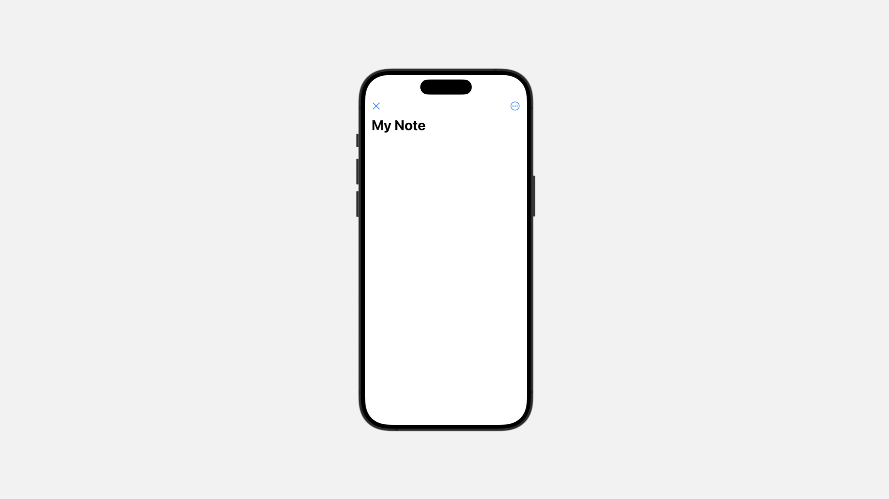

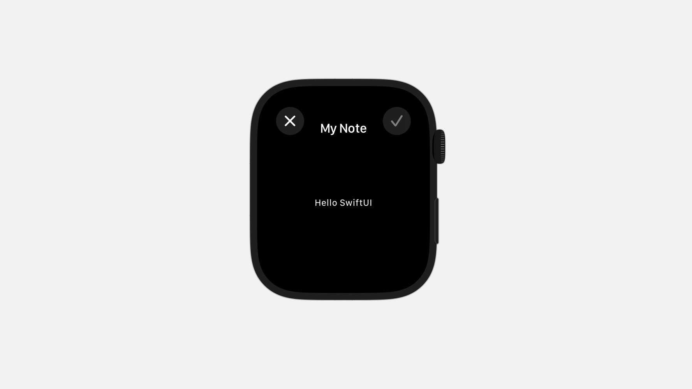
:::


::: info `destructiveAction`

该项目代表模态界面中的破坏性操作。

破坏性操作代表了确认操作的对立面。例如，一个标有“不保存”的按钮，允许用户在退出前丢弃对文档的未保存更改。

在 macOS 和 Mac Catalyst 应用中，系统将破坏性操作项放置在表单的前缘，并赋予它们特殊的外观，以警告防止意外使用。

在 iOS、tvOS 和 watchOS 中，系统将破坏性操作项放置在导航栏的尾随边缘。

与 `secondaryAction` 没明显差别。

:::

::: info `navigation`

该项目代表一个导航操作。

导航操作允许用户在不同上下文中切换。例如，网络浏览器中的前进和后退按钮就是导航操作。

在 macOS 和 Mac Catalyst 应用中，系统会将导航项目放置在工具栏的左侧边缘，并且如果工具栏中有内联标题，导航项目会出现在标题前面。

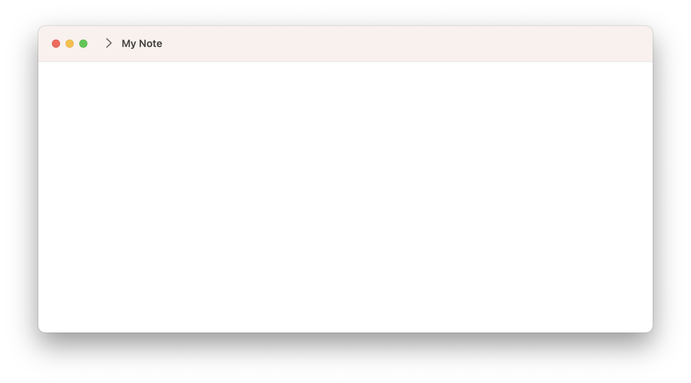

在 iOS、iPadOS 和 tvOS 中，导航项目会出现在导航栏的左侧边缘。如果在紧凑宽度布局中存在系统导航项目（如后退按钮），则它会出现在 `primaryAction` 的位置。


watchOS 不支持。

:::


### Getting explicit placement

::: info `topBarLeading`
将项目置于顶部栏的起始。

在 watchOS、iOS 和 tvOS 中，顶部栏指的是导航栏。
:::

::: info `topBarTrailing`
将项目置于顶部栏的尾部。

在 watchOS、iOS 和 tvOS 中，顶部栏指的是导航栏。
:::


::: info `bottomBar`
将项目置于底部工具栏中。

macOS 不支持。

iOS

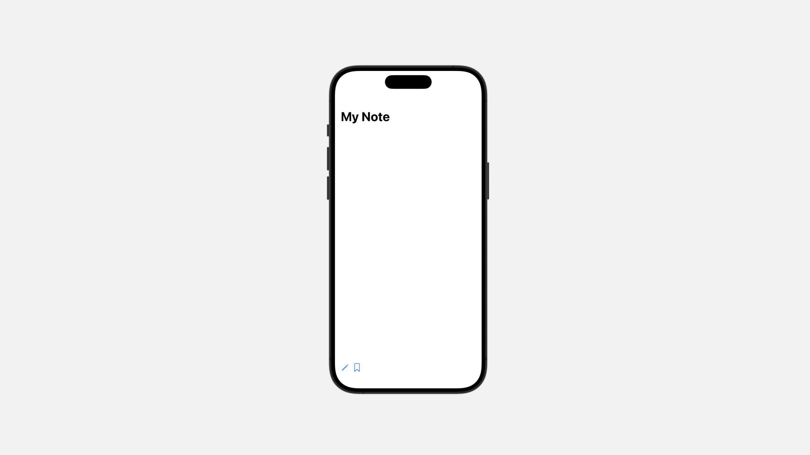

watchOS

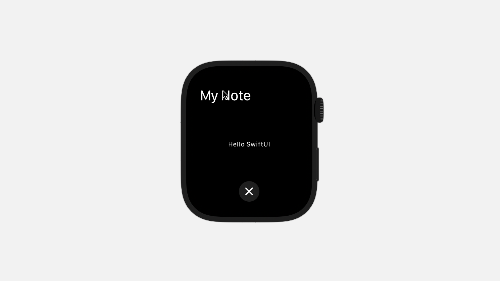


:::


::: info `bottomOrnament`

将项目置于窗口下的装饰元素中。

visionOS

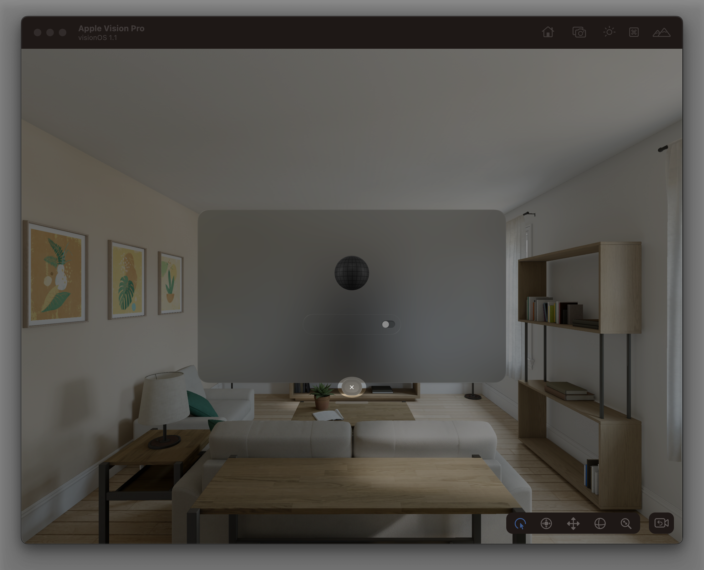


:::


::: info `keyboard`

该项目被放置在键盘区域。

在 iOS 设备上，键盘项会在软键盘出现时显示在上方，或者在连接了硬件键盘时显示在屏幕底部。

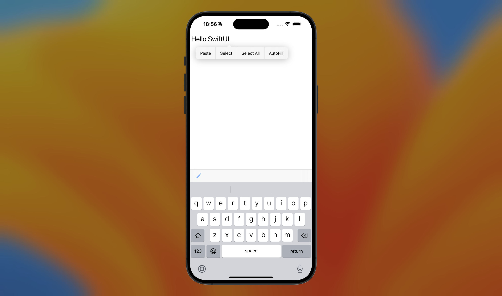

在 macOS 系统中，键盘项会被放置在 `Touch Bar` 内部。

:::

::: info `accessoryBar(id:)`

创建一个独特的辅助栏位置。

在 macOS 系统中，具有辅助栏位置的项目会被放置在窗口的标题栏和工具栏区域下方。

每一个独立的标识符将对应于添加到这一区域的一个单独的辅助栏。


```swift
 .toolbar {
    ToolbarItemGroup(placement: .accessoryBar(id: "1")) {
        Button("♣️", action: {})
        Button("♥️", action: {})
        Button("♠️", action: {})
        Button("♦️", action: {})
    }

    ToolbarItem(placement: .accessoryBar(id: "2")) {
        Button {
        } label: {
            Label("导航", systemImage: "chevron.left")
        }
    }
    
    ToolbarItem(placement: .accessoryBar(id: "3")) {
        Button {
            
        } label: {
            Label("导航", systemImage: "chevron.up")
        }
    }
}
```

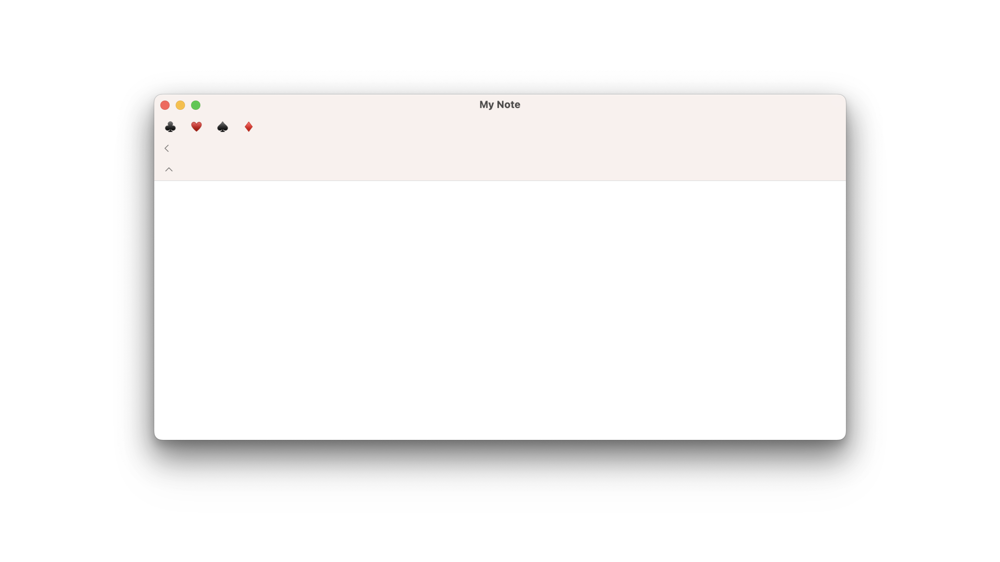

:::