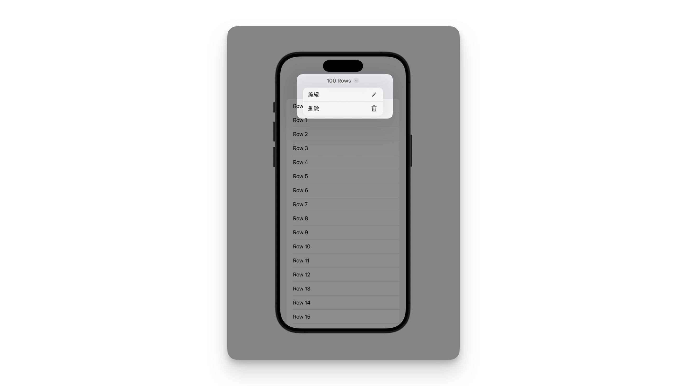

# Setting the toolbar title menu

## `toolbarTitleMenu(content:)`

配置工具栏的标题菜单。


```swift
func toolbarTitleMenu<C>(@ViewBuilder content: () -> C) -> some View where C : View
```

标题菜单通常代表可以在你的应用程序工具栏或导航标题所表示内容上执行的常见功能。

这个菜单可以从你的应用程序内置命令填充，例如保存项( `saveItem` )或打印项( `printItem` )等。

通过配置标题菜单，你可以方便快捷地向用户提供与当前内容相关的操作选项。


```swift
.toolbar {
    Button("编辑", systemImage: "pencil") {}
    Button("删除", systemImage: "trash") {}
}
```

你可以提供自己的操作集来覆盖默认行为。

```swift
.toolbarTitleMenu {
    Button("编辑", systemImage: "pencil") {}
    Button("删除", systemImage: "trash") {}
}
```

在 iOS 和 iPadOS 中，这将会构建一个菜单，用户可以通过点击应用导航栏中的导航标题来展示该菜单。

