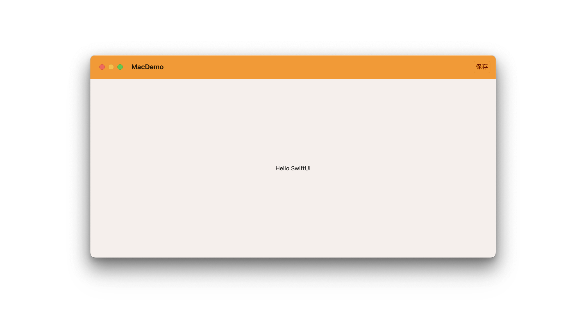
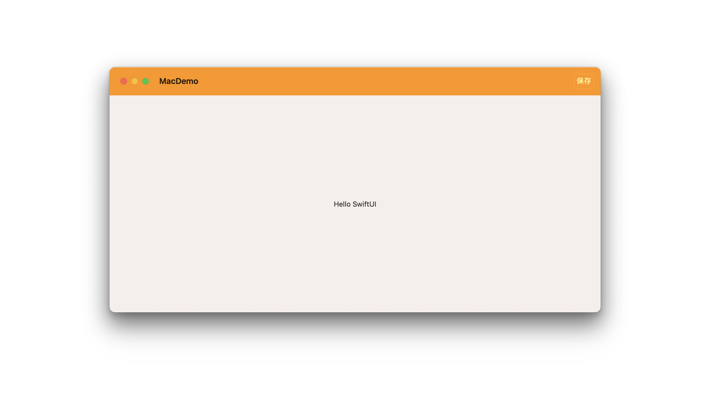

# Styling a toolbar

## `toolbarBackground(_:for:)`

此设置用于指定由 SwiftUI 管理的条栏背景的首选形状样式。

```swift
func toolbarBackground<S>(
    _ style: S,
    for bars: ToolbarPlacement...
) -> some View where S : ShapeStyle
```

首选样式会沿袭到最接近的渲染条栏的容器组件。
- 在 iOS 中，这样的容器可能是一个 `NavigationStack` 或 `TabView`；
- 而在 `macOS` 中，则可能是 `WindowGroup` 的根视图。

以下示例展示了一个将导航栏背景设置为蓝色，并采用深色主题样式的视图。

```swift
struct ContentView: View {

    var body: some View {
        
        NavigationStack {
            List(0..<100) {
                Text("Row \($0)")
            }
            .navigationTitle("100 Rows")
            .toolbarBackground(.teal)
        }
    }
}
```
<video src="../../video/ToolbarBackground.mp4" controls="controls"></video>


```swift
struct ContentView: View {

    var body: some View {
        
        TabView {
            List(0..<100) {
                Text("Row \($0)")
            }
            .navigationTitle("100 Rows")
            .toolbarBackground(.green, for: .tabBar)
        }
    
    }
}
```

<video src="../../video/ToolbarBackgroundTabView.mp4" controls="controls"></video>


你可以一次性提供多个位置设置，如下例所示：


```swift
struct ContentView: View {

    var body: some View {
        
        TabView {
            NavigationStack {
                List(0..<20) {
                    Text("Row \($0)")
                }.navigationTitle("100 Rows")
                    .toolbarBackground(.brown, for: .tabBar, .navigationBar)
            }
            
        }
    
    }
}
```

<video src="../../video/ToolbarBackgroundBoth.mp4" controls="controls"></video>


macOS

```swift
@main
struct MacDemoApp: App {
    var body: some Scene {
        WindowGroup {
            ContentView()
                .toolbarBackground(.orange, for: .windowToolbar)
                .toolbar(content: {
                    ToolbarItem(id: "new") {
                        Button("保存") {
                        }
                    }
                })
        }
    }
}
```




## `toolbarBackground(_:for:)`

该设置用于指定由 SwiftUI 管理的条栏背景的首选可见性。

```swift
func toolbarBackground(
    _ visibility: Visibility,
    for bars: ToolbarPlacement...
) -> some View
```


该首选可见性设置会逐级向上影响到渲染条栏的最近容器，这个容器在 iOS 中可能是 `NavigationStack` 或 `TabView`，在 macOS 中则可能是 `WindowGroup` 的根视图。

在 iOS 中，若设置为 `automatic` ，则标签栏或导航栏背景的可见性将取决于 `List` 或 `ScrollView` 的停靠位置。例如，当它们与滚动视图内容底部边缘对齐时，标签栏的背景就会变为透明。

若要确保无论滚动视图或列表停止滚动的位置如何，条栏的背景始终保持可见，请指定 `Visibility.visible` 值。

以下示例展示了一个视图，其中在选中中间标签时，优先保持标签栏始终可见：

```swift
TabView {
    FirstTab()
    MiddleTab()
        .toolbarBackground(.visible, for: .tabBar)
    LastTab()
}
```


## `toolbarColorScheme(_:for:)`

指定由 SwiftUI 管理的 `toolbar` 的首选颜色方案。

```swift
func toolbarColorScheme(
    _ colorScheme: ColorScheme?,
    for bars: ToolbarPlacement...
) -> some View
```

指定 SwiftUI 管理的工具栏的首选颜色方案，这一设定会沿袭至最接近的负责渲染工具栏的容器。

- 比如在 iOS 中可能是 `NavigationView` 或 `TabView` 结构的一部分
- 在 macOS 中则可能对应 `WindowGroup` 的根视图。若传递 `nil` 作为参数值，则工具栏的颜色方案会自动匹配当前系统的颜色方案。

以下是一个示例，它展示了如何使工具栏带有蓝色背景并采用深色模式呈现：


```swift
struct ContentView: View {

    var body: some View {
        
        TabView {
            
            NavigationStack {
                List(0..<20) {
                    Text("Row \($0)")
                }.navigationTitle("100 Rows")
                    
                    .toolbarBackground(.blue, for: .tabBar, .navigationBar)
                    .toolbarColorScheme(.dark, for: .tabBar, .navigationBar)
            }.tabItem {
                Label("首页", systemImage: "star")
            }
        }
    }
}
```
<video src="../../video/ToolbarColorScheme.mp4" controls="controls"></video>

MacOS

```swift
@main
struct MacDemoApp: App {
    var body: some Scene {
        WindowGroup {
            ContentView()
                .toolbarBackground(.orange, for: .windowToolbar)
                .toolbarColorScheme(.dark, for: .windowToolbar)
                .toolbar(content: {
                    ToolbarItem(id: "new") {
                        Button("保存") {
                        }
                    }
                })
        }
    }
}
```



